# MySql 性能优化指南

## 1.目标

- 了解什么是优化
- 掌握优化查询的方法
- 掌握优化数据库结构的方法
- 掌握优化 MySQL 服务器的方法

---

## 2. 什么是优化?

合理安排资源.调整系统参数使 MySQL 运行更快.更节省资源.

优化是多方面的,包括查询优化.更新优化.服务器优化等很多方面.没有特定方式特定的方法,总是要具体场景,具体分析,但是我们要掌握基本的优化手段.

原则：**减少系统瓶颈,减少资源占用,增加系统的反应速度.**

---

## 3. 数据库性能参数

我们可以通过 SHOW STATUS 语句查看 MySQL 数据库的性能参数

- `SHOW STATUS LIKE 'value'`

常用的参数：

- `Slow_queries` 慢查询次数：

-     什么是慢查询?  mysql读写分离的时候的日志,里面记录了执行某条sql语句超过某个时间后的记录,方便我们做一个后期的优化,我们可以通过Slow_queries显示慢查询

查看你的 mysql 数据库是否有慢查询：`SHOW STATUS LIKE 'Slow_queries'`

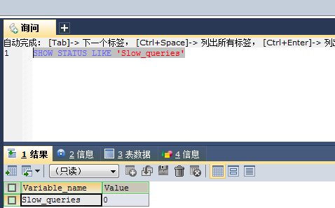

从哪里解决呢? 从日志里面去找啊 这个我们需要配置的

- `Com_(CRUD)` 操作的次数

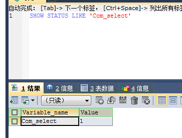

- Uptime 上线时间

---

## 4. 查询优化

### 4.1 EXPLAIN

在 MySQL 中可以使用 EXPLAIN 查看 SQL 执行计划,用法：EXPLAIN SELECT \* FROM tb_item

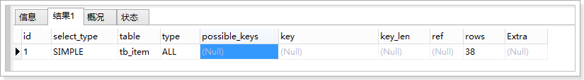

### 4.2 结果说明

#### 4.2.1 id

SELECT 识别符.这是 SELECT 查询序列号.这个不重要.

#### 4.2.2 select_type

表示查询中每个 select 子句的类型(简单 OR 复杂).

有以下几种值：

1.  `SIMPLE`
    查询中不包含子查询或者 UNION

2.  `PRIMARY`
    查询中若包含任何复杂的子部分,最外层查询则被标记为：PRIMARY.

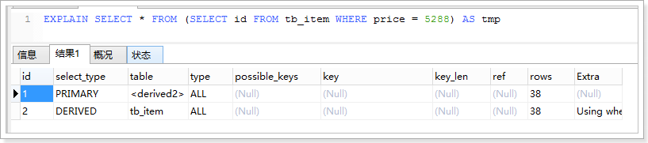

3.  `UNION`
    表示连接查询的第 2 个或后面的查询语句.

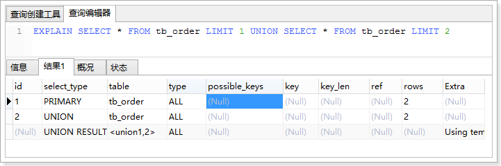

4.  `DEPENDENT UNION`
    UNION 中的第二个或后面的 SELECT 语句,取决于外面的查询.

5.  `UNION RESULT`
    连接查询的结果.

6.  `SUBQUERY`
    子查询中的第 1 个 SELECT 语句.

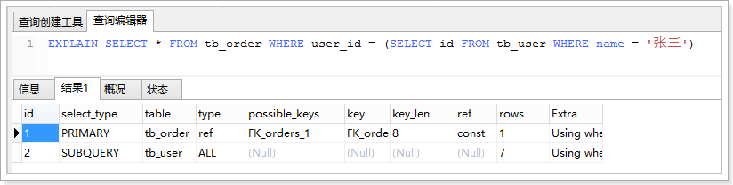

7.  `DEPENDENT SUBQUERY`
    子查询中的第 1 个 SELECT 语句,取决于外面的查询.

8.  `DERIVED`
    SELECT(FROM 子句的子查询).

#### 4.2.3 table

表示查询的表.

#### 4.2.4 type[重要]

表示表的连接类型.

以下的连接类型的顺序是从最佳类型到最差类型：

1.  `system`

表仅有一行,这是 const 类型的特列,平时不会出现,这个也可以忽略不计.

2.  `const`

数据表最多只有一个匹配行,因为只匹配一行数据,所以很快,常用于 PRIMARY KEY 或者 UNIQUE 索引的查询,可理解为 const 是最优化的.

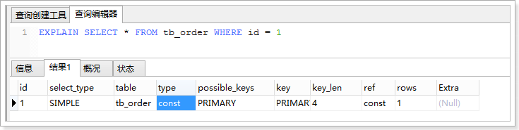

3.  `eq_ref`

mysql 手册是这样说的:"对于每个来自于前面的表的行组合,从该表中读取一行.这可能是最好的联接类型,除了 const 类型.它用在一个索引的所有部分被联接使用并且索引是 UNIQUE 或 PRIMARY KEY".eq_ref 可以用于使用=比较带索引的列.

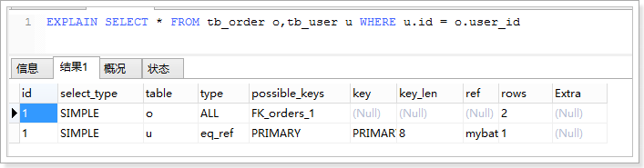

4.  `ref`

查询条件索引既不是 UNIQUE 也不是 PRIMARY KEY 的情况.ref 可用于=或<或>操作符的带索引的列.

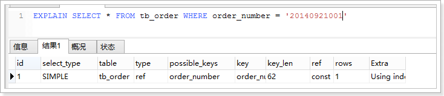

5.  `ref_or_null`

该联接类型如同 ref,但是添加了 MySQL 可以专门搜索包含 NULL 值的行.在解决子查询中经常使用该联接类型的优化.

**上面这五种情况都是很理想的索引使用情况.**

6.  `index_merge`

该联接类型表示使用了索引合并优化方法.在这种情况下,key 列包含了使用的索引的清单,key_len 包含了使用的索引的最长的关键元素.

7.  `unique_subquery`

该类型替换了下面形式的 IN 子查询的 ref: `value IN (SELECT primary_key FROM single_table WHERE some_expr)`
unique_subquery 是一个索引查找函数,可以完全替换子查询,效率更高.

8.  `index_subquery`

该联接类型类似于 unique_subquery.可以替换 IN 子查询,但只适合下列形式的子查询中的非唯一索引: `value IN (SELECT key_column FROM single_table WHERE some_expr)`

9.  `range`

只检索给定范围的行,使用一个索引来选择行.

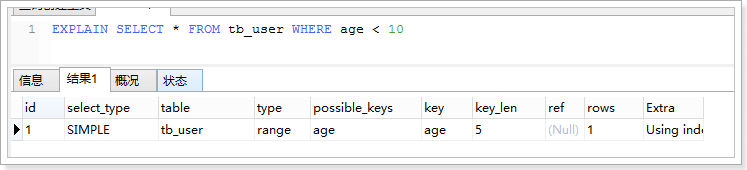

10. `index`

该联接类型与 ALL 相同,除了只有索引树被扫描.这通常比 ALL 快,因为索引文件通常比数据文件小.

11. `ALL`

对于每个来自于先前的表的行组合,进行完整的表扫描.(性能最差) B tree b+tree

#### 4.2.5 possible_keys

指出 MySQL 能使用哪个索引在该表中找到行.

如果该列为 NULL,说明没有使用索引,可以对该列创建索引来提高性能.

#### 4.2.6 key

显示 MySQL 实际决定使用的键(索引).如果没有选择索引,键是 NULL.

可以强制使用索引或者忽略索引：

- 强制使用索引：`USE INDEX(列名)`

- 忽略使用索引：`IGNORE INDEX(列名)`

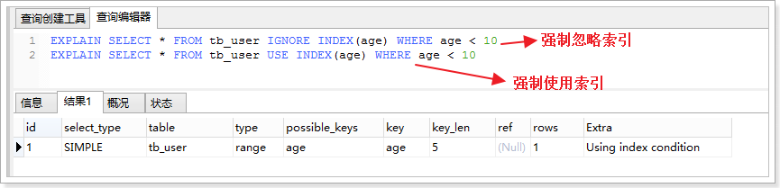

#### 4.2.7 key_len

显示 MySQL 决定使用的键长度.如果键是 NULL,则长度为 NULL.

注意：key_len 是确定了 MySQL 将实际使用的索引长度.

#### 4.2.8 ref

显示使用哪个列或常数与 key 一起从表中选择行.

#### 4.2.9 rows

显示 MySQL 认为它执行查询时必须检查的行数.

#### 4.2.10 Extra

该列包含 MySQL 解决查询的详细信息

- Distinct:MySQL 发现第 1 个匹配行后,停止为当前的行组合搜索更多的行.

- Not exists:MySQL 能够对查询进行 LEFT JOIN 优化,发现 1 个匹配 LEFT JOIN 标准的行后,不再为前面的的行组合在该表内检查更多的行.

- range checked for each record (index map: #):MySQL 没有发现好的可以使用的索引,但发现如果来自前面的表的列值已知,可能部分索引可以使用.

- Using filesort:MySQL 需要额外的一次传递,以找出如何按排序顺序检索行.

- Using index:从只使用索引树中的信息而不需要进一步搜索读取实际的行来检索表中的列信息.

- Using temporary:为了解决查询,MySQL 需要创建一个临时表来容纳结果.

- Using where:WHERE 子句用于限制哪一个行匹配下一个表或发送到客户.

- Using sort_union(...), Using union(...), Using intersect(...):这些函数说明如何为 index_merge 联接类型合并索引扫描.

- Using index for group-by:类似于访问表的 Using index 方式,Using index for group-by 表示 MySQL 发现了一个索引,可以用来查 询 GROUP BY 或 DISTINCT 查询的所有列,而不要额外搜索硬盘访问实际的表.

### 4.3 使用索引查询需要注意

索引可以提供查询的速度,但并不是使用了带有索引的字段查询都会生效,有些情况下是不生效的,需要注意！

数据库索引,是数据库管理系统中一个排序的数据结构,以协助快速查询.更新数据库表中数据.索引的实现通常使用 B 树(B-tree(多路搜索树,并不是二叉的)是一种常见的数据结构)及其变种 B+树.

在数据之外,数据库系统还维护着满足特定查找算法的数据结构,这些数据结构以某种方式引用(指向)数据,这样就可以在这些数据结构上实现高级查找算法.这种数据结构,就是索引.

为表设置索引要付出代价的：一是增加了数据库的存储空间,二是在插入和修改数据时要花费较多的时间(因为索引也要随之变动).

为什么使用索引就能加快查询速度呢?

​ 场景：面试官问你 你有没有做过数据库优化啊?有做过,设计的时候给一些查询字段加一些索引,为什么要加索引,为什么加了索引就快克?

索引就是通过事先排好序,从而在查找时可以应用二分查找等高效率的算法.

一般的顺序查找,复杂度为`O(n)`,而二分查找复杂度为`O(log2n)`.当 n 很大时,二者的效率相差及其悬殊.

举个例子：

表中有一百万条数据,需要在其中寻找一条特定 id 的数据.如果顺序查找,平均需要查找 50 万条数据.而用二分法,至多不超过 20 次就能找到.二者的效率差了 2.5 万倍！

#### 4.3.1 使用 LIKE 关键字的查询

在使用 LIKE 关键字进行查询的查询语句中,如果匹配字符串的第一个字符为“%”,索引不起作用.只有“%”不在第一个位置,索引才会生效.

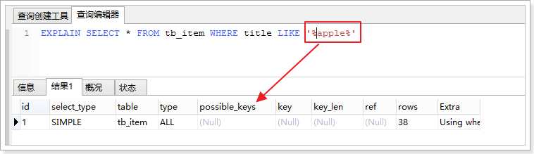

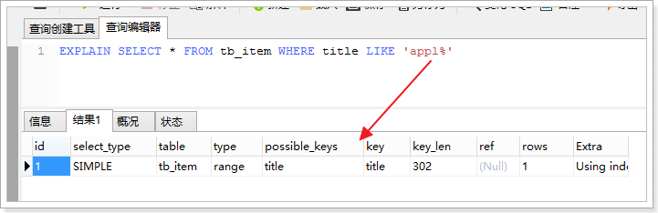

#### 4.3.2 使用联合索引的查询

MySQL 可以为多个字段创建索引,一个索引可以包括 16 个字段.对于联合索引,只有查询条件中使用了这些字段中第一个字段时,索引才会生效.

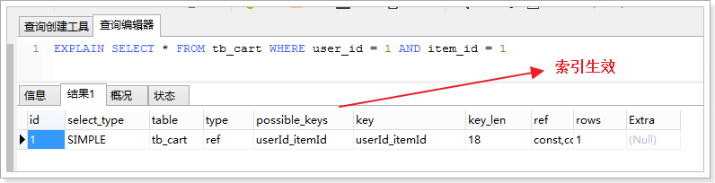

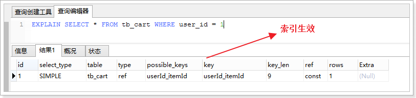

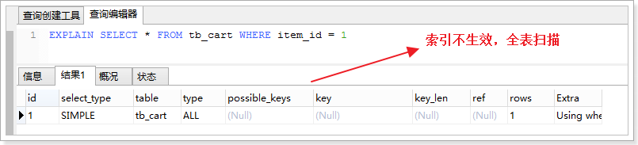

#### 4.3.3 使用 OR 关键字的查询

查询语句的查询条件中只有 OR 关键字,且 OR 前后的两个条件中的列都是索引时,索引才会生效,否则,索引不生效.

- id 是含有索引的
- cid 是有索引的
- price 是没有索引的

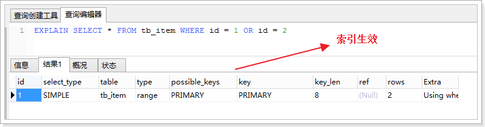

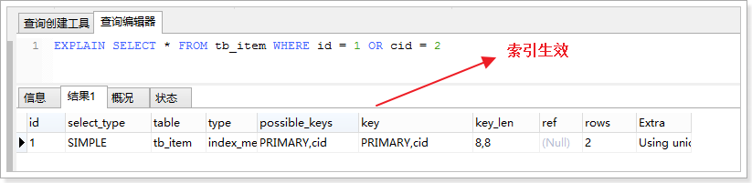

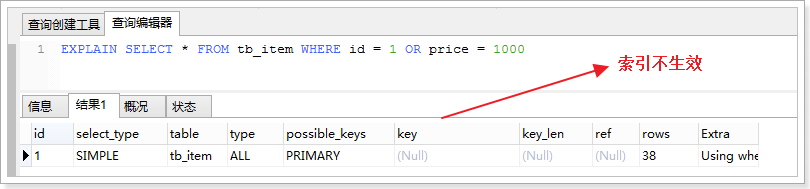

### 4.4 子查询优化

MySQL 从 4.1 版本开始支持子查询,使用子查询进行 SELECT 语句嵌套查询,可以一次完成很多逻辑上需要多个步骤才能完成的 SQL 操作.

子查询虽然很灵活,但是执行效率并不高.

那么问题又来了啊? 什么叫子查询?为什么它效率不高?

(把内层查询结果当作外层查询的比较条件的)

例子：

```sql
select goods_id,goods_name from goods where goods_id = (select max(goods_id) from goods);
```

执行子查询时,MYSQL 需要创建临时表,查询完毕后再删除这些临时表,所以,子查询的速度会受到一定的影响.这多了一个创建临时表和销毁表的过程啊.

优化方式：**可以使用连接查询(JOIN)代替子查询,连接查询时不需要建立临时表,其速度比子查询快.**

---

## 5. 数据库结构优化

一个好的数据库设计方案对于数据库的性能往往会起到事半功倍的效果.这句话是什么意思呢,就是说我们的数据库优化不仅仅要局限于查询优化,要从这块跳出来做好最开始的设计优化,如果你这个主要设计是不合理的这些个查询优化效果也只是杯水车薪.

需要考虑数据冗余.查询和更新的速度.字段的数据类型是否合理等多方面的内容.

### 5.1 分表

对于字段较多的表,如果有些字段的使用频率很低,可以将这些字段分离出来形成新表.

因为当一个表的数据量很大时,会由于使用频率低的字段的存在而变慢.

项目实战的时候会将一个完全信息的表里面的数据拆分出来 形成多个新表 每个新表负责那一块的数据查询 然后这个拆分是定时的

### 5.2 增加中间表

对于需要经常联合查询的表,可以建立中间表以提高查询效率.这个大家能不能理解?

通过建立中间表,将需要通过联合查询的数据插入到中间表中,然后将原来的联合查询改为对中间表的查询.

举个例子啊：比如我们需要在五张表里面做查询数据,left join 每次查询要连接五张表是吧 我这里做一个中间表 把查询结果都放在这个中间表里面,只要在这个表里面查询就行了啊

通常都是在统计当中有使用啊,每次统计报表的时候都是离线统计啊,后台有有一个线程对你这统计结果查询号放入一个中间表,然后你对这个中间表查询就行了.

### 5.3 增加冗余字段

设计数据表时应尽量遵循范式理论的规约,尽可能的减少冗余字段,让数据库设计看起来精致.优雅.但是,合理的加入冗余字段可以提高查询速度.

表的规范化程度越高,表和表之间的关系越多,需要连接查询的情况也就越多,性能也就越差.

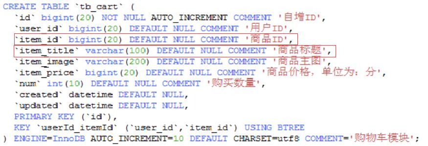

**注意：**

**冗余字段的值在一个表中修改了,就要想办法在其他表中更新,否则就会导致数据不一致的问题.**

---

## 6. 插入数据的优化

插入数据时,影响插入速度的主要是索引.唯一性校验.一次插入的数据条数等.

为什么索引会影响插入速度呢?

​ 索引越多,当你写入数据的时候就会越慢,因为我们在插入数据的时候不只是把数据写入文件,而且还要把这个数据写到索引中,索引索引越多插入越慢

那么插入数据的优化,根据不同的存储引擎优化手段不一样,在 MySQL 中常用的存储引擎有,MyISAM 和 InnoDB,两者的区别：

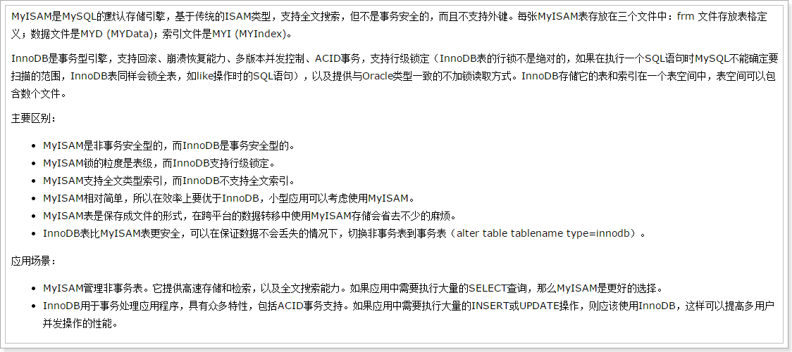

### 6.1 MyISAM

#### 6.1.1 禁用索引

对于非空表,插入记录时,MySQL 会根据表的索引对插入的记录建立索引.如果插入大量数据,建立索引会降低插入数据速度.

为了解决这个问题,可以在批量插入数据之前禁用索引,数据插入完成后再开启索引.

禁用索引的语句：

```sql
ALTER TABLE table_name DISABLE KEYS
```

开启索引语句：

```sql
ALTER TABLE table_name ENABLE KEYS
```

对于空表批量插入数据,则不需要进行操作,因为 MyISAM 引擎的表是在导入数据后才建立索引.

#### 6.1.2 禁用唯一性检查

唯一性校验会降低插入记录的速度,可以在插入记录之前禁用唯一性检查,插入数据完成后再开启.

禁用唯一性检查的语句：`SET UNIQUE_CHECKS = 0;`

开启唯一性检查的语句：`SET UNIQUE_CHECKS = 1;`

#### 6.1.3 批量插入数据

插入数据时,可以使用一条 INSERT 语句插入一条数据,也可以插入多条数据.

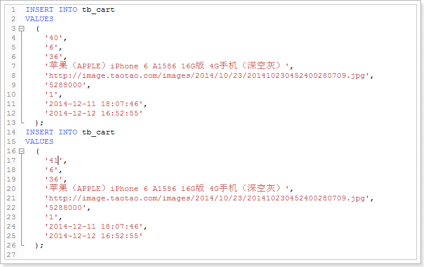
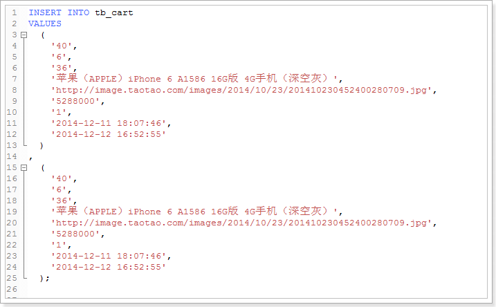

第二种方式的插入速度比第一种方式快.

为什么? 第一次执行两条 sq 第二次执行一条 SQ

我们把 sql 语句发送到 sql 后要解析两次 二第二次只需要解析一次啊

#### 6.1.4 使用 LOAD DATA INFILE

当需要批量导入数据时,使用`LOAD DATA INFILE`语句比`INSERT`语句插入速度快很多.

### 6.2. InnoDB

#### 6.2.1 禁用唯一性检查

禁用唯一性检查的语句：`SET UNIQUE_CHECKS = 0;`

开启唯一性检查的语句：`SET UNIQUE_CHECKS = 1;`

#### 6.2.2 禁用外键检查

插入数据之前执行禁止对外键的检查,数据插入完成后再恢复,可以提供插入速度.

禁用：`SET foreign_key_checks = 0;`

开启：`SET foreign_key_checks = 1;`

#### 6.2.3 禁止自动提交

插入数据之前执行禁止事务的自动提交,数据插入完成后再恢复,可以提高插入速度.

禁用：`SET autocommit = 0;`

开启：`SET autocommit = 1;`

---

## 7. 服务器优化

### 7.1 优化服务器硬件

服务器的硬件性能直接决定着 MySQL 数据库的性能,硬件的性能瓶颈,直接决定 MySQL 数据库的运行速度和效率.

需要从以下几个方面考虑：

1.  配置较大的内存.足够大的内存,是提高 MySQL 数据库性能的方法之一.内存的 IO 比硬盘快的多,可以增加系统的缓冲区容量,使数据在内存停留的时间更长,以减少磁盘的 IO.

2.  配置高速磁盘,比如 SSD.

3.  合理分配磁盘 IO,把磁盘 IO 分散到多个设备上,以减少资源的竞争,提高并行操作能力.

4.  配置多核处理器,MySQL 是多线程的数据库,多处理器可以提高同时执行多个线程的能力.

### 7.2. 优化 MySQL 的参数

通过优化 MySQL 的参数可以提高资源利用率,从而达到提高 MySQL 服务器性能的目的.
MySQL 的配置参数都在 my.conf 或者 my.ini 文件的[mysqld]组中,常用的参数如下：

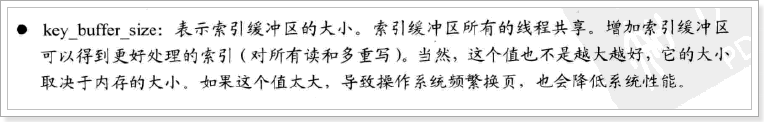

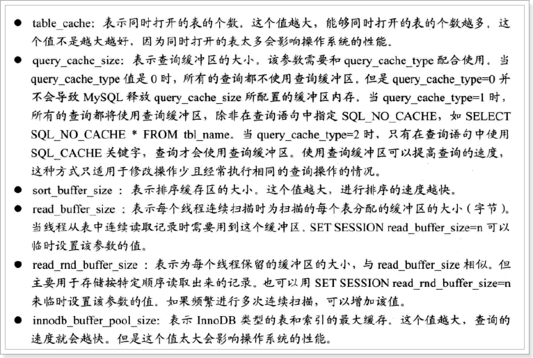

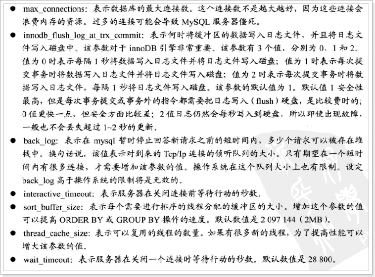

要求：必须记忆至少 3 个.
