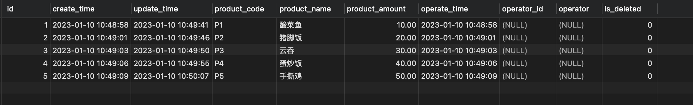
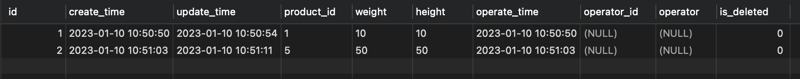
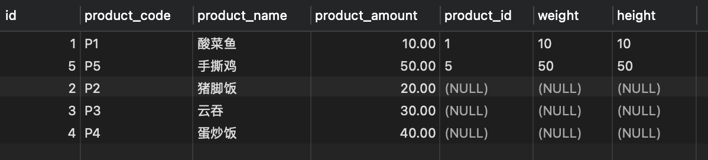
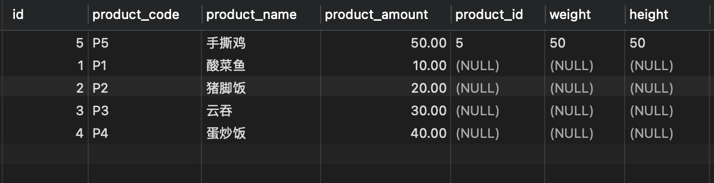
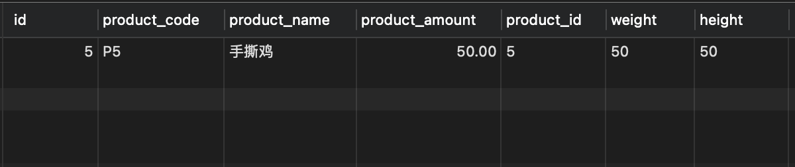
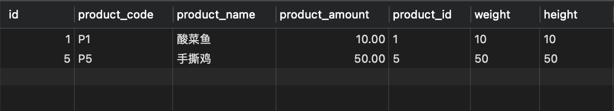

## Mysql Join

这个总是把我整懵了. 泪流满面.jpg

---

### 1. 测试数据

**ddl**:

```sql
CREATE TABLE `product_info` (
	`id` BIGINT ( 20 ) UNSIGNED NOT NULL AUTO_INCREMENT COMMENT 'ID',
	`create_time` datetime DEFAULT CURRENT_TIMESTAMP COMMENT '创建时间',
	`update_time` datetime DEFAULT NULL ON UPDATE CURRENT_TIMESTAMP COMMENT '修改时间',
	`product_code` VARCHAR ( 32 ) DEFAULT NULL COMMENT '商品编码',
	`product_name` VARCHAR ( 32 ) DEFAULT NULL COMMENT '商品名称',
	`product_amount` DECIMAL ( 15, 2 ) DEFAULT NULL COMMENT '商品金额,额度:元',
	`operate_time` datetime DEFAULT CURRENT_TIMESTAMP COMMENT '操作时间',
	`operator_id` VARCHAR ( 32 ) DEFAULT NULL COMMENT '创建人id',
	`operator` VARCHAR ( 64 ) DEFAULT NULL COMMENT '创建人名称',
	`is_deleted` TINYINT ( 4 ) NOT NULL DEFAULT '0' COMMENT '逻辑删除',
	PRIMARY KEY ( `id` ) USING BTREE,
	KEY `idx_product_code` ( `product_code` )
) ENGINE = INNODB AUTO_INCREMENT = 1 DEFAULT CHARSET = utf8mb4 COMMENT = '商品信息';

CREATE TABLE `product_detail` (
	`id` BIGINT ( 20 ) UNSIGNED NOT NULL AUTO_INCREMENT COMMENT 'ID',
	`create_time` datetime DEFAULT CURRENT_TIMESTAMP COMMENT '创建时间',
	`update_time` datetime DEFAULT NULL ON UPDATE CURRENT_TIMESTAMP COMMENT '修改时间',
	`product_id` VARCHAR ( 32 ) DEFAULT NULL COMMENT '商品编码',
	`weight` VARCHAR ( 32 ) DEFAULT NULL COMMENT '商品长度',
	`height` VARCHAR ( 32 ) DEFAULT NULL COMMENT '商品高度',
	`operate_time` datetime DEFAULT CURRENT_TIMESTAMP COMMENT '操作时间',
	`operator_id` VARCHAR ( 32 ) DEFAULT NULL COMMENT '创建人id',
	`operator` VARCHAR ( 64 ) DEFAULT NULL COMMENT '创建人名称',
	`is_deleted` TINYINT ( 4 ) NOT NULL DEFAULT '0' COMMENT '逻辑删除',
	PRIMARY KEY ( `id` ) USING BTREE,
KEY `idx_product_id` ( `product_id` )
) ENGINE = INNODB AUTO_INCREMENT = 1 DEFAULT CHARSET = utf8mb4 COMMENT = '商品明细';
```

**dml**:

```sql
-- 商品数据
INSERT INTO `test`.`product_info` (`id`, `create_time`, `update_time`, `product_code`, `product_name`, `product_amount`, `operate_time`, `operator_id`, `operator`, `is_deleted`) VALUES (1, '2023-01-10 10:48:58', '2023-01-10 10:49:41', 'P1', '酸菜鱼', 10.00, '2023-01-10 10:48:58', NULL, NULL, 0);
INSERT INTO `test`.`product_info` (`id`, `create_time`, `update_time`, `product_code`, `product_name`, `product_amount`, `operate_time`, `operator_id`, `operator`, `is_deleted`) VALUES (2, '2023-01-10 10:49:01', '2023-01-10 10:49:46', 'P2', '猪脚饭', 20.00, '2023-01-10 10:49:01', NULL, NULL, 0);
INSERT INTO `test`.`product_info` (`id`, `create_time`, `update_time`, `product_code`, `product_name`, `product_amount`, `operate_time`, `operator_id`, `operator`, `is_deleted`) VALUES (3, '2023-01-10 10:49:03', '2023-01-10 10:49:50', 'P3', '云吞', 30.00, '2023-01-10 10:49:03', NULL, NULL, 0);
INSERT INTO `test`.`product_info` (`id`, `create_time`, `update_time`, `product_code`, `product_name`, `product_amount`, `operate_time`, `operator_id`, `operator`, `is_deleted`) VALUES (4, '2023-01-10 10:49:06', '2023-01-10 10:49:55', 'P4', '蛋炒饭', 40.00, '2023-01-10 10:49:06', NULL, NULL, 0);
INSERT INTO `test`.`product_info` (`id`, `create_time`, `update_time`, `product_code`, `product_name`, `product_amount`, `operate_time`, `operator_id`, `operator`, `is_deleted`) VALUES (5, '2023-01-10 10:49:09', '2023-01-10 10:50:07', 'P5', '手撕鸡', 50.00, '2023-01-10 10:49:09', NULL, NULL, 0);


-- 商品明细数据
INSERT INTO `test`.`product_detail` (`id`, `create_time`, `update_time`, `product_id`, `weight`, `height`, `operate_time`, `operator_id`, `operator`, `is_deleted`) VALUES (1, '2023-01-10 10:50:50', '2023-01-10 10:50:54', '1', '10', '10', '2023-01-10 10:50:50', NULL, NULL, 0);
INSERT INTO `test`.`product_detail` (`id`, `create_time`, `update_time`, `product_id`, `weight`, `height`, `operate_time`, `operator_id`, `operator`, `is_deleted`) VALUES (2, '2023-01-10 10:51:03', '2023-01-10 10:51:11', '5', '50', '50', '2023-01-10 10:51:03', NULL, NULL, 0);
```

商品数据:



商品详情数据:



---

### 2. Left join

ok,那么先从最简单的关联开始.

```sql
SELECT
	product_info.id,
	product_info.product_code,
	product_info.product_name,
	product_info.product_amount,
	product_detail.product_id,
	product_detail.weight,
	product_detail.height
FROM
	product_info
	LEFT JOIN product_detail ON product_info.id = product_detail.product_id
```



使用 left jion 时,`on`和`where`区别如下:

- on 条件是在生成临时表时使用的条件,它不管 on 中的条件是否为真,都会返回左边表中的记录.
- where 条件是在临时表生成好后,再对临时表进行过滤的条件.这时已经没有 left join 的含义（必须返回左边表的记录）了,条件不为真的就全部过滤掉

#### 2.1 ON 条件

```sql
SELECT
	product_info.id,
	product_info.product_code,
	product_info.product_name,
	product_info.product_amount,
	product_detail.product_id,
	product_detail.weight,
	product_detail.height
FROM
	product_info
	LEFT JOIN product_detail ON product_info.id = product_detail.product_id
    AND product_info.product_code ='P5'
```



比如: **a left join b ON x=x AND y=y, 左表数据为主,右表字段不符条件全部为 null**.

结论: <u style='color:red'>on 条件是在生成临时表时使用的条件,它不管 on 中的条件是否为真,都会返回左边表中的记录.</u>

#### 2.2 WHERE 条件

```sql
SELECT
	product_info.id,
	product_info.product_code,
	product_info.product_name,
	product_info.product_amount,
	product_detail.product_id,
	product_detail.weight,
	product_detail.height
FROM
	product_info
	LEFT JOIN product_detail ON product_info.id = product_detail.product_id
WHERE
	product_info.product_code = 'P5';
```



Q: 那么像 left join 这种只获取能关联数据该怎么操作?

A: 可以使用`inner join`,或者使用`b.attr IS NOT NULL`这种查询条件.

```sql
SELECT
	product_info.id,
	product_info.product_code,
	product_info.product_name,
	product_info.product_amount,
	product_detail.product_id,
	product_detail.weight,
	product_detail.height
FROM
	product_info
	LEFT JOIN product_detail ON product_info.id = product_detail.product_id
WHERE
	product_detail.product_id IS NOT NULL
```



结论: <u style='color:red'>where 条件是在临时表生成好后,再对临时表进行过滤的条件,条件不为真的全部过滤</u>

---

### 3. 参考文档

a. [Mysql left join 博客](https://cloud.tencent.com/developer/article/1406430)
