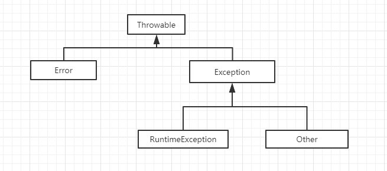
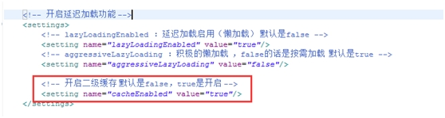
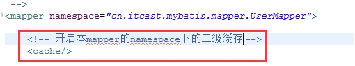
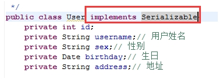
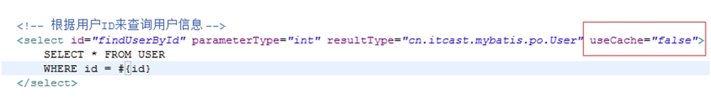
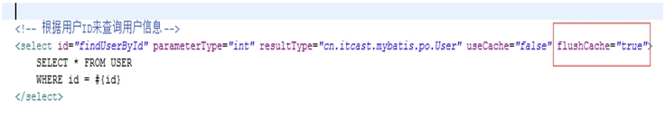
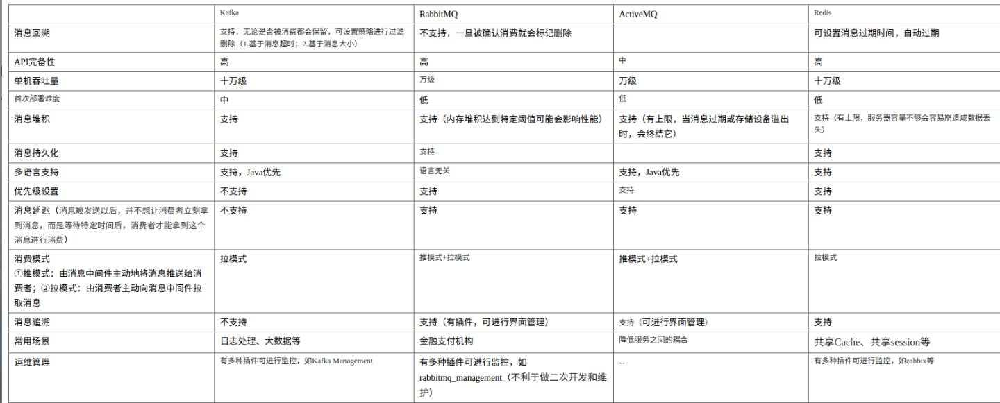
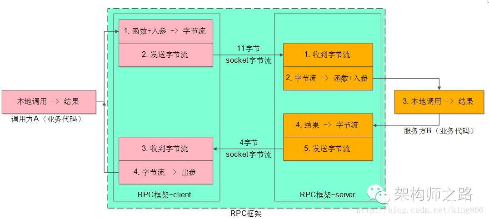

# Ali面试题 

阿里面试涉及的问题和答案,答案全都是网上博客来的,请知悉.

被虐,但也所获匪浅.

---

## 1. JVM加载机制

当写好一个Java程序之后,不是管是CS还是BS应用,都是由若干个`.class`文件组织而成的一个完整的Java应用程序.当程序在运行时,即会调用该程序的一个入口函数来调用系统的相关功能,而这些功能都被封装在不同的class文件当中,所以经常要从这个class文件中要调用另外一个class文件中的方法,如果另外一个文件不存在的,则会引发系统异常.而程序在启动的时候,并不会一次性加载程序所要用的所有class文件,而是根据程序的需要,通过Java的类加载机制(ClassLoader)来动态加载某个class文件到内存当中的,从而只有class文件被载入到了内存之后,才能被其它class所引用. 

**所以ClassLoader就是用来动态加载class文件到内存当中用的.**


### 1.1 JVM的ClassLoader

**BootStrap ClassLoader**:称为启动类加载器,是Java类加载层次中最顶层的类加载器,负责加载JDK中的核心类库,如:rt.jar,resources.jar,charsets.jar等.

可通过如下程序获得该类加载器从哪些地方加载了相关的jar或class文件:

```java
URL[] urls = sun.misc.Launcher.getBootstrapClassPath().getURLs();
for(int i = 0; i < urls.length; i++) {
	System.out.println(urls[i].toExternalForm());
}
```

以下内容是上述程序从本机JDK环境所获得的结果:
```java
file:/C:/Program%20Files/Java/jdk1.6.0_22/jre/lib/resources.jar
file:/C:/Program%20Files/Java/jdk1.6.0_22/jre/lib/rt.jar
file:/C:/Program%20Files/Java/jdk1.6.0_22/jre/lib/sunrsasign.jar
file:/C:/Program%20Files/Java/jdk1.6.0_22/jre/lib/jsse.jar
file:/C:/Program%20Files/Java/jdk1.6.0_22/jre/lib/jce.jar
file:/C:/Program%20Files/Java/jdk1.6.0_22/jre/lib/charsets.jar
file:/C:/Program%20Files/Java/jdk1.6.0_22/jre/classes/
```
其实上述结果也是通过查找sun.boot.class.path这个系统属性所得知的.
```java
System.out.println(System.getProperty("sun.boot.class.path"));
```
打印结果:
```java
C:\Program Files\Java\jdk1.6.0_22\jre\lib\resources.jar;C:\Program Files\Java\jdk1.6.0_22\jre\lib\rt.jar;C:\Program Files\Java\jdk1.6.0_22\jre\lib\sunrsasign.jar;C:\Program Files\Java\jdk1.6.0_22\jre\lib\jsse.jar;C:\Program Files\Java\jdk1.6.0_22\jre\lib\jce.jar;C:\Program Files\Java\jdk1.6.0_22\jre\lib\charsets.jar;C:\Program Files\Java\jdk1.6.0_22\jre\classes
```

**Extension ClassLoader**:称为扩展类加载器,负责加载Java的扩展类库,默认加载JAVA_HOME/jre/lib/ext/目下的所有jar.

**App ClassLoader**:称为系统类加载器,负责加载应用程序classpath目录下的所有jar和class文件.

注意: 除了Java默认提供的三个ClassLoader之外,用户还可以根据需要定义自已的ClassLoader,而这些自定义的ClassLoader都必须继承自java.lang.ClassLoader类,也包括Java提供的另外二个ClassLoader(Extension ClassLoader和App ClassLoader)在内,但是Bootstrap ClassLoader不继承自ClassLoader,因为它不是一个普通的Java类,底层由C++编写,已嵌入到了JVM内核当中,当JVM启动后,Bootstrap ClassLoader也随着启动,负责加载完核心类库后,并构造Extension ClassLoader和App ClassLoader类加载器.

### 1.2 双亲委托

**原理介绍**

ClassLoader使用的是 **双亲委托模型** 来搜索类的,每个ClassLoader实例都有一个父类加载器的引用(不是继承的关系,是一个包含的关系),虚拟机内置的类加载器(Bootstrap ClassLoader)本身没有父类加载器,但可以用作其它ClassLoader实例的的父类加载器.当一个ClassLoader实例需要加载某个类时,它会试图亲自搜索某个类之前,先把这个任务委托给它的父类加载器,这个过程是由上至下依次检查的,首先由最顶层的类加载器Bootstrap ClassLoader试图加载,如果没加载到,则把任务转交给Extension ClassLoader试图加载,如果也没加载到,则转交给App ClassLoader 进行加载,如果它也没有加载得到的话,则返回给委托的发起者,由它到指定的文件系统或网络等URL中加载该类.如果它们都没有加载到这个类时,则抛出ClassNotFoundException异常.否则将这个找到的类生成一个类的定义,并将它加载到内存当中,最后返回这个类在内存中的Class实例对象.

 

**为什么要使用双亲委托这种模型呢?**

因为这样可以 **避免重复加载**,当父亲已经加载了该类的时候,就没有必要子ClassLoader再加载一次.考虑到安全因素,我们试想一下,如果不使用这种委托模式,那我们就可以随时使用自定义的String来动态替代java核心api中定义的类型,这样会存在非常大的安全隐患,而双亲委托的方式,就可以避免这种情况,因为String已经在启动时就被引导类加载器(Bootstrcp ClassLoader)加载,所以用户自定义的ClassLoader永远也无法加载一个自己写的String,除非你改变JDK中ClassLoader搜索类的默认算法.

 

**但是JVM在搜索类的时候,又是如何判定两个class是相同的呢?**

​JVM在判定两个class是否相同时,不仅要判断两个类名是否相同,而且要判断是否由同一个类加载器实例加载的.只有两者同时满足的情况下,JVM才认为这两个class是相同的.就算两个class是同一份class字节码,如果被两个不同的ClassLoader实例所加载,JVM也会认为它们是两个不同class.比如网络上的一个Java类org.classloader.simple.NetClassLoaderSimple,javac编译之后生成字节码文件NetClassLoaderSimple.class,ClassLoaderA和ClassLoaderB这两个类加载器并读取了NetClassLoaderSimple.class文件,并分别定义出了java.lang.Class实例来表示这个类,对于JVM来说,它们是两个不同的实例对象,但它们确实是同一份字节码文件,如果试图将这个Class实例生成具体的对象进行转换时,就会抛运行时异常java.lang.ClassCaseException,提示这是两个不同的类型.现在通过实例来验证上述所描述的是否正确.


---


## 2. HashMap相关

### 2.1 HashMap的增长

在Java 8 之前,HashMap和其他基于map的类都是通过链地址法解决冲突,它们使用单向链表来存储相同索引值的元素.在最坏的情况下,这种方式会将HashMap的get方法的性能从O(1)降低到O(n).为了解决在频繁冲突时hashmap性能降低的问题,Java 8中使用平衡树来替代链表存储冲突的元素.这意味着我们可以将最坏情况下的性能从O(n)提高到O(logn).

在Java 8中使用常量TREEIFY_THRESHOLD来控制是否切换到平衡树来存储.目前,这个常量值是8,这意味着当有超过8个元素的索引一样时,HashMap会使用树来存储它们.

这一改变是为了继续优化常用类.大家可能还记得在Java 7中为了优化常用类对ArrayList和HashMap采用了延迟加载的机制,在有元素加入之前不会分配内存,这会减少空的链表和HashMap占用的内存.

这一动态的特性使得HashMap一开始使用链表,并在冲突的元素数量超过指定值时用平衡二叉树替换链表.不过这一特性在所有基于hash table的类中并没有,例如Hashtable和WeakHashMap.
目前,只有ConcurrentHashMap,LinkedHashMap和HashMap会在频繁冲突的情况下使用平衡树.

什么时候会产生冲突

HashMap中调用hashCode()方法来计算hashCode.
由于在Java中两个不同的对象可能有一样的hashCode,所以不同的键可能有一样hashCode,从而导致冲突的产生.

总结

- HashMap在处理冲突时使用链表存储相同索引的元素.
- 从Java 8开始,HashMap,ConcurrentHashMap和LinkedHashMap在处理频繁冲突时将使用平衡树来代替链表,当同一hash桶中的元素数量超过特定的值便会由链表切换到平衡树,这会将get()方法的性能从O(n)提高到O(logn).
- 当从链表切换到平衡树时,HashMap迭代的顺序将会改变.不过这并不会造成什么问题,因为HashMap并没有对迭代的顺序提供任何保证.
- 从Java 1中就存在的Hashtable类为了保证迭代顺序不变,即便在频繁冲突的情况下也不会使用平衡树.这一决定是为了不破坏某些较老的需要依赖于Hashtable迭代顺序的Java应用.
- 除了Hashtable之外,WeakHashMap和IdentityHashMap也不会在频繁冲突的情况下使用平衡树.
- 使用HashMap之所以会产生冲突是因为使用了键对象的hashCode()方法,而equals()和hashCode()方法不保证不同对象的hashCode是不同的.需要记住的是,相同对象的hashCode一定是相同的,但相同的hashCode不一定是相同的对象.
- 在HashTable和HashMap中,冲突的产生是由于不同对象的hashCode()方法返回了一样的值.

以上就是Java中HashMap如何处理冲突.这种方法被称为链地址法,因为使用链表存储同一桶内的元素.通常情况HashMap,HashSet,LinkedHashSet,LinkedHashMap,ConcurrentHashMap,HashTable,IdentityHashMap和WeakHashMap均采用这种方法处理冲突.

从JDK 8开始,HashMap,LinkedHashMap和ConcurrentHashMap为了提升性能,在频繁冲突的时候使用平衡树来替代链表.因为HashSet内部使用了HashMap,LinkedHashSet内部使用了LinkedHashMap,所以他们的性能也会得到提升.

HashMap的快速高效,使其使用非常广泛.其原理是,调用hashCode()和equals()方法,并对hashcode进行一定的哈希运算得到相应value的位置信息,将其分到不同的桶里.桶的数量一般会比所承载的实际键值对多.当通过key进行查找的时候,往往能够在常数时间内找到该value.

但是,当某种针对key的hashcode的哈希运算得到的位置信息重复了之后,就发生了哈希碰撞.这会对HashMap的性能产生灾难性的影响.

在Java 8 之前, 如果发生碰撞往往是将该value直接链接到该位置的其他所有value的末尾,即相互碰撞的所有value形成一个链表.

因此,在最坏情况下,HashMap的查找时间复杂度将退化到O(n).

但是在Java 8 中,该碰撞后的处理进行了改进.当一个位置所在的冲突过多时,存储的value将形成一个排序二叉树,排序依据为key的hashcode.

则,在最坏情况下,HashMap的查找时间复杂度将从O(1)退化到O(logn).

虽然是一个小小的改进,但意义重大:

- a. O(n)到O(logn)的时间开销.

- b. 如果恶意程序知道我们用的是Hash算法,则在纯链表情况下,它能够发送大量请求导致哈希碰撞,然后不停访问这些key导致HashMap忙于进行线性查找,最终陷入瘫痪,即形成了拒绝服务攻击(DoS).


### 2.2 HashMap和HashSet的区别

| hashMap实现的是map接口                                                      | hashSet实现的是set接口                  |
| --------------------------------------------------------------------------- | --------------------------------------- |
| hashMap是键对值存储                                                         | hashset存储的仅仅是值                   |
| hashMap使用put()存入数据                                                    | hashset使用add()存入数据                |
| hashMap效率比较快,因为他是使用唯一的键来获取对象                            | hashSet相对于hashMap来说效率较慢        |
| hashMap使用的是键对象来计算hashcode值                                       | hashSet使用的是成员对象来计算hashcode值 |
| hashMap的键具有唯一性,并且允许null值和null键,且不保证内部数据的顺序恒久不变 | hashSet具有去除重复项的功能             |


### 2.3 HashMap和HashTable的区别

HashTable:

方法是同步的,方法不允许value=null,key=null


HashMap:

方法是非同步的,方法允许key=null,value=null

HashMap把Hashtable的contains方法去掉了,改成containsvalue和containsKey.因为contains方法容易让人引起误解.


### 2.4 LinkedHashMap

在HashMap里边,put进去的元素,取出来是无序的,如果要保证有序,那么可以使用LinkedHashMap.

```java
public class LinkedMap {
	public static void main(String[] args) {
		Map<String, String> map = new LinkedHashMap<>();

		map.put("1", "1");
		map.put("2", "2");
		map.put("3", "3");
		/*
		 * key,value允许为null
		 */
		map.put(null, null);

		map.forEach((k, v) -> {
			System.out.println(k + ":" + v);
		});
	}
}
```

```java
1:1
2:2
3:3
null:null
```


### 2.5 HashTable和ConcurrentHashMap的区别

**为什么我们需要ConcurrentHashMap和CopyOnWriteArrayList**

同步的集合类(Hashtable和Vector),同步的封装类(使用Collections.synchronizedMap()方法和Collections.synchronizedList()方法返回的对象)可以创建出线程安全的Map和List.但是有些因素使得它们不适合高并发的系统.它们仅有单个锁,对整个集合加锁,以及为了防止ConcurrentModificationException异常经常要在迭代的时候要将集合锁定一段时间,这些特性对可扩展性来说都是障碍.

ConcurrentHashMap和CopyOnWriteArrayList保留了线程安全的同时,也提供了更高的并发性.ConcurrentHashMap和CopyOnWriteArrayList并不是处处都需要用,大部分时候你只需要用到HashMap和ArrayList,它们用于应对一些普通的情况.


**ConcurrentHashMap和Hashtable的区别**

Hashtable和ConcurrentHashMap有什么分别呢?它们都可以用于多线程的环境,但是当Hashtable的大小增加到一定的时候,性能会急剧下降,因为迭代时需要被锁定很长的时间.因为ConcurrentHashMap引入了分割(segmentation),不论它变得多么大,仅仅需要锁定map的某个部分,而其它的线程不需要等到迭代完成才能访问map.简而言之,**在迭代的过程中,ConcurrentHashMap仅仅锁定map的某个部分,而Hashtable则会锁定整个map**.


a. HashTable的线程安全使用的是一个单独的全部Map范围的锁,ConcurrentHashMap抛弃了HashTable的单锁机制,使用了锁分离技术,使得多个修改操作能够并发进行,只有进行SIZE()操作时ConcurrentHashMap会锁住整张表.


b. HashTable的put和get方法都是同步方法,  而ConcurrentHashMap的get方法多数情况都不用锁,put方法需要锁.

但是ConcurrentHashMap不能替代HashTable,因为两者的迭代器的一致性不同的,hash table的迭代器是强一致性的,而concurrenthashmap是弱一致的. ConcurrentHashMap的get,clear,iterator 都是弱一致性的.

---


## 3. 线程池的使用

执行流程:  **创建coresize的初始线程 ->coresize全部已执行,新进任务放进等待队列 -> 队列已满 -> 开启线程数至maxsize -> 还执行不过来,进行策略拒绝.**


```java
public class ThreadPoolExecutor extends AbstractExecutorService {
    .....
    public ThreadPoolExecutor(int corePoolSize,int maximumPoolSize,long keepAliveTime,TimeUnit unit,
BlockingQueue<Runnable> workQueue);
 
    public ThreadPoolExecutor(int corePoolSize,int maximumPoolSize,long keepAliveTime,TimeUnit unit,
BlockingQueue<Runnable> workQueue,ThreadFactory threadFactory);
 
    public ThreadPoolExecutor(int corePoolSize,int maximumPoolSize,long keepAliveTime,TimeUnit unit,
BlockingQueue<Runnable> workQueue,RejectedExecutionHandler handler);
 
    public ThreadPoolExecutor(int corePoolSize,int maximumPoolSize,long keepAliveTime,TimeUnit unit,
 BlockingQueue<Runnable> workQueue,ThreadFactory threadFactory,RejectedExecutionHandler handler);
    ...
}

```

- corePoolSize:核心池的大小,这个参数跟后面讲述的线程池的实现原理有非常大的关系.在创建了线程池后,默认情况下,线程池中并没有任何线程,而是等待有任务到来才创建线程去执行任务,除非调用了prestartAllCoreThreads()或者prestartCoreThread()方法,从这2个方法的名字就可以看出,是预创建线程的意思,即在没有任务到来之前就创建corePoolSize个线程或者一个线程.默认情况下,在创建了线程池后,线程池中的线程数为0,当有任务来之后,就会创建一个线程去执行任务,当线程池中的线程数目达到corePoolSize后,就会把到达的任务放到缓存队列当中;

- maximumPoolSize:线程池最大线程数,这个参数也是一个非常重要的参数,它表示在线程池中最多能创建多少个线程;

- keepAliveTime:表示线程没有任务执行时最多保持多久时间会终止.默认情况下,只有当线程池中的线程数大于corePoolSize时,keepAliveTime才会起作用,直到线程池中的线程数不大于corePoolSize,即当线程池中的线程数大于corePoolSize时,如果一个线程空闲的时间达到keepAliveTime,则会终止,直到线程池中的线程数不超过corePoolSize.但是如果调用了allowCoreThreadTimeOut(boolean)方法,在线程池中的线程数不大于corePoolSize时,keepAliveTime参数也会起作用,直到线程池中的线程数为0;

- unit:参数keepAliveTime的时间单位,有7种取值,在TimeUnit类中有7种静态属性:

```java
TimeUnit.DAYS; //天
TimeUnit.HOURS; //小时
TimeUnit.MINUTES; //分钟
TimeUnit.SECONDS; //秒
TimeUnit.MILLISECONDS; //毫秒
TimeUnit.MICROSECONDS; //微妙
TimeUnit.NANOSECONDS; //纳秒
```


- workQueue:一个阻塞队列,用来存储等待执行的任务,这个参数的选择也很重要,会对线程池的运行过程产生重大影响,一般来说,这里的阻塞队列有以下几种选择:

```java
ArrayBlockingQueue;
LinkedBlockingQueue;
SynchronousQueue;
```

ArrayBlockingQueue和PriorityBlockingQueue使用较少,一般使用LinkedBlockingQueue和Synchronous.线程池的排队策略与BlockingQueue有关.

- threadFactory:线程工厂,主要用来创建线程;
- handler:表示当拒绝处理任务时的策略,有以下四种取值:

```java
//丢弃任务并抛出RejectedExecutionException异常. 
ThreadPoolExecutor.AbortPolicy;
//也是丢弃任务,但是不抛出异常. 
ThreadPoolExecutor.DiscardPolicy;
//丢弃队列最前面的任务,然后重新尝试执行任务(重复此过程)
ThreadPoolExecutor.DiscardOldestPolicy;
//由调用线程处理该任务 
ThreadPoolExecutor.CallerRunsPolicy;
```


---


## 4. Java里面的异常体系 

### 4.1 Java异常体系

Java异常体系如下:



### 4.2 基础概念

**Error与Exception**

Error是程序无法处理的错误,比如OutOfMemoryError,ThreadDeath等.这些异常发生时,Java虚拟机(JVM)一般会选择线程终止.Exception是程序本身可以处理的异常,这种异常分两大类运行时异常和非运行时异常.程序中应当尽可能去处理这些异常.       


**运行时异常和非运行时异常**  

运行时异常都是RuntimeException类及其子类异常,如NullPointerException,IndexOutOfBoundsException等,这些异常是不检查异常,程序中可以选择捕获处理,也可以不处理.这些异常一般是由程序逻辑错误引起的,程序应该从逻辑角度尽可能避免这类异常的发生.非运行时异常是RuntimeException以外的异常,类型上都属于Exception类及其子类.从程序语法角度讲是必须进行处理的异常,如果不处理,程序就不能编译通过. 如IOException,SQLException等以及用户自定义的Exception异常,一般情况下不自定义检查异常.   


**throw,throws关键字**

throw关键字是用于方法体内部,用来抛出一个Throwable类型的异常.如果抛出了检查异常,则还应该在方法头部声明方法可能抛出的异常类型.该方法的调用者也必须检查处理抛出的异常.如果所有方法都层层上抛获取的异常,最终JVM会进行处理,处理也很简单,就是打印异常消息和堆栈信息.如果抛出的是Error或RuntimeException,则该方法的调用者可选择处理该异常.有关异常的转译会在下面说明.throws关键字用于方法体外部的方法声明部分,用来声明方法可能会抛出某些异常.仅当抛出了检查异常,该方法的调用者才必须处理或者重新抛出该异常.当方法的调用者无力处理该异常的时候,应该继续抛出,而不是囫囵吞枣一般在catch块中打印一下堆栈信息做个勉强处理.


---


## 5. Wait和Sleep的区别

sleep 是线程类(Thread)的方法,导致此线程暂停执行指定时间,给执行机会给其他线程,但是监控状态依然保持,到时后会自动恢复.调用sleep 不会释放对象锁.
wait 是Object 类的方法,对此对象调用wait 方法导致本线程放弃对象锁,进入等待此对象的等待锁定池,只有针对此对象发出notify 方法(或notifyAll)后本线程才进入对象锁定池准备获得对象锁进入运行状态.

- 这两个方法来自不同的类分别是Thread和Object

- 最主要是sleep方法没有释放锁,而wait方法释放了锁,使得其他线程可以使用同步控制块或者方法.

- wait,notify和notifyAll只能在同步控制方法或者同步控制块里面使用,而sleep可以在任何地方使用(使用范围)

```java
synchronized(x){
 　　x.notify()
 　　//或者wait()
}
```

- sleep必须捕获异常,而wait,notify和notifyAll不需要捕获异常

sleep方法属于Thread类中方法,表示让一个线程进入睡眠状态,等待一定的时间之后,自动醒来进入到可运行状态,不会马上进入运行状态,因为线程调度机制恢复线程的运行也需要时间,一个线程对象调用了sleep方法之后,并不会释放他所持有的所有对象锁,所以也就不会影响其他进程对象的运行.但在sleep的过程中过程中有可能被其他对象调用它的interrupt(),产生InterruptedException异常,如果你的程序不捕获这个异常,线程就会异常终止,进入TERMINATED状态,如果你的程序捕获了这个异常,那么程序就会继续执行catch语句块(可能还有finally语句块)以及以后的代码.

注意sleep()方法是一个静态方法,也就是说他只对当前对象有效,通过t.sleep()让t对象进入sleep,这样的做法是错误的,它只会是使当前线程被sleep 而不是t线程

wait属于Object的成员方法,一旦一个对象调用了wait方法,必须要采用notify()和notifyAll()方法唤醒该进程;如果线程拥有某个或某些对象的同步锁,那么在调用了wait()后,这个线程就会释放它持有的所有同步资源,而不限于这个被调用了wait()方法的对象.wait()方法也同样会在wait的过程中有可能被其他对象调用interrupt()方法而产生.


---

## 6. Mybatis缓存

### 6.1 延迟加载

resultMap中的association和collection标签具有延迟加载的功能.

延迟加载的意思是说,在关联查询时,利用延迟加载,先加载主信息.使用关联信息时再去加载关联信息.

**设置延迟加载**

需要在SqlMapConfig.xml文件中,在`<settings>`标签中设置下延迟加载.

lazyLoadingEnabled,aggressiveLazyLoading

| 设置项                | 描述                                                                                 | 允许值          | 默认值  |
| --------------------- | ------------------------------------------------------------------------------------ | --------------- | ------- |
| lazyLoadingEnabled    | 全局性设置懒加载.如果设为‘false’,则所有相关联的都会被初始化加载.                   | `true`,`false`  | `false` |
| aggressiveLazyLoading | 当设置为‘true’的时候,懒加载的对象可能被任何懒属性全部加载.否则,每个属性都按需加载. | `true`, `false` | `true`  |

 


### 6.2 查询缓存

**Mybatis的一级缓存**是指SqlSession.

一级缓存的作用域是一个SqlSession.Mybatis默认开启一级缓存.

在同一个SqlSession中,执行相同的查询SQL,第一次会去查询数据库,并写到缓存中;第二次直接从缓存中取.当执行SQL时两次查询中间发生了增删改操作,则SqlSession的缓存清空.

 

**Mybatis的二级缓存**是指mapper映射文件.

二级缓存的作用域是同一个namespace下的mapper映射文件内容,多个SqlSession共享.Mybatis需要手动设置启动二级缓存.

在同一个namespace下的mapper文件中,执行相同的查询SQL,第一次会去查询数据库,并写到缓存中;第二次直接从缓存中取.当执行SQL时两次查询中间发生了增删改操作,则二级缓存清空.

 

**一级缓存原理**


一级缓存区域是根据SqlSession为单位划分的.

 

每次查询会先去缓存中找,如果找不到,再去数据库查询,然后把结果写到缓存中.Mybatis的内部缓存使用一个HashMap,key为hashcode+statementId+sql语句.Value为查询出来的结果集映射成的java对象.

 

SqlSession执行insert,update,delete等操作commit后会清空该SQLSession缓存. 

**二级缓存原理**


二级缓存是mapper级别的.Mybatis默认是没有开启二级缓存.

 

第一次调用mapper下的SQL去查询用户信息.查询到的信息会存到该mapper对应的二级缓存区域内.

第二次调用相同namespace下的mapper映射文件中相同的SQL去查询用户信息.会去对应的二级缓存内取结果.

如果调用相同namespace下的mapper映射文件中的增删改SQL,并执行了commit操作.此时会清空该namespace下的二级缓存.

 

### 6.3 缓存设置

在核心配置文件SqlMapConfig.xml中加入以下内容(开启二级缓存总开关):

cacheEnabled设置为 true



  

在映射文件中,加入以下内容,开启二级缓存:



 

**实现序列化**

由于二级缓存的数据不一定都是存储到内存中,它的存储介质多种多样,所以需要给缓存的对象执行序列化.

如果该类存在父类,那么父类也要实现序列化.



**禁用二级缓存**

该statement中设置userCache=false可以禁用当前select语句的二级缓存,即每次查询都是去数据库中查询,默认情况下是true,即该statement使用二级缓存.



**刷新二级缓存**




---

## 7. Mysql


### 7.1 组合索引

联合索引又叫复合索引.对于复合索引:Mysql从左到右的使用索引中的字段,一个查询可以只使用索引中的一部份,但只能是最左侧部分.例如索引是key index(a,b,c). 可以支持[a],[a,b],[a,c] ,[a,b,c] 4种组合进行查找,但不支持 b,c进行查找.当最左侧字段是常量引用时,索引就十分有效.

假设有表结构如下

```sql
DROP TABLE IF EXISTS `abc`;
CREATE TABLE `abc`(
  `a` varchar(255) DEFAULT NULL,
  `b` varchar(255) DEFAULT NULL,
  `c` varchar(255) DEFAULT NULL,
  `d` varchar(255) DEFAULT NULL,
  KEY `abcIndex`(`a`,`b`,`c`)
) ENGINE=InnoDB DEFAULT CHARSET=utf8;
```

对字段`a`,`b`,`c`建立联合索引

下面是可以使用到索引的情况

```sql
select * from abc where a ='1' and d='1';
select * from abc where a ='1' and b='1' and c ='1';
select * from abc where a ='1' and c='1';
select * from abc where a ='1' and b='1';
```

下面是不能使用到索引的情况

```sql
select * from abc where b='1' and c ='1';
```

### 7.2 乐观锁与悲观锁

悲观锁与乐观锁是两种常见的资源并发锁设计思路,也是并发编程中一个非常基础的概念.本文将对这两种常见的锁机制在数据库数据上的实现进行比较系统的介绍.

**悲观锁(Pessimistic Lock)**

悲观锁的特点是先获取锁,再进行业务操作,即"悲观"的认为获取锁是非常有可能失败的,因此要先确保获取锁成功再进行业务操作.通常所说的"一锁二查三更新"即指的是使用悲观锁.通常来讲在数据库上的悲观锁需要数据库本身提供支持,即通过常用的select ... for update操作来实现悲观锁.当数据库执行select for update时会获取被select中的数据行的行锁,因此其他并发执行的select for update如果试图选中同一行则会发生排斥(需要等待行锁被释放),因此达到锁的效果.select for update获取的行锁会在当前事务结束时自动释放,因此必须在事务中使用.

这里需要注意的一点是不同的数据库对select for update的实现和支持都是有所区别的,例如oracle支持select for update no wait,表示如果拿不到锁立刻报错,而不是等待,mysql就没有no wait这个选项.另外mysql还有个问题是select for update语句执行中所有扫描过的行都会被锁上,这一点很容易造成问题.因此如果在mysql中用悲观锁务必要确定走了索引,而不是全表扫描.

**乐观锁(Optimistic Lock)**

乐观锁的特点先进行业务操作,不到万不得已不去拿锁.即"乐观"的认为拿锁多半是会成功的,因此在进行完业务操作需要实际更新数据的最后一步再去拿一下锁就好.

乐观锁在数据库上的实现完全是逻辑的,不需要数据库提供特殊的支持.一般的做法是在需要锁的数据上增加一个版本号,或者时间戳,然后按照如下方式实现：

```java
SELECT data AS old_data, version AS old_version FROM ...;

// 根据获取的数据进行业务操作,得到new_data和new_version
UPDATE SET data = new_data, version = new_version WHERE version = old_version

if (updated row > 0) {
    // 乐观锁获取成功,操作完成
} else {
    // 乐观锁获取失败,回滚并重试
}

```

乐观锁是否在事务中其实都是无所谓的,其底层机制是这样：在数据库内部update同一行的时候是不允许并发的,即数据库每次执行一条update语句时会获取被update行的写锁,直到这一行被成功更新后才释放.因此在业务操作进行前获取需要锁的数据的当前版本号,然后实际更新数据时再次对比版本号确认与之前获取的相同,并更新版本号,即可确认这之间没有发生并发的修改.如果更新失败即可认为老版本的数据已经被并发修改掉而不存在了,此时认为获取锁失败,需要回滚整个业务操作并可根据需要重试整个过程.

**总结**

乐观锁在不发生取锁失败的情况下开销比悲观锁小,但是一旦发生失败回滚开销则比较大,因此适合用在取锁失败概率比较小的场景,可以提升系统并发性能

乐观锁还适用于一些比较特殊的场景,例如在业务操作过程中无法和数据库保持连接等悲观锁无法适用的地方

---

## 8. 动态代理和Cglib的区别

### 8.1 基础知识

Spirng的AOP的动态代理实现机制有两种,分别是:

JDK动态代理

> 通过实现InvocationHandlet接口创建自己的调用处理器
>
> 通过为Proxy类指定ClassLoader对象和一组interface来创建动态代理
>
> 通过反射机制获取动态代理类的构造函数,其唯一参数类型就是调用处理器接口类型
>
> 通过构造函数创建动态代理类实例,构造时调用处理器对象作为参数参入
>
> JDK动态代理是面向接口的代理模式,如果被代理目标没有接口那么Spring也无能为力
>
> Spring通过java的反射机制生产被代理接口的新的匿名实现类,重写了其中AOP的增强方法


CGLib动态代理

> **CGLib是一个强大,高性能的Code生产类库,可以实现运行期动态扩展java类,Spring在运行期间通过 CGlib继承要被动态代理的类,重写父类的方法,实现AOP面向切面编程呢.**


### 8.2 两者对比

**比较:**

JDK动态代理是 **面向接口**,在创建代理实现类时比CGLib要快,创建代理速度快.

CGLib动态代理是通过字节码底层继承要代理类来实现(如果被代理类被final关键字所修饰,那么抱歉会失败),在创建代理这一块没有JDK动态代理快,但是运行速度比JDK动态代理要快.

**使用注意:**

如果要被代理的对象是个实现类,那么Spring会使用JDK动态代理来完成操作(Spirng默认采用JDK动态代理实现机制)

如果要被代理的对象不是个实现类那么,Spring会强制使用CGLib来实现动态代理.


---


## 9. 消息队列对比


主流消息队列对比




---


## 10. Spring请求过程和注解区别


### 10.1 Spring请求响应过程

请求如下图所示


### 10.2 获取ApplicationContext

在项目中,经常遇到这样的问题:有些类需要使用new来创建对象,但是类中需要使用spring容器中定义的bean,此时无法通过spring的自动注入来注入我们需要使用的bean.所以需要手动的从spring容器中获取bean.要获取bean必须先获取到ApplicationContext对象,有以下方式可以获取该对象.

#### 方式一

手动创建ApplicationContext对象,并保存起来.

```java
public class ApplicationContextUtil {
    private static ApplicationContext context;
    static {
        context = new ClassPathXmlApplicationContext("applicationContext.xml");
    }
    public static ApplicationContext getApplicationContext() {
        return context;
    }
}
```

#### 方式二

在web环境中通过spring提供的工具类获取,需要ServletContext对象作为参数.然后才通过ApplicationContext对象获取bean.下面两个工具方式的区别是,前者在获取失败时返回null,后者抛出异常.另外,由于spring是容器的对象放在ServletContext中的,所以可以直接在ServletContext取出 WebApplicationContext 对象.

```java
ApplicationContext context1 = WebApplicationContextUtils.getWebApplicationContext(ServletContext sc);
ApplicationContext context2 = WebApplicationContextUtils.getRequiredWebApplicationContext(ServletContext sc);
```

```java
WebApplicationContext webApplicationContext =(WebApplicationContext) servletContext.getAttribute(WebApplicationContext.ROOT_WEB_APPLICATION_CONTEXT_ATTRIBUTE);
```

#### 方式三

工具类继承抽象类ApplicationObjectSupport,并在工具类上使用@Component交由spring管理.这样spring容器在启动的时候,会通过父类

ApplicationObjectSupport中的setApplicationContext()方法将ApplicationContext对象设置进去.可以通过getApplicationContext()得到ApplicationContext对象.

#### 方式四

工具类继承抽象类WebApplicationObjectSupport,查看源码可知WebApplicationObjectSupport是继承了ApplicationObjectSupport,所以获取ApplicationContext对象的方式和上面一样,也是使用getApplicationContext()方法.

#### 方式五

工具类实现ApplicationContextAware接口,并重写setApplicationContext(ApplicationContext applicationContext)方法,在工具类中使用@Component注解让spring进行管理.spring容器在启动的时候,会调用setApplicationContext()方法将ApplicationContext 对象设置进去.

```java
@Component
public class ApplicationContextUtil implements ApplicationContextAware {
    private static ApplicationContext context;

    public void setApplicationContext(ApplicationContext applicationContext) throws BeansException {
        context = applicationContext;
    }

	public static ApplicationContext getApplicationContext() {
        return context;
    }
}
```


### 10.3 @Autowired 与 @Resource

年初刚加入到现在的项目时,在使用注解时我用的@Resource.后来,同事:你怎么使用@Resource注解?我:使用它有错吗?同事:没错,但是现在都使用@Autowired.我:我研究一下.

在大学,学习J2EE实训时一直使用的是@Resource注解,后来我就养成习惯了.现在对这两个注解做一下解释:

- @Resource默认按照名称方式进行bean匹配,@Autowired默认按照类型方式进行bean匹配
- @Resource(import javax.annotation.Resource;)是J2EE的注解,@Autowired( import org.springframework.beans.factory.annotation.Autowired;)是Spring的注解

Spring属于第三方的,J2EE是Java自己的东西.使用@Resource可以减少代码和Spring之间的耦合.

**@Resource注入**

现在有一个接口Human和两个实现类ManImpl,WomanImpl,在service层的一个bean中要引用了接口Human,这种情况处理如下:

接口Human

```java
package testwebapp.com.wangzuojia.service;

public interface Human {
	public void speak();
	public void walk();
}
```

实现类ManImpl

```java
package testwebapp.com.wangzuojia.service.impl;

import org.springframework.stereotype.Service;
import testwebapp.com.wangzuojia.service.Human;


@Service
public class ManImpl implements Human {

	public void speak() {
		System.out.println(" man speaking!");
	}

	public void walk() {
		System.out.println(" man walking!");
	}

}
```

实现类WomanImpl

```java
package testwebapp.com.wangzuojia.service.impl;

import org.springframework.stereotype.Service;
import testwebapp.com.wangzuojia.service.Human;

@Service
public class WomanImpl implements Human {

	public void speak() {
		System.out.println(" woman speaking!");
	}

	public void walk() {
		System.out.println(" woman walking!");
	}

}
```

主调类SequenceServiceImpl

```java
package testwebapp.com.wangzuojia.service.impl;

import java.util.Map;
import javax.annotation.Resource;
import org.springframework.stereotype.Service;
import testwebapp.com.wangzuojia.dao.SequenceMapper;
import testwebapp.com.wangzuojia.service.Human;
import testwebapp.com.wangzuojia.service.SequenceService;

@Service
public class SequenceServiceImpl implements SequenceService {

	@Resource
	private SequenceMapper sequenceMapper;

	public void generateId(Map<String, String> map) {
		sequenceMapper.generateId(map);
	}

	//起服务此处会报错
	@Resource
	private Human human;

}
```

这时候启动tomcat会包如下错误:


```java
严重: Exception sendingcontext initialized event to listener instance of classorg.springframework.web.context.ContextLoaderListenerorg.springframework.beans.factory.BeanCreationException: Error creating beanwith name 'sequenceServiceImpl': Injection of resource dependencies failed;nested exception isorg.springframework.beans.factory.NoUniqueBeanDefinitionException: Noqualifying bean of type [testwebapp.com.wangzuojia.service.Human] is defined:expected single matching bean**but found 2: manImpl,
```


报错的地方给我们提示了:*but found 2: manImpl,womanImpl*  意思是Human有两个实现类.解决方案如下:

```java
package testwebapp.com.wangzuojia.service.impl;


import java.util.Map;
import javax.annotation.Resource;
import org.springframework.stereotype.Service;
import testwebapp.com.wangzuojia.dao.SequenceMapper;
import testwebapp.com.wangzuojia.service.Human;
import testwebapp.com.wangzuojia.service.SequenceService;

@Service
public class SequenceServiceImpl implements SequenceService {

	@Resource
	private SequenceMapper sequenceMapper;

	public void generateId(Map<String, String> map) {
		sequenceMapper.generateId(map);
	}

//注意是manImpl不是ManImpl,因为使用@Service,容器为我们创建bean时默认类名首字母小写
	@Resource(name = "manImpl")
	private Human human;
}
```

这样启动服务就不会报错了.如果是使用的@Autowired注解,要配上@Qualifier("manImpl"),代码如下:

```java
package testwebapp.com.wangzuojia.service.impl;

import java.util.Map;
import javax.annotation.Resource;
import org.springframework.beans.factory.annotation.Autowired;
import org.springframework.beans.factory.annotation.Qualifier;
import org.springframework.stereotype.Service;
import testwebapp.com.wangzuojia.dao.SequenceMapper;
import testwebapp.com.wangzuojia.service.Human;
import testwebapp.com.wangzuojia.service.SequenceService;

@Service
public class SequenceServiceImpl implements SequenceService {

	@Resource
	private SequenceMapper sequenceMapper;

	public void generateId(Map<String, String> map) {
		sequenceMapper.generateId(map);
	}
	@Autowired
	@Qualifier("manImpl")
	private Human human;
}
```


### 10.4 BeanFactory与FactoryBean

区别:BeanFactory是个Factory,也就是IOC容器或对象工厂,FactoryBean是个Bean.在Spring中,所有的Bean都是由BeanFactory(也就是IOC容器)来进行管理的.但对FactoryBean而言,这个Bean不是简单的Bean,而是一个能生产或者修饰对象生成的工厂Bean,它的实现与设计模式中的工厂模式和修饰器模式类似


**BeanFactory**

BeanFactory定义了IOC容器的最基本形式,并提供了IOC容器应遵守的的最基本的接口,也就是Spring IOC所遵守的最底层和最基本的编程规范.在Spring代码中,BeanFactory只是个接口,并不是IOC容器的具体实现,但是Spring容器给出了很多种实现,如 DefaultListableBeanFactory,XmlBeanFactory,ApplicationContext等,都是附加了某种功能的实现.

```java
package org.springframework.beans.factory;  
import org.springframework.beans.BeansException;  
public interface BeanFactory {  
    String FACTORY_BEAN_PREFIX = "&";  
    Object getBean(String name) throws BeansException;  
    <T> T getBean(String name, Class<T> requiredType) throws BeansException;  
    <T> T getBean(Class<T> requiredType) throws BeansException;  
    Object getBean(String name, Object... args) throws BeansException;  
    boolean containsBean(String name);  
    boolean isSingleton(String name) throws NoSuchBeanDefinitionException;  
    boolean isPrototype(String name) throws NoSuchBeanDefinitionException;  
    boolean isTypeMatch(String name, Class<?> targetType) throws NoSuchBeanDefinitionException;  
    Class<?> getType(String name) throws NoSuchBeanDefinitionException;  
    String[] getAliases(String name);  
}  
```

**FactoryBean**

一般情况下,Spring通过反射机制利用<bean>的class属性指定实现类实例化Bean,在某些情况下,实例化Bean过程比较复杂,如果按照传统的方式,则需要在<bean>中提供大量的配置信息.配置方式的灵活性是受限的,这时采用编码的方式可能会得到一个简单的方案.Spring为此提供了一个org.springframework.bean.factory.FactoryBean的工厂类接口,用户可以通过实现该接口定制实例化Bean的逻辑.
FactoryBean接口对于Spring框架来说占用重要的地位,Spring自身就提供了70多个FactoryBean的实现.它们隐藏了实例化一些复杂Bean的细节,给上层应用带来了便利.从Spring3.0开始,FactoryBean开始支持泛型,即接口声明改为FactoryBean<T>的形式

```java
package org.springframework.beans.factory;  
public interface FactoryBean<T> {  
    T getObject() throws Exception;  
    Class<?> getObjectType();  
    boolean isSingleton();  
}
```

该接口中还定义了以下3个方法:

- T getObject():返回由FactoryBean创建的Bean实例,如果isSingleton()返回true,则该实例会放到Spring容器中单实例缓存池中;

- boolean isSingleton():返回由FactoryBean创建的Bean实例的作用域是singleton还是prototype;

- Class<T> getObjectType():返回FactoryBean创建的Bean类型.


当配置文件中`<bean>`的class属性配置的实现类是FactoryBean时,通过getBean()方法返回的不是FactoryBean本身,而是FactoryBean#getObject()方法所返回的对象,相当于FactoryBean#getObject()代理了getBean()方法.

例:如果使用传统方式配置下面Car的`<bean>`时,Car的每个属性分别对应一个`<property>`元素标签.

```java
package  com.baobaotao.factorybean;  
public   class  Car  {  
	private  int maxSpeed ;  
	private  String brand ;  
	private  double price ;  
	public   int  getMaxSpeed()   {  
		return   this.maxSpeed ;  
	}  
	public   void  setMaxSpeed( int  maxSpeed )   {  
		this.maxSpeed  = maxSpeed;  
	}  
	public  String getBrand()   {  
		return   this.brand ;  
	}  
	public   void  setBrand( String brand )   {  
		this.brand  = brand;  
	}  
	public   double  getPrice()   {  
		return   this.price ;  
	}  
	public   void  setPrice( double  price )   {  
		this.price  = price;  
	}  
}  
```

如果用FactoryBean的方式实现就灵活点,下例通过逗号分割符的方式一次性的为Car的所有属性指定配置值:

```java
package  com.baobaotao.factorybean;  
import  org.springframework.beans.factory.FactoryBean;  
public   class  CarFactoryBean  implements  FactoryBean<Car>  {  
    private  String carInfo ;  
    public  Car getObject()   throws  Exception  {  
        Car car =  new  Car() ;  
        String []  infos =  carInfo .split( "," ) ;  
        car.setBrand( infos [ 0 ]) ;  
        car.setMaxSpeed( Integer. valueOf( infos [ 1 ])) ;  
        car.setPrice( Double. valueOf( infos [ 2 ])) ;  
        return  car;  
    }  
    public  Class<Car> getObjectType()   {  
        return  Car.class ;  
    }  
    public   boolean  isSingleton()   {  
        return   false ;  
    }  
    public  String getCarInfo()   {  
        return   this.carInfo ;  
    }  
  
    // 接受逗号分割符设置属性信息  
    public   void  setCarInfo( String carInfo )   {  
        this.carInfo  = carInfo;  
    }  
}   
```


有了这个CarFactoryBean后,就可以在配置文件中使用下面这种自定义的配置方式配置CarBean了:

```xml
<bean id="car" class="com.baobaotao.factorybean.CarFactoryBean" P:carInfo="法拉利,400,2000000"/>
```

当调用getBean("car")时,Spring通过反射机制发现CarFactoryBean实现了FactoryBean的接口,这时Spring容器就调用接口方法CarFactoryBean#getObject()方法返回.如果希望获取CarFactoryBean的实例,则需要在使用getBean(beanName)方法时在beanName前显示的加上"&"前缀:如getBean("&car");


**区别**

BeanFactory是个Factory,也就是IOC容器或对象工厂,FactoryBean是个Bean.在Spring中,所有的Bean都是由BeanFactory(也就是IOC容器)来进行管理的.但对FactoryBean而言,这个Bean不是简单的Bean,而是一个能生产或者修饰对象生成的工厂Bean,它的实现与设计模式中的工厂模式和修饰器模式类似.


### 10.5 @Component与@Service区别

在spring集成的框架中,注解在类上的`@Component`,`@Repository`,`@Service`等注解能否被互换?或者说这些注解有什么区别?

引用spring的官方文档中的一段描述:

在Spring2.0之前的版本中,`@Repository`注解可以标记在任何的类上,用来表明该类是用来执行与数据库相关的操作(即dao对象),并支持自动处理数据库操作产生的异常

在Spring2.5版本中,引入了更多的Spring类注解:`@Component`,`@Service`,`@Controller`.`Component`是一个通用的Spring容器管理的单例bean组件.而`@Repository`, `@Service`, `@Controller`就是针对不同的使用场景所采取的特定功能化的注解组件.

因此,当你的一个类被`@Component`所注解,那么就意味着同样可以用`@Repository`, `@Service`, `@Controller`来替代它,同时这些注解会具备有更多的功能,而且功能各异.

最后,如果你不知道要在项目的业务层采用`@Service`还是`@Component`注解.那么,`@Service`是一个更好的选择.

就如上文所说的,`@Repository`早已被支持了在你的持久层作为一个标记可以去自动处理数据库操作产生的异常(译者注:因为原生的java操作数据库所产生的异常只定义了几种,但是产生数据库异常的原因却有很多种,这样对于数据库操作的报错排查造成了一定的影响;而Spring拓展了原生的持久层异常,针对不同的产生原因有了更多的异常进行描述.所以,在注解了`@Repository`的类上如果数据库操作中抛出了异常,就能对其进行处理,转而抛出的是翻译后的spring专属数据库异常,方便我们对异常进行排查处理).

| 注解        | 含义                                        |
| ----------- | :-----------------------------------------: |
| @Component  | 最普通的组件,可以被注入到spring容器进行管理 |
| @Repository | 作用于持久层                                |
| @Service    | 作用于业务逻辑层                            |
| @Controller | 作用于表现层(spring-mvc的注解)              |

回答2

这几个注解几乎可以说是一样的:因为被这些注解修饰的类就会被Spring扫描到并注入到Spring的bean容器中.

这里,有两个注解是不能被其他注解所互换的:

* `@Controller` 注解的bean会被spring-mvc框架所使用.
* `@Repository` 会被作为持久层操作(数据库)的bean来使用

如果想使用自定义的组件注解,那么只要在你定义的新注解中加上`@Component`即可:

```java
@Component 

@Scope("prototype")

public @interface ScheduleJob {...}
```

这样,所有被`@ScheduleJob`注解的类就都可以注入到spring容器来进行管理.我们所需要做的,就是写一些新的代码来处理这个自定义注解(译者注:可以用反射的方法),进而执行我们想要执行的工作.

回答3

`@Component`就是跟`<bean>`一样,可以托管到Spring容器进行管理.

@Service, @Controller , @Repository = {@Component + 一些特定的功能}.这个就意味着这些注解在部分功能上是一样的.

当然,下面三个注解被用于为我们的应用进行分层:

* `@Controller`注解类进行前端请求的处理,转发,重定向.包括调用Service层的方法
* `@Service`注解类处理业务逻辑
* `@Repository`注解类作为DAO对象(数据访问对象,Data Access Objects),这些类可以直接对数据库进行操作

有这些分层操作的话,代码之间就实现了松耦合,代码之间的调用也清晰明朗,便于项目的管理;假想一下,如果只用`@Controller`注解,那么所有的请求转发,业务处理,数据库操作代码都糅合在一个地方,那这样的代码该有多难拓展和维护.


总结

* `@Component`, `@Service`, `@Controller`, `@Repository`是spring注解,注解后可以被spring框架所扫描并注入到spring容器来进行管理
* `@Component`是通用注解,其他三个注解是这个注解的拓展,并且具有了特定的功能
* `@Repository`注解在持久层中,具有将数据库操作抛出的原生异常翻译转化为spring的持久层异常的功能.
* `@Controller`层是spring-mvc的注解,具有将请求进行转发,重定向的功能.
* `@Service`层是业务逻辑层注解,这个注解只是标注该类处于业务逻辑层.
* 用这些注解对应用进行分层之后,就能将请求处理,义务逻辑处理,数据库操作处理分离出来,为代码解耦,也方便了以后项目的维护和开发.


---

## 11. Spring事务和传播机制

### 11.1 事务的嵌套概念

所谓事务的嵌套就是两个事务方法之间相互调用.spring事务开启 ,或者是基于接口的或者是基于类的代理被创建(**注意一定要是代理,不能手动new 一个对象,并且此类(有无接口都行)一定要被代理——spring中的bean只要纳入了IOC管理都是被代理的**).所以在同一个类中一个方法调用另一个方法有事务的方法,事务是不会起作用的.

Spring默认情况下会对运行期例外(RunTimeException),即uncheck异常,进行事务回滚.

如果遇到checked异常就不回滚.

如何改变默认规则:

1. 让checked例外也回滚:在整个方法前加上 `@Transactional(rollbackFor=Exception.class)`

2. 让unchecked例外不回滚: `@Transactional(notRollbackFor=RunTimeException.class)`

3. 不需要事务管理的(只查询的)方法:`@Transactional(propagation=Propagation.NOT_SUPPORTED)`

上面三种方式也可在xml配置

### 11.2 spring事务传播属性

在 spring的 TransactionDefinition接口中一共定义了六种事务传播属性:

```java
//支持当前事务,如果当前没有事务,就新建一个事务.这是最常见的选择. 
PROPAGATION_REQUIRED;

//支持当前事务,如果当前没有事务,就以非事务方式执行. 
PROPAGATION_SUPPORTS;

//支持当前事务,如果当前没有事务,就抛出异常. 
PROPAGATION_MANDATORY;

//新建事务,如果当前存在事务,把当前事务挂起. 
PROPAGATION_REQUIRES_NEW;

//以非事务方式执行操作,如果当前存在事务,就把当前事务挂起. 
PROPAGATION_NOT_SUPPORTED;

//以非事务方式执行,如果当前存在事务,则抛出异常. 
PROPAGATION_NEVER;

//如果当前存在事务,则在嵌套事务内执行.如果当前没有事务,则进行与PROPAGATION_REQUIRED类似的操作. 
PROPAGATION_NESTED;
```

前六个策略类似于EJB CMT,第七个(PROPAGATION_NESTED)是Spring所提供的一个特殊变量. 
它要求事务管理器或者使用JDBC 3.0 Savepoint API提供嵌套事务行为(如Spring的DataSourceTransactionManager) 

举例浅析Spring嵌套事务

**ServiceA#methodA(我们称之为外部事务),ServiceB#methodB(我们称之为外部事务)**

```java
ServiceA { 
    void methodA() {
        ServiceB.methodB();
    }
}
  
ServiceB {
    void methodB() {
}

```

**PROPAGATION_REQUIRED**

假如当前正要执行的事务不在另外一个事务里,那么就起一个新的事务 
比如说,ServiceB.methodB的事务级别定义为PROPAGATION_REQUIRED, 那么由于执行ServiceA.methodA的时候

- 如果ServiceA.methodA已经起了事务,这时调用ServiceB.methodB,ServiceB.methodB看到自己已经运行在ServiceA.methodA的事务内部,就不再起新的事务.这时只有外部事务并且他们是共用的,所以这时ServiceA.methodA或者ServiceB.methodB无论哪个发生异常methodA和methodB作为一个整体都将一起回滚.
- 如果ServiceA.methodA没有事务,ServiceB.methodB就会为自己分配一个事务.这样,在ServiceA.methodA中是没有事务控制的.只是在ServiceB.methodB内的任何地方出现异常,ServiceB.methodB将会被回滚,不会引起ServiceA.methodA的回滚


**PROPAGATION_SUPPORTS**

如果当前在事务中,即以事务的形式运行,如果当前不在一个事务中,那么就以非事务的形式运行 


**PROPAGATION_MANDATORY**

必须在一个事务中运行.也就是说,他只能被一个父事务调用.否则,他就要抛出异常


**PROPAGATION_REQUIRES_NEW**

启动一个新的, 不依赖于环境的 "内部" 事务. 这个事务将被完全 commited 或 rolled back 而不依赖于外部事务, 它拥有自己的隔离范围, 自己的锁, 等等. 当内部事务开始执行时, 外部事务将被挂起, 内务事务结束时, 外部事务将继续执行. 

 比如我们设计ServiceA.methodA的事务级别为PROPAGATION_REQUIRED,ServiceB.methodB的事务级别为PROPAGATION_REQUIRES_NEW,那么当执行到ServiceB.methodB的时候,ServiceA.methodA所在的事务就会挂起,ServiceB.methodB会起一个新的事务,等待ServiceB.methodB的事务完成以后,他才继续执行.他与PROPAGATION_REQUIRED 的事务区别在于事务的回滚程度了.因为ServiceB.methodB是新起一个事务,那么就是存在两个不同的事务.

- 如果ServiceB.methodB已经提交,那么ServiceA.methodA失败回滚,ServiceB.methodB是不会回滚的.
- 如果ServiceB.methodB失败回滚,如果他抛出的异常被ServiceA.methodA的try..catch捕获并处理,ServiceA.methodA事务仍然可能提交;如果他抛出的异常未被ServiceA.methodA捕获处理,ServiceA.methodA事务将回滚.

使用场景:

不管业务逻辑的service是否有异常,Log Service都应该能够记录成功,所以Log Service的传播属性可以配为此属性.最下面将会贴出配置代码.


**PROPAGATION_NOT_SUPPORTED**

当前不支持事务.比如ServiceA.methodA的事务级别是PROPAGATION_REQUIRED ,而ServiceB.methodB的事务级别是PROPAGATION_NOT_SUPPORTED ,那么当执行到ServiceB.methodB时,ServiceA.methodA的事务挂起,而他以非事务的状态运行完,再继续ServiceA.methodA的事务.


**PROPAGATION_NEVER**

不能在事务中运行.假设ServiceA.methodA的事务级别是PROPAGATION_REQUIRED, 而ServiceB.methodB的事务级别是PROPAGATION_NEVER ,那么ServiceB.methodB就要抛出异常了. 


**PROPAGATION_NESTED**

开始一个 "嵌套的" 事务,  它是已经存在事务的一个真正的子事务. 潜套事务开始执行时,  它将取得一个 savepoint. 如果这个嵌套事务失败, 我们将回滚到此 savepoint. 潜套事务是外部事务的一部分, 只有外部事务结束后它才会被提交. 

比如我们设计ServiceA.methodA的事务级别为PROPAGATION_REQUIRED,ServiceB.methodB的事务级别为PROPAGATION_NESTED,那么当执行到ServiceB.methodB的时候,ServiceA.methodA所在的事务就会挂起,ServiceB.methodB会起一个**新的子事务并设置savepoint**,等待ServiceB.methodB的事务完成以后,他才继续执行..因为ServiceB.methodB是外部事务的子事务,那么1,如果ServiceB.methodB已经提交,那么ServiceA.methodA失败回滚,ServiceB.methodB也将回滚.2,如果ServiceB.methodB失败回滚,如果他抛出的异常被ServiceA.methodA的try..catch捕获并处理,ServiceA.methodA事务仍然可能提交;如果他抛出的异常未被ServiceA.methodA捕获处理,ServiceA.methodA事务将回滚.

理解Nested的关键是savepoint.他与PROPAGATION_REQUIRES_NEW的区别是:

PROPAGATION_REQUIRES_NEW 完全是一个新的事务,它与外部事务相互独立; 而 PROPAGATION_NESTED 则是外部事务的子事务, 如果外部事务 commit, 嵌套事务也会被 commit, 这个规则同样适用于 roll back. 


**在 spring 中使用 PROPAGATION_NESTED的前提:**

a. 我们要设置 transactionManager 的 nestedTransactionAllowed 属性为 true, 注意, 此属性默认为 false!!! 

b. java.sql.Savepoint 必须存在, 即 jdk 版本要 1.4+ 

c. Connection.getMetaData().supportsSavepoints() 必须为 true, 即 jdbc drive 必须支持 JDBC 3.0 

确保以上条件都满足后, 你就可以尝试使用 PROPAGATION_NESTED 了. 


### 11.3 Log Service配置事务传播

不管业务逻辑的service是否有异常,Log Service都应该能够记录成功,通常有异常的调用更是用户关心的.Log Service如果沿用业务逻辑Service的事务的话在抛出异常时将没有办法记录日志(事实上是回滚了).所以希望Log Service能够有独立的事务.日志和普通的服务应该具有不同的策略.Spring 配置文件transaction.xml:

```xml
<?xml version="1.0" encoding="UTF-8"?>
<beans xmlns="http://www.springframework.org/schema/beans"
	xmlns:xsi="http://www.w3.org/2001/XMLSchema-instance" xmlns:aop="http://www.springframework.org/schema/aop"
	xmlns:tx="http://www.springframework.org/schema/tx"
	xsi:schemaLocation="http://www.springframework.org/schema/beans http://www.springframework.org/schema/beans/spring-beans-2.0.xsd http://www.springframework.org/schema/tx http://www.springframework.org/schema/tx/spring-tx-2.0.xsd http://www.springframework.org/schema/aop http://www.springframework.org/schema/aop/spring-aop-2.0.xsd">
	<!-- configure transaction -->
 
	<tx:advice id="defaultTxAdvice" transaction-manager="transactionManager">
		<tx:attributes>
			<tx:method name="get*" read-only="true" />
			<tx:method name="query*" read-only="true" />
			<tx:method name="find*" read-only="true" />
			<tx:method name="*" propagation="REQUIRED" rollback-for="java.lang.Exception" />
		</tx:attributes>
	</tx:advice>
 
	<tx:advice id="logTxAdvice" transaction-manager="transactionManager">
		<tx:attributes>
			<tx:method name="get*" read-only="true" />
			<tx:method name="query*" read-only="true" />
			<tx:method name="find*" read-only="true" />
			<tx:method name="*" propagation="REQUIRES_NEW"
				rollback-for="java.lang.Exception" />
		</tx:attributes>
	</tx:advice>
 
	<aop:config>
		<aop:pointcut id="defaultOperation"
			expression="@within(com.homent.util.DefaultTransaction)" />
		<aop:pointcut id="logServiceOperation"
			expression="execution(* com.homent.service.LogService.*(..))" />
			
		<aop:advisor advice-ref="defaultTxAdvice" pointcut-ref="defaultOperation" />
		<aop:advisor advice-ref="logTxAdvice" pointcut-ref="logServiceOperation" />
	</aop:config>
</beans>
```

​																 																		 													
如上面的Spring配置文件所示,日志服务的事务策略配置为propagation="REQUIRES_NEW",告诉Spring不管上下文是否有事务,Log Service被调用时都要求一个完全新的只属于Log Service自己的事务.通过该事务策略,Log Service可以独立的记录日志信息,不再受到业务逻辑事务的干扰.

---

## 12. Spring IOC和AOP的应用 

IOC:IOC,另外一种说法叫DI(Dependency Injection),即依赖注入.它并不是一种技术实现,而是一种设计思想.在任何一个有实际开发意义的程序项目中,我们会使用很多类来描述它们特有的功能,并且通过类与类之间的相互协作来完成特定的业务逻辑.这个时候,每个类都需要负责管理与自己有交互的类的引用和依赖,代码将会变的异常难以维护和极度的高耦合.而IOC的出现正是用来解决这个问题,我们通过IOC将这些相互依赖对象的创建.协调工作交给Spring容器去处理,每个对象只需要关注其自身的业务逻辑关系就可以了.在这样的角度上来看,获得依赖的对象的方式,进行了反转,变成了由spring容器控制对象如何获取外部资源(包括其他对象和文件资料等等).

举例:某一天,你生病了,但是你不清楚自己到底得了什么病,你只知道自己头疼,咳嗽,全身无力.这个时候你决定去药店买药,药店有很多种药,仅仅是治疗头疼就有好几十种,还有西药中药等区别.然后你自己看了看说明书,选择了一盒你自己觉得最能治疗自己病症的药,付钱吃药,期待可以早点好起来. 
但是这个过程,对于一个病人来说,太辛苦了.头疼,咳嗽,全身无力,还要一个个的看药品说明书,一个个的比较哪个药比较好,简直是太累了.这个时候,你决定直接去医院看医生. 
医生给你做了检查,知道你的病症是什么,有什么原因引起的;同时医生非常了解有哪些药能治疗你的病痛,并且能根据你的自身情况进行筛选.只需要短短的十几分钟,你就能拿到对症下药的药品,即省时又省力.

在上面这个例子中,IOC起到的就是医生的作用,它收集你的需求要求,并且对症下药,直接把药开给你.你就是对象,药品就是你所需要的外部资源.通过医生,你不用再去找药品,而是通过医生把药品开给你.这就是整个IOC的精髓所在.

AOP:面向切面编程,往往被定义为促使软件系统实现关注点的分离的技术.系统是由许多不同的组件所组成的,每一个组件各负责一块特定功能.除了实现自身核心功能之外,这些组件还经常承担着额外的职责.例如日志.事务管理和安全这样的核心服务经常融入到自身具有核心业务逻辑的组件中去.这些系统服务经常被称为横切关注点,因为它们会跨越系统的多个组件.

AOP的概念不好像IOC一样实例化举例,现在我们以一个系统中的具体实现来讲讲AOP具体是个什么技术.

我们以系统中常用到的事务管控举例子.在系统操作数据库的过程中,不可避免地要考虑到事务相关的内容.如果在每一个方法中都新建一个事务管理器,那么无疑是对代码严重的耦合和侵入.为了简化我们的开发过程(实际上spring所做的一切实现都是为了简化开发过程),需要把事务相关的代码抽成出来做为一个独立的模块.通过AOP,确认每一个操作数据库方法为一个连接点,这些连接点组成了一个切面.当程序运行到其中某个一个切点时,我们将事务管理模块顺势织入对象中,通过通知功能,完成整个事务管控的实现.这样一来,所有的操作数据库的方法中不需要再单独关心事务管理的内容,只需要关注自身的业务代码的实现即可.所有的事务管控相关的内容都通过AOP的方式进行了实现.简化了代码的内容,将目标对象复杂的内容进行解耦,分离业务逻辑与横切关注点.

下面介绍一下AOP相关的术语:

通知: 通知定义了切面是什么以及何时使用的概念.

Spring 切面可以应用5种类型的通知:
>
> 前置通知(Before):在目标方法被调用之前调用通知功能.
>
> 后置通知(After):在目标方法完成之后调用通知,此时不会关心方法的输出是什么.
>
> 返回通知(After-returning):在目标方法成功执行之后调用通知.
>
> 异常通知(After-throwing):在目标方法抛出异常后调用通知.
>
> 环绕通知(Around):通知包裹了被通知的方法,在被通知的方法调用之前和调用之后执行自定义的行为.
>
>连接点:是在应用执行过程中能够插入切面的一个点.
>
>切点:切点定义了切面在何处要织入的一个或者多个连接点.
>
>切面:是通知和切点的结合.通知和切点共同定义了切面的全部内容.
>
>引入:引入允许我们向现有类添加新方法或属性.
>
>织入:是把切面应用到目标对象,并创建新的代理对象的过程.切面在指定的连接点被织入到目标对象中.在目标对象的生命周期中有多个点可以进行织入.
>
>编译期:在目标类编译时,切面被织入.这种方式需要特殊的编译器.AspectJ的织入编译器就是以这种方式织入切面的.
>
>类加载期:切面在目标加载到JVM时被织入.这种方式需要特殊的类加载器(class loader)它可以在目标类被引入应用之前增强该目标类的字节码.
>
>运行期: 切面在应用运行到某个时刻时被织入.一般情况下,在织入切面时,AOP容器会为目标对象动态地创建一个代理对象.SpringAOP就是以这种方式织入切面的.

---

## 13. RPC与Rest

接口调用通常包含两个部分,序列化和通信协议.常见的序列化协议包括json,xml,hession,protobuf,thrift,text,bytes等;通信比较流行的是http,soap,websockect,RPC通常基于TCP实现,常用框架例如dubbo,netty,mina,thrift

**两种接口**

> Rest:严格意义上说接口很规范,操作对象即为资源,对资源的四种操作(post,get,put,delete),并且参数都放在URL上,但是不严格的说Http+json,Http+xml,常见的http api都可以称为Rest接口.
>
> Rpc:我们常说的远程方法调用,就是像调用本地方法一样调用远程方法,通信协议大多采用二进制方式


**http vs 高性能二进制协议**

http相对更规范,更标准,更通用,无论哪种语言都支持http协议.如果你是对外开放API,例如开放平台,外部的编程语言多种多样,你无法拒绝对每种语言的支持,相应的,如果采用http,无疑在你实现SDK之前,支持了所有语言,所以,现在开源中间件,基本最先支持的几个协议都包含RESTful.

RPC协议性能要高的多,例如Protobuf,Thrift,Kyro等,(如果算上序列化)吞吐量大概能达到http的二倍.响应时间也更为出色.千万不要小看这点性能损耗,公认的,微服务做的比较好的,例如,netflix,阿里,曾经都传出过为了提升性能而合并服务.如果是交付型的项目,性能更为重要,因为你卖给客户往往靠的就是性能上微弱的优势.

RESTful你可以看看,无论是Google,Amazon,netflix(据说很可能转向grpc),还是阿里,实际上内部都是采用性能更高的RPC方式.而对外开放的才是RESTful.


Rest 调用及测试都很方便,Rpc就显得有点麻烦,但是Rpc的效率是毋庸置疑的,所以建议在多系统之间采用Rpc,对外提供服务,Rest是很适合的
duboo在生产者和消费者两个微服务之间的通信采用的就是Rpc,无疑在服务之间的调用Rpc更变现的优秀


Rpc在微服务中的利用

1. RPC 框架是架构微服务化的首要基础组件,它能大大降低架构微服务化的成本,提高调用方与服务提供方的研发效率,屏蔽跨进程调用函数(服务)的各类复杂细节


2. RPC 框架的职责是: 让调用方感觉就像调用本地函数一样调用远端函数,让服务提供方感觉就像实现一个本地函数一样来实现服务




**RPC的好处**

RPC 的主要功能目标是让构建分布式计算(应用)更容易,在提供强大的远程调用能力时不损失本地调用的语义简洁性. 为实现该目标,RPC 框架需提供一种透明调用机制让使用者不必显式的区分本地调用和远程调用.

服务化的一个好处就是,不限定服务的提供方使用什么技术选型,能够实现大公司跨团队的技术解耦. 

如果没有统一的服务框架,RPC框架,各个团队的服务提供方就需要各自实现一套序列化,反序列化,网络框架,连接池,收发线程,超时处理,状态机等"业务之外"的重复技术劳动,造成整体的低效.所以,统一RPC框架把上述"业务之外"的技术劳动统一处理,是服务化首要解决的问题


**几种协议**

Socket使用时可以指定协议Tcp,Udp等;

RIM使用Jrmp协议,Jrmp又是基于TCP/IP;

RPC底层使用Socket接口,定义了一套远程调用方法;

HTTP是建立在TCP上,不是使用Socket接口,需要连接方主动发数据给服务器,服务器无法主动发数据个客户端;

Web Service提供的服务是基于web容器的,底层使用http协议,类似一个远程的服务提供者,比如天气预报服务,对各地客户端提供天气预报,是一种请求应答的机制,是跨系统跨平台的.就是通过一个servlet,提供服务出去.

hessian是一套用于建立web service的简单的二进制协议,用于替代基于XML的web service,是建立在rpc上的,hessian有一套自己的序列化格式将数据序列化成流,然后通过http协议发送给服务器.