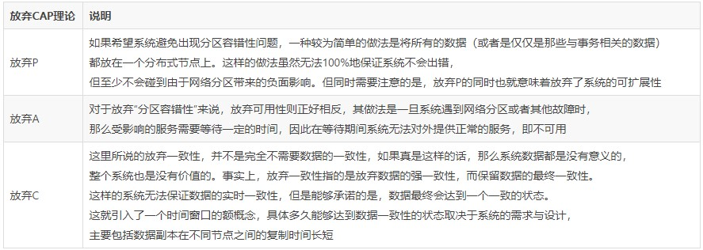

# Java EE

本章节笔记为 EE 场景,请知悉.

---

## 1. 基础知识

各种一言难尽的基础理论知识,你值得拥有. 泪目

#### 1.1 CAP

分布式系统不可能同时满足`一致性(C:Consistency)`,`可用性(A:Availability)`和`分区容错性(P:Partition tolerance)`.

这三个基本需求,最多只能同时满足其中的两项.

| 概念名称   | 释义                                                                                                              |
| ---------- | ----------------------------------------------------------------------------------------------------------------- |
| 一致性     | 跟新操作使各节点的数据一致.                                                                                       |
| 可用性     | 能够在有限的时间内返回明确的结果.                                                                                 |
| 分区容错性 | 分布式系统在遇到任何网络分区故障时,任然需要能够保证对外提供满足一致性和可用性服务,除非是整个网络环境都发生了故障. |

分布式系统无法同时满足上述单个需求,而只能满足其中的两项.

因此在进行对 CAP 理论的应用时,就需要抛弃其中的一项.

场景说明如下:

#### 1.2 BASE

BASE 理论是对 CAP 理论的延伸,核心思想是即使无法做到强一致性`(Strong Consistency,CAP 的一致性就是强一致性)`,可以采用适合的方式达到`最终一致性(Eventual Consitency)`.

BASE: <u>`基本可用(Basically Available)`,`软状态(Soft State)`,`最终一致性(Eventual Consistency)`.</u>

**基本可用**: 分布式系统在出现故障的时候,允许损失部分可用性,即保证核心可用(如熔断和服务降级).

**软状态**: 系统存在中间状态,而该中间状态不会影响系统整体可用性.(如分布式存储中一般一份数据至少会有三个副本,允许不同节点间副本同步的延时就是软状态的体现.mysql replication 的异步复制也是一种体现.)

**最终一致性**: 系统中的所有数据副本经过一定时间后,最终能够达到一致的状态(如 rocketmq 的事务消息).

#### 1.3 ACID

事务的概念: <u>事务逻辑上的一组操作,组成这组操作的各个逻辑单元,要么一起成功,要么一起失败.</u>

ACID 基础知识

| 名称               | 释义                                                                                              |
| ------------------ | ------------------------------------------------------------------------------------------------- |
| 原子性(Atomic)     | 事务中各项操作,要么全做要么全不做,任何一项操作的失败都会导致整个事务的失败.                       |
| 一致性(Consistent) | 事务结束后系统状态是一致的.                                                                       |
| 隔离性(Isolated)   | 并发执行的事务彼此无法看到对方的中间状态.                                                         |
| 持久性(Durable)    | 事务完成后所做的改动都会被持久化.即使发生灾难性的失败,通过日志和同步备份可以在故障发生后重建数据. |

---

## 2. 参考资料

a. [CAP 与 BASE 博客](https://blog.csdn.net/Y0Q2T57s/article/details/84332551)

b. [ACID 博客](https://blog.csdn.net/troubleshooter/article/details/78390957)
