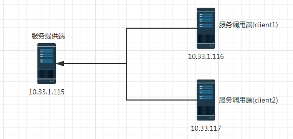

# Rpc

IBM的博客不错呀.详情[link](https://www.ibm.com/developerworks/cn/java/j-lo-apachethrift/)

RPC:远程过程调用(Remote Procedure Call,RPC)是一个计算机通信协议.该协议允许运行于一台计算机的程序调用另一台计算机的子程序,而程序员无需额外地为这个交互作用编程.

为什么选择 RPC?

提高开发效率,tcp携带数据比http的少,减少网络负载.tcp有着更好的响应速度.

---


## 1. 安装Thrift

### 1.1 Apache Thrift概述

Thrift是Facebook实现的一种高效的,支持多种编程语言的远程服务调用的框架.

Thrift 服务器包含用于绑定协议和传输层的基础架构,它提供阻塞,非阻塞,单线程和多线程的模式运行在服务器上,可以配合服务器 / 容器一起运行,可以和现有的 J2EE 服务器 /Web 容器无缝的结合.


在网上的资料看来,Thrift比Google的gRpc性能更高,所以才选择使用的.


### 1.2 下载安装包

下载安装包,官网下载地址[link](http://thrift.apache.org/download)

```bash
[root@dev-116 thrift]# wget https://www-us.apache.org/dist/thrift/0.11.0/thrift-0.11.0.tar.gz
[root@dev-116 thrift-0.11.0]# tar -xvf thrift-0.11.0.tar.gz 
[root@dev-116 thrift-0.11.0]# cd thrift-0.11.0
```

### 1.3 安装thrift

重点: **依赖`gcc`和`gcc-c++`编译环境**

如果没有该环境请先安装

```bash
[root@dev-116 thrift-0.11.0]# yum install -y gcc
[root@dev-116 thrift-0.11.0]# yum install -y gcc-c++
```

安装thrift

```bash
[root@dev-116 thrift-0.11.0]# ./configure
[root@dev-116 thrift-0.11.0]# make 
[root@dev-116 thrift-0.11.0]# make install
[root@dev-116 thrift-0.11.0]# thrift
Usage: thrift [options] file
Use thrift -help for a list of options
```


### 1.4 测试使用

创建文件夹

```bash
[root@dev-116 thrift-0.11.0]# cd ..
[root@dev-116 thrift]# mkdir thrift-java
[root@dev-116 thrift]# cd thrift-java
```

编写和编译接口

```bash
[root@dev-116 thrift-java]# cat Hello.thrift 
namespace java service.demo
service Hello{
    string helloString(1:string para)
}
[root@dev-116 thrift-java]# thrift -r -gen java Hello.thrift 
[root@dev-116 thrift-java]# ls
gen-java  Hello.thrift
[root@dev-116 thrift-java]# ls gen-java/service/demo/
Hello.java
```
---

## 2. 基础知识


简单架构:**服务提供端提供服务给客户端调用.**



温馨提示: **请结合后面的章节看.**

### 2.1 数据类型

基础数据类型如下:

| 类型      | 说明                       | Java中对应类型 |
| --------- | -------------------------- | -------------- |
| bool      | 布尔值,bool or false       | boolean        |
| byte      | 8位有符号整数              | byte           |
| i16       | 16位有符号整数             | short          |
| i32       | 32位有符号整数             | int            |
| i64       | 64位有符号整数             | long           |
| double    | 64位浮点数                 | double         |
| string    | 未知编码文本或二进制字符串 | String         |
| struct    | 结构体类型                 | JavaBean       |
| list      | 容器类型,数组              | ArrayList      |
| set       | 容器类型,集合              | HashSet        |
| map       | 容器类型,映射              | HashMap        |
| exception | 异常类型                   | Exception      |
| service   | 服务类型,对应服务的类      | 无             |

### 2.2 传输协议

注意: **客户端和服务端都要同一个协议,如要替换请同时替换服务端和客户端协议.**

Thrift 可以让用户选择客户端与服务端之间传输通信协议的类别,在传输协议上总体划分为`文本(text)` 和`二进制(binary)` 传输协议,为节约带宽,提高传输效率,一般情况下使用二进制类型的传输协议.常用协议有以下几种:

| 协议类型            | 说明                                          |
| ------------------- | --------------------------------------------- |
| TBinaryProtocol     | 二进制编码格式进行数据传输                    |
| TCompactProtocol    | 高效率的,密集的二进制编码格式进行数据传输     |
| TJSONProtocol       | 使用 JSON 的数据编码协议进行数据传输          |
| TSimpleJSONProtocol | 只提供 JSON 只写的协议,适用于通过脚本语言解析 |


如在`PersonServiceClient`和`PersonServiceServer`里面替换为`TBinaryProtocol`协议.

`PersonServiceServer`

```java
// 设置协议工厂为 TBinaryProtocol.Factory
Factory proFactory = new TBinaryProtocol.Factory();
```

`PersonServiceClient`

```java
TProtocol protocol = new TBinaryProtocol(transport);
PersonService.Client client = new PersonService.Client(protocol);
```

### 2.3 传输层类型

常用传输层

| 名称                  | 说明                                                   |
| --------------------- | ------------------------------------------------------ |
| TSocket               | 使用阻塞式 I/O 进行传输,是最常见的模式                 |
| TFramedTransport      | 使用非阻塞方式,按块的大小进行传输,类似于 Java 中的 NIO |
| TNonblockingTransport | 使用非阻塞方式,用于构建异步客户端                      |


a. **TSocket使用**

请参考`3.4 客户端`章节内容.


b. **TFramedTransport使用**

若使用 TFramedTransport 传输层,其服务器必须修改为非阻塞的服务类型,客户端只需替换清单 TTransport 部分, TNonblockingServerTransport 类是构建非阻塞 socket 的抽象类,TNonblockingServerSocket 类继承 TNonblockingServerTransport

使用 TFramedTransport 传输层的 HelloServiceServer.java
```java
TNonblockingServerTransport serverTransport= new TNonblockingServerSocket(10005); 
Hello.Processor processor = new Hello.Processor(new HelloServiceImpl()); 
TServer server = new TNonblockingServer(processor, serverTransport); 
System.out.println("Start server on port 10005 ..."); 
server.serve();
```

使用 TFramedTransport 传输层的 HelloServiceClient.java
```java
TTransport transport = new TFramedTransport(new TSocket("localhost", 10005));
```


c. **TNonblockingTransport**

请参考`5. 构建异步客户端`章节代码.


### 2.4 服务端类型

| 类型名称           | 说明                               |
| ------------------ | ---------------------------------- |
| TSimpleServer      | 单线程服务器端使用标准的阻塞式 I/O |
| TThreadPoolServer  | 多线程服务器端使用标准的阻塞式 I/O |
| TNonblockingServer | 多线程服务器端使用非阻塞式 I/O     |

---

## 3. HelloWorld

把生成的`Hello.java`文件复制到项目里面.


### 3.1 pom.xml依赖

```xml
<dependency>
    <groupId>org.apache.thrift</groupId>
    <artifactId>libthrift</artifactId>
    <version>0.11.0</version>
</dependency>

<dependency>
    <groupId>org.slf4j</groupId>
    <artifactId>slf4j-log4j12</artifactId>
    <version>1.7.5</version>
</dependency>
```


### 3.2 服务实现类

创建 HelloServiceImpl.java 文件并实现 Hello.java 文件中的 Hello.Iface 接口

```java
package service.demo;

import org.apache.thrift.TException;

public class HelloServiceImpl implements Hello.Iface {

	@Override
	public String helloString(String para) throws TException {
		return this.getClass() + " say: " + para;
	}

}
```

### 3.3 服务端

```java
package service.server;

import org.apache.thrift.TProcessor;
import org.apache.thrift.protocol.TBinaryProtocol;
import org.apache.thrift.protocol.TBinaryProtocol.Factory;
import org.apache.thrift.server.TServer;
import org.apache.thrift.server.TThreadPoolServer;
import org.apache.thrift.server.TThreadPoolServer.Args;
import org.apache.thrift.transport.TServerSocket;
import org.apache.thrift.transport.TTransportException;

import service.demo.Hello;
import service.demo.HelloServiceImpl;

public class HelloServiceServer {

	@SuppressWarnings({"unchecked", "rawtypes"})
	public static void main(String[] args) {
		try {
			// 设置服务端口为 7911
			TServerSocket serverTransport = new TServerSocket(7911);
			// 设置协议工厂为 TBinaryProtocol.Factory
			Factory proFactory = new TBinaryProtocol.Factory();
			// 关联处理器与 Hello 服务的实现
			TProcessor processor = new Hello.Processor(new HelloServiceImpl());

			Args argsValue = new Args(serverTransport);
			argsValue.inputProtocolFactory(proFactory);
			argsValue.processor(processor);

			TServer server = new TThreadPoolServer(argsValue);
			System.out.println("Start server on port 7911...");
			server.serve();
		} catch (TTransportException e) {
			e.printStackTrace();
		}
	}
}
```


### 3.4 客户端

```java
package service.client;

import org.apache.thrift.TException;
import org.apache.thrift.protocol.TBinaryProtocol;
import org.apache.thrift.protocol.TProtocol;
import org.apache.thrift.transport.TSocket;
import org.apache.thrift.transport.TTransport;
import org.apache.thrift.transport.TTransportException;

import service.demo.Hello;

public class HelloServiceClient {
	public static void main(String[] args) {
		try {
			// 设置调用的服务地址为本地,端口为 7911
			TTransport transport = new TSocket("127.0.0.1", 7911);
			transport.open();
			// 设置传输协议为 TBinaryProtocol
			TProtocol protocol = new TBinaryProtocol(transport);
			Hello.Client client = new Hello.Client(protocol);
			// 调用服务的 helloVoid 方法
			String result = client.helloString("窝草");

			System.out.println(result);

			transport.close();
		} catch (TTransportException e) {
			e.printStackTrace();
		} catch (TException e) {
			e.printStackTrace();
		}
	}
}
```

### 3.5 测试

流程:**先开启服务端,再开启客户端**


测试结果

```java
class service.demo.HelloServiceImpl say: 窝草
```


## 4. Thrift复杂类型

在现实的生产环境里面,一个接口接受复杂数据(实体类),并能返回复杂数据(实体类).

那么上面的Helloworld就不适用了,那么我们来看看要怎么定义复杂类型和使用.

### 4.1 定义实体类

实体类文件: ` Person.thrift`

```c
namespace java com.pkgs.entity

struct Person{
        1: required i32 id;
        2: required string name;
        3: optional list<Subject> subjectList;
}

struct Subject{
        1: required string name;
        2: required double score;
}
```

### 4.2 定义接口

接口类文件: `PersonService.thrift`

```c
namespace java com.pkgs.service

include "Person.thrift"

typedef Person.Person Person

service PersonService{
	Person update(1:Person info,2:string name);
}
```

执行生成命令

```bash
[root@dev-116 thrift-java]# thrift -r -gen java PersonService.thrift
[root@dev-116 thrift-java]# ls  gen-java/com/pkgs/entity/
Person.java  Subject.java
[root@dev-116 thrift-java]# ls  gen-java/com/pkgs/service/
PersonService.java
```

把上面这些生成类复制到eclipse项目下面.

### 4.3 Java实现

接口实现类

```java
package com.pkgs.service.impl;

import java.util.ArrayList;
import java.util.List;

import org.apache.thrift.TException;

import com.pkgs.entity.Person;
import com.pkgs.entity.Subject;
import com.pkgs.service.PersonService;

public class PersonServiceImpl implements PersonService.Iface {

	@Override
	public Person update(Person info, String name) throws TException {
		System.out.println("Update person name to: " + name);

		List<Subject> list = new ArrayList<>(3);
		list.add(new Subject("chinese", 100));
		list.add(new Subject("math", 100));
		list.add(new Subject("english", 100));

		info.setName(name);
		info.setSubjectList(list);

		return info;
	}
}
```

服务类

```java
package com.pkgs.server;

import org.apache.thrift.TProcessor;
import org.apache.thrift.protocol.TBinaryProtocol;
import org.apache.thrift.protocol.TBinaryProtocol.Factory;
import org.apache.thrift.server.TServer;
import org.apache.thrift.server.TThreadPoolServer;
import org.apache.thrift.server.TThreadPoolServer.Args;
import org.apache.thrift.transport.TServerSocket;
import org.apache.thrift.transport.TTransportException;

import com.pkgs.service.PersonService;
import com.pkgs.service.impl.PersonServiceImpl;

public class PersonServiceServer {

	@SuppressWarnings({"unchecked", "rawtypes"})
	public static void main(String[] args) {
		try {
			// 设置服务端口为 7911
			TServerSocket serverTransport = new TServerSocket(7911);
			// 设置协议工厂为 TBinaryProtocol.Factory
			Factory proFactory = new TBinaryProtocol.Factory();
			// 关联处理器与 Hello 服务的实现
			TProcessor processor = new PersonService.Processor(new PersonServiceImpl());

			Args argsValue = new Args(serverTransport);
			argsValue.inputProtocolFactory(proFactory);
			argsValue.processor(processor);

			TServer server = new TThreadPoolServer(argsValue);
			System.out.println("Start server on port 7911...");
			server.serve();
		} catch (TTransportException e) {
			e.printStackTrace();
		}
	}

}
```


客户端

```java
package com.pkgs.client;

import org.apache.thrift.TException;
import org.apache.thrift.protocol.TBinaryProtocol;
import org.apache.thrift.protocol.TProtocol;
import org.apache.thrift.transport.TSocket;
import org.apache.thrift.transport.TTransport;
import org.apache.thrift.transport.TTransportException;

import com.alibaba.fastjson.JSON;
import com.pkgs.entity.Person;
import com.pkgs.service.PersonService;

public class PersonServiceClient {
	public static void main(String[] args) {
		try {
			// 设置调用的服务地址为本地,端口为 7911
			TTransport transport = new TSocket("127.0.0.1", 7911);
			transport.open();
			// 设置传输协议为 TBinaryProtocol
			TProtocol protocol = new TBinaryProtocol(transport);
			PersonService.Client client = new PersonService.Client(protocol);
			Person person = new Person();
			person.setName("1");
			person.setId(123);
			Person after = client.update(person, "haiyan");
			System.out.println(JSON.toJSONString(after));
			transport.close();
		} catch (TTransportException e) {
			e.printStackTrace();
		} catch (TException e) {
			e.printStackTrace();
		}
	}
}
```

## 5. 构建异步客户端

### 5.1 Callback Method

```java

import org.apache.thrift.async.AsyncMethodCallback;

public class MethodCallback<T> implements AsyncMethodCallback<T> {

	private T response = null;

	/**
	 * 获取返回结果
	 * 
	 * @return Object
	 */
	public T getResult() {
		return this.response;
	}

	/**
	 * 处理服务返回的结果值
	 */
	@Override
	public void onComplete(T response) {
		//System.out.println("complete: " + response);
		this.response = response;
	}

	/**
	 * 处理调用服务过程中出现的异常
	 */
	@Override
	public void onError(Exception exception) {
		exception.printStackTrace();
	}

}
```

### 5.2 非阻塞服务器端

```java
package com.sync.server;

import org.apache.thrift.protocol.TBinaryProtocol;
import org.apache.thrift.protocol.TProtocolFactory;
import org.apache.thrift.server.TNonblockingServer;
import org.apache.thrift.server.TNonblockingServer.Args;
import org.apache.thrift.server.TServer;
import org.apache.thrift.transport.TNonblockingServerSocket;
import org.apache.thrift.transport.TNonblockingServerTransport;
import org.apache.thrift.transport.TTransportException;

import service.demo.Hello;
import service.demo.HelloServiceImpl;

public class HelloServiceAsyncServer {

	/**
	 * 启动 Thrift 异步服务器
	 * 
	 * @param args
	 */
	public static void main(String[] args) {
		TNonblockingServerTransport serverTransport;
		try {
			// 使用TNonblockingServerSocket
			serverTransport = new TNonblockingServerSocket(10005);
			Hello.Processor<Hello.Iface> processor = new Hello.Processor<Hello.Iface>(new HelloServiceImpl());
			TProtocolFactory proFactory = new TBinaryProtocol.Factory();

			Args argsValue = new Args(serverTransport);
			argsValue.processor(processor);
			argsValue.protocolFactory(proFactory);

			TServer server = new TNonblockingServer(argsValue);

			System.out.println("Start server on port 10005 ...");
			server.serve();
		} catch (TTransportException e) {
			e.printStackTrace();
		}
	}
}
```


### 5.3 非阻塞客户端

```java
package com.sync.client;

import java.io.IOException;

import org.apache.thrift.async.TAsyncClientManager;
import org.apache.thrift.protocol.TBinaryProtocol;
import org.apache.thrift.protocol.TProtocolFactory;
import org.apache.thrift.transport.TNonblockingSocket;
import org.apache.thrift.transport.TNonblockingTransport;

import com.sync.callback.MethodCallback;

import service.demo.Hello;

public class HelloServiceAsyncClient {

	/**
	 * 调用 Hello 服务
	 * 
	 * @param args
	 */
	public static void main(String[] args) throws Exception {
		try {
			TAsyncClientManager clientManager = new TAsyncClientManager();
			TNonblockingTransport transport = new TNonblockingSocket("127.0.0.1", 10005, 5000);
			TProtocolFactory protocol = new TBinaryProtocol.Factory();
			Hello.AsyncClient asyncClient = new Hello.AsyncClient(protocol, clientManager, transport);
			System.out.println("Client calls .....");
			MethodCallback<String> callBack = new MethodCallback<String>();
			asyncClient.helloString("Hello World", callBack);
			String res = callBack.getResult();
			while (res == null) {
				res = callBack.getResult();
				// 不知为何要在这里加sleep才不会死循环
				Thread.sleep(10);
			}
			System.out.println(res);
			transport.close();
		} catch (IOException e) {
			e.printStackTrace();
		}
	}
}
```

### 5.4 测试结果

先开启服务端,然后开启客户端.

```java
Client calls .....
class service.demo.HelloServiceImpl say: Hello World
```


## 6. 常见问题

### 6.1 Null问题

在 Thrift 中,直接调用一个返回 null 值的方法会抛出 TApplicationException 异常.

修改一些HelloServiceImpl让方法返回null

```java
import org.apache.thrift.TException;
public class HelloServiceImpl implements Hello.Iface {
	@Override
	public String helloString(String para) throws TException {
		return null;
	}
}
```

重新开启服务端和客户端,抛出异常

```java
org.apache.thrift.TApplicationException: helloString failed: unknown result
	at service.demo.Hello$Client.recv_helloString(Hello.java:65)
	at service.demo.Hello$Client.helloString(Hello.java:50)
	at service.client.HelloServiceClient.main(HelloServiceClient.java:22)
```

代码

```java
package service.client;

import org.apache.thrift.TApplicationException;
import org.apache.thrift.TException;
import org.apache.thrift.protocol.TBinaryProtocol;
import org.apache.thrift.protocol.TProtocol;
import org.apache.thrift.transport.TSocket;
import org.apache.thrift.transport.TTransport;
import org.apache.thrift.transport.TTransportException;

import service.demo.Hello;

public class HelloServiceClient {
	public static void main(String[] args) {
		try {
			// 设置调用的服务地址为本地,端口为 7911
			TTransport transport = new TSocket("127.0.0.1", 7911);
			transport.open();
			// 设置传输协议为 TBinaryProtocol
			TProtocol protocol = new TBinaryProtocol(transport);
			Hello.Client client = new Hello.Client(protocol);
			// 调用服务的 helloVoid 方法
			String result = client.helloString("窝草");

			System.out.println(result);

			transport.close();
		} catch (TTransportException e) {
			e.printStackTrace();
		} catch (TException e) {
			if (e instanceof TApplicationException
					&& ((TApplicationException) e).getType() == TApplicationException.MISSING_RESULT) {
				System.err.println("The result of helloString function is NULL");
			}
		}
	}
}
```

重新测试

```java
The result of helloString function is NULL
```


### 6.2 异步客户端死循环

代码请参考`5. 构建异步客户端`代码的`HelloServiceAsyncClient`

```java
while (res == null) {
	res = callBack.getResult();
	// 不知为何要在这里加sleep才不会死循环
	Thread.sleep(10);
}
```
如果没加上`Thread.sleep(10)`就进入死循环了,这叫我情何以堪.

---

## 7. 参考文档

a. [Apache thrift官网](http://thrift.apache.org/download)

b. [IBM博客](https://www.ibm.com/developerworks/cn/java/j-lo-apachethrift/)
