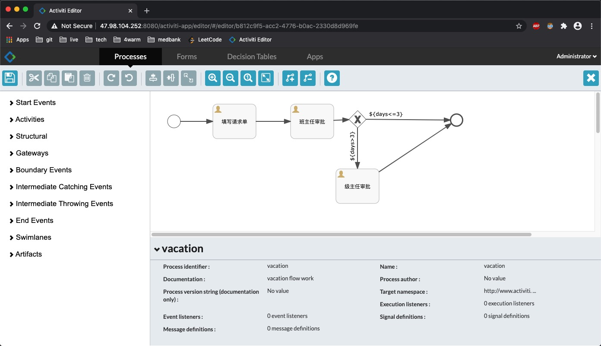
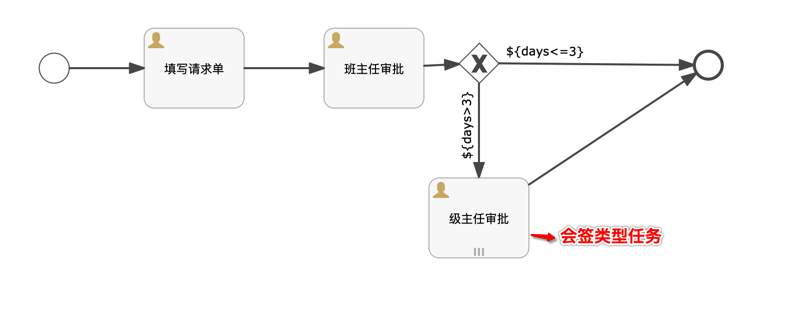
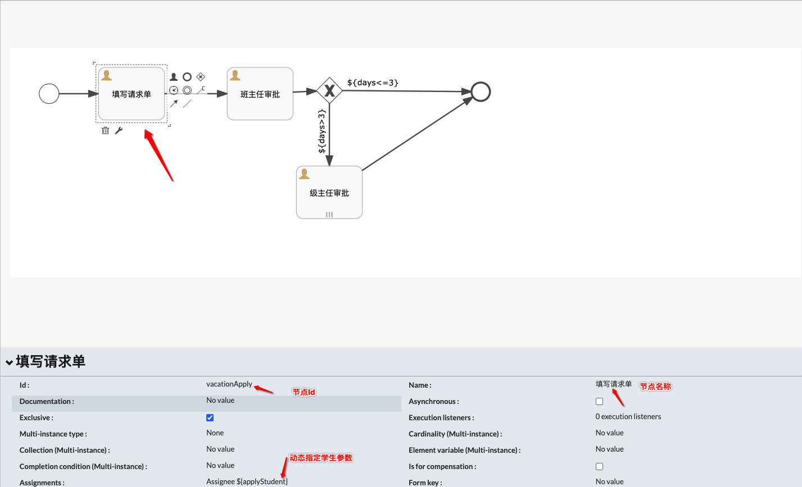
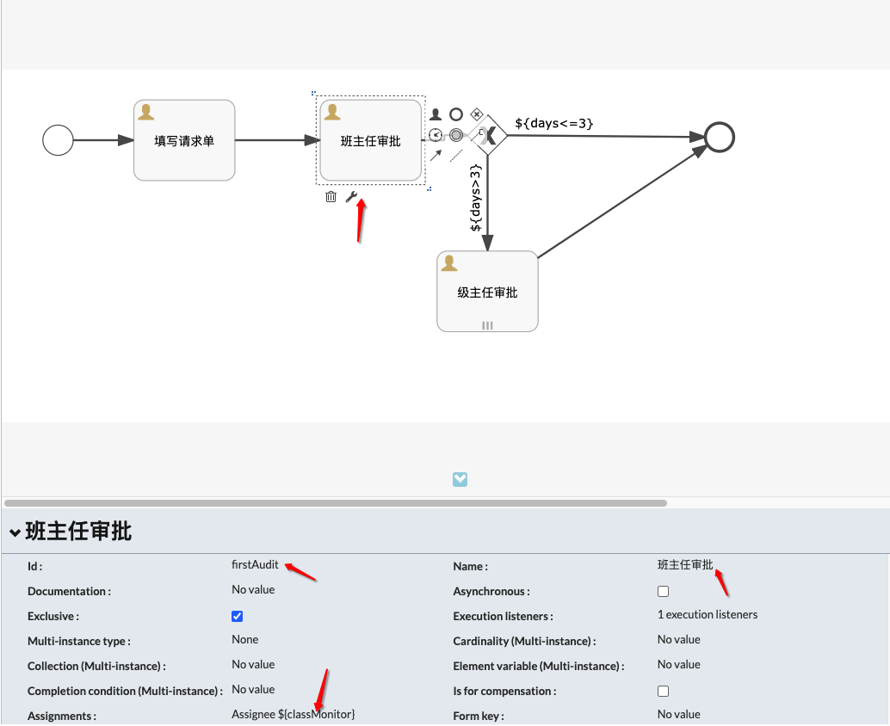
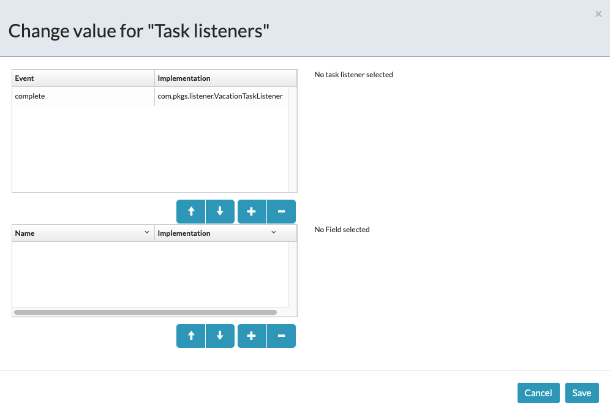
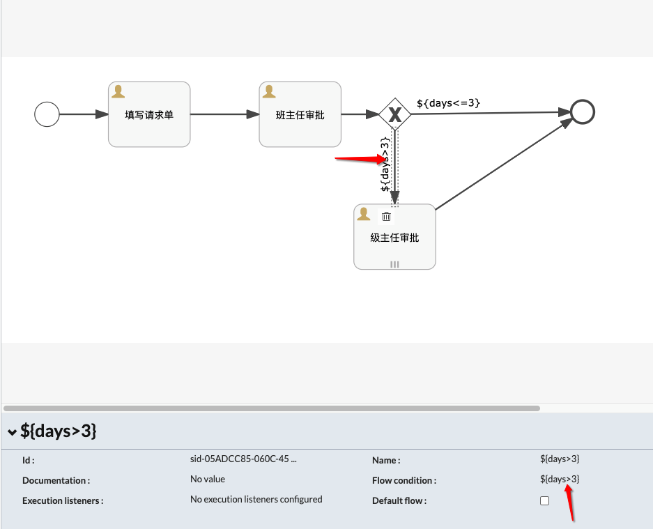
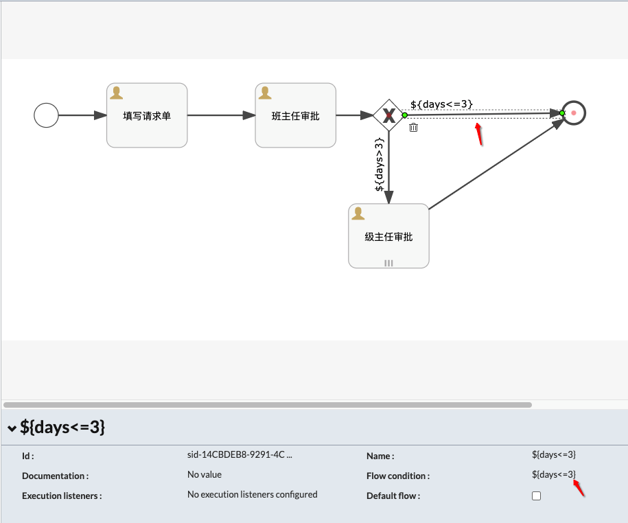
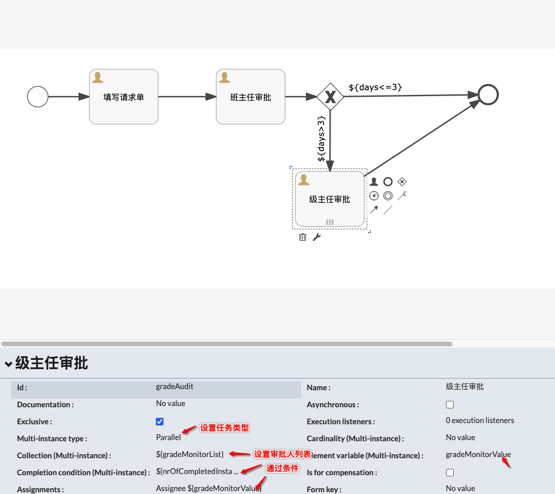
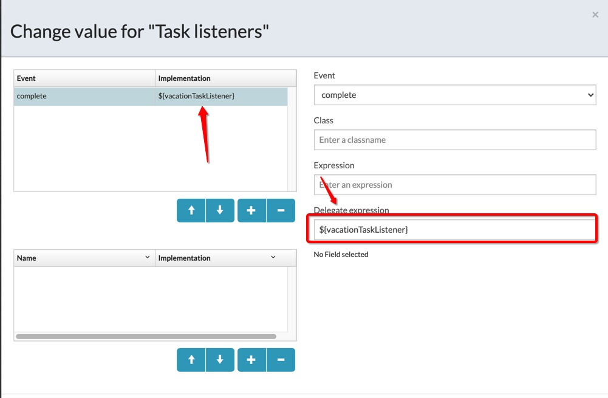

# 工作流(Activiti)

`activiti`,至今都不知道这个单词是不是写对了

FBI Warning: 本文档使用 activiti 版本为 6.0

---

### 1. 基础知识

基础知识和环境部署.

#### 1.1 安装 activiti-app

Q: 为什么要安装???不是直接使用 maven 引入依赖和 idea 安装一下插件就可以了吗?

A: idea 安装的插件太难用,使用起来真的一言难尽,activiti 的官方插件还比较好用一点.

在官网:`https://www.activiti.org/get-started`下载好所需的 activiti 组件(下载慢到泪目),把`activiti-app.war`扔进 tomcat 目录即可.

如下所示,可以修改`activiti-app`数据库,用户名等配置.

```sh
# root @ team-2 in /opt/soft/tomcat/apache-tomcat-8.5.37 [15:24:13] C:127
$ cd webapps/activiti-app/WEB-INF/classes/META-INF/activiti-app

# root @ team-2 in /opt/soft/tomcat/apache-tomcat-8.5.37/webapps/activiti-app/WEB-INF/classes/META-INF/activiti-app [15:24:38]
$ ll
total 4.0K
-rw-r----- 1 root root 1.6K Jul 31 15:07 activiti-app.properties
```

重启 tomcat 完成后,可以通过浏览器打开:`http://47.98.104.252:8080/activiti-app/#/login`

| 用户名 | 密码 | 备注     |
| ------ | ---- | -------- |
| admin  | test | 默认密码 |

进入之后的界面如下图所示



#### 1.2 基础知识

#### 数据表

在初始化工作流数据库的时候,会自动生成数据库表,

各个数据库含义,表以 ACT\_开头, 第二部分是表示表的用途的两个字母标识.

- ACT_RE\_: `repository`包含了流程定义和流程静态资源(图片,规则...)
- ACT_RU\_: `runtime`包含运行时的表包含流程实例,任务,变量,异步任务,等运行中的数据.只在流程实例执行过程中保存这些数据,在流程结束时就会删除这些记录.
- ACT_ID\_: `identity`包含身份信息,比如用户,组等等.
- ACT_HI\_: `history`包含历史数据,比如历史流程实例, 变量,任务等.
- ACT_GE\_: `general`包含通用数据, 用于不同场景下,如存放资源文件.

#### 关键对象

| 对象               | 名称         | 备注                                                                    |
| ------------------ | ------------ | ----------------------------------------------------------------------- |
| Deployment         | 流程部署对象 | 部署一个流程时创建                                                      |
| ProcessDefinitions | 流程定义     | 部署成功后自动创建                                                      |
| ProcessInstances   | 流程实例     | 启动流程时创建                                                          |
| Task               | 任务         | 在 Activiti 中的 Task 仅指有角色参与的任务(UserTask)                    |
| Execution          | 执行计划     | 流程实例和流程执行中的所有节点都是 Execution,如 UserTask,ServiceTask 等 |

#### 服务接口

| 接口名称          | 功能                                                                                                                                                                                                                                     | 备注 |
| ----------------- | ---------------------------------------------------------------------------------------------------------------------------------------------------------------------------------------------------------------------------------------- | ---- |
| ProcessEngine     | 流程引擎的抽象,通过它可以获得需要的一切服务                                                                                                                                                                                              |      |
| RepositoryService | Activiti 中每一个不同版本的业务流程的定义都需要使用一些定义文件,部署文件和支持数据(例如 BPMN2.0 XML 文件,表单定义文件,流程定义图像文件等),这些文件都存储在 Activiti 内建的 Repository 中.RepositoryService 提供对 repository 的存取服务. |      |
| RuntimeService    | 在 Activiti 中,每当一个流程定义被启动一次之后,都会生成一个相应的流程对象实例.RuntimeService 提供了启动流程,查询流程实例,设置获取流程实例变量等功能.此外它还提供了对流程部署,流程定义和流程实例的存取服务.                                |      |
| TaskService       | 在 Activiti 中业务流程定义中的每一个执行节点被称为一个 Task,对流程中的数据存取,状态变更等操作均需要在 Task 中完成.TaskService 提供了对用户 Task 和 Form 相关的操作.它提供了运行时任务查询,领取,完成,删除以及变量设置等功能.              |      |
| IdentityService   | Activiti 中内置了用户以及组管理的功能,必须使用这些用户和组的信息才能获取到相应的 Task.IdentityService 提供了对 Activiti 系统中的用户和组的管理功能.                                                                                      |      |
| ManagementService | ManagementService 提供了对 Activiti 流程引擎的管理和维护功能,这些功能不在工作流驱动的应用程序中使用,主要用于 Activiti 系统的日常维护.                                                                                                    |      |
| HistoryService    | HistoryService 用于获取正在运行或已经完成的流程实例的信息,与 RuntimeService 中获取的流程信息不同,历史信息包含已经持久化存储的永久信息,并已经被针对查询优化.                                                                              |      |

---

### 2. Java 使用

[github 地址](https://github.com/cs12110/activiti-project),模块: `activiti-javase`,运行程序为:`com.pkgs.VacationApp`

#### 流程图



详细代码请参考 github 或者本文档最后提供的流程 xml 代码.

#### 任务设置

**设置填写请求单节点**ß



Q: 那么在什么指定了申请的学生是谁?

A: 请看`VacationApp#studentApply`

```java
 Map<String, Object> map = new HashMap<>(8);
// 对应申请节点的参数
map.put("applyStudent", studentNo);
map.put("days", days[index]);
map.put("reason", "卧槽,批假呀");

// 指定审批班主任是谁
map.put("classMonitor", classMonitor);

// 启动流程,指定申请学生
ProcessInstance instance = runtimeService.startProcessInstanceByKey("vacation", studentNo, map);
```

**班主任审批节点设置**



设置任务监听器(用于通知学生被审批通过的场景)



**排他网关设置**




**级主任审批节点设置**

任务类型为:`Parallel`(会签任务),例如多少人通过才算通过这种场景,或者多个审批人,一个通过就通过



Completion condition (Multi-instance)参数解析

- nrOfInstances:当前节点的任务实例总数
- nrOfCompletedInstances:当前节点的任务实例总数中已经完成的实例数
- nrOfActiveInstances:当前节点的任务实例中活跃的实例个数

例如: 多个用户任务完成流转到下一个流程节点的条件,设置为`${nrOfCompletedInstances/nrOfInstances == 1 }`表示所有任务都被执行才流转到下一个节点,`${nrOfCompletedInstances/nrOfInstances <= 0.5 }`表示假如总共 4 个任务,执行了 2 个任务之后就流转到下一个节点.

在代码设置多个审批人,`VacationApp#classAudit`

```java
// 动态指定多个级主任
List<String> list = Arrays.asList(gradeMonitor.split(","));
map.put("gradeMonitorList", list);
map.put("applyInfo", applyInfo);

// 同意学生请假,流转到级主任节点
taskService.complete(task.getId(), map);
```

---

### 3. 整合 Spring

[github 地址](https://github.com/cs12110/activiti-project),模块: `activiti-javaee`,运行程序为:`com.pkgs.App`.

总体来看整合 springboot 之后使用起来更简单了.

#### 3.1 配置文件

maven 依赖

```xml
<dependencyManagement>
    <dependencies>
        <dependency>
            <groupId>org.springframework.boot</groupId>
            <artifactId>spring-boot-starter-parent</artifactId>
            <version>2.1.4.RELEASE</version>
            <type>pom</type>
            <scope>import</scope>
        </dependency>
    </dependencies>
</dependencyManagement>

<dependencies>

    <dependency>
        <groupId>org.springframework.boot</groupId>
        <artifactId>spring-boot-starter</artifactId>
    </dependency>

    <dependency>
        <groupId>org.springframework.boot</groupId>
        <artifactId>spring-boot-starter-web</artifactId>
    </dependency>

    <dependency>
        <groupId>org.activiti</groupId>
        <artifactId>activiti-spring-boot-starter-basic</artifactId>
        <version>6.0.0</version>
    </dependency>
</dependencies>
```

application.properties

```properties
# 项目基础配置
server.port=8090
spring.application.name=springboot-activiti
server.servlet.context-path=/api/activiti/

# activiti配置
# 自动检查,部署流程文件
spring.activiti.check-process-definitions=true
# 自动更新数据库结构
spring.activiti.database-schema-update=true
# 定义流程文件存放目录
spring.activiti.process-definition-location-prefix=classpath:/workflow/

# 配置数据源
spring.datasource.driver-class-name=com.mysql.jdbc.Driver
spring.datasource.url=jdbc:mysql://118.89.113.147:3306/spring_act_db?useUnicode=true&characterEncoding=UTF-8&useSSL=false
spring.datasource.username=root
spring.datasource.password=Team@3306


# 日志配置
logging.config=classpath:logback.xml
```

#### 3.2 监听器配置

修改为 bean 的名称即可.



#### 3.3 测试运行

**学生请假**

请求地址:`127.0.0.1:8090/api/activiti/apply/start`

请求参数:

```json
{
  "applyStudent": "cs12110",
  "days": 20,
  "reason": "要搬砖解决温饱"
}
```

返回参数

```json
{
  "status": 1,
  "message": null,
  "value": "已提交请求申请,申请Id:5"
}
```

**班主任审批**

获取审批数据请求地址:`127.0.0.1:8090/api/activiti/audit/tasks?user=haiyan`

返回参数:

```json
{
  "status": 1,
  "message": null,
  "value": [
    {
      "id": "75",
      "applyStudent": "cs12110",
      "days": 20,
      "reason": "要搬砖解决温饱",
      "applyDate": "2020-08-02T06:08:40.159+0000"
    }
  ]
}
```

审批接口请求地址:`127.0.0.1:8090/api/activiti/audit/agree`

请求数据:

```json
{
  "id": "75",
  "agree": true,
  "comment": "班主任同意"
}
```

返回参数

```json
{
  "status": 1,
  "message": null,
  "value": "审批通过"
}
```

**级主任审批**

获取审批数据请求地址:`127.0.0.1:8090/api/activiti/audit/tasks?user=haiyan`

返回参数:

```json
{
  "status": 1,
  "message": null,
  "value": [
    {
      "id": "102",
      "applyStudent": "cs12110",
      "days": 20,
      "reason": "要搬砖解决温饱",
      "applyDate": "2020-08-02T06:11:38.454+0000"
    }
  ]
}
```

审批接口请求地址:`127.0.0.1:8090/api/activiti/audit/agree`

请求数据:

```json
{
  "id": "102",
  "agree": true,
  "comment": "级主任同意"
}
```

返回参数:

```json
{
  "status": 1,
  "message": null,
  "value": "审批通过"
}
```

**历史查询**

请求地址:`127.0.0.1:8090/api/activiti/history/trace?processId=60`

返回数据:

```json
{
  "status": 1,
  "message": null,
  "value": [
    {
      "taskName": "级主任审批",
      "startTime": "2020-08-02 14:11:38",
      "assignee": "3307",
      "endTime": "2020-08-02 14:12:35",
      "localVars": {}
    },
    {
      "taskName": "级主任审批",
      "startTime": "2020-08-02 14:11:38",
      "assignee": "3306",
      "endTime": "2020-08-02 14:12:35",
      "localVars": {
        "gradeMonitorList": ["3306", "3307"],
        "level": null,
        "comment": "级主任同意",
        "id": "102",
        "agree": true
      }
    },
    {
      "taskName": "班主任审批",
      "startTime": "2020-08-02 14:08:40",
      "assignee": "haiyan",
      "endTime": "2020-08-02 14:11:38",
      "localVars": {
        "gradeMonitorList": ["3306", "3307"],
        "level": null,
        "comment": "班主任同意",
        "id": "75",
        "agree": true
      }
    },
    {
      "taskName": "填写请求单",
      "startTime": "2020-08-02 14:08:37",
      "assignee": "cs12110",
      "endTime": "2020-08-02 14:08:40",
      "localVars": {
        "reason": "要搬砖解决温饱",
        "classMonitor": "haiyan",
        "days": 20,
        "applyStudent": "cs12110"
      }
    }
  ]
}
```

---

### 4. 参考文档

a. [Activiti 官方文档](https://www.activiti.org/quick-start)

b. [Activiti 参考文档](https://segmentfault.com/a/1190000013839729)

---

### 5. 流程图代码

#### vacation

```xml
<?xml version="1.0" encoding="UTF-8"?>
<definitions xmlns="http://www.omg.org/spec/BPMN/20100524/MODEL" xmlns:xsi="http://www.w3.org/2001/XMLSchema-instance" xmlns:xsd="http://www.w3.org/2001/XMLSchema" xmlns:activiti="http://activiti.org/bpmn" xmlns:bpmndi="http://www.omg.org/spec/BPMN/20100524/DI" xmlns:omgdc="http://www.omg.org/spec/DD/20100524/DC" xmlns:omgdi="http://www.omg.org/spec/DD/20100524/DI" typeLanguage="http://www.w3.org/2001/XMLSchema" expressionLanguage="http://www.w3.org/1999/XPath" targetNamespace="http://www.activiti.org/processdef">
  <process id="vacation" name="vacation" isExecutable="true">
    <documentation>vacation flow work</documentation>
    <startEvent id="start"></startEvent>
    <userTask id="firstAudit" name="班主任审批" activiti:assignee="${classMonitor}">
      <extensionElements>
        <activiti:executionListener event="end" class="com.pkgs.listener.VacationExecutionListener"></activiti:executionListener>
        <activiti:taskListener event="complete" class="com.pkgs.listener.VacationTaskListener"></activiti:taskListener>
        <modeler:initiator-can-complete xmlns:modeler="http://activiti.com/modeler"><![CDATA[false]]></modeler:initiator-can-complete>
      </extensionElements>
    </userTask>
    <userTask id="gradeAudit" name="级主任审批" activiti:assignee="${gradeMonitorValue}">
      <extensionElements>
        <activiti:taskListener event="complete" class="com.pkgs.listener.VacationTaskListener"></activiti:taskListener>
        <modeler:initiator-can-complete xmlns:modeler="http://activiti.com/modeler"><![CDATA[false]]></modeler:initiator-can-complete>
      </extensionElements>
      <multiInstanceLoopCharacteristics isSequential="false" activiti:collection="${gradeMonitorList}" activiti:elementVariable="gradeMonitorValue">
        <completionCondition>${nrOfCompletedInstances&gt;0}</completionCondition>
      </multiInstanceLoopCharacteristics>
    </userTask>
    <exclusiveGateway id="sid-3FC5E931-3647-4A80-BE58-D777D2159392"></exclusiveGateway>
    <sequenceFlow id="sid-C297E320-8846-4684-AADB-27FCEB2F7694" sourceRef="vacationApply" targetRef="firstAudit"></sequenceFlow>
    <sequenceFlow id="sid-D4EE0B4C-8690-481C-84A3-93DD9DAA16B4" sourceRef="start" targetRef="vacationApply"></sequenceFlow>
    <endEvent id="sid-E7C08E26-4376-4375-8E3E-CABB34576008"></endEvent>
    <sequenceFlow id="sid-233578BE-63EC-4CBA-9AD0-764508976569" sourceRef="firstAudit" targetRef="sid-3FC5E931-3647-4A80-BE58-D777D2159392"></sequenceFlow>
    <userTask id="vacationApply" name="填写请求单" activiti:assignee="${applyStudent}">
      <extensionElements>
        <modeler:initiator-can-complete xmlns:modeler="http://activiti.com/modeler"><![CDATA[false]]></modeler:initiator-can-complete>
      </extensionElements>
    </userTask>
    <sequenceFlow id="sid-14CBDEB8-9291-4C80-A87A-CD1B7DCFC5F1" name="${days&lt;=3}" sourceRef="sid-3FC5E931-3647-4A80-BE58-D777D2159392" targetRef="sid-E7C08E26-4376-4375-8E3E-CABB34576008">
      <conditionExpression xsi:type="tFormalExpression"><![CDATA[${days<=3}]]></conditionExpression>
    </sequenceFlow>
    <sequenceFlow id="sid-05ADCC85-060C-4546-83B3-B16D4B2A0B87" name="${days&gt;3}" sourceRef="sid-3FC5E931-3647-4A80-BE58-D777D2159392" targetRef="gradeAudit">
      <conditionExpression xsi:type="tFormalExpression"><![CDATA[${days>3}]]></conditionExpression>
    </sequenceFlow>
    <sequenceFlow id="sid-2F8E0CB4-9F3B-4A4C-8585-CEB75CE8E876" sourceRef="gradeAudit" targetRef="sid-E7C08E26-4376-4375-8E3E-CABB34576008"></sequenceFlow>
  </process>
  <bpmndi:BPMNDiagram id="BPMNDiagram_vacation">
    <bpmndi:BPMNPlane bpmnElement="vacation" id="BPMNPlane_vacation">
      <bpmndi:BPMNShape bpmnElement="start" id="BPMNShape_start">
        <omgdc:Bounds height="30.0" width="30.0" x="45.0" y="55.0"></omgdc:Bounds>
      </bpmndi:BPMNShape>
      <bpmndi:BPMNShape bpmnElement="firstAudit" id="BPMNShape_firstAudit">
        <omgdc:Bounds height="80.0" width="100.0" x="330.0" y="30.0"></omgdc:Bounds>
      </bpmndi:BPMNShape>
      <bpmndi:BPMNShape bpmnElement="gradeAudit" id="BPMNShape_gradeAudit">
        <omgdc:Bounds height="80.0" width="100.0" x="435.0" y="180.0"></omgdc:Bounds>
      </bpmndi:BPMNShape>
      <bpmndi:BPMNShape bpmnElement="sid-3FC5E931-3647-4A80-BE58-D777D2159392" id="BPMNShape_sid-3FC5E931-3647-4A80-BE58-D777D2159392">
        <omgdc:Bounds height="40.0" width="40.0" x="465.0" y="45.0"></omgdc:Bounds>
      </bpmndi:BPMNShape>
      <bpmndi:BPMNShape bpmnElement="sid-E7C08E26-4376-4375-8E3E-CABB34576008" id="BPMNShape_sid-E7C08E26-4376-4375-8E3E-CABB34576008">
        <omgdc:Bounds height="28.0" width="28.0" x="700.5" y="53.0"></omgdc:Bounds>
      </bpmndi:BPMNShape>
      <bpmndi:BPMNShape bpmnElement="vacationApply" id="BPMNShape_vacationApply">
        <omgdc:Bounds height="80.0" width="100.0" x="150.0" y="30.0"></omgdc:Bounds>
      </bpmndi:BPMNShape>
      <bpmndi:BPMNEdge bpmnElement="sid-233578BE-63EC-4CBA-9AD0-764508976569" id="BPMNEdge_sid-233578BE-63EC-4CBA-9AD0-764508976569">
        <omgdi:waypoint x="430.0" y="67.61904761904762"></omgdi:waypoint>
        <omgdi:waypoint x="465.9090909090909" y="65.9090909090909"></omgdi:waypoint>
      </bpmndi:BPMNEdge>
      <bpmndi:BPMNEdge bpmnElement="sid-05ADCC85-060C-4546-83B3-B16D4B2A0B87" id="BPMNEdge_sid-05ADCC85-060C-4546-83B3-B16D4B2A0B87">
        <omgdi:waypoint x="485.0" y="85.0"></omgdi:waypoint>
        <omgdi:waypoint x="485.0" y="180.0"></omgdi:waypoint>
      </bpmndi:BPMNEdge>
      <bpmndi:BPMNEdge bpmnElement="sid-2F8E0CB4-9F3B-4A4C-8585-CEB75CE8E876" id="BPMNEdge_sid-2F8E0CB4-9F3B-4A4C-8585-CEB75CE8E876">
        <omgdi:waypoint x="535.0" y="186.66666666666666"></omgdi:waypoint>
        <omgdi:waypoint x="702.8512958792702" y="74.76580274715323"></omgdi:waypoint>
      </bpmndi:BPMNEdge>
      <bpmndi:BPMNEdge bpmnElement="sid-C297E320-8846-4684-AADB-27FCEB2F7694" id="BPMNEdge_sid-C297E320-8846-4684-AADB-27FCEB2F7694">
        <omgdi:waypoint x="250.0" y="70.0"></omgdi:waypoint>
        <omgdi:waypoint x="330.0" y="70.0"></omgdi:waypoint>
      </bpmndi:BPMNEdge>
      <bpmndi:BPMNEdge bpmnElement="sid-14CBDEB8-9291-4C80-A87A-CD1B7DCFC5F1" id="BPMNEdge_sid-14CBDEB8-9291-4C80-A87A-CD1B7DCFC5F1">
        <omgdi:waypoint x="504.8272138228942" y="65.17278617710583"></omgdi:waypoint>
        <omgdi:waypoint x="700.5005315791224" y="66.87800027519933"></omgdi:waypoint>
      </bpmndi:BPMNEdge>
      <bpmndi:BPMNEdge bpmnElement="sid-D4EE0B4C-8690-481C-84A3-93DD9DAA16B4" id="BPMNEdge_sid-D4EE0B4C-8690-481C-84A3-93DD9DAA16B4">
        <omgdi:waypoint x="75.0" y="70.0"></omgdi:waypoint>
        <omgdi:waypoint x="150.0" y="70.0"></omgdi:waypoint>
      </bpmndi:BPMNEdge>
    </bpmndi:BPMNPlane>
  </bpmndi:BPMNDiagram>
</definitions>
```

#### spring-vacation

```xml
<?xml version="1.0" encoding="UTF-8"?>
<definitions xmlns="http://www.omg.org/spec/BPMN/20100524/MODEL" xmlns:xsi="http://www.w3.org/2001/XMLSchema-instance" xmlns:xsd="http://www.w3.org/2001/XMLSchema" xmlns:activiti="http://activiti.org/bpmn" xmlns:bpmndi="http://www.omg.org/spec/BPMN/20100524/DI" xmlns:omgdc="http://www.omg.org/spec/DD/20100524/DC" xmlns:omgdi="http://www.omg.org/spec/DD/20100524/DI" typeLanguage="http://www.w3.org/2001/XMLSchema" expressionLanguage="http://www.w3.org/1999/XPath" targetNamespace="http://www.activiti.org/processdef">
  <process id="spring-vacation" name="spring-vacation" isExecutable="true">
    <documentation>vacation flow work</documentation>
    <startEvent id="start"></startEvent>
    <userTask id="firstAudit" name="班主任审批" activiti:assignee="${classMonitor}">
      <extensionElements>
        <activiti:executionListener event="end" class="com.pkgs.listener.VacationExecutionListener"></activiti:executionListener>
        <activiti:taskListener event="complete" delegateExpression="${vacationTaskListener}"></activiti:taskListener>
        <modeler:initiator-can-complete xmlns:modeler="http://activiti.com/modeler"><![CDATA[false]]></modeler:initiator-can-complete>
      </extensionElements>
    </userTask>
    <userTask id="gradeAudit" name="级主任审批" activiti:assignee="${gradeMonitorValue}">
      <extensionElements>
        <activiti:taskListener event="complete" delegateExpression="${vacationTaskListener}"></activiti:taskListener>
        <modeler:initiator-can-complete xmlns:modeler="http://activiti.com/modeler"><![CDATA[false]]></modeler:initiator-can-complete>
      </extensionElements>
      <multiInstanceLoopCharacteristics isSequential="false" activiti:collection="${gradeMonitorList}" activiti:elementVariable="gradeMonitorValue">
        <completionCondition>${nrOfCompletedInstances&gt;0}</completionCondition>
      </multiInstanceLoopCharacteristics>
    </userTask>
    <exclusiveGateway id="sid-3FC5E931-3647-4A80-BE58-D777D2159392"></exclusiveGateway>
    <sequenceFlow id="sid-C297E320-8846-4684-AADB-27FCEB2F7694" sourceRef="vacationApply" targetRef="firstAudit"></sequenceFlow>
    <sequenceFlow id="sid-D4EE0B4C-8690-481C-84A3-93DD9DAA16B4" sourceRef="start" targetRef="vacationApply"></sequenceFlow>
    <endEvent id="sid-E7C08E26-4376-4375-8E3E-CABB34576008"></endEvent>
    <sequenceFlow id="sid-233578BE-63EC-4CBA-9AD0-764508976569" sourceRef="firstAudit" targetRef="sid-3FC5E931-3647-4A80-BE58-D777D2159392"></sequenceFlow>
    <userTask id="vacationApply" name="填写请求单" activiti:assignee="${applyStudent}">
      <extensionElements>
        <modeler:initiator-can-complete xmlns:modeler="http://activiti.com/modeler"><![CDATA[false]]></modeler:initiator-can-complete>
      </extensionElements>
    </userTask>
    <sequenceFlow id="sid-2F8E0CB4-9F3B-4A4C-8585-CEB75CE8E876" sourceRef="gradeAudit" targetRef="sid-E7C08E26-4376-4375-8E3E-CABB34576008"></sequenceFlow>
    <sequenceFlow id="sid-05ADCC85-060C-4546-83B3-B16D4B2A0B87" name="${days&gt;3}" sourceRef="sid-3FC5E931-3647-4A80-BE58-D777D2159392" targetRef="gradeAudit">
      <conditionExpression xsi:type="tFormalExpression"><![CDATA[${days>3}]]></conditionExpression>
    </sequenceFlow>
    <sequenceFlow id="sid-14CBDEB8-9291-4C80-A87A-CD1B7DCFC5F1" name="${days&lt;=3}" sourceRef="sid-3FC5E931-3647-4A80-BE58-D777D2159392" targetRef="sid-E7C08E26-4376-4375-8E3E-CABB34576008">
      <conditionExpression xsi:type="tFormalExpression"><![CDATA[${days<=3}]]></conditionExpression>
    </sequenceFlow>
  </process>
  <bpmndi:BPMNDiagram id="BPMNDiagram_spring-vacation">
    <bpmndi:BPMNPlane bpmnElement="spring-vacation" id="BPMNPlane_spring-vacation">
      <bpmndi:BPMNShape bpmnElement="start" id="BPMNShape_start">
        <omgdc:Bounds height="30.0" width="30.0" x="45.0" y="55.0"></omgdc:Bounds>
      </bpmndi:BPMNShape>
      <bpmndi:BPMNShape bpmnElement="firstAudit" id="BPMNShape_firstAudit">
        <omgdc:Bounds height="80.0" width="100.0" x="319.4039767913553" y="30.0"></omgdc:Bounds>
      </bpmndi:BPMNShape>
      <bpmndi:BPMNShape bpmnElement="gradeAudit" id="BPMNShape_gradeAudit">
        <omgdc:Bounds height="80.00000000000003" width="100.0" x="435.0" y="165.0"></omgdc:Bounds>
      </bpmndi:BPMNShape>
      <bpmndi:BPMNShape bpmnElement="sid-3FC5E931-3647-4A80-BE58-D777D2159392" id="BPMNShape_sid-3FC5E931-3647-4A80-BE58-D777D2159392">
        <omgdc:Bounds height="40.0" width="40.0" x="465.0" y="50.0"></omgdc:Bounds>
      </bpmndi:BPMNShape>
      <bpmndi:BPMNShape bpmnElement="sid-E7C08E26-4376-4375-8E3E-CABB34576008" id="BPMNShape_sid-E7C08E26-4376-4375-8E3E-CABB34576008">
        <omgdc:Bounds height="28.0" width="28.0" x="700.5" y="53.0"></omgdc:Bounds>
      </bpmndi:BPMNShape>
      <bpmndi:BPMNShape bpmnElement="vacationApply" id="BPMNShape_vacationApply">
        <omgdc:Bounds height="80.0" width="100.0" x="135.0" y="30.0"></omgdc:Bounds>
      </bpmndi:BPMNShape>
      <bpmndi:BPMNEdge bpmnElement="sid-233578BE-63EC-4CBA-9AD0-764508976569" id="BPMNEdge_sid-233578BE-63EC-4CBA-9AD0-764508976569">
        <omgdi:waypoint x="419.4039767913553" y="70.0"></omgdi:waypoint>
        <omgdi:waypoint x="465.0" y="70.0"></omgdi:waypoint>
      </bpmndi:BPMNEdge>
      <bpmndi:BPMNEdge bpmnElement="sid-05ADCC85-060C-4546-83B3-B16D4B2A0B87" id="BPMNEdge_sid-05ADCC85-060C-4546-83B3-B16D4B2A0B87">
        <omgdi:waypoint x="485.0" y="90.0"></omgdi:waypoint>
        <omgdi:waypoint x="485.0" y="165.0"></omgdi:waypoint>
      </bpmndi:BPMNEdge>
      <bpmndi:BPMNEdge bpmnElement="sid-2F8E0CB4-9F3B-4A4C-8585-CEB75CE8E876" id="BPMNEdge_sid-2F8E0CB4-9F3B-4A4C-8585-CEB75CE8E876">
        <omgdi:waypoint x="535.0" y="174.9346405228758"></omgdi:waypoint>
        <omgdi:waypoint x="702.5020238270478" y="74.21446933275558"></omgdi:waypoint>
      </bpmndi:BPMNEdge>
      <bpmndi:BPMNEdge bpmnElement="sid-C297E320-8846-4684-AADB-27FCEB2F7694" id="BPMNEdge_sid-C297E320-8846-4684-AADB-27FCEB2F7694">
        <omgdi:waypoint x="235.0" y="70.0"></omgdi:waypoint>
        <omgdi:waypoint x="319.4039767913553" y="70.0"></omgdi:waypoint>
      </bpmndi:BPMNEdge>
      <bpmndi:BPMNEdge bpmnElement="sid-14CBDEB8-9291-4C80-A87A-CD1B7DCFC5F1" id="BPMNEdge_sid-14CBDEB8-9291-4C80-A87A-CD1B7DCFC5F1">
        <omgdi:waypoint x="504.741935483871" y="69.74193548387098"></omgdi:waypoint>
        <omgdi:waypoint x="700.5011959678819" y="67.18299090238064"></omgdi:waypoint>
      </bpmndi:BPMNEdge>
      <bpmndi:BPMNEdge bpmnElement="sid-D4EE0B4C-8690-481C-84A3-93DD9DAA16B4" id="BPMNEdge_sid-D4EE0B4C-8690-481C-84A3-93DD9DAA16B4">
        <omgdi:waypoint x="75.0" y="70.0"></omgdi:waypoint>
        <omgdi:waypoint x="135.0" y="70.0"></omgdi:waypoint>
      </bpmndi:BPMNEdge>
    </bpmndi:BPMNPlane>
  </bpmndi:BPMNDiagram>
</definitions>
```
