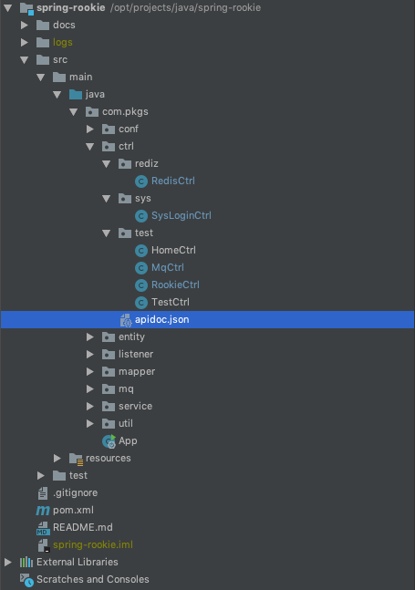
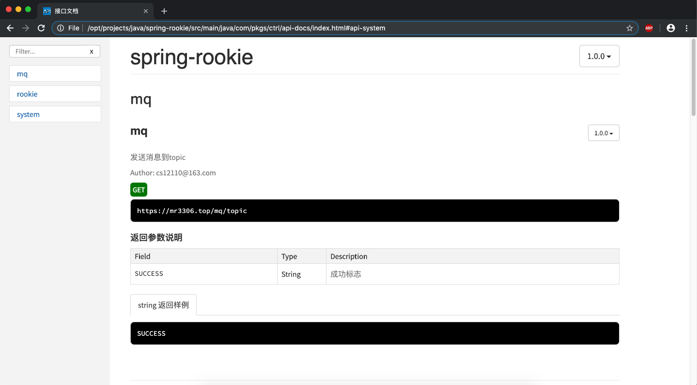

# apis

往河里丢了一个接口,河神说: 你是要 apidoc,swagger,yapi.

---

## Apidoc

### 1. 安装 apidoc

因为 apidoc 安装依赖 nodejs,这里面不叙述 nodejs 怎么安装了,因为只要在官网里面的下载相应的安装包,安装即可.

安装 nodejs 完成之后,使用命令查看是否安装完成.

```sh
mr3306:test mr3306$ node -v
v10.16.0
mr3306:test mr3306$
```

好的,现在安装完成 nodejs 之后,我们可以安装 apidoc 了.安装会出现权限问题(osx),建议切换为更高级的用户安装,如 root.

```sh
mr3306:test mr3306$npm install -g apidoc
```

### 2. 使用教程

Q: 那我们要怎么使用呀?

A: follow me.

因为用于说明接口,所以我们只要在 controller 层的接口加上 apidoc 相应的注释,然后使用 apidoc 生成文档即可.

#### 2.1 apidoc.json

apidoc 主要说明项目.

```json
{
  "name": "spring-rookie",
  "version": "1.0.0",
  "title": "接口文档",
  "url": "https://mr3306.top"
}
```

#### 2.2 注释样例

现在项目结构如下图所示.



注释示例如下:

```java
/**
* @apiDescription test param interface of controller
* <p>
* Author: cs12110@163.com
* @api {get} /rookie/param
* @apiName param
* @apiGroup rookie
* @apiVersion 1.0.0
* @apiParam {String} name 用户昵称
* @apiParam {String} password 用户密码
* @apiSuccess (返回参数说明) {String} name 用户名称
* @apiSuccess (返回参数说明) {String} password 用户密码
* @apiSuccess (返回参数说明) {String} timestamp 时间戳
* @apiSuccessExample jsonp 返回样例
* {
* "name":"haiyan",
* "password":"123456",
* "timestamp":"2019-06-06 19:02:00"
* }
*/
@RequestMapping("/param")
@ResponseBody
public Object param(@RequestParam("name") String name, @RequestParam("password") String password) {

    log.info(name + ":" + password);


    Map<String, Object> map = new HashMap<>();
    map.put("name", name);
    map.put("password", password);
    map.put("timestamp", System.currentTimeMillis());


    return map;
}
```

各个注释参数含义,请参考[apidoc 官方文档](http://apidocjs.com/)

### 3. 生成接口文档

#### 3.1 生成接口文档

注意:**每一次生成新的接口文档都是全量覆盖**

生成命令: `apidoc -i yourControllerFolderPath -o docsPath`

参数含义:

- i 带有 apidoc.json 文件的 controller 文件夹路径
- o 输出文档的路径,会自动创建

```sh
# 项目路径
mr3306:ctrl mr3306$ pwd
/opt/projects/java/spring-rookie/src/main/java/com/pkgs/ctrl

# package结构
mr3306:ctrl mr3306$ ls
api-docs	apidoc.json	rediz		sys		test

# 在当前文件夹生成api文档
mr3306:ctrl mr3306$ apidoc -i .  -o api-docs/
```

Q: 如果只想生成某一个类的 api 接口文档,而不是整一个 package 的呢?

A: 可以使用 `-f`来正则匹配文件来生成.

```ssh
mr3306:ctrl mr3306$ apidoc -f 'MyController.java' -i . -o d:/apidoc
```

#### 3.2 查看接口文档

在上面的命令生成文件夹之后,里面有一个`index.html`文件,使用浏览器打开这个 index.html 文件即可.



---

## Swagger Api

### 1. SpringBoot 整合 Swagger2

SpringBoot 整合 Swagger2.

#### 1.1 pom.xml

Springboot 的依赖,在这里就不贴了,就贴一下 swagger2 的依赖,请谅.

```xml
<!-- swagger -->
<dependency>
    <groupId>io.springfox</groupId>
    <artifactId>springfox-swagger2</artifactId>
    <version>2.2.2</version>
</dependency>
<dependency>
    <groupId>io.springfox</groupId>
    <artifactId>springfox-swagger-ui</artifactId>
    <version>2.2.2</version>
</dependency>
```

#### 1.2 配置类

在添加完依赖之后,要对 swagger 进行一些简单的配置.

```java
package com.pkgs.conf;

import org.springframework.context.annotation.Bean;
import org.springframework.context.annotation.Configuration;
import springfox.documentation.builders.ApiInfoBuilder;
import springfox.documentation.builders.PathSelectors;
import springfox.documentation.builders.RequestHandlerSelectors;
import springfox.documentation.service.ApiInfo;
import springfox.documentation.spi.DocumentationType;
import springfox.documentation.spring.web.plugins.Docket;
import springfox.documentation.swagger2.annotations.EnableSwagger2;

/**
 * Swagger2 conf
 * <p>
 * 访问地址: `http://127.0.0.1:8081/swagger-ui.html`
 * <p/>
 *
 * @author cs12110 created at: 2019/1/30 14:25
 * <p>
 * since: 1.0.0
 */
@Configuration
@EnableSwagger2
public class Swagger2Conf {


    /**
     * swagger2配置文件,配置扫描包
     *
     * @return Docket
     */
    @Bean
    public Docket createRestApi() {
        return new Docket(DocumentationType.SWAGGER_2)
                .apiInfo(buildApiInfo())
                .select()
                .apis(RequestHandlerSelectors.basePackage("com.pkgs.ctrl"))
                .paths(PathSelectors.any())
                .build();
    }

    /**
     * 创建API信息
     *
     * @return ApiInfo
     */
    private ApiInfo buildApiInfo() {
        return new ApiInfoBuilder()
                .title("Api home")
                .contact("cs12110")
                .version("1.0")
                .description("rest api docs")
                .build();
    }
}
```

#### 1.3 接口类

```java
package com.pkgs.ctrl;

import com.alibaba.fastjson.JSON;
import com.baomidou.mybatisplus.extension.plugins.pagination.Page;
import com.pkgs.conf.anno.AntiResubmitAnno;
import com.pkgs.entity.AnswerEntity;
import com.pkgs.service.AnswerService;
import com.pkgs.service.TopicService;
import io.swagger.annotations.Api;
import io.swagger.annotations.ApiImplicitParam;
import io.swagger.annotations.ApiImplicitParams;
import io.swagger.annotations.ApiOperation;
import org.springframework.beans.factory.annotation.Autowired;
import org.springframework.stereotype.Controller;
import org.springframework.web.bind.annotation.RequestMapping;
import org.springframework.web.bind.annotation.ResponseBody;

import java.util.HashMap;
import java.util.List;
import java.util.Map;

/**
 * TODO: controller
 * <p>
 * Author: cs12110 create at: 2019/1/6 17:10
 * Since: 1.0.0
 */
@Controller
@RequestMapping("/rest")
@Api("RestCtrl")
public class RestCtrl {

    @Autowired
    private AnswerService answerService;

    @Autowired
    private TopicService topicService;

    /**
     * 获取回答
     *
     * @param topicId   话题Id
     * @param pageIndex 分页下标
     * @param pageSize  分页大小
     * @return String
     */
    @RequestMapping("/answers")
    @ResponseBody
    @AntiResubmitAnno
    @ApiOperation(value = "根据topicId,分页获取精华回答", notes = "获取精华回答")
    @ApiImplicitParams({
            @ApiImplicitParam(name = "topicId", value = "话题id", required = true, dataType = "String", paramType = "query"),
            @ApiImplicitParam(name = "pageIndex", value = "page index", required = true, dataType = "Integer", paramType = "query"),
            @ApiImplicitParam(name = "pageSize", value = "page size", required = true, dataType = "Integer", paramType = "query")
    })
    public String answers(String topicId, Integer pageIndex, Integer pageSize) {
        if ("null".equals(topicId)) {
            topicId = null;
        }

        Page<AnswerEntity> page = new Page<>(pageIndex, pageSize);
        List<AnswerEntity> list = answerService.queryWithTopic(topicId, page);

        Map<String, Object> map = new HashMap<>(2);
        map.put("page", page);
        map.put("list", list);

        return JSON.toJSONString(map);

    }


    /**
     * 获取顶级的话题
     *
     * @return String
     */
    @RequestMapping("/topTopics")
    @ResponseBody
    @AntiResubmitAnno
    public String topTopic() {
        return JSON.toJSONString(topicService.queryTopTopics());
    }

    /**
     * 获取父级下面的所有有答案的类型
     *
     * @param parentId 父级话题Id
     * @return List
     */
    @RequestMapping("/topics")
    @ResponseBody
    @AntiResubmitAnno
    public String topic(String parentId) {
        return JSON.toJSONString(topicService.queryTopics(parentId));
    }

}
```

#### 1.4 访问页面

```html
http://ip:port/swagger-ui.html#/
```

### 2. Swagger 注解说明

该章节摘录于: [link](https://www.dalaoyang.cn/article/21),请知悉.

#### 2.1 @Api

作用:用在请求的类上,表示对类的说明.

参数说明:

```java
tags="说明该类的作用,可以在 UI 界面上看到的注解"

value="该参数没什么意义,在 UI 界面上也看到,所以不需要配置"
```

示例:

```java
@Api(tags="APP用户注册Controller")
```

#### 2.2 @ApiOperation

作用: 用在请求的方法上,说明方法的用途、作用

参数说明:

```java
value="说明方法的用途、作用"
notes="方法的备注说明"
```

示例

```java
@ApiOperation(value="用户注册",notes="手机号、密码都是必输项,年龄随边填,但必须是数字")
```

#### 2.3 @ApiImplicitParams

作用: 用在请求的方法上,表示一组参数说明

参数说明:

```java
@ApiImplicitParam:用在@ApiImplicitParams注解中,指定一个请求参数的各个方面
        name:参数名
        value:参数的汉字说明、解释
        required:参数是否必须传
        paramType:参数放在哪个地方
            · header:  请求参数的获取:@RequestHeader
            · query:   请求参数的获取:@RequestParam
            · path(用于restful接口): 请求参数的获取,@PathVariable
            · body(不常用)
            · form(不常用)
        dataType:参数类型,默认String,其它值dataType="Integer"
        defaultValue:参数的默认值
```

示例:

```java
@ApiImplicitParams({
    @ApiImplicitParam(name="mobile",value="手机号",required=true,paramType="form"),
    @ApiImplicitParam(name="password",value="密码",required=true,paramType="form"),
    @ApiImplicitParam(name="age",value="年龄",required=true,paramType="form",dataType="Integer")
})
```

#### 2.4 @ApiResponses

作用:用在请求的方法上,表示一组响应

参数说明:

```java
@ApiResponse:用在@ApiResponses中,用于表达一个错误的响应信息
  code:数字,例如 400
  message:信息,例如"请求参数没填好"
  response:抛出异常的类
```

示例:

```java
@ApiOperation(value = "select1 请求",notes = "多个参数,多种的查询参数类型")
@ApiResponses({
    @ApiResponse(code=400,message="请求参数没填好"),
    @ApiResponse(code=404,message="请求路径没有或页面跳转路径不对")
})
```

#### 2.5 @ApiModel

- @ApiModel:用于响应类上,表示一个返回响应数据的信息(这种一般用在 post 创建的时候,使用@RequestBody 这样的场景,请求参数无法使用@ApiImplicitParam 注解进行描述的时候)

- @ApiModelProperty:用在属性上,描述响应类的属性

```java
import io.swagger.annotations.ApiModel;
import io.swagger.annotations.ApiModelProperty;

import java.io.Serializable;

@ApiModel(description= "返回响应数据")
public class RestMessage implements Serializable{
    @ApiModelProperty(value = "是否成功")
    private boolean success=true;
    @ApiModelProperty(value = "返回对象")
    private Object data;
    @ApiModelProperty(value = "错误编号")
    private Integer errCode;
    @ApiModelProperty(value = "错误信息")
    private String message;
}
```

```java
@ApiOperation(value="保存用户", notes="保存用户")
@RequestMapping(value="/saveUser", method= RequestMethod.POST)
public String saveUser(@RequestBody @ApiParam(name="用户对象",value="传入json格式",required=true) User user){
    userDao.save(user);
    return "success!";
}
```

---

##  ~~Yapi(安装失败)~~

使用 yapi 好像没什么好描述的,那么这里来看一下是怎么安装 yapi 的.

### 1. 安装 yapi

使用 docker 安装 yapi

```sh
# root @ team-2 in ~ [14:08:01]
$ docker pull silsuer/yapi
```

如果下载镜像比较慢,可以切换为阿里云的镜像

```sh
# root @ team-2 in ~ [14:21:39]
$ cat /etc/docker/daemon.json
{"registry-mirrors":["https://f9dk003m.mirror.aliyuncs.com"]}
```

启动 yapi

```sh

# -p 27017 指 mongodb 数据库端口
# -p 9600 指 Yapi 初始化配置端口
# -p 9700 指 Yapi 实际运行端口
# root @ team-2 in ~ [14:25:31]
$ docker run --name yapi -dit -p 27017:27017 -p 9600:9600 -p 9700:9700 silsuer/yapi bash
aacfe4acd5ba1014b7bf90e68b4c10f17aaaeee73b42f216a4683a247fed6e9c

# root @ team-2 in ~ [14:25:44]
$ docker ps
CONTAINER ID        IMAGE               COMMAND             CREATED             STATUS              PORTS                                                                      NAMES
aacfe4acd5ba        silsuer/yapi        "bash"              19 seconds ago      Up 17 seconds       0.0.0.0:9600->9600/tcp, 0.0.0.0:9700->9700/tcp, 0.0.0.0:27017->27017/tcp   yapi

# 进入容器内部
# root @ team-2 in ~ [14:26:05]
$ docker exec -it yapi /bin/bash
# yapi依赖 node,mongodb,git
# 启动容器里的mongodb
root@aacfe4acd5ba:/# service mongodb start
 * Starting database mongodb         [ OK ]

# 安装git
root@aacfe4acd5ba:/# apt-get install git

# 修改默认端口配置
root@aacfe4acd5ba:/# find / -name server.js
/usr/lib/node_modules/npm/node_modules/request/node_modules/hawk/lib/server.js
/usr/lib/node_modules/yapi-cli/node_modules/mongodb-core/lib/topologies/server.js
/usr/lib/node_modules/yapi-cli/node_modules/mongodb/lib/server.js
/usr/lib/node_modules/yapi-cli/src/commands/server.js
root@aacfe4acd5ba:/# cd /usr/lib/node_modules/yapi-cli/src/commands/
root@aacfe4acd5ba:/usr/lib/node_modules/yapi-cli/src/commands# vim server.js
root@aacfe4acd5ba:/usr/lib/node_modules/yapi-cli/src/commands# cat server.js |grep 9600
    app.listen(9600)

# 启动yapi服务
root@aacfe4acd5ba:/# yapi server --port 9600
在浏览器打开 http://0.0.0.0:9600 访问。非本地服务器，请将 0.0.0.0 替换成指定的域名或ip
/bin/sh: 1: xdg-open: not found
```

使用 docker-compose 安装 yapi,[github link](https://github.com/Ryan-Miao/docker-yapi)

tips: docker-compose 安装文档地址 [菜鸟教程 link](https://www.runoob.com/docker/docker-compose.html)

```sh
# root @ team-2 in /opt/soft/yapi/docker-yapi on git:master x [11:18:19] C:127
$ sudo curl -L "https://github.com/docker/compose/releases/download/1.24.1/docker-compose-$(uname -s)-$(uname -m)" -o /usr/local/bin/docker-compose

# root @ team-2 in /opt/soft/yapi/docker-yapi
$ sudo chmod +x /usr/local/bin/docker-compose
创建软链：

# root @ team-2 in /opt/soft/yapi/docker-yapi
$ sudo ln -s /usr/local/bin/docker-compose /usr/bin/docker-compose
测试是否安装成功：

# root @ team-2 in /opt/soft/yapi/docker-yapi
$ docker-compose --version
cker-compose version 1.24.1, build 4667896b
```


---

## 参考文档

a. [apidoc 官网](http://apidocjs.com/)

b. [Swagger 使用博客](https://www.dalaoyang.cn/article/21)
