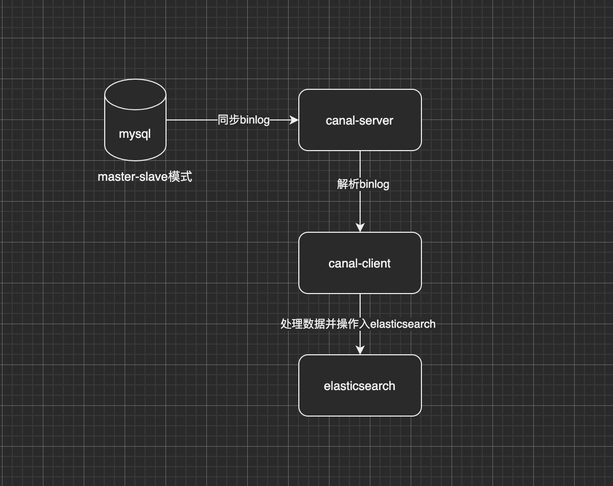

# ElasticSearch&Canal

在使用了 elasticsearch 之后,一直在考虑一个是数据怎么进入 elasticsearch 的问题.

在网上看见了一个可以使用 canal 处理 mysql 的 binlog 日志数据进入 elasticsearch.

这种和业务解耦的方法,真的挺好的. :"}

---

## 1. 基础知识

canal 处理 mysqlbinlog 示意图:



依赖模块:

- mysql 数据库
- canal-server
- canal-client
- elasticsearch

---

## 2. 环境部署

### 2.1 docker 部署 mysql

```sh
# root @ team3 in ~ [15:14:42] C:1
$ docker images
REPOSITORY                                      TAG                 IMAGE ID            CREATED             SIZE
docker.elastic.co/elasticsearch/elasticsearch   7.12.0              9337ed510a0c        4 weeks ago         830 MB
docker.io/canal/canal-admin                     v1.1.4              6a0ef7151b46        19 months ago       865 MB
docker.io/canal/canal-server                    v1.1.1              008e1d7824e1        2 years ago         831 MB
msyql5.7                                        5.7                 3ac2290b7c6e        2 years ago         372 MB
docker.io/mobz/elasticsearch-head               5-alpine            e2a76963bc18        4 years ago         78.9 MB

# 挂载容器目录到本地目录:
# -v /opt/soft/docker/ext-conf/mysql:/etc/mysql/conf.d
# root @ team3 in ~ [15:14:42] C:1
$ docker run -itd --name mysql7.0 -v /opt/soft/docker/ext-conf/mysql:/etc/mysql/conf.d  -p 4406:3306 -e MYSQL_ROOT_PASSWORD=123456 3ac2290b7c6e


# root @ team3 in ~ [15:15:55]
$ cd /opt/soft/docker/ext-conf

# root @ team3 in /opt/soft/docker/ext-conf [15:16:02]
$ cat mysql/my.cnf

!includedir /etc/mysql/conf.d/
!includedir /etc/mysql/mysql.conf.d/

# change from outside
[mysqld]
collation-server = utf8_unicode_ci
init-connect="SET NAMES utf8"
character-set-server = utf8
innodb_flush_log_at_trx_commit=2
sync_binlog=0
innodb_use_native_aio=0

# 设置开启binlog和binlog格式
log-bin=mysql-bin
binlog-format=ROW
server_id=1
```

重启 mysql 容器,进入容器查看 binlog 状态和设置同步用户

```sh
# root @ team3 in /opt/soft/docker/ext-conf [15:18:50]
$ docker exec -it 892c4e9a5e77 /bin/bash
root@892c4e9a5e77:/# mysql -u root -p

mysql> show variables like '%log_bin%';
+---------------------------------+--------------------------------+
| Variable_name                   | Value                          |
+---------------------------------+--------------------------------+
| log_bin                         | ON                             |
| log_bin_basename                | /var/lib/mysql/mysql-bin       |
| log_bin_index                   | /var/lib/mysql/mysql-bin.index |
| log_bin_trust_function_creators | OFF                            |
| log_bin_use_v1_row_events       | OFF                            |
| sql_log_bin                     | ON                             |
+---------------------------------+--------------------------------+
6 rows in set (0.00 sec)

mysql> show variables like 'binlog_format%'
    -> ;
+---------------+-------+
| Variable_name | Value |
+---------------+-------+
| binlog_format | ROW   |
+---------------+-------+
1 row in set (0.00 sec)
```

```sh
# 创建canal用户
mysql> CREATE USER canal IDENTIFIED BY 'canal';
# 分配全部权限,懒得夜长梦多
mysql> GRANT ALL PRIVILEGES ON *.* TO 'canal'@'%' ;
# 刷新用户权限
mysql> FLUSH PRIVILEGES;
```

### 2.2 docker 部署 canal-server

```sh
# root @ team3 in /opt/soft/docker/ext-conf [15:28:47]
$ docker pull canal/canal-server:v1.1.1

# root @ team3 in /opt/soft/docker/ext-conf [15:28:47]
$ docker run -itd -p 11111:11111 --name canal-server  008e1d7824e1

# 进入canal-server容器
# root @ team3 in /opt/soft/docker/ext-conf [15:30:30]
$ docker exec -it 71556b8c9872 /bin/bash

# app.sh为启动脚本
[root@71556b8c9872 admin]# ls
app.sh  bin  canal-server  health.sh

# 修改配置文件
[root@71556b8c9872 admin]# cd canal-server/conf/example/
[root@71556b8c9872 example]# pwd
/home/admin/canal-server/conf/example

# 膝盖instance.properties文件配置
[root@71556b8c9872 example]# ls
h2.mv.db  h2.trace.db  instance.properties  meta.dat

[root@71556b8c9872 example]# vi instance.properties
## mysql serverId , v1.0.26+ will autoGen
canal.instance.mysql.slaveId=1024

# position info
canal.instance.master.address=118.89.113.147:4406

# username/password
canal.instance.dbUsername=canal
canal.instance.dbPassword=canal

# 启动服务
[root@71556b8c9872 admin]# ls
app.sh  bin  canal-server  health.sh
[root@71556b8c9872 admin]# pwd
/home/admin
[root@71556b8c9872 admin]# ./app.sh

# 查看启动日志,可以在各自文件夹判断的日志判断是否启动成功
[root@71556b8c9872 logs]# pwd
/home/admin/canal-server/logs
```

---

## 3. 项目使用

项目范例: [github link]()

```xml

```

### 3.1 canal 客户端

```java

```

### 3.2 测试

```java

```

---

## 4. 参考文档

a. [canal github link](https://github.com/alibaba/canal/wiki/Docker-QuickStart)

b. [docker run 菜鸟教程 link](https://www.runoob.com/docker/docker-run-command.html)

c. [canal binlog 博客 link](https://blog.csdn.net/weixin_42179746/article/details/108465763)
