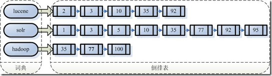
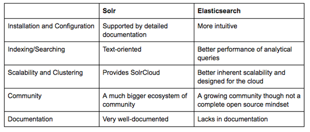

# ElasticSearch文档

Elasticsearch是建立在全文搜索引擎` Apache Lucene™ `基础上的搜索引擎,用它做全文搜索只需要使用统一开发好的API即可,而不需要了解Lucene的运行原理.

Elasticsearch是一个**实时的分布式搜索和分析引擎**.它可以帮助你用前所未有的速度去处理大规模数据.

Elasticsearch并不仅仅是Lucene这么简单,它不但包括了全文搜索功能,还可以:

- 分布式实时文件存储,并将每一个字段都编入索引,使其可以被搜索.


- 实时分析的分布式搜索引擎.


- 可以扩展到上百台服务器,处理PB级别的结构化或非结构化数据.


Java参考代码:[github地址](https://github.com/cs12110/demo-box/tree/master/elasticsearch-demo)

入坑: **你甚至可以拥有自己的搜索引擎.  :"}**


---

## 1. 全文检索

### 1.1  基本概念

现实中的数据结构分为两种: `结构化数据` 和 `非结构化数据`.

* 结构化数据: 指具有固定格式或有限长度的数据,如数据库,元数据等.
* 非结构化数据: 指不定长或无固定格式的数据,如邮件,word文档等.

说明: **非结构化数据又一种叫法叫全文数据**

按照数据的分类,搜索也分为两种:

* 对结构化数据的搜索 : 如对数据库的搜索,用SQL语句.再如对元数据的搜索,如利用windows搜索对文件名,类型,修改时间进行搜索等.
* 对非结构化数据的搜索: 如利用windows的搜索也可以搜索文件内容,Linux下的grep命令,再如用Google和百度可以搜索大量内容数据.


对全文数据的搜索主要有两种方法:

a. **顺序扫描法** :  所谓顺序扫描,比如要找内容包含某一个字符串的文件,就是一个文档一个文档的看,对于每一个文档,从头看到尾,如果此文档包含此字符串,则此文档为我们要找的文件,接着看下一个文件,直到扫描完所有的文件.


b. **全文索引法**：将非结构化数据中的一部分信息提取出来,重新组织,使其变得有一定结构,然后对此有一定结构的数据进行搜索,从而达到搜索相对较快的目的.这种先建立索引,再对索引进行搜索的过程就叫全文检索(Full-text Search).


索引概念: 从非结构化数据中提取出的然后重新组织的信息,我们称之**索引** .


举个栗子

>比如字典,字典的拼音表和部首检字表就相当于字典的索引,对每一个字的解释是非结构化的,如果字典没有音节表和部首检字表,在茫茫辞海中找一个字只能顺序扫描.然而字的某些信息可以提取出来进行结构化处理,比如读音,就比较结构化,分声母和韵母,分别只有几种可以一一列举,于是将读音拿出来按一定的顺序排列,每一项读音都指向此字的详细解释的页数.我们搜索时按结构化的拼音搜到读音,然后按其指向的页数,便可找到我们的非结构化数据——也即对字的解释 


### 1.2 全文检索流程

大致流程如下


细分流程如下

建立索引流程: 1->4 

搜索流程: a -> g


### 1.3 索引相关概念

**索引概念**: 从非结构化数据中提取出的然后重新组织的信息,我们称之**索引** .

在全文检索里面,会出现一个叫**反向索引**的东西? 那么反向索引是什么呢? 

[知乎用户耗子的回答 link]( https://www.zhihu.com/question/23202010/answer/23901671 )

```
渣翻译的例子之一.

英文原名Inverted index,大概因为 Invert 有颠倒的意思,就被翻译成了倒排.
但是倒排这个名称很容易让人理解为从A-Z颠倒成Z-A.

个人认为翻译成转置索引可能比较合适.

一个未经处理的数据库中,一般是以文档ID作为索引,以文档内容作为记录.

而Inverted index 指的是将单词或记录作为索引,将文档ID作为记录,这样便可以方便地通过单词或记录查找到其所在的文档.
```


[知乎用户良张的回答 link](https://www.zhihu.com/question/23202010/answer/23928943 )

```
我喜欢叫她"反向索引"(索引那么萌的东西,当然要用“她”啦！^_^ )
常规的索引是文档到关键词的映射：
           文档——>关键词
但是这样检索关键词的时候很费力，要一个文档一个文档的遍历一遍。(这事不能忍~)
于是人们发明了倒排索引~
倒排索引是关键词到文档的映射
          关键词——>文档
这样，只要有关键词，立马就能找到她在那个文档里出现过，剩下的事就是把她揪出来了~~~
可能是因为将正常的索引倒过来了吧，所以大家叫他倒排索引，可我依然喜欢叫他反向索引~
```


**索引创建流程**

创建索引流程如下图所示:


**分词组件**[此过程称为Tokenize]

>a. 将文档分成一个一个单独的单词;
>
>b. 去除标点符号;
>
>c. 去除停用词(Stop word);
>所谓停用词(Stop word)就是一种语言中最普通的一些单词,由于没有特别的意义,因而大多数情况下不能成为搜索的关键词,因而创建索引时,这种词会被去掉而减少索引的大小.
>英语中停词(Stop word)如：“the”,“a”,“this”等.
>对于每一种语言的分词组件(Tokenizer),都有一个停词(stop word)集合.
>经过分词(Tokenizer)后得到的结果称为词次(Token).
>
>d. 将词次(Token)传给语言处理组件(Linguistic Processor)


**语言处理组件(linguistic processor)**

> 对得到的词次(Token)做一些同语言相关的处理.
>
> 对于英语,语言处理组件(Linguistic Processor)一般做以下几点：
>
> a. 变为小写(Lowercase).
>
> b. 将单词缩减为词根形式,如“cars”到“car”等.这种操作称为：stemming.
>
> c. 将单词转变为词根形式,如“drove”到“drive”等.这种操作称为：lemmatization.
> 语言处理组件(linguistic processor)的结果称为词元(Term).
>
> d. 将词元(Term)传给索引组件(Indexer)


**索引组件(Indexer)**

>a. 利用得到的词(Term)创建一个字典(Term-DocumentID)
>
>b. 对字典按字母顺序进行排序.
>
>c. 合并相同的词元(Term)成为文档倒排(Posting List)链表.
>
>在此表中,有几个定义：
>
>Document Frequency 即文档频次,表示总共有多少文件包含此词(Term).
>
>Frequency 即词频率,表示此文件中包含了几个此词(Term).


影响一个词(Term)在一篇文档中的重要性主要有两个因素:

- Term Frequency (tf):即此Term在此文档中出现了多少次.tf 越大说明越重要.
- Document Frequency (df):即有多少文档包含次Term.df 越大说明越不重要.

词(Term)在文档中出现的次数越多,说明此词(Term)对该文档越重要,如“搜索”这个词,在本文档中出现的次数很多,说明本文档主要就是讲这方面的事的.然而在一篇英语文档中,this出现的次数更多,就说明越重要吗?不是的,这是由第二个因素进行调整,第二个因素说明,有越多的文档包含此词(Term), 说明此词(Term)太普通,不足以区分这些文档,因而重要性越低.


### 1.4 反向索引搜索样例

例子来自CSDN博客: [博客地址](https://blog.csdn.net/forfuture1978/article/details/4711308/)

反向索引保存的信息(词典-倒排表)

假设文档集合里面有100篇文档,为了方便表示,我们为文档编号从1到100,得到下面的结构



左边保存的是一系列字符串,称为词典.
每个字符串都指向包含此字符串的文档(Document)链表,此文档链表称为倒排表(Posting List).
有了索引,便使保存的信息和要搜索的信息一致,可以大大加快搜索的速度.


反向索引查询示例

比如说,我们要寻找既包含字符串“lucene”又包含字符串“solr”的文档,我们只需要以下几步：

a. 取出包含字符串“lucene”的文档链表.

b. 取出包含字符串“solr”的文档链表.

c. 通过合并链表,找出既包含“lucene”又包含“solr”的文件.


---


## 2. elasticsearch

### 2.1 为什么是elasticsearch?

在Java的全文检索里面有两大牛逼玩意,分别是倚天`solr`和屠龙`elasticsearch`.

为什么是elasticsearch,而不是solr呢? 是不是确认过眼神?

那么来看看solr和elasticsearch的对比:



简概对比:

a. Solr 利用 Zookeeper 进行分布式管理,而 Elasticsearch 自身带有分布式协调管理功能.

b. Solr 支持更多格式的数据,而 Elasticsearch 仅支持json文件格式.

c. Solr 官方提供的功能更多,而 Elasticsearch 本身更注重于核心功能,高级功能多有第三方插件提供.

d. Solr 在传统的搜索应用中表现好于 Elasticsearch,但在处理实时搜索应用时效率明显低于 Elasticsearch.

**Solr 是传统搜索应用的有力解决方案,Elasticsearch 更适用于新兴的实时搜索应用.**

因此,我们选用elasticsearch. :"}

~~你以为我会说用过solr而选elasticsearch?不可能的,这辈子都不可能说的.~~


### 2.2 安装elasticsearch

#### 2.2.1 创建用户

因为elasticsearch出于某种考虑,不能使用root启动.所以要建立其他的普通用户.

创建: dev用户,密码: rojao123.

```sh
[root@dev-2 ~]# useradd dev
[root@dev-2 ~]# passwd dev
Changing password for user dev.
New password: 
Retype new password: 
passwd: all authentication tokens updated successfully.
[root@dev-2 ~]# id dev
uid=1000(dev) gid=1000(dev) groups=1000(dev)
```

#### 2.2.2 下载elasticsearch

```sh
[root@dev-2 elasticsearch]# wget https://artifacts.elastic.co/downloads/elasticsearch/elasticsearch-6.3.0.tar.gz
--2018-07-04 09:46:33--  https://artifacts.elastic.co/downloads/elasticsearch/elasticsearch-6.3.0.tar.gz
Resolving artifacts.elastic.co (artifacts.elastic.co)... 107.21.253.15, 184.72.242.47, 107.21.237.95, ...
Connecting to artifacts.elastic.co (artifacts.elastic.co)|107.21.253.15|:443... connected.
HTTP request sent, awaiting response... 200 OK
Length: 91423553 (87M) [application/x-gzip]
Saving to: ‘elasticsearch-6.3.0.tar.gz’

100%[=====================================================================================================================================================>] 91,423,553   947KB/s   in 1m 55s 

2018-07-04 09:48:29 (776 KB/s) - ‘elasticsearch-6.3.0.tar.gz’ saved [91423553/91423553]
```

#### 2.2.3 解压并设置环境变量

解压软件

```sh
[root@dev-2 elasticsearch]# tar -xvf elasticsearch-6.3.0.tar.gz 
[root@dev-2 elasticsearch]# ls
elasticsearch-6.3.0  elasticsearch-6.3.0.tar.gz
[root@dev-2 elasticsearch]# cd elasticsearch-6.3.0
[root@dev-2 elasticsearch-6.3.0]# ls
bin  config  lib  LICENSE.txt  logs  modules  NOTICE.txt  plugins  README.textile
```

配置环境变量

```sh
[root@dev-2 elasticsearch-6.3.0]# vim /etc/profile
# import elasticsearch
export SEARCH_HOME='/opt/soft/elasticsearch/elasticsearch-6.3.0'
export PATH=$PATH:$SEARCH_HOME/bin
[root@dev-2 elasticsearch-6.3.0]# source /etc/profile
```

设置文件夹所有者为`dev`

```sh
[root@dev-2 elasticsearch]# ll 
total 89284
drwxr-xr-x. 8 root root      143 Jun 11 19:43 elasticsearch-6.3.0
[root@dev-2 elasticsearch]# chown -R dev:dev elasticsearch-6.3.0 
[root@dev-2 elasticsearch]# ll
total 89284
drwxr-xr-x. 8 dev  dev       143 Jun 11 19:43 elasticsearch-6.3.0
```


#### 2.2.4 配置ElasticSearch

**修改JVM参数**

因为在虚拟机上安装,内存分配了1G,所以要修改elasticsearch的jvm启动参数.

注意: **-Xms和-Xmx的值要一致**.

```sh
[root@dev-2 elasticsearch-6.3.0]# cd config/
[root@dev-2 config]# ls
elasticsearch.yml  jvm.options  log4j2.properties  role_mapping.yml  roles.yml  users  users_roles
[root@dev-2 config]# vim jvm.options 
-Xms512m
-Xmx512m
```

**修改启动参数**

```sh
[root@dev-2 config]# vim elasticsearch.yml 
# Set the bind address to a specific IP (IPv4 or IPv6):
#
network.host: 10.33.1.111
#
# Set a custom port for HTTP:
#
http.port: 9200
#
# 开启跨域访问支持,默认为false
# 
http.cors.enabled: true
#  
# 跨域访问允许的域名地址,(允许所有域名)以上使用正则
#   
http.cors.allow-origin: /.*/
```

### 2.3 启动elasticsearch

切换到dev用户启动.

```sh
[root@dev-2 elasticsearch-6.3.0]# su dev
[dev@dev-2 elasticsearch-6.3.0]$ elasticsearch 
[2018-07-04T10:00:17,771][INFO ][o.e.n.Node               ] [] initializing ...
```

但在后面出现启动异常,大致如下

```java
[2018-07-04T10:00:32,449][INFO ][o.e.b.BootstrapChecks    ] [eme3ye6] bound or publishing to a non-loopback address, enforcing bootstrap checks
ERROR: [4] bootstrap checks failed
[1]: initial heap size [268435456] not equal to maximum heap size [536870912]; this can cause resize pauses and prevents mlockall from locking the entire heap
[2]: max file descriptors [4096] for elasticsearch process is too low, increase to at least [65536]
[3]: max number of threads [3852] for user [dev] is too low, increase to at least [4096]
[4]: max virtual memory areas vm.max_map_count [65530] is too low, increase to at least [262144]
[2018-07-04T10:00:32,504][INFO ][o.e.n.Node               ] [eme3ye6] stopping ...
[2018-07-04T10:00:32,606][INFO ][o.e.n.Node               ] [eme3ye6] stopped
[2018-07-04T10:00:32,606][INFO ][o.e.n.Node               ] [eme3ye6] closing ...
[2018-07-04T10:00:32,619][INFO ][o.e.n.Node               ] [eme3ye6] closed
```

请按照如下修改

切换到root,修改`/etc/security/limits.conf `文件

```sh
[root@dev-2 elasticsearch-6.3.0]#  vim /etc/security/limits.conf 
* soft nofile 65536
* hard nofile 131072
* soft nproc 2048
* hard nproc 4096
```

修改`/etc/sysctl.conf`文件

```sh
[root@dev-2 etc]# vim /etc/sysctl.conf 
vm.max_map_count=655360
[root@dev-2 etc]# sysctl -p
vm.max_map_count = 655360
```

然后再切换dev用户启动Elasticsearch.

```sh
[dev@dev-2 elasticsearch-6.3.0]$ nohup elasticsearch  & 
[dev@dev-2 elasticsearch-6.3.0]$ curl 10.33.1.111:9200
{
  "name" : "eme3ye6",
  "cluster_name" : "elasticsearch",
  "cluster_uuid" : "MuyCFswhRFumWHhvee0Rig",
  "version" : {
    "number" : "6.3.0",
    "build_flavor" : "default",
    "build_type" : "tar",
    "build_hash" : "424e937",
    "build_date" : "2018-06-11T23:38:03.357887Z",
    "build_snapshot" : false,
    "lucene_version" : "7.3.1",
    "minimum_wire_compatibility_version" : "5.6.0",
    "minimum_index_compatibility_version" : "5.0.0"
  },
  "tagline" : "You Know, for Search"
}
```


### 2.3 Hello elasticsearch

为了更清楚的了解elasticsearch数据,我们这里对elasticsearch和关系型数据库数据结构进行对比.

| ElasticSearch  | RDBMS            |
| -------------- | ---------------- |
| 索引(index)    | 数据库(database) |
| 类型(type)     | 表(table)        |
| 文档(document) | 行(row)          |
| 字段(field)    | 列(column)       |
| 映射(mapping)  | 表结构(schema)   |
| 全文索引       | 索引             |
| 查询DSL        | SQL              |
| GET            | select           |
| PUT/POST       | update           |
| DELETE         | delete           |

你看elaticsearch是不是和数据库很像呀? :"}


哔哔了那么多,我们现在来看看elastic有哪些数据类型,好不好?

This way ,sir. elasticsearch的基本数据类型,官方网站页面,[请点击](https://www.elastic.co/guide/en/elasticsearch/reference/current/mapping-types.html)

| 类型      | 参数定义                         | 赋值                                  |
| --------- | -------------------------------- | ------------------------------------- |
| text      | "name":{"type":"text"}           | "name": "zhangsan"                    |
| keyword   | "tags":{"type":"keyword"}        | "tags": "abc"                         |
| date      | "date":{"type": "date"}          | "date":"2015-01-01T12:10:30Z"         |
| long      | "age":{"type":"long"}            | "age" :28                             |
| double    | "score":{"type":"double"}        | "score":98.8                          |
| boolean   | "isgirl": { "type": "boolean" }  | "isgirl" :true                        |
| ip        | "ip_addr":{"type":"ip"}          | "ip_addr": "192.168.1.1"              |
| geo_point | "location": {"type":"geo_point"} | "location":{"lat":40.12,"lon":-71.34} |


elasticsearch使用RESTFul接口进行数据操作.Restful API `GET`,`POST`,`PUT`,`DELETE`,`HEAD`含义:

- GET: 获取请求对象的当前状态.
- POST: 改变对象的当前状态. 
- PUT: 创建一个对象 .
- DELETE: 销毁对象.
- HEAD: 请求获取对象的基础信息.


### 2.4 简单增删改查

增删改查走起,使用`Postman`或者`Fiddler`来推送,去他妈的head插件.

#### 2.4.1 新增

```sh
[root@dev-2 elasticsearch]# curl -XPUT http://47.98.104.252:9200/blog/art/1 -d '
{
"title":"New version of Elasticsearch released!",
"content":"Version 1.0 released today!",
"tags":["announce","elasticsearch","release"]
}'

{
    "_index": "blog",
    "_type": "art",
    "_id": "1",
    "_version": 1,
    "result": "created",
    "_shards": {
        "total": 2,
        "successful": 1,
        "failed": 0
    },
    "_seq_no": 0,
    "_primary_term": 1
}
```

#### 2.4.2 查询

```sh
[root@dev-2 elasticsearch]# curl -XGET http://47.98.104.252:9200/blog/art/1
{
    "_index": "blog",
    "_type": "art",
    "_id": "1",
    "_version": 1,
    "found": true,
    "_source": {
        "title": "New version of Elasticsearch released!",
        "content": "Version 1.0 released today!",
        "tags": [
            "announce",
            "elasticsearch",
            "release"
        ]
    }
}
```

#### 2.4.3 更新

```sh
[root@dev-2 elasticsearch]# curl -XPUT http://10.33.1.111:9200/blog/art/1 -d '{
"title":"just test",
"content":"this is update content",
"tags":["test","elasticsearch","helloworld"]
}'

{
    "_index": "blog",
    "_type": "art",
    "_id": "1",
    "_version": 2,
    "result": "updated",
    "_shards": {
        "total": 2,
        "successful": 1,
        "failed": 0
    },
    "_seq_no": 1,
    "_primary_term": 1
}
```

### 2.4.4 删除

```sh
[root@dev-2 elasticsearch]# curl -XDELETE http://10.33.1.111:9200/blog/art/1
{
    "_index": "blog",
    "_type": "art",
    "_id": "1",
    "_version": 3,
    "result": "deleted",
    "_shards": {
        "total": 2,
        "successful": 1,
        "failed": 0
    },
    "_seq_no": 2,
    "_primary_term": 1
}
```

---


## 3. 中文分词

不管是`Solr`还是`elasticsearch`自带的分词器对中文的分词支持都不好,那怎么办呢?

当然是自己写一个啦!!!(这里的自己是指开发IK分词器的各位大牛 笑哭脸.jpg)

### 3.1 默认分词

这世界,对我们并不怎么好,这有分词点扯,嘿嘿嘿.

```sh
[root@dev-2 elasticsearch]# curl -H 'Content-type:application/json' http://10.33.1.111:9200/book_index/_analyze?pretty='true' -d '{"text":"我要解决温饱"}'
{
  "tokens" : [
    {
      "token" : "我",
      "start_offset" : 0,
      "end_offset" : 1,
      "type" : "<IDEOGRAPHIC>",
      "position" : 0
    },
    {
      "token" : "要",
      "start_offset" : 1,
      "end_offset" : 2,
      "type" : "<IDEOGRAPHIC>",
      "position" : 1
    },
    {
      "token" : "解",
      "start_offset" : 2,
      "end_offset" : 3,
      "type" : "<IDEOGRAPHIC>",
      "position" : 2
    },
    {
      "token" : "决",
      "start_offset" : 3,
      "end_offset" : 4,
      "type" : "<IDEOGRAPHIC>",
      "position" : 3
    },
    {
      "token" : "温",
      "start_offset" : 4,
      "end_offset" : 5,
      "type" : "<IDEOGRAPHIC>",
      "position" : 4
    },
    {
      "token" : "饱",
      "start_offset" : 5,
      "end_offset" : 6,
      "type" : "<IDEOGRAPHIC>",
      "position" : 5
    }
  ]
}
```

是时候召唤传说中的IK分词器了.


### 3.2 安装IK分词器

**Github下载和Elasticsearch相同版本的IK分词器**: [下载地址](https://github.com/medcl/elasticsearch-analysis-ik/releases)

在`plugins/`文件夹下建立`ik`文件夹,并把压缩包内容解压到`ik`文件夹.

```sh
[root@dev-2 plugins]# pwd
/opt/soft/elasticsearch/elasticsearch-6.3.0/plugins
[dev@dev-2 plugins]$ mkdir ik
[dev@dev-2 plugins]$ cd ik
[dev@dev-2 ik]$ unzip elasticsearch-analysis-ik-6.3.0.zip  -d .
[dev@dev-2 ik]$  ls
commons-codec-1.9.jar    config                               httpclient-4.5.2.jar  plugin-descriptor.properties
commons-logging-1.2.jar  elasticsearch-analysis-ik-6.3.0.jar  httpcore-4.4.4.jar
```

重新启动ElasticSearch

```sh
[dev@dev-2 elasticsearch-6.3.0]$ nohup bin/elasticsearch & 
[1] 17149
[dev@dev-2 elasticsearch-6.3.0]$ jps
17236 Jps
17149 Elasticsearch
[dev@dev-2 elasticsearch-6.3.0]$ cat nohup.out |grep ik
[2018-07-05T02:32:17,317][INFO ][o.e.p.PluginsService     ] [eme3ye6] loaded plugin [analysis-ik]
[2018-07-05T02:32:29,379][INFO ][o.w.a.d.Monitor          ] try load config from /opt/soft/elasticsearch/elasticsearch-6.3.0/config/analysis-ik/IKAnalyzer.cfg.xml
[2018-07-05T02:32:29,381][INFO ][o.w.a.d.Monitor          ] try load config from /opt/soft/elasticsearch/elasticsearch-6.3.0/plugins/ik/config/https://blog.csdn.net/z90818/article/details/78644293.cfg.xml
[dev@dev-2 elasticsearch-6.3.0]$ 
```


### 3.3 IK分词器分词

在安装好IK分词之后,就可以使用IK分词了.

测试使用:**ik_smart**

```sh
[dev@dev-2 elasticsearch-6.3.0]$ curl -H 'Content-type:application/json' http://10.33.1.111:9200/_analyze?pretty -d '{   "analyzer": "ik_smart",    "text":"我要解决温饱,哈哈哈哈" }'
{
  "tokens" : [
    {
      "token" : "我",
      "start_offset" : 0,
      "end_offset" : 1,
      "type" : "CN_CHAR",
      "position" : 0
    },
    {
      "token" : "要",
      "start_offset" : 1,
      "end_offset" : 2,
      "type" : "CN_CHAR",
      "position" : 1
    },
    {
      "token" : "解决",
      "start_offset" : 2,
      "end_offset" : 4,
      "type" : "CN_WORD",
      "position" : 2
    },
    {
      "token" : "温饱",
      "start_offset" : 4,
      "end_offset" : 6,
      "type" : "CN_WORD",
      "position" : 3
    },
    {
      "token" : "哈哈哈哈",
      "start_offset" : 7,
      "end_offset" : 11,
      "type" : "CN_WORD",
      "position" : 4
    }
  ]
}
[dev@dev-2 elasticsearch-6.3.0]$ 
```

测试使用:**ik_max_word**

```sh
[dev@dev-2 elasticsearch-6.3.0]$ curl -H 'Content-type:application/json' http://10.33.1.111:9200/_analyze?pretty -d '{   "analyzer": "ik_max_word",    "text":"我要解决温饱,哈哈哈哈" }'
{
  "tokens" : [
    {
      "token" : "我",
      "start_offset" : 0,
      "end_offset" : 1,
      "type" : "CN_CHAR",
      "position" : 0
    },
    {
      "token" : "要",
      "start_offset" : 1,
      "end_offset" : 2,
      "type" : "CN_CHAR",
      "position" : 1
    },
    {
      "token" : "解决",
      "start_offset" : 2,
      "end_offset" : 4,
      "type" : "CN_WORD",
      "position" : 2
    },
    {
      "token" : "温饱",
      "start_offset" : 4,
      "end_offset" : 6,
      "type" : "CN_WORD",
      "position" : 3
    },
    {
      "token" : "哈哈哈哈",
      "start_offset" : 7,
      "end_offset" : 11,
      "type" : "CN_WORD",
      "position" : 4
    },
    {
      "token" : "哈哈哈",
      "start_offset" : 7,
      "end_offset" : 10,
      "type" : "CN_WORD",
      "position" : 5
    },
    {
      "token" : "哈哈",
      "start_offset" : 7,
      "end_offset" : 9,
      "type" : "CN_WORD",
      "position" : 6
    },
    {
      "token" : "哈哈哈",
      "start_offset" : 8,
      "end_offset" : 11,
      "type" : "CN_WORD",
      "position" : 7
    },
    {
      "token" : "哈哈",
      "start_offset" : 8,
      "end_offset" : 10,
      "type" : "CN_WORD",
      "position" : 8
    },
    {
      "token" : "哈哈",
      "start_offset" : 9,
      "end_offset" : 11,
      "type" : "CN_WORD",
      "position" : 9
    }
  ]
}
```

结论:**ik_max_word**比**ik_smart**细分粒度更大.一般来说**ik_smart**就足够了.


### 3.4 具体使用

Q: 怎么使用IK分词器对自己需要存放的数据进行分词和查询?

A: **在创建index和type的时候,就指定type里面的字段是否需要分词.就像我们在mysql数据库先搭建表结构一样. :"}**

举个栗子: 指定Index为`index`,type为`fulltext`里面的字段`content`使用`ik_max_word`分词存储和搜索.

```sh
curl -XPOST http://localhost:9200/index/fulltext/_mapping -H 'Content-Type:application/json' -d'
{
        "properties": {
            "content": {
                "type": "text",
                "analyzer": "ik_max_word",
                "search_analyzer": "ik_max_word"
            }
        }

}'
```

详细栗子: [IK github地址](https://github.com/medcl/elasticsearch-analysis-ik)


Q: 要是动态搭建index和type呢?或者type里面的数据结构不定呢?

A: **我拒绝回答这个问题!!!**

----

## 4. 应用场景

### 4.1 简单搜索引擎

电影在elasticsearch里面进行索引,实现简单的Elasticsearch搜索.

是不是自己都可以做一个类似磁力网站的东西了? :"}

演示地址: [阿里云演示地址](http://47.98.104.252:8080/search-view/search.html)


**movie_fields.json**文件内容如下

```json
{
    "mappings": {
        "movies": {
            "properties": {
                "name":{
                    "type":"keyword"
                },
                "searchName": {
                    "type": "text",
                    "analyzer": "ik_smart",
                    "search_analyzer": "ik_smart"
                },
                "region": {
                    "type": "keyword"
                },
                "score": {
                    "type": "double"
                },
                "director": {
                    "type": "keyword"
                },
                "actors": {
                    "type": "keyword"
                },
                "tag": {
                    "type": "keyword"
                },
                "summary": {
                    "type": "text",
                    "analyzer": "ik_smart",
                    "search_analyzer": "ik_smart"
                }
            }
        }
    }
}
```

创建type

```sh
curl -XPUT -H 'Content-type:application/json' 'http://10.33.1.111:9200/movie_lib?pretty' -d @movie_fields.json
```

可以使用如下命令查看是否成功执行

```sh
curl -XGET 'http://10.33.1.111:9200/movie_lib/_mapping/movies?pretty'
```

运行页面如下


### 4.2 ELK

ELK 是 elastic公司旗下三款产品 ElasticSearch ,Logstash ,Kibana的首字母组合.

- ElasticSearch是一个基于 Lucene 构建的开源,分布式,RESTful 搜索引擎.
- Logstash传输和处理你的日志,事务或其他数据.
- Kibana将Elasticsearch 的数据分析并渲染为可视化的报表.


**elk架构图如下所示**


### 4.3 其他应用

a. 维基百科使用Elasticsearch来进行全文搜做并高亮显示关键词,以及提供search-as-you-type,did-you-mean等搜索建议功能.

b. GitHub使用Elasticsearch来检索超过1300亿行代码.

c. [美团App异常监控平台](https://tech.meituan.com/spark_streaming_es.html)

---

## 5. 常用命令

构建type

```sh
curl -XPUT -H 'Content-type:application/json' 'http://10.33.1.111:9200/movie_lib?pretty' -d @movie_fields.json
```


获取所有的index

```sh
curl -XGET 'http://47.98.104.252:9200/_cat/indices?pretty'
```


获取type的mapping结构

```sh
curl -XGET 'http://10.33.1.111:9200/movie_lib/_mapping/movies?pretty'
```


删除index

```sh
curl -XDELETE 'http://10.33.1.111:9200/movie_lib?pretty'
```


删除某个`type`下的所有数据

```sh
curl -XPOST 'http://10.33.1.111:9200/movie_lib/movies/_delete_by_query?pretty' -H 'Content-Type: application/json' -d'
{
  "query": {
    "match_all": {}
  }
}
'
```

---

## 6. 参考资料 

a. [全文检索原理优秀博客](https://blog.csdn.net/tomorrow_c/article/details/62240383)

b. [solr与elasticsearch对比](https://blog.csdn.net/Aliloke/article/details/78244426)

c. [elasticsearch官方文档](https://www.elastic.co/guide/en/elasticsearch/reference/current/index.html)

d. [elasticsearch查询样例](https://www.coyee.com/article/10764-23-useful-elasticsearch-example-queries/)

e. [ CSDN优秀博客](https://blog.csdn.net/forfuture1978/article/details/4711308/)

f. [关于elasticsearch实时](http://blog.sina.com.cn/s/blog_140c4cf3d0102xdap.html)

g. [solr与elasticsearch性能比较](https://yq.aliyun.com/articles/588309)