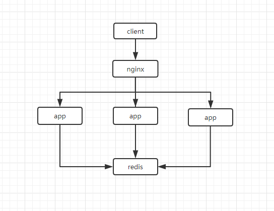

# 分布式 session

为了解决温饱,我们了解一下分布式 session. :"}

当前使用的为: `SpringBoot+Shiro+Redis`,请知悉.

---

## 1. 概要说明

### 1.1 使用场景

在系统的部署里面,通常部署在多台服务器上面,使用 nginx 进行反向代理和负载均衡.

nginx 默认的策略里面使用`ip_hash`,如果当前用户使用的`server1`服务器 down 掉了,被 nginx 代理到`server2`(server2 没有相关的 session)的时候,需要用户重新登录.

那么分布式 session 就可以用上场了.

### 1.2 简单架构



---

## 2. 代码实现

### 2.1 pom.xml

当然还有`springboot`,`redis`,`shiro`之类的依赖.

使用高版本的可以支持 redis 集群.

FBI WARING:`Do not use version < 3.1.0` [详情 link](http://alexxiyang.github.io/shiro-redis/)

```xml
<!-- shiro+redis缓存插件 -->
<dependency>
	<groupId>org.crazycake</groupId>
	<artifactId>shiro-redis</artifactId>
	<version>3.1.0</version>
</dependency>
```

### 2.2 Shrio 配置

```yml
spring:
    ......
    redis:
        password:
        clusters: 10.10.2.233:7000,10.10.2.233:7001,10.10.2.234:7000,10.10.2.234:7001,10.10.2.235:7000,10.10.2.236:7001
```

```java

import java.util.LinkedHashMap;
import java.util.Map;

import javax.servlet.Filter;

import org.apache.shiro.codec.Base64;
import org.apache.shiro.mgt.SecurityManager;
import org.apache.shiro.session.mgt.SessionManager;
import org.apache.shiro.spring.LifecycleBeanPostProcessor;
import org.apache.shiro.spring.security.interceptor.AuthorizationAttributeSourceAdvisor;
import org.apache.shiro.spring.web.ShiroFilterFactoryBean;
import org.apache.shiro.web.mgt.CookieRememberMeManager;
import org.apache.shiro.web.mgt.DefaultWebSecurityManager;
import org.apache.shiro.web.servlet.SimpleCookie;
import org.apache.shiro.web.session.mgt.DefaultWebSessionManager;
import org.crazycake.shiro.IRedisManager;
import org.crazycake.shiro.RedisCacheManager;
import org.crazycake.shiro.RedisClusterManager;
import org.crazycake.shiro.RedisSessionDAO;
import org.springframework.aop.framework.autoproxy.DefaultAdvisorAutoProxyCreator;
import org.springframework.beans.factory.annotation.Value;
import org.springframework.context.annotation.Bean;
import org.springframework.context.annotation.Configuration;

import cn.rojao.utils.shiro.UserRealm;

/**
 * Shiro配置
 *
 * @version 创建时间：2019年12月05日
 */
@Configuration
public class ShiroConfig {

	@Bean(name = "securityManager")
	public SecurityManager securityManager(UserRealm userRealm, SessionManager sessionManager) {
		DefaultWebSecurityManager securityManager = new DefaultWebSecurityManager();
		securityManager.setRealm(userRealm);
		securityManager.setSessionManager(sessionManager);
		// 注入记住我管理器
		securityManager.setRememberMeManager(rememberMeManager());
		return securityManager;
	}

	@Bean("shiroFilter")
	public ShiroFilterFactoryBean shirFilter(SecurityManager securityManager) {
		ShiroFilterFactoryBean shiroFilter = new ShiroFilterFactoryBean();
		shiroFilter.setSecurityManager(securityManager);
		shiroFilter.setLoginUrl("/login.html");
		shiroFilter.setUnauthorizedUrl("/login.html");

		// 设置拦截器
		Map<String, String> filterMap = new LinkedHashMap<>();
		filterMap.put("/public/**", "anon");
		filterMap.put("/webjars/**", "anon");
	    filterMap.put("/sys/logout", "logout");
		filterMap.put("/**", "user");
		shiroFilter.setFilterChainDefinitionMap(filterMap);

		Map<String, Filter> filtersMap = new LinkedHashMap<String, Filter>();
		shiroFilter.setFilters(filtersMap);
		return shiroFilter;
	}

	/**
	 * 注意设置为static,不然@value获取不了值
	 *
	 * @return
	 */
	@Bean(name = "lifecycleBeanPostProcessor")
	public static LifecycleBeanPostProcessor lifecycleBeanPostProcessor() {
		return new LifecycleBeanPostProcessor();
	}

	@Bean
	public DefaultAdvisorAutoProxyCreator defaultAdvisorAutoProxyCreator() {
		DefaultAdvisorAutoProxyCreator proxyCreator = new DefaultAdvisorAutoProxyCreator();
		proxyCreator.setProxyTargetClass(true);
		return proxyCreator;
	}

	@Bean
	public AuthorizationAttributeSourceAdvisor authorizationAttributeSourceAdvisor(SecurityManager securityManager) {
		AuthorizationAttributeSourceAdvisor advisor = new AuthorizationAttributeSourceAdvisor();
		advisor.setSecurityManager(securityManager);
		return advisor;
	}

	/**
	 * cookie对象; rememberMeCookie()方法是设置Cookie的生成模版，比如cookie的name，cookie的有效时间等等。
	 *
	 * @return
	 */
	@Bean
	public SimpleCookie rememberMeCookie() {
		// 这个参数是cookie的名称，对应前端的checkbox的name = rememberMe
		SimpleCookie simpleCookie = new SimpleCookie("rememberMe");
		simpleCookie.setMaxAge(7 * 24 * 60 * 60);
		return simpleCookie;
	}

	/**
	 * cookie管理对象;
	 * rememberMeManager()方法是生成rememberMe管理器，而且要将这个rememberMe管理器设置到securityManager中
	 *
	 * @return
	 */
	@Bean
	public CookieRememberMeManager rememberMeManager() {
		CookieRememberMeManager cookieRememberMeManager = new CookieRememberMeManager();
		cookieRememberMeManager.setCookie(rememberMeCookie());
		// rememberMe cookie加密的密钥 建议每个项目都不一样 默认AES算法 密钥长度(128 256 512 位)
		cookieRememberMeManager.setCipherKey(Base64.decode("2AvVhdsgUs0FSA3SDFAdag=="));
		return cookieRememberMeManager;
	}

	// -------------------- 分布式session ------------------

	/**
	 * Session Manager
	 */
	@Bean
	public DefaultWebSessionManager sessionManager() {
		DefaultWebSessionManager sessionManager = new DefaultWebSessionManager();
		sessionManager.setSessionDAO(redisSessionDAO());
		return sessionManager;
	}

	/**
	 * RedisSessionDAO
	 */
	@Bean
	public RedisSessionDAO redisSessionDAO() {
		RedisSessionDAO redisSessionDAO = new RedisSessionDAO();
		redisSessionDAO.setRedisManager(redisManager());
		return redisSessionDAO;
	}

	/**
	 * cacheManager 缓存 redis实现
	 *
	 * @return
	 */
	public RedisCacheManager cacheManager() {
		RedisCacheManager redisCacheManager = new RedisCacheManager();
		redisCacheManager.setRedisManager(redisManager());
		return redisCacheManager;
	}

	@Value("${spring.redis.clusters}")
	public String cluster;

	@Value("${spring.redis.password}")
	public String password;

	/**
	 * 配置shiro redisManager
	 *
	 * <p>
	 * 这里没找到集群的配置方法 orz.
	 *
	 * @return
	 */
	public IRedisManager redisManager() {
		RedisClusterManager clusterManager = new RedisClusterManager();
		clusterManager.setHost(cluster);
		if (null != password && !"".equals(password.trim())) {
			clusterManager.setPassword(password);
		}
		clusterManager.setTimeout(3000);
		return clusterManager;
	}

	// -----------------------------------------------------------
}
```

### 2.3 nginx 配置

```nginx
# 分别使用5555,5500端口开启项目
upstream upsserver {
    server 10.10.1.244:5555;
    server 10.10.1.244:5500;
}

server {
    listen       10086;
    server_name  localhost;

    charset utf-8;

    # 添加头部信息
    location /ups {
            proxy_pass http://upsserver/;
    }
}
```

### 2.4 测试

确定当前登录用户使用哪个系统,然后 down 掉那个系统,用户继续 web 操作不要求重新登录,则成功.

---

## 3. 参考资料

a. [shiro-redis 官网](http://alexxiyang.github.io/shiro-redis/)

b. [springboot+shiro+redis 项目整合](https://www.cnblogs.com/caichaoqi/p/8900677.html)
