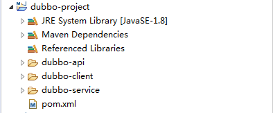
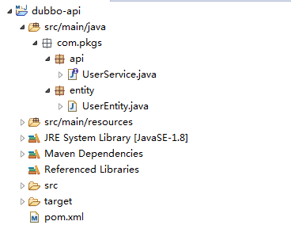
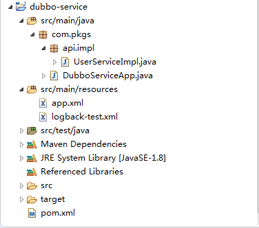

# Rpc 之 dubbo

在微服务里面,springcloud 一家独大之外,dubbo 也登上了 apache 的开源项目系列.

那么我们来看看 dubbo 的 hello world 是怎样子的.

此处示例使用: `maven+springmvc+zookeeper+dubbo`,请知悉.

---

## 1. 项目说明


### 1.1 模块说明

项目结构如下图所示




模块功能说明:

| 项目名称       | 备注                     |
| -------------- | ------------------------ |
| dubbo-project  | maven父级模块            |
| dubbo-api      | 定义接口和相关共用实体类 |
| dubbo-service  | 接口具体实现模块         |
| dubbo-consumer | 接口调用消费模块         |


### 1.2 zookeeper安装

请参考:  [zookeeper集群安装 link](zookeeper之配置中心.md)文档的zookeeper安装,此处不再累述.


---

## 2. 代码实现

### 2.1 dubbo-project

该模块主要引入系统所需jar和建建立子模块.

#### 2.1.1 项目结构


#### 2.1.2 pom.xml

```xml
<project xmlns="http://maven.apache.org/POM/4.0.0"
	xmlns:xsi="http://www.w3.org/2001/XMLSchema-instance"
	xsi:schemaLocation="http://maven.apache.org/POM/4.0.0 http://maven.apache.org/xsd/maven-4.0.0.xsd">
	<modelVersion>4.0.0</modelVersion>
	<groupId>dubbo-project</groupId>
	<artifactId>dubbo-project</artifactId>
	<version>0.0.1-SNAPSHOT</version>
	<packaging>pom</packaging>
	<modules>
		<!-- api模块 -->
		<module>dubbo-api</module>
		<!-- 服务提供者 -->
		<module>dubbo-service</module>
		<!-- 服务调用端 -->
		<module>dubbo-client</module>
	</modules>

	<properties>
		<maven.compiler.source>1.8</maven.compiler.source>
		<maven.compiler.target>1.8</maven.compiler.target>
		<project.build.sourceEncoding>UTF-8</project.build.sourceEncoding>
		<project.reporting.outputEncoding>UTF-8</project.reporting.outputEncoding>
		<spring.version>4.2.5.RELEASE</spring.version>
	</properties>
	<dependencies>
		<!-- 添加junit4依赖 -->
		<dependency>
			<groupId>junit</groupId>
			<artifactId>junit</artifactId>
			<version>4.11</version>
			<scope>test</scope>
		</dependency>

		<!-- 添加spring核心依赖 -->
		<dependency>
			<groupId>org.springframework</groupId>
			<artifactId>spring-core</artifactId>
			<version>${spring.version}</version>
		</dependency>
		<dependency>
			<groupId>org.springframework</groupId>
			<artifactId>spring-web</artifactId>
			<version>${spring.version}</version>
		</dependency>
		<dependency>
			<groupId>org.springframework</groupId>
			<artifactId>spring-oxm</artifactId>
			<version>${spring.version}</version>
		</dependency>
		<dependency>
			<groupId>org.springframework</groupId>
			<artifactId>spring-tx</artifactId>
			<version>${spring.version}</version>
		</dependency>
		<dependency>
			<groupId>org.springframework</groupId>
			<artifactId>spring-jdbc</artifactId>
			<version>${spring.version}</version>
		</dependency>
		<dependency>
			<groupId>org.springframework</groupId>
			<artifactId>spring-webmvc</artifactId>
			<version>${spring.version}</version>
		</dependency>
		<dependency>
			<groupId>org.springframework</groupId>
			<artifactId>spring-context</artifactId>
			<version>${spring.version}</version>
		</dependency>
		<dependency>
			<groupId>org.springframework</groupId>
			<artifactId>spring-context-support</artifactId>
			<version>${spring.version}</version>
		</dependency>
		<dependency>
			<groupId>org.springframework</groupId>
			<artifactId>spring-aop</artifactId>
			<version>${spring.version}</version>
		</dependency>

		<dependency>
			<groupId>org.springframework</groupId>
			<artifactId>spring-test</artifactId>
			<version>${spring.version}</version>
		</dependency>


		<!-- 添加fastjson -->
		<dependency>
			<groupId>com.alibaba</groupId>
			<artifactId>fastjson</artifactId>
			<version>1.2.30</version>
		</dependency>

		<!-- logback -->
		<dependency>
			<groupId>org.slf4j</groupId>
			<artifactId>slf4j-api</artifactId>
			<version>1.7.5</version>
			<type>jar</type>
			<scope>compile</scope>
		</dependency>
		<dependency>
			<groupId>ch.qos.logback</groupId>
			<artifactId>logback-core</artifactId>
			<version>1.0.13</version>
			<type>jar</type>
		</dependency>
		<dependency>
			<groupId>ch.qos.logback</groupId>
			<artifactId>logback-classic</artifactId>
			<version>1.0.13</version>
			<type>jar</type>
		</dependency>

		<!-- zookeeper -->
		<dependency>
			<groupId>org.apache.zookeeper</groupId>
			<artifactId>zookeeper</artifactId>
			<version>3.4.9</version>
		</dependency>
		<dependency>
			<groupId>com.101tec</groupId>
			<artifactId>zkclient</artifactId>
			<version>0.10</version>
		</dependency>

		<!-- dubbo -->
		<dependency>
			<groupId>com.alibaba</groupId>
			<artifactId>dubbo</artifactId>
			<version>2.6.0</version>
			<exclusions>
				<exclusion>
					<groupId>org.springframework</groupId>
					<artifactId>spring</artifactId>
				</exclusion>
			</exclusions>
		</dependency>
	</dependencies>
</project>
```

### 2.2 dubbo-api


#### 2.2.1 项目结构
声明接口和相关公用实体类,所以不使用其他依赖和日志插件.



#### 2.2.2 pom.xml

```xml
<project xmlns="http://maven.apache.org/POM/4.0.0"
	xmlns:xsi="http://www.w3.org/2001/XMLSchema-instance"
	xsi:schemaLocation="http://maven.apache.org/POM/4.0.0 http://maven.apache.org/xsd/maven-4.0.0.xsd">
	<modelVersion>4.0.0</modelVersion>
	<parent>
		<groupId>dubbo-project</groupId>
		<artifactId>dubbo-project</artifactId>
		<version>0.0.1-SNAPSHOT</version>
	</parent>
	<artifactId>dubbo-api</artifactId>
	<version>1.0.0</version>
</project>
```

#### 2.2.3 UserService接口

```java
package com.pkgs.api;

import com.pkgs.entity.UserEntity;

/**
 * 用户业务接口
 * 
 *
 * <p>
 *
 * @author cs12110 2018年12月13日
 * @see
 * @since 1.0
 */
public interface UserService {

	/**
	 * 根据Id查询用户数据
	 * 
	 * @param id
	 *            用户Id
	 * @return {@link UserEntity}
	 */
	public UserEntity query(Integer id);
}
```

#### 2.2.4 UserEntity实体类

```java
package com.pkgs.entity;

import java.io.Serializable;
import com.alibaba.fastjson.JSON;

/**
 * 用户实体类
 * 
 *
 * <p>
 *
 * @author cs12110 2018年12月13日
 * @see
 * @since 1.0
 */
public class UserEntity implements Serializable {
	private static final long serialVersionUID = 1L;
	private Integer id;
	private String name;

	//getter/setter

	@Override
	public String toString() {
		return JSON.toJSONString(this, true);
	}
}
```

### 2.3 dubbo-service

#### 2.3.1 项目结构



#### 2.3.2 pom.xml

导入`dubbo-api`模块依赖,内容如下

```xml
<project xmlns="http://maven.apache.org/POM/4.0.0"
	xmlns:xsi="http://www.w3.org/2001/XMLSchema-instance"
	xsi:schemaLocation="http://maven.apache.org/POM/4.0.0 http://maven.apache.org/xsd/maven-4.0.0.xsd">
	<modelVersion>4.0.0</modelVersion>
	<parent>
		<groupId>dubbo-project</groupId>
		<artifactId>dubbo-project</artifactId>
		<version>0.0.1-SNAPSHOT</version>
	</parent>
	<artifactId>dubbo-service</artifactId>
	<dependencies>
		<dependency>
			<groupId>dubbo-project</groupId>
			<artifactId>dubbo-api</artifactId>
			<version>1.0.0</version>
		</dependency>
	</dependencies>
</project>
```

#### 2.3.3 app.xml

声明bean和zookeeper相关位置.

```xml
<?xml version="1.0" encoding="UTF-8"?>
<beans xmlns="http://www.springframework.org/schema/beans"
	xmlns:xsi="http://www.w3.org/2001/XMLSchema-instance"
	xmlns:dubbo="http://code.alibabatech.com/schema/dubbo"
	xsi:schemaLocation="http://www.springframework.org/schema/beans
       http://www.springframework.org/schema/beans/spring-beans.xsd
       http://code.alibabatech.com/schema/dubbo
       http://code.alibabatech.com/schema/dubbo/dubbo.xsd">

	<!-- 定义了提供方应用信息，用于计算依赖关系。在dubbo-admin 或 dubbo-monitor 会显示这个名字，方便识别 -->
	<dubbo:application name="dubbo-service"
		owner="cs12110" organization="cs12110" />

	<!-- 使用zookeeper 注册中心暴露服务，注意要先开启 zookeeper -->
	<dubbo:registry
		address="zookeeper://10.33.1.115:2181?backup=10.33.1.115:2182,10.33.1.115:2183" />

	<!-- 用dubbo协议在20880端口暴露服务 -->
	<dubbo:protocol name="dubbo" port="20880" />

	<!-- 用dubbo 协议实现定义好的 api 接口 -->
	<dubbo:service interface="com.pkgs.api.UserService"
		ref="userService" protocol="dubbo" />

	<!-- 具体实现接口的bean -->
	<bean id="userService" class="com.pkgs.api.impl.UserServiceImpl" />
</beans>
```

#### 2.3.4 logback-test.xml

```xml
<?xml version="1.0" encoding="UTF-8" ?>
<configuration scan="true">

	<!-- 控制台标志化输出 -->
	<appender name="STDOUT"
		class="ch.qos.logback.core.ConsoleAppender">
		<encoder>
			<pattern>%d{yyyy-MM-dd HH:mm:ss} %-5level %logger{128}:%L - %msg%n
			</pattern>
		</encoder>
	</appender>

	<!-- 将日志写入日志文件 -->
	<appender name="FILE" class="ch.qos.logback.core.FileAppender">
		<file>logs/logback.log</file>
		<append>true</append><!-- 日志追加 -->
		<encoder>
			<pattern>%d{yyyy-MM-dd HH:mm:ss} %-5level %logger{128}:%L - %msg%n
			</pattern>
		</encoder>
	</appender>

	<logger name="org.springframework" level="ERROR"></logger>
	<logger name="org.apache.zookeeper" level="ERROR"></logger>
	<logger name="org.I0Itec.zkclient" level="ERROR"></logger>
	<logger name="com.alibaba.dubbo" level="INFO"></logger>

	<root level="DEBUG">
		<appender-ref ref="STDOUT" />
		<appender-ref ref="FILE" />
	</root>
</configuration>
```

#### 2.3.5 UserService接口实现类

```java
package com.pkgs.api.impl;

import java.util.ArrayList;
import java.util.List;

import com.pkgs.api.UserService;
import com.pkgs.entity.UserEntity;

/**
 * 业务接口类
 * 
 *
 * <p>
 *
 * @author cs12110 2018年12月13日
 * @see
 * @since 1.0
 */
public class UserServiceImpl implements UserService {
	private List<UserEntity> list = init();

	@Override
	public UserEntity query(Integer id) {
		for (UserEntity e : list) {
			if (e.getId() == id) {
				return e;
			}
		}
		return null;
	}

	private List<UserEntity> init() {
		List<UserEntity> list = new ArrayList<>();
		for (int index = 0; index < 10; index++) {
			UserEntity user = new UserEntity();
			user.setId(index);
			user.setName("name: " + index);
			list.add(user);
		}
		return list;
	}
}
```


#### 2.3.6 项目启动类

```java
package com.pkgs;

import java.io.IOException;
import org.slf4j.Logger;
import org.slf4j.LoggerFactory;
import org.springframework.context.support.ClassPathXmlApplicationContext;

/**
 * 启动类
 * 
 *
 * <p>
 *
 * @author cs12110 2018年12月13日
 * @see
 * @since 1.0
 */
public class DubboServiceApp {
	private static Logger logger = LoggerFactory.getLogger(DubboServiceApp.class);
	public static void main(String[] args) throws IOException {
		ClassPathXmlApplicationContext ctx = new ClassPathXmlApplicationContext("app.xml");
		try {
			ctx.start();
			logger.info("Start service app");
			// 这里有点难堪
			System.in.read();
		} catch (Exception e) {
			e.printStackTrace();
			ctx.close();
		}
	}
}
```


### 2.4 dubbo-client

#### 2.4.1 项目结构


#### 2.4.2 pom.xml

```xml
<project xmlns="http://maven.apache.org/POM/4.0.0"
	xmlns:xsi="http://www.w3.org/2001/XMLSchema-instance"
	xsi:schemaLocation="http://maven.apache.org/POM/4.0.0 http://maven.apache.org/xsd/maven-4.0.0.xsd">
	<modelVersion>4.0.0</modelVersion>
	<parent>
		<groupId>dubbo-project</groupId>
		<artifactId>dubbo-project</artifactId>
		<version>0.0.1-SNAPSHOT</version>
	</parent>
	<artifactId>dubbo-client</artifactId>

	<dependencies>
		<dependency>
			<groupId>dubbo-project</groupId>
			<artifactId>dubbo-api</artifactId>
			<version>1.0.0</version>
		</dependency>
	</dependencies>
</project>
```
#### 2.4.3 app.xml

```xml
<?xml version="1.0" encoding="UTF-8"?>
<beans xmlns="http://www.springframework.org/schema/beans"
	xmlns:xsi="http://www.w3.org/2001/XMLSchema-instance"
	xmlns:dubbo="http://code.alibabatech.com/schema/dubbo"
	xsi:schemaLocation="http://www.springframework.org/schema/beans
       http://www.springframework.org/schema/beans/spring-beans.xsd
       http://code.alibabatech.com/schema/dubbo
       http://code.alibabatech.com/schema/dubbo/dubbo.xsd">

	<!-- 定义了提供方应用信息，用于计算依赖关系。在dubbo-admin 或 dubbo-monitor 会显示这个名字，方便识别 -->
	<dubbo:application name="dubbo-user" owner="user"
		organization="user" />

	<!-- 向zookeeper 订阅provider 的地址，由zookeeper 定时推送 -->
	<dubbo:registry
		address="zookeeper://10.33.1.115:2181?backup=10.33.1.115:2182,10.33.1.115:2183" />

	<!-- 使用dubbo 协议调用定义好的 api 接口 -->
	<dubbo:reference id="userService"
		interface="com.pkgs.api.UserService" />
</beans>
```

#### 2.4.4 logback-test.xml

```xml
<?xml version="1.0" encoding="UTF-8" ?>
<configuration scan="true">
	<!-- 控制台标志化输出 -->
	<appender name="STDOUT" class="ch.qos.logback.core.ConsoleAppender">
		<encoder>
			<pattern>%d{yyyy-MM-dd HH:mm:ss} %-5level %logger{128}:%L - %msg%n
			</pattern>
		</encoder>
	</appender>
	<!-- 将日志写入日志文件 -->
	<appender name="FILE" class="ch.qos.logback.core.FileAppender">
		<file>logs/logback.log</file>
		<append>true</append><!-- 日志追加 -->
		<encoder>
			<pattern>%d{yyyy-MM-dd HH:mm:ss} %-5level %logger{128}:%L - %msg%n
			</pattern>
		</encoder>
	</appender>

	<logger name="org.springframework" level="ERROR"></logger>
	<logger name="org.apache.zookeeper" level="ERROR"></logger>
	<logger name="org.I0Itec.zkclient" level="ERROR"></logger>
	<logger name="com.alibaba.dubbo" level="INFO"></logger>

	<root level="DEBUG">
		<appender-ref ref="STDOUT" />
		<appender-ref ref="FILE" />
	</root>
</configuration>
```

#### 2.4.5 服务调用类

```java
package com.pkgs.consumer;

import org.slf4j.Logger;
import org.slf4j.LoggerFactory;
import org.springframework.context.support.ClassPathXmlApplicationContext;

import com.pkgs.api.UserService;
import com.pkgs.entity.UserEntity;

/**
 * 消费端
 * 
 *
 * <p>
 *
 * @author cs12110 2018年12月13日
 * @see
 * @since 1.0
 */
public class ConsumerApp {

	private static Logger logger = LoggerFactory.getLogger(ConsumerApp.class);

	public static void main(String[] args) {
		// 测试常规服务
		ClassPathXmlApplicationContext context = new ClassPathXmlApplicationContext("app.xml");
		try {
			context.start();

			logger.info("start consumer app");

			UserService sevice = context.getBean(UserService.class);

			UserEntity user = sevice.query(1);
			logger.info("query by id: {} ->{}", 1, user);

			user = sevice.query(2);
			logger.info("query by id: {} ->{}", 2, user);

			user = sevice.query(100);
			logger.info("query by id: {} ->{}", 100, user);

		} catch (Exception e) {
			logger.error("{}", e);
			context.close();
		}
	}
}
```

---


## 3. 测试

该章节主要用于测试各个模块的联通.

### 3.1 开启dubbo-service项目

首先开启`dubbo-service`项目,直接运行 `DubboServiceApp` 即可.

开启成功日志如下:

```java
2018-12-13 14:06:15 INFO  com.pkgs.DubboServiceApp:27 - Start service app
```

### 3.2 开启dubbo-client项目

直接运行`ConsumerApp`即可,交互成功日志如下:

```java
2018-12-13 14:09:52 INFO  com.pkgs.consumer.ConsumerApp:35 - query by id: 1 ->{
	"id":1,
	"name":"name: 1"
}
2018-12-13 14:09:52 INFO  com.pkgs.consumer.ConsumerApp:38 - query by id: 2 ->{
	"id":2,
	"name":"name: 2"
}
2018-12-13 14:09:52 INFO  com.pkgs.consumer.ConsumerApp:41 - query by id: 100 ->null
```

可以看出`dubbo-client`和`dubbo-service`交互成功.

---

## 4. 参考文档

a. [dubbo 与 zookeeper 的关系](https://www.cnblogs.com/xiaofei1208/p/7077733.html)

b. [dubbo 入门](https://github.com/nomico271/DatatablesDemo)
