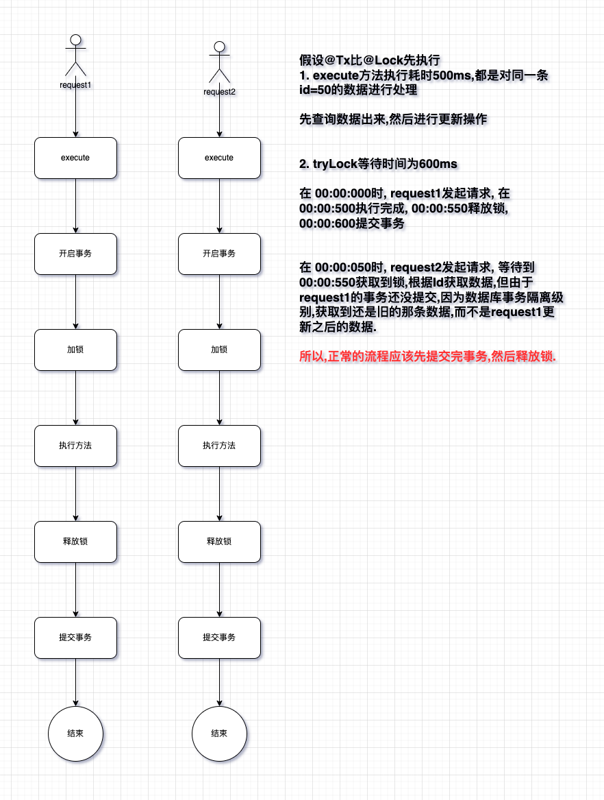

# Spring Order

order, order, order.

---

### 1. 场景

Q: what the fuck are you doing here?

A: 嘿嘿嘿.看看下面的场景有啥问题? `@Tx` 代表事务, `@Lock` 代表分布式锁

```java
@Tx
@Lock
public void execute(String userId, BigDeciaml amount){
    User user = userMapper.getFromDatabase(userId);
    user.setAmount(user.getAmount+amount);

    userMapper.updateById(user);
}
```

这里关于`@Tx`和`@Lock` 的执行顺序有点讲究.举个栗子:



所以,`@Lock`切面执行的优先级应该要比`@Tx`的高.

如果`@Lock`没设置 order 的前提下,使用`Integer.MAX_VALUE`的情况,spring 会先执行事务管理的拦截器,这样子就会出现上述的情况.

---

### 2. 源码分析

Q: 如果在方法上面加了多个注解,怎么知道哪个先执行呀?

A: spring 切面方法加载 interceptor 核心源码:

```java
org.springframework.aop.framework.autoproxy.AbstractAdvisorAutoProxyCreator#findEligibleAdvisors
```

```java
protected List<Advisor> findEligibleAdvisors(Class<?> beanClass, String beanName) {
    List<Advisor> candidateAdvisors = this.findCandidateAdvisors();
    // 获取当前beanClass有哪些切面
    List<Advisor> eligibleAdvisors = this.findAdvisorsThatCanApply(candidateAdvisors, beanClass, beanName);
    // 添加扩展切面
    this.extendAdvisors(eligibleAdvisors);
    if (!eligibleAdvisors.isEmpty()) {
        // 切面排序,对切面`order`进行升序排序,如果没有order默认为Integer.MAX_VALUE
        eligibleAdvisors = this.sortAdvisors(eligibleAdvisors);
    }

    return eligibleAdvisors;
}
```

对切面`order`进行`升序`排序,<b>order 值越小,优先级越高,越先执行.</b>

```java
org.springframework.aop.aspectj.autoproxy.AspectJAwareAdvisorAutoProxyCreator#sortAdvisors
```

Q: 可以在切面上使用`@Order(num)`来指定执行顺序,但是如果没有写`@Order`来指定呢?

A: debug 看来,如果没指定 order 的话,默认为`Integer.MAX_VALUE`(优先级最低).

Q: 那么如果 order 是一样的情况下,怎么确定哪个先执行?

A: 这个看起来和切面的加载有关系,会产生不确定的执行顺序.如果切面之间有执行顺序要求,建议使用 order 来控制.

---

### 3. 参考资料

a. [@Transactional 和普通自定义切面执行顺序的思考 link](https://juejin.cn/post/7133207925593489439)
