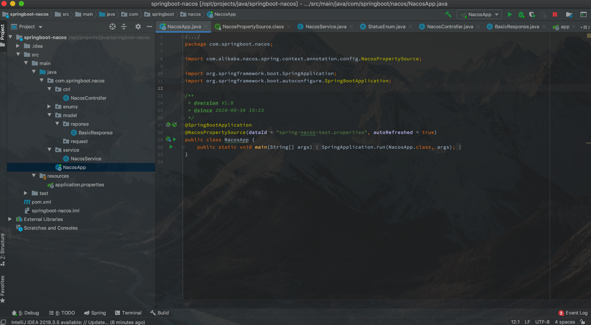
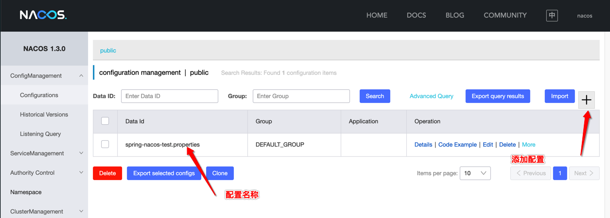

# nacos

配置中心的使用. :"}

---

### 1. 安装教程

下载 nacos1.3 安装包[github 地址](https://github.com/alibaba/nacos/releases/tag/1.3.0)

```sh
# 解压文件夹,在conf/application.properties文件可以调整nacos的端口
# root @ team3 in /opt/soft/nacos/nacos [18:19:03]
$ ls
LICENSE  NOTICE  bin  conf  startup-nacos.sh  target
```

编写启动脚本`startup-nacos.sh`

```sh
#!/bin/sh

echo -e '\n--- Startup nacos by standalone mode ---\n'

bin/startup.sh -m standalone

echo -e '\n --- Using port:3308 ---\n'
```

启动成功之后,可以通过网页的形式访问 nacos:`http://118.89.113.147:3308/nacos/#/login`

默认账户: `nocos`,默认密码:`nacos`.

---

### 2. 整合 spring boot

FBI Waring:`项目启动的配置文件application.properties时,在nacos上面最好创建同一后缀名的配置文件.(识别yml有毒,哭了,求大神打救)`

项目结构如下图所示



#### 2.1 Nacos 添加配置



配置内容如下:

```properties
# 系统端口
server.port=8090
# url统一前缀
server.servlet.context-path=/api/springboot-nacos/
# 项目名称
spring.application.name=springboot-nacos

# 自定义数值
remote.value=3.1415926
remote.suffix=.properties
```

#### 2.2 pom.xml

maven 依赖如下

```xml
<?xml version="1.0" encoding="UTF-8"?>
<project xmlns="http://maven.apache.org/POM/4.0.0"
         xmlns:xsi="http://www.w3.org/2001/XMLSchema-instance"
         xsi:schemaLocation="http://maven.apache.org/POM/4.0.0 http://maven.apache.org/xsd/maven-4.0.0.xsd">
    <modelVersion>4.0.0</modelVersion>

    <groupId>org.example</groupId>
    <artifactId>springboot-nacos</artifactId>
    <version>1.0-SNAPSHOT</version>

    <!-- spring boot -->
    <parent>
        <groupId>org.springframework.boot</groupId>
        <artifactId>spring-boot-starter-parent</artifactId>
        <version>2.0.4.RELEASE</version>
    </parent>

    <properties>
        <nacos-config-spring-boot.version>0.2.1</nacos-config-spring-boot.version>
    </properties>

    <dependencies>

        <!-- boot env -->
        <dependency>
            <groupId>org.springframework.boot</groupId>
            <artifactId>spring-boot-starter</artifactId>
        </dependency>

        <!-- web env -->
        <dependency>
            <groupId>org.springframework.boot</groupId>
            <artifactId>spring-boot-starter-web</artifactId>
        </dependency>

        <!-- aspect -->
        <dependency>
            <groupId>org.springframework.boot</groupId>
            <artifactId>spring-boot-starter-aop</artifactId>
        </dependency>

        <!-- nacos -->
        <dependency>
            <groupId>com.alibaba.boot</groupId>
            <artifactId>nacos-config-spring-boot-starter</artifactId>
            <version>${nacos-config-spring-boot.version}</version>
        </dependency>


        <!-- lombok -->
        <dependency>
            <groupId>org.projectlombok</groupId>
            <artifactId>lombok</artifactId>
            <version>1.18.4</version>
        </dependency>


        <!-- fastjson -->
        <dependency>
            <groupId>com.alibaba</groupId>
            <artifactId>fastjson</artifactId>
            <version>1.2.30</version>
        </dependency>
    </dependencies>
</project>
```

#### 2.3 启动

##### 项目配置

**application.properties**配置文件内容如下:

```properties
# nacos 配置中心地址
nacos.config.server-addr=118.89.113.147:3308
```

##### 启动类

**NacosApp**启动类如下:

```java
package com.springboot.nacos;

import com.alibaba.nacos.spring.context.annotation.config.NacosPropertySource;

import org.springframework.boot.SpringApplication;
import org.springframework.boot.autoconfigure.SpringBootApplication;

/**
 * @version V1.0
 * @since 2020-06-30 19:23
 */
@SpringBootApplication
@NacosPropertySource(dataId = "spring-nacos-test.properties", autoRefreshed = true)
public class NacosApp {
    public static void main(String[] args) {
        SpringApplication.run(NacosApp.class, args);
    }
}
```

##### Service

```java
package com.springboot.nacos.service;

import com.alibaba.nacos.api.config.annotation.NacosValue;
import com.springboot.nacos.enums.StatusEnum;
import com.springboot.nacos.model.reponse.BasicResponse;

import java.util.HashMap;
import java.util.Map;

import org.springframework.beans.factory.annotation.Value;
import org.springframework.stereotype.Service;

import lombok.extern.slf4j.Slf4j;

/**
 * @version V1.0
 * @since 2020-06-30 19:29
 */
@Service
@Slf4j
public class NacosService {

    @Value("${remote.suffix:null}")
    private String suffix;

    @NacosValue(value = "${remote.value:null}", autoRefreshed = true)
    private String nacosValue;

    public BasicResponse execute() {
        BasicResponse response = new BasicResponse();

        Map<String, Object> map = new HashMap<>(4);
        map.put("suffix", suffix);
        map.put("value", nacosValue);

        response.setCode(StatusEnum.SUCCESS.getValue());
        response.setMessage(StatusEnum.SUCCESS.getLabel());
        response.setValue(map);
        return response;
    }

}
```

#### 2.4 测试

```sh
# mr3306 @ mr3306 in /opt/auto-login [17:26:27] C:127
$ curl 127.0.0.1:8090/api/springboot-nacos/nacos/execute
{"code":1,"message":"成功","value":{"suffix":".properties","value":"3.1415926"}}%
```

更新 nacos 的数值,应用能自动刷新值,满分.

```sh
# mr3306 @ mr3306 in /opt/auto-login [17:26:42]
$ curl 127.0.0.1:8090/api/springboot-nacos/nacos/execute
{"code":1,"message":"成功","value":{"suffix":".properties","value":"3.1415926&c137"}}%
```

---

### 3. 参考文档

a. [nacos 官网](https://nacos.io/zh-cn/docs/quick-start.html)
