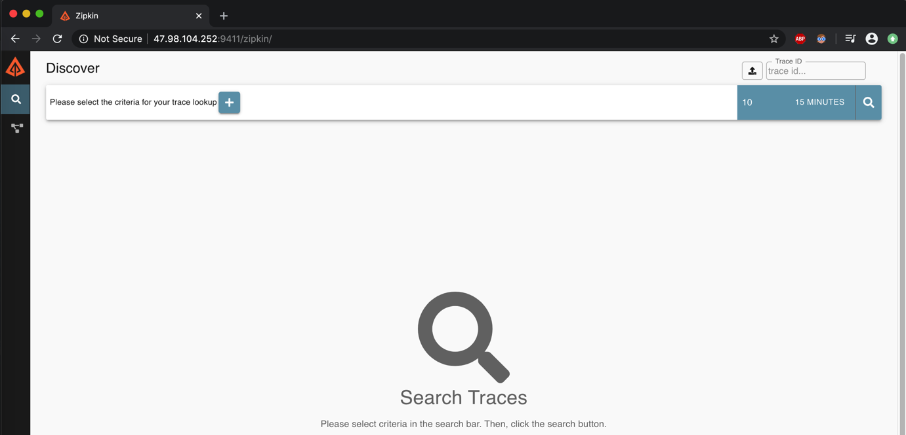
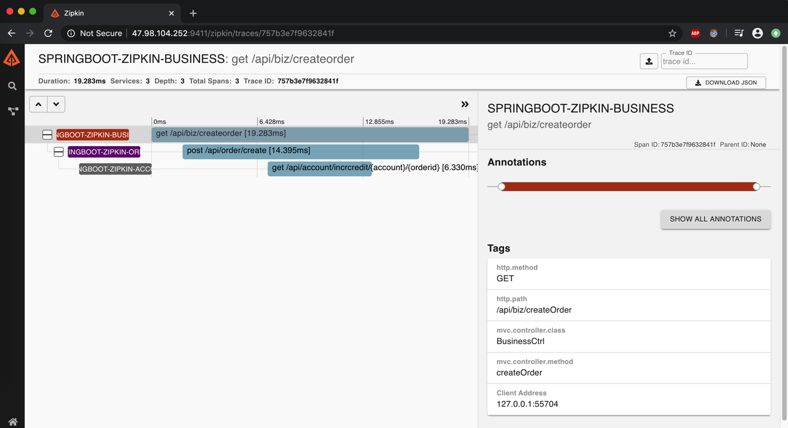
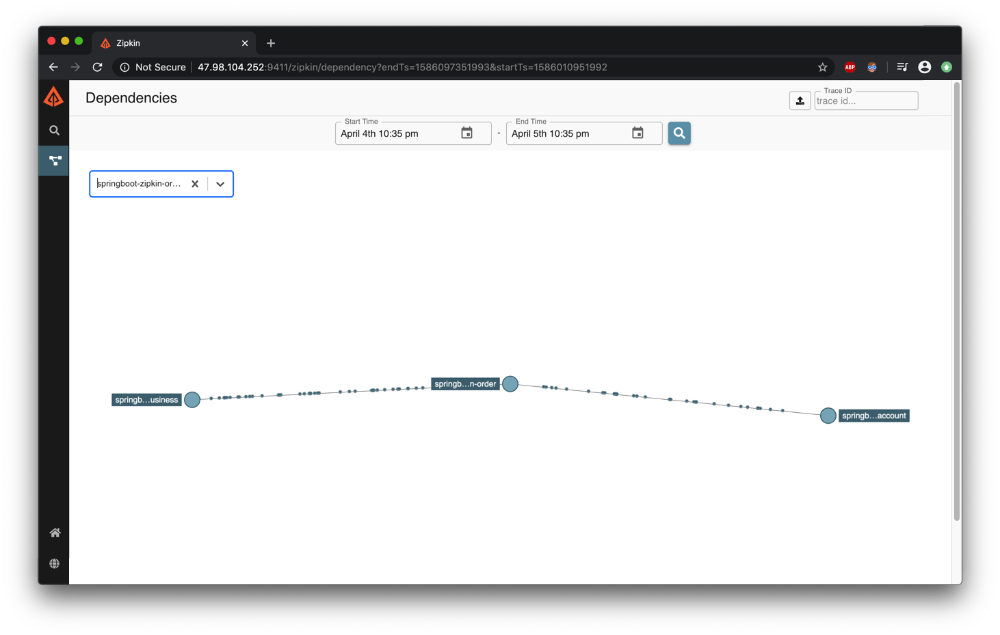

# Springboot zipkin

Q: 分布式的多个服务之间的调用链和日志该怎么处理呀?

A: zipkin,你值得拥有.详情请看 github 项目[springboot-zipkin link](https://github.com/cs12110/springboot-zipkin).

---

## 1. 基础知识

首先,要和 zipkin 混个脸熟.

### 1.1 基础概念

官网介绍

```
Zipkin is a distributed tracing system. It helps gather timing data needed to troubleshoot latency problems in service architectures. Features include both the collection and lookup of this data.

If you have a trace ID in a log file, you can jump directly to it. Otherwise, you can query based on attributes such as service, operation name, tags and duration. Some interesting data will be summarized for you, such as the percentage of time spent in a service, and whether or not operations failed.
```

[zipkin 基础知识博客 link](https://blog.csdn.net/liaokailin/article/details/52077620)

### 1.2 安装 zipkin

是的,首先要安装 zipkin.可以在 github 上下载`zipkin-server-2.21.0-exec.jar`到服务器上,并启动 zipkin 服务.

github 下载[zipkin link](https://github.com/openzipkin/zipkin)地址.

```sh
# root @ team-2 in /opt/soft/zipkin [21:50:45]
$ nohup java -jar zipkin-server-2.21.0-exec.jar &
```

使用端口号为默认的`9411`端口

```sh
# root @ team-2 in /opt/soft/zipkin [21:54:40] C:2
$ ps -ef |grep zipkin |grep -v 'grep'
root     14952 14610  0 14:01 pts/1    00:00:31 java -jar zipkin-server-2.21.0-exec.jar

# root @ team-2 in /opt/soft/zipkin [21:55:26]
$ netstat -lnp|grep 14952
tcp        0      0 0.0.0.0:9411            0.0.0.0:*               LISTEN      14952/java
```

启动之后,可以使用浏览器访问



---

## 2. Hello world

只记录重要的配置,详情请看 github 项目[springboot-zipkin link](https://github.com/cs12110/springboot-zipkin)

| 模块名称                   | 作用     | 备注 |
| -------------------------- | -------- | ---- |
| springboot-zipkin-business | 业务入口 | -    |
| springboot-zipkin-order    | 订单业务 | -    |
| springboot-zipkin-account  | 账户业务 | -    |
| springboot-zipkin-common   | 公共模块 | -    |

### 2.1 maven 依赖

```xml
<?xml version="1.0" encoding="UTF-8"?>
<project xmlns="http://maven.apache.org/POM/4.0.0"
         xmlns:xsi="http://www.w3.org/2001/XMLSchema-instance"
         xsi:schemaLocation="http://maven.apache.org/POM/4.0.0 http://maven.apache.org/xsd/maven-4.0.0.xsd">
    <modelVersion>4.0.0</modelVersion>

    <groupId>springboot-zipkin</groupId>
    <artifactId>springboot-zipkin</artifactId>
    <version>1.0-SNAPSHOT</version>
    <modules>
        <module>springboot-zipkin-business</module>
        <module>springboot-zipkin-order</module>
        <module>springboot-zipkin-common</module>
        <module>springboot-zipkin-account</module>
    </modules>
    <packaging>pom</packaging>

    <!-- spring boot -->
    <parent>
        <groupId>org.springframework.boot</groupId>
        <artifactId>spring-boot-starter-parent</artifactId>
        <version>2.0.4.RELEASE</version>
    </parent>

    <dependencyManagement>
        <dependencies>
            <dependency>
                <groupId>io.zipkin.brave</groupId>
                <artifactId>brave-bom</artifactId>
                <version>${brave.version}</version>
                <type>pom</type>
            </dependency>
        </dependencies>
    </dependencyManagement>

    <dependencies>

        <!-- boot env -->
        <dependency>
            <groupId>org.springframework.boot</groupId>
            <artifactId>spring-boot-starter</artifactId>
        </dependency>

        <!-- web env -->
        <dependency>
            <groupId>org.springframework.boot</groupId>
            <artifactId>spring-boot-starter-web</artifactId>
        </dependency>

        <!-- aspect -->
        <dependency>
            <groupId>org.springframework.boot</groupId>
            <artifactId>spring-boot-starter-aop</artifactId>
        </dependency>


        <!--- rookie env -->
        <dependency>
            <groupId>org.springframework.boot</groupId>
            <artifactId>spring-boot-starter-test</artifactId>
            <scope>test</scope>
        </dependency>

        <!-- view -->
        <dependency>
            <groupId>org.springframework.boot</groupId>
            <artifactId>spring-boot-starter-thymeleaf</artifactId>
        </dependency>


        <!-- log4j -->
        <dependency>
            <groupId>org.springframework.boot</groupId>
            <artifactId>spring-boot-starter-log4j2</artifactId>
        </dependency>


        <!-- fastjson -->
        <dependency>
            <groupId>com.alibaba</groupId>
            <artifactId>fastjson</artifactId>
            <version>1.2.30</version>
        </dependency>


        <!-- lombok -->
        <dependency>
            <groupId>org.projectlombok</groupId>
            <artifactId>lombok</artifactId>
            <version>1.18.4</version>
        </dependency>


        <dependency>
            <groupId>org.springframework.boot</groupId>
            <artifactId>spring-boot-starter-web</artifactId>
        </dependency>
        <dependency>
            <groupId>org.apache.httpcomponents</groupId>
            <artifactId>httpclient</artifactId>
        </dependency>

        <!-- Adds the MVC class and method names to server spans -->
        <dependency>
            <groupId>io.zipkin.brave</groupId>
            <artifactId>brave-instrumentation-spring-webmvc</artifactId>
            <version>5.10.1</version>
        </dependency>
        <!-- Instruments the underlying HttpClient requests that call the backend -->
        <dependency>
            <groupId>io.zipkin.brave</groupId>
            <artifactId>brave-instrumentation-httpclient</artifactId>
            <version>5.10.1</version>
        </dependency>

        <!-- Integrates so you can use log patterns like %X{traceId}/%X{spanId} -->
        <dependency>
            <groupId>io.zipkin.brave</groupId>
            <artifactId>brave-context-slf4j</artifactId>
            <version>5.10.1</version>
        </dependency>

        <!-- The below are needed to report traces to http://localhost:9411/api/v2/spans -->
        <dependency>
            <groupId>io.zipkin.brave</groupId>
            <artifactId>brave</artifactId>
            <version>5.10.1</version>
        </dependency>

        <dependency>
            <groupId>io.zipkin.reporter2</groupId>
            <artifactId>zipkin-sender-okhttp3</artifactId>
            <version>2.11.0</version>
        </dependency>

    </dependencies>
</project>
```

### 2.2 zipkin configuration

在需要使用 zipkin 的项目,添加 zipkin 配置如下:

```properties
# zipkin
zipkin.server-url=http://47.98.104.252:9411/
zipkin.service-name=${spring.application.name}
zipkin.connect-timeout=6000
zipkin.read-timeout=6000
```

#### 加载配置类

```java
package com.zipkin.common.conf.properties;

import lombok.Data;
import org.springframework.boot.context.properties.ConfigurationProperties;
import org.springframework.stereotype.Component;

/**
 * 加载zipkin配置
 *
 * <p>
 *
 * @author cs12110 create at 2020-04-05 15:00
 * <p>
 * @since 1.0.0
 */
@Data
@Component
@ConfigurationProperties(prefix = "zipkin")
public class ZipkinProperties {

    private String serviceName;
    private String serverUrl;
    private Integer connectTimeout;
    private Integer readTimeout;
}
```

#### 配置 zipkin

注意: **配置 zipkin 和 restTemplate 是最重要的一环.**

```java
package com.zipkin.common.conf;

import brave.CurrentSpanCustomizer;
import brave.SpanCustomizer;
import brave.Tracing;
import brave.context.slf4j.MDCScopeDecorator;
import brave.http.HttpTracing;
import brave.httpclient.TracingHttpClientBuilder;
import brave.propagation.B3Propagation;
import brave.propagation.ExtraFieldPropagation;
import brave.propagation.ThreadLocalCurrentTraceContext;
import brave.servlet.TracingFilter;
import brave.spring.webmvc.SpanCustomizingAsyncHandlerInterceptor;
import com.zipkin.common.conf.properties.ZipkinProperties;
import org.apache.http.impl.client.CloseableHttpClient;
import org.springframework.boot.web.client.RestTemplateBuilder;
import org.springframework.boot.web.client.RestTemplateCustomizer;
import org.springframework.context.annotation.Bean;
import org.springframework.context.annotation.Configuration;
import org.springframework.context.annotation.Import;
import org.springframework.http.client.HttpComponentsClientHttpRequestFactory;
import org.springframework.web.client.RestTemplate;
import org.springframework.web.servlet.config.annotation.InterceptorRegistry;
import org.springframework.web.servlet.config.annotation.WebMvcConfigurer;
import zipkin2.Span;
import zipkin2.reporter.AsyncReporter;
import zipkin2.reporter.Sender;
import zipkin2.reporter.okhttp3.OkHttpSender;

import javax.annotation.Resource;
import javax.servlet.Filter;

/**
 * <p>
 *
 * @author cs12110 create at 2020-04-05 15:00
 * <p>
 * @since 1.0.0
 */
@Configuration
@Import(SpanCustomizingAsyncHandlerInterceptor.class)
public class ZipkinConfiguration implements WebMvcConfigurer {

    @Resource
    private ZipkinProperties zipkinProperties;

    @Resource
    private SpanCustomizingAsyncHandlerInterceptor webMvcTracingCustomizer;


    /**
     * 配置怎么发送span到zipkin服务器
     */
    @Bean
    public Sender sender() {
        return OkHttpSender.create(zipkinProperties.getServerUrl() + "/api/v2/spans");
    }

    /**
     * Configuration for how to buffer spans into messages for Zipkin
     */
    @Bean
    public AsyncReporter<Span> spanReporter() {
        return AsyncReporter.create(sender());
    }

    /**
     * Controls aspects of tracing such as the service name that shows up in the UI
     */
    @Bean
    public Tracing tracing() {
        return Tracing.newBuilder()
                .localServiceName(zipkinProperties.getServiceName())
                .propagationFactory(ExtraFieldPropagation.newFactory(B3Propagation.FACTORY, "user-name"))
                .currentTraceContext(ThreadLocalCurrentTraceContext.newBuilder()
                        // puts trace IDs into logs
                        .addScopeDecorator(MDCScopeDecorator.create())
                        .build()
                )
                .spanReporter(spanReporter()).build();
    }

    /**
     * Allows someone to add tags to a span if a trace is in progress
     */
    @Bean
    public SpanCustomizer spanCustomizer(Tracing tracing) {
        return CurrentSpanCustomizer.create(tracing);
    }

    /**
     * Decides how to name and tag spans. By default they are named the same as the http method
     */
    @Bean
    public HttpTracing httpTracing(Tracing tracing) {
        return HttpTracing.create(tracing);
    }

    /**
     * Creates server spans for http requests
     */
    @Bean
    public Filter tracingFilter(HttpTracing httpTracing) {
        return TracingFilter.create(httpTracing);
    }

    @Bean
    public RestTemplateCustomizer useTracedHttpClient(HttpTracing httpTracing) {
        final CloseableHttpClient httpClient = TracingHttpClientBuilder.create(httpTracing).build();
        return (restTemplate) ->
                restTemplate.setRequestFactory(new HttpComponentsClientHttpRequestFactory(httpClient));
    }


    /**
     * Decorates server spans with application-defined web tags
     */
    @Override
    public void addInterceptors(InterceptorRegistry registry) {
        registry.addInterceptor(webMvcTracingCustomizer);
    }


    /**
     * 构建tempalte
     *
     * @param restTemplateBuilder template builder
     * @return RestTemplate
     */
    @Bean(name = "restTemplate")
    public RestTemplate createRestTemplate(RestTemplateBuilder restTemplateBuilder) {
        restTemplateBuilder.setConnectTimeout(zipkinProperties.getConnectTimeout());
        restTemplateBuilder.setReadTimeout(zipkinProperties.getReadTimeout());
        return restTemplateBuilder.build();
    }
}
```

### 2.3 logback.xml

logback 日志配置获取出来整一条链路调用的`traceId`.

```xml
<appender name="STDOUT" class="ch.qos.logback.core.ConsoleAppender">
    <encoder>
        <pattern>%d{yyyy-MM-dd HH:mm:ss} %-5level %logger{16}:%L [%X{traceId}] - %msg%n</pattern>
    </encoder>
</appender>
```

### 2.4 测试使用

请求业务接口

```sh
# mr3306 @ mr3306 in /opt/projects/java/springboot-zipkin on git:master o [22:26:00]
$ curl http://127.0.0.1:8080/api/biz/createOrder
{"status":1,"data":{"orderId":"O1586096903870","account":"cs12110","price":1024.0,"createTime":"2020-04-05T14:28:23.870+0000"},"list":null,"timestamp":1586096903878}
```

business 模块日志

```java
2020-04-05 22:29:06 INFO  c.z.b.s.BusinessService:46 [757b3e7f9632841f] - Function[createOrder] result:{"data":{"orderId":"O1586096946011","account":"cs12110","price":1024.0,"createTime":"2020-04-05T14:29:06.011+0000"},"status":1,"timestamp":1586096946016}
```

order 模块日志

```java
2020-04-05 22:29:06 INFO  c.z.o.s.OrderService:39 [757b3e7f9632841f] - Function[create] order:{"account":"cs12110","createTime":1586096946011,"orderId":"O1586096946011","price":1024.0}
2020-04-05 22:29:06 INFO  c.z.o.s.OrderService:45 [757b3e7f9632841f] - Function[create] account result:{"status":1,"data":"账号:cs12110 订单:O1586096946011 增加积分","list":null,"timestamp":1586096946022}
```

account 模块日志

```java
2020-04-05 22:29:06 INFO  c.z.a.s.AccountService:28 [757b3e7f9632841f] - Function[incrCredit] incr result:{"data":"账号:cs12110 订单:O1586096946011 增加积分","status":1,"timestamp":1586096946022}
```

zipkin 页面调用结果:



模块依赖如下:



结论: `调用链和traceId都正常,可以追踪到链路调用. 一脸满足.jpg`

---

## 3. 参考资料

a. [zipkin 官网](https://zipkin.io/)

b. [zipkin 官方 demo](https://github.com/openzipkin/brave-webmvc-example)
