# 微服务初探

摘录于网上,请知悉.

Spring cloud教程 [link](https://blog.csdn.net/forezp/article/details/69696915)


## 1. 什么是微服务?

微服务是一种架构风格,一个大型复杂软件应用由一个或多个微服务组成.系统中的各个微服务可被独立部署,各个微服务之间是松耦合的.每个微服务仅关注于完成一件任务并很好地完成该任务.在所有情况下,每个任务代表着一个小的业务能力.

 

### 1.1 为什么需要微服务?

在传统的IT行业软件大多都是各种独立系统的堆砌,这些系统的问题总结来说就是扩展性差,可靠性不高,维护成本高.到后面引入了SOA服务化,但是,由于 SOA 早期均使用了总线模式,这种总线模式是与某种技术栈强绑定的,比如:J2EE.这导致很多企业的遗留系统很难对接,切换时间太长,成本太高,新系统稳定性的收敛也需要一些时间.最终 SOA 看起来很美,但却成为了企业级奢侈品,中小公司都望而生畏.

早期系统比较多是使用单体架构的,单体架构存在什么问题呢?

- 复杂性逐渐变高

- 技术债务逐渐上升

- 部署速度逐渐变慢

- 阻碍技术创新

- 无法按需伸缩

 

### 1.2 微服务与单体架构区别

1. 单体架构所有的模块全都耦合在一块,代码量大,维护困难,微服务每个模块就相当于一个单独的项目,代码量明显减少,遇到问题也相对来说比较好解决.

2. 单体架构所有的模块都共用一个数据库,存储方式比较单一,微服务每个模块都可以使用不同的存储方式(比如有的用redis,有的用mysql等),数据库也是单个模块对应自己的数据库.


3. 单体架构所有的模块开发所使用的技术一样,微服务每个模块都可以使用不同的开发技术,开发模式更灵活


### 1.3 微服务的优缺点

优点:
- 易于开发和维护.
- 启动较快.
- 局部修改容易部署.
- 技术栈不受限.
- 按需伸缩.

 

缺点:

- 运维要求较高,对于单体架构来讲,我们只需要维护好这一个项目就可以了,但是对于微服务架构来讲,由于项目是由多个微服务构成的,每个模块出现问题都会造成整个项目运行出现异常,想要知道是哪个模块造成的问题往往是不容易的,因为我们无法一步一步通过debug的方式来跟踪,这就对运维人员提出了很高的要求.

- 分布式的复杂性,对于单体架构来讲,我们可以不使用分布式,但是对于微服务架构来说,分布式几乎是必会用的技术,由于分布式本身的复杂性,导致微服务架构也变得复杂起来.

- 接口调整成本高,比如,用户微服务是要被订单微服务和电影微服务所调用的,一旦用户微服务的接口发生大的变动,那么所有依赖它的微服务都要做相应的调整,由于微服务可能非常多,那么调整接口所造成的成本将会明显提高.

- 重复劳动,对于单体架构来讲,如果某段业务被多个模块所共同使用,我们便可以抽象成一个工具类,被所有模块直接调用,但是微服务却无法这样做,因为这个微服务的工具类是不能被其它微服务所直接调用的,从而我们便不得不在每个微服务上都建这么一个工具类,从而导致代码的重复.


### 1.4 什么样的项目适合微服务

微服务可以按照业务功能本身的独立性来划分,如果系统提供的业务是非常底层的,如:操作系统内核,存储系统,网络系统,数据库系统等等,这类系统都偏底层,功能和功能之间有着紧密的配合关系,如果强制拆分为较小的服务单元,会让集成工作量急剧上升,并且这种人为的切割无法带来业务上的真正的隔离,所以无法做到独立部署和运行,也就不适合做成微服务了.

简单来说,能不能做成微服务,取决于四个要素:

- 小:微服务体积小.
- 独:能够独立的部署和运行.
- 轻:使用轻量级的通信机制和架构.
- 松:为服务之间是松耦合的.


---


## 2. Spring cloud初窥

Spring cloud 的中文网是这样说的:`微服务架构集大成者,云计算最佳业务实践`.

Spring Cloud是一系列框架的有序集合.它利用Spring Boot的开发便利性巧妙地简化了分布式系统基础设施的开发,如服务发现注册,配置中心,消息总线,负载均衡,断路器,数据监控等,都可以用Spring Boot的开发风格做到一键启动和部署.Spring Cloud并没有重复制造轮子,它只是将目前各家公司开发的比较成熟,经得起实际考验的服务框架组合起来,通过Spring Boot风格进行再封装屏蔽掉了复杂的配置和实现原理,最终给开发者留出了一套简单易懂,易部署和易维护的分布式系统开发工具包.

在介绍Spring Cloud 全家桶之前,首先要介绍一下Netflix ,Netflix 是一个很伟大的公司,在Spring Cloud项目中占着重要的作用,Netflix 公司提供了包括Eureka,Hystrix,Zuul,Archaius等在内的很多组件,在微服务架构中至关重要,Spring在Netflix 的基础上,封装了一系列的组件,命名为:Spring Cloud Eureka,Spring Cloud Hystrix,Spring Cloud Zuul等,下面对各个组件进行分别介绍:

### 2.1 Eureka

微服务的本质还是各种API接口的调用,那么怎么产生这些接口,产生了这些接口之后如何调用呢? 如何管理呢?

答案就是`Spring Cloud Eureka`,我们可以将自己定义的API 接口注册到Spring Cloud Eureka上,`Eureka负责服务的注册与发现`.

如果学习过Zookeeper的话,就可以很好的理解,Eureka的角色和 Zookeeper的角色差不多,都是服务的注册和发现,构成Eureka体系的包括:`服务注册中心`,`服务提供者`,`服务消费者`.

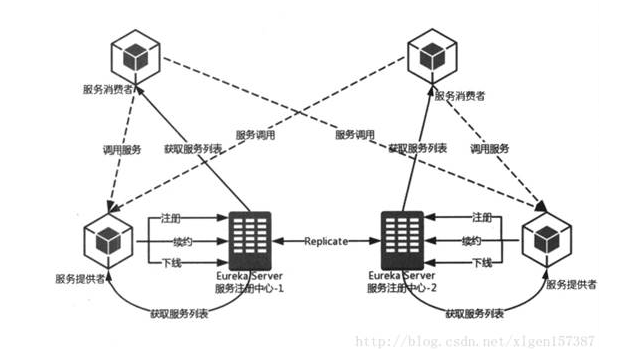

上图中描述了:

1. 两台Eureka服务注册中心构成的服务注册中心的主从复制集群.


2. 然后服务提供者向注册中心进行注册,续约,下线服务等.


3. 服务消费者向Eureka注册中心拉取服务列表并维护在本地(这也是客户端发现模式的机制体现).


4. 然后服务消费者根据从Eureka服务注册中心获取的服务列表选取一个服务提供者进行消费服务.


### 2.2 Ribbon

`Eureka`描述了服务如何进行注册,注册到哪里,服务消费者如何获取服务生产者的服务信息,但是Eureka只维护了服务生产者,注册中心,服务消费者三者之间的关系,真正的服务消费者调用服务生产者提供的数据是通过`Spring Cloud Ribbon`来实现的.


在`2.1`中提到了服务消费者是将服务从注册中心获取服务生产者的服务列表并维护在本地的,这种客户端发现模式的方式是服务消费者选择合适的节点进行访问服务生产者提供的数据,这种选择合适节点的过程就是Spring Cloud Ribbon完成的.

**Spring Cloud Ribbon客户端负载均衡器由此而来.**


### 2.3 Hystrix

在`2.1`,`2.2`中知道了使用Eureka进行服务的注册和发现,使用Ribbon实现服务的负载均衡调用.这些还不足以实现一个高可用的微服务架构.

例如:当有一个服务出现了故障,而服务的调用方不知道服务出现故障,若此时调用的请求不断的增加,最后就会等待出现故障,相应形成任务的积压,最终导致自身服务的瘫痪.

Spring Cloud Hystrix正是为了解决这种情况的,防止对某一故障服务持续进行访问.Hystrix的含义是:断路器,断路器本身是一种开关装置,用于我们家庭的电路保护,防止电流的过载,当线路中有电器发生短路的时候,断路器能够及时切换故障的电器,防止发生过载,发热甚至起火等严重后果.

 

### 2.4 Feign

通过以上,我们了解到如何通过Spring Cloud ribbon进行负责均衡,如何通过Spring Cloud Hystrix进行服务断路保护?

两者作为基础工具类框架应用在各种基础设施类微服务和业务类微服务中,并且成对存在,那么有没有更高层的封装,将两者的使用进一步简化呢? 

有! 他就是Spring Cloud Feign.它基于Netflix Feign实现,整合了`Spring Cloud Ribbon`和`Spring Cloud Hystrix`.

简单的可以理解为: **Spring Cloud Feign 的出现使得Eureka和Ribbon的使用更为简单.**

 

### 2.5 Config

对于微服务还不是很多的时候,各种服务的配置管理起来还相对简单,但是当成百上千的微服务节点起来的时候,服务配置的管理变得会复杂起来.

分布式系统中,由于服务数量巨多,为了方便服务配置文件统一管理,实时更新,所以需要分布式配置中心组件.在Spring Cloud中,有分布式配置中心组件Spring Cloud Config ,它支持配置服务放在配置服务的内存中(即本地),也支持放在远程Git仓库中.在Spring Cloud Config 组件中,分两个角色,一是Config Server,二是Config Client.

Config Server用于配置属性的存储,存储的位置可以为Git仓库,SVN仓库,本地文件等,Config Client用于服务属性的读取.

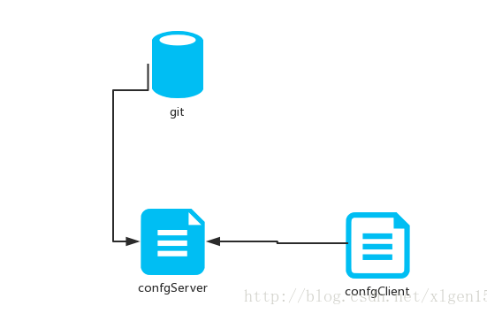

### 2.6 Zuul

我们使用Spring Cloud Netflix中的Eureka实现了服务注册中心以及服务注册与发现;而服务间通过Ribbon或Feign实现服务的消费以及均衡负载;通过Spring Cloud Config实现了应用多环境的外部化配置以及版本管理.为了使得服务集群更为健壮,使用Hystrix的融断机制来避免在微服务架构中个别服务出现异常时引起的故障蔓延.

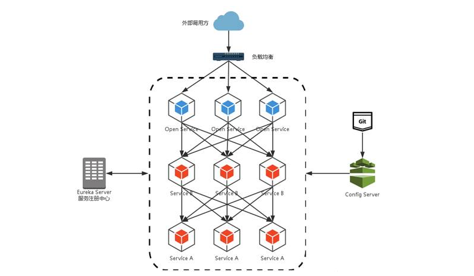

先来说说这样架构需要做的一些事儿以及存在的不足:

1. 首先,破坏了服务无状态特点.为了保证对外服务的安全性,我们需要实现对服务访问的权限控制,而开放服务的权限控制机制将会贯穿并污染整个开放服务的业务逻辑,这会带来的最直接问题是,破坏了服务集群中REST API无状态的特点.从具体开发和测试的角度来说,在工作中除了要考虑实际的业务逻辑之外,还需要额外可续对接口访问的控制处理.


2. 其次,无法直接复用既有接口.当我们需要对一个即有的集群内访问接口,实现外部服务访问时,我们不得不通过在原有接口上增加校验逻辑,或增加一个代理调用来实现权限控制,无法直接复用原有的接口. 

面对类似上面的问题,我们要如何解决呢?下面进入关键组件:服务网关.

服务网关是微服务架构中一个不可或缺的部分.通过服务网关统一向外系统提供REST API的过程中,除了具备服务路由,均衡负载功能之外,它还具备了权限控制等功能.Spring Cloud Netflix中的Zuul就担任了这样的一个角色,为微服务架构提供了前门保护的作用,同时将权限控制这些较重的非业务逻辑内容迁移到服务路由层面,使得服务集群主体能够具备更高的可复用性和可测试性.


### 2.7 Bus

在`2.5`Spring Cloud Config中,我们知道的配置文件可以通过Config Server存储到Git等地方,通过Config Client进行读取,但是我们的配置文件不可能是一直不变的,当我们的配置文件发生变化的时候如何进行更新呢?

一种最简单的方式重启一下Config Client进行重新获取,但Spring Cloud绝对不会让你这样做的,Spring Cloud Bus正是提供一种操作使得我们在不关闭服务的情况下更新我们的配置.

Spring Cloud Bus官方意义:消息总线.

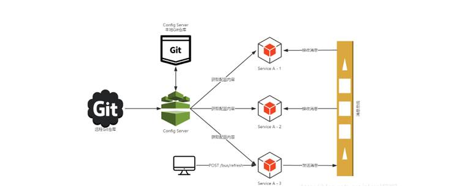

因为我们引入了消息总线,所以Config Server和Config Client都连接到了RabbitMQ队列当中.

当Config Server启动的时候,它会向git仓库拿到配置信息.

而当Config Client启动的时候,会向Config Server拿配置信息.

而我们修改git仓库的时候,服务客户端是无法刷新配置信息的.

当我们向Config Server的/bus/refresh中发送POST请求时,此时,Config Server会将这个刷新请求发送到消息总线中,当我们的客户端从消息总线中获取到刷新请求的时候,就会重新从Config Server中获取配置信息.

这样子,其实我们还是没有达到目的,虽然配置的刷新变得很快了,但是我们依然没有达到只需要修改git仓库,所有服务就自动刷新的这么一件事,我们还需要向Config Server发送POST请求呢.

这个时候,我们可以通过远程仓库的webhook来达到目的.webhook有什么用呢?

webhook会在我们向仓库发送push请求的时候,对指定的url发送一个POST请求.这下就懂了吧.当我们向配置中心的配置仓库发送push请求,他就会向我们的Config Server的/bus/refresh发送一个POST请求,那么就达到了服务刷新的目的了.


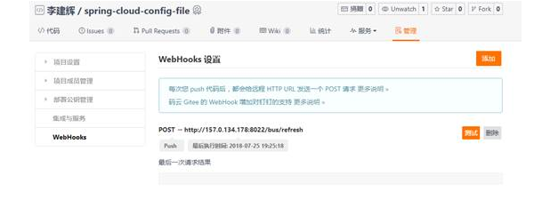

 

### 2.8 sleuth

微服务架构是一种分布式架构,微服务系统按照业务划分服务单元,一个微服务往往会有很多个服务单元,一个请求往往会有很多个单元参与,一旦请求出现异常,想要去定位问题点真心不容易,因此需要有个东西去跟踪请求链路,记录一个请求都调用了哪些服务单元,调用顺序是怎么样的以及在各个服务单元处理的时间长短.常见的服务链路追踪组件有google的dapper,twitter的zipkin,阿里的鹰眼等,它们都是出众的开源链路追踪组件.

 

spring cloud 有自己的组件来集成这些开源组件,它就是spring cloud sleuth,它为服务链路追踪提供了一套完整的解决方案.

spring cloud sleuth整合zipkin进行服务链路追踪, zipkin分服务端和客户端, 客户端就是我们的服务单元,用来发送链路信息到服务端; 服务端用来接收客户端发送来的链路信息,并进行处理,它包括4个部分:

1. Collector组件:用来接收客户端发送的链路信息然后整理成zipkin能处理的格式,供后续存储或向外部提供查询使用.
2. Storage组件:对链路信息进行保存,默认存储在内存,通过配置还可以保存到mysql等地方.
3. Restful API组件:对其他服务单元提供api接口进行查询链路信息.
4. Web UI组件:调用API 组件的接口并将信息显示到web 画面.

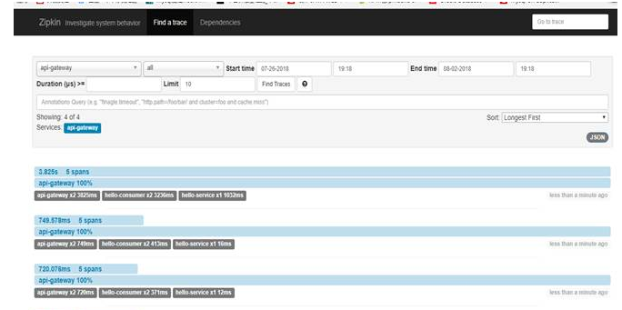

能看到请求都经历了哪些服务节点.再点相关link,可以查看调用顺序,并且还能看到在各个服务节点的处理的时间长度.

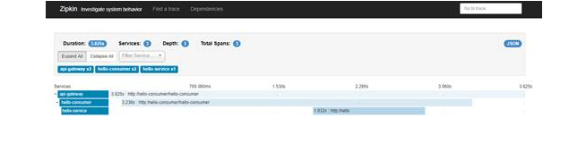

切换到依赖画面,能查看服务节点的依赖关系

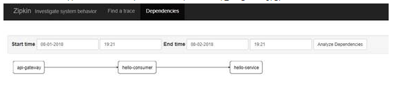

---

## 3. 项目流程图

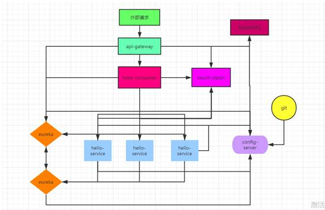

- euraka:注册中心主从复制集群.

- api-gateway:服务网关

- hello-consumer:服务消费者

- hello-service :服务提供者

- config-server:服务配置中心

- sleuth-zipkin:服务链路追踪


------


# 微服务再探

本章节讲述spring cloud的使用和相关注意事项.


## 1. 系统架构

### 1.1 整体应用架构

* 整体应用架构:一个完整应用程序构建成一个单独的单元.企业级应用通常被构建成三个主要部分:客户端用户界面(由运行在客户机器上的浏览器的 HTML 页面,Javascript 组成),数据库,服务端应用.服务端应用处理HTTP 请求,执行业务逻辑,检索并更新数据库中的数据,使用适当的 HTML 视图发送给浏览器.服务端应用是完整的 ,是一个单独的的逻辑执行.任何对系统的改变都涉及到重新构建和部署一个新版本的服务端应用程序.


* 整体应用程序相当成功,但是越来越多的人感觉到有点不妥.在部署时,变更发布周期被绑定了——只是变更应用程序的一小部分,却要求整个重新构建和部署.随着时间的推移,很难再保持一个好的模块化结构,使得一个模块的变更很难不影响到其它模块.扩展就需要整个应用程序的扩展,而不能进行部分扩展.

 

### 1.2 微服务架构

微服务架构风格,就像是把一个单独的应用程序开发为一套小服务,每个小服务运行在自己的进程中,并使用轻量级机制通信,通常是 HTTP API.这些服务围绕业务能力来构建,并通过完全自动化部署机制来独立部署.这些服务使用不同的编程语言书写,以及不同数据存储技术,并保持最低限度的集中式管理.

 

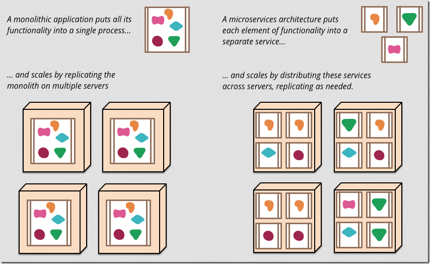

 


---


## 2. Spring Cloud

spring cloud是一系列框架的有序集合.它利用Spring Boot的开发便利性巧妙地简化了分布式系统基础设施的开发,如服务发现注册,配置中心,消息总线,负载均衡,断路器,数据监控等,都可以用spring boot的开发风格做到一键启动和部署.Spring Cloud并没有重复制造轮子,它只是将目前各家公司开发的比较成熟,经得起实际考验的服务框架组合起来,通过spring boot风格进行再封装屏蔽掉了复杂的配置和实现原理,最终给开发者留出了一套简单易懂,易部署和易维护的分布式系统开发工具包.

 

### 2.1 服务注册与发现[eureka]

#### 2.1.1 创建注册中心

**添加依赖**

```xml
<dependency>
<groupId>org.springframework.cloud</groupId>
<artifactId>spring-cloud-starter-eureka-server</artifactId>
</dependency>
```

**添加注解**

```java
@SpringBootApplication
@EnableEurekaServer
public class EurekaServer {
 public static void main(String[] args) {
  	SpringApplication.run(EurekaServer.class, args);
 }
}
```

**访问**

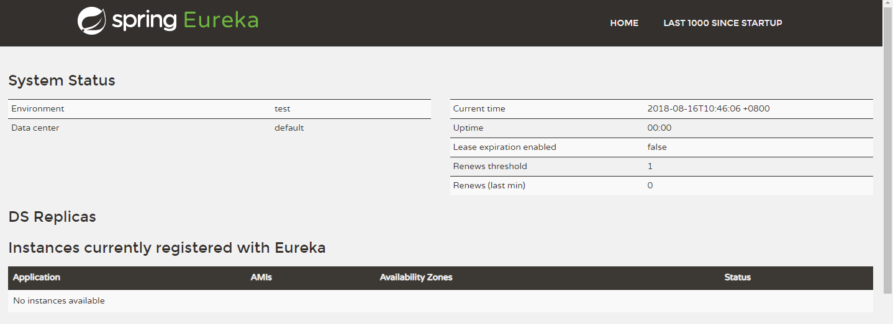


#### 2.1.2 创建服务提供者

**添加依赖**

```xml
<dependency>
 <groupId>org.springframework.cloud</groupId>
 <artifactId>spring-cloud-starter-eureka</artifactId>
</dependency>
```

**指定注册中心**

```yml
eureka:
  client:
 	service-url:
		defaultZone: http://127.0.0.1:1001/eureka
```

**添加注解**

```java
@SpringBootApplication
@EnableEurekaClient
@EnableDiscoveryClient
public class EurekaService {

 public static void main(String[] args) {
  	SpringApplication.run(EurekaService.class, args);
 }
}
```

**编写controller**

```java
@Controller
public class HelloController {
 @RequestMapping("/hello")
 @ResponseBody
 public String hello () {
  return "hello";
 }
}
```

**访问注册中心**

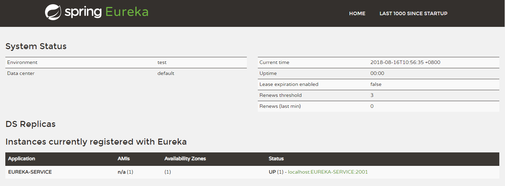


#### 2.1.3 高可用注册中心

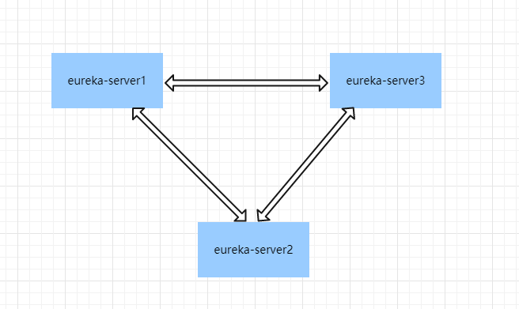

**eureka-server1 配置 eureka-server2 和 eureka-server3 地址,eureka-server2 和 eureka-server3 同理**

```yml
eureka:
  client:
    service-url:
       defaultZone: http://eureka-server2:1002/eureka/,http://eureka-server3:1003/eureka/
```

**启动三个实例后,访问eureka-server1 可见 eureka-server2 和 eureka-server3 在 available-replicas 中**

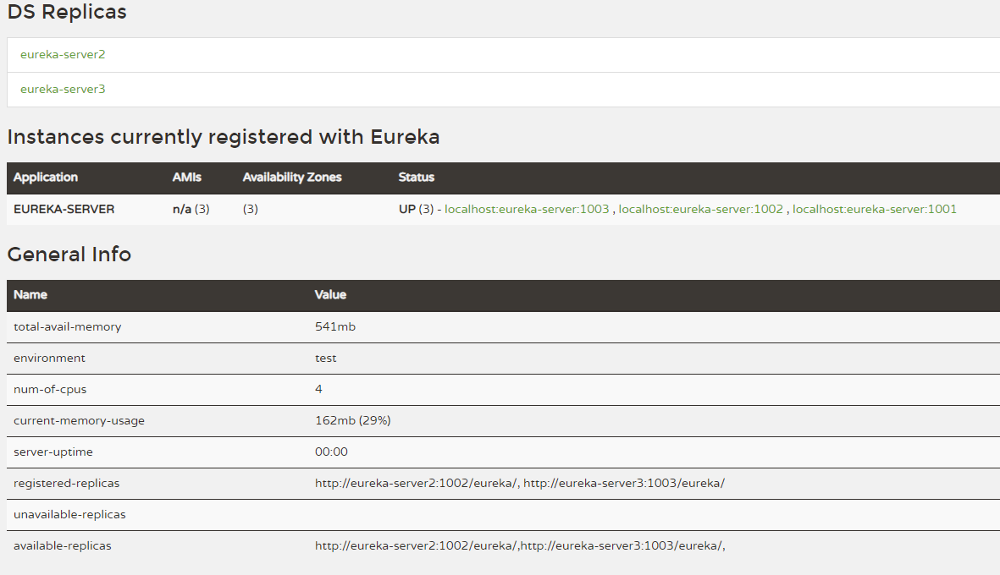

#### 2.1.4 服务提供者注册

**配置集群**
```yml
eureka:
  client:
 	service-url:
		defaultZone: http://eureka-server1:1001/eureka/,http://eureka-server2:1002/eureka/,http://eureka-server3:1003/eureka/
```


**启动服务提供者后三个 eureka 实例出现如下注册信息,说明服务已注册到集群中**


```java
eureka-server1
Registered instance EUREKA-SERVICE/localhost:EUREKA-SERVICE:2001 with status UP (replication=true)
eureka-server2
Registered instance EUREKA-SERVICE/localhost:EUREKA-SERVICE:2001 with status UP (replication=true)
eureka-server3
Registered instance EUREKA-SERVICE/localhost:EUREKA-SERVICE:2001 with status UP (replication=false)
```


### 2.2 服务消费[ribbon/feign]

 

####  2.2.1 ribbon示例

**添加依赖**

```xml
<dependency>
 <groupId>org.springframework.cloud</groupId>
 <artifactId>spring-cloud-starter-eureka</artifactId>
</dependency>
 <dependency>
 <groupId>org.springframework.cloud</groupId>
 <artifactId>spring-cloud-starter-ribbon</artifactId>
</dependency>
```

**配置注册中心**

```yml
eureka:
  client:
    service-url:
		defaultZone: http://127.0.0.1:1001/eureka
```

**添加注解**

```java
@SpringBootApplication
@EnableDiscoveryClient
public class EurekaRibbon {
 public static void main(String[] args) {
 	SpringApplication.run(EurekaRibbon.class, args);
 }
}
```

**编写controller**

```java
@Controller

public class HelloApi {
 @Autowired
 private RestTemplate restTemplate;

 @RequestMapping("/api/hello")
 @ResponseBody
 public String hello() {
	return restTemplate.getForObject("http://EUREKA-SERVICE/hello", String.class);
 }
}
```


**启动消费者**

启动后访问:`http://localhost:3002/api/hello`

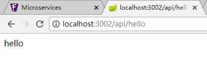


**实现负载均衡及指定算法**

```java
@Configuration
public class RibbonConfig {

 @Bean
 @LoadBalanced
 public RestTemplate restTemplate() {
      return new RestTemplate();
 }

 @Bean
 public IRule rule() {
  // return new RoundRobinRule();
  return new RandomRule();
 }
}
```


#### 2.2.2 Feign示例

**添加依赖**

```xml
<dependency>
 <groupId>org.springframework.cloud</groupId>
 <artifactId>spring-cloud-starter-eureka</artifactId>
</dependency>
<dependency>
 <groupId>org.springframework.cloud</groupId>
 <artifactId>spring-cloud-starter-feign</artifactId>
</dependency>
```


**配置注册中心**

```yml
eureka:
  client:
     service-url:
         defaultZone: http://127.0.0.1:1001/eureka
```


**添加注解**

```java
@SpringBootApplication
@EnableDiscoveryClient
@EnableFeignClients
public class EurekaFeign {

 public static void main(String[] args) {
  SpringApplication.run(EurekaFeign.class, args);
 }
}
```


**编写client**
```java
@FeignClient("EUREKA-SERVICE")
public interface HelloClient {

 @RequestMapping("/hello")
 @ResponseBody
 String hello ();
}
```


**编写controller**

```java
@Controller
public class HelloApi {

 @Autowired
 private HelloClient helloClient;
 @RequestMapping("/api/hello")
 @ResponseBody

 public String hello() {
  return helloClient.hello();
 }
}
```


**启动消费者**

访问:`http://localhost:3003/api/hello`

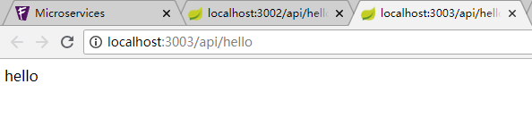


### 2.3 断路器[hystrix]

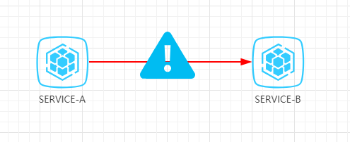

#### 2.3.1 代码

**添加依赖**

```xml
<dependency>
 <groupId>org.springframework.cloud</groupId>
 <artifactId>spring-cloud-starter-eureka</artifactId>
</dependency>
<dependency>
 <groupId>org.springframework.cloud</groupId>
 <artifactId>spring-cloud-starter-ribbon</artifactId>
</dependency>
<dependency>
 <groupId>org.springframework.cloud</groupId>
 <artifactId>spring-cloud-starter-hystrix</artifactId>
</dependency>
```


**配置注册中心**

```yml
eureka:
  client:
 service-url:
    defaultZone: http://127.0.0.1:1001/eureka
```


**添加注解**

```java
@SpringBootApplication
@EnableDiscoveryClient
@EnableCircuitBreaker
public class EurekaRibbonHystrix {
 public static void main(String[] args) {
  SpringApplication.run(EurekaRibbonHystrix.class, args);
 }
}
```


**编写controller**

```java
@Controller

public class HelloApi {

 @Autowired
 private RestTemplate restTemplate;
 @RequestMapping("/api/hello")
 @ResponseBody
 @HystrixCommand(fallbackMethod = "helloFallback")
 public String hello() {
  return restTemplate.getForObject("http://EUREKA-SERVICE/hello", String.class);
 }
 public String helloFallback() {
  return "helloFallback";
 }
}
```


**启动**

启动后访问: `http://localhost:3004/api/hello`

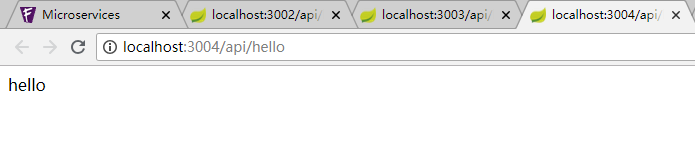

在服务提供者中添加sleep后再次访问在服务提供者中添加sleep后再次访问:`http://localhost:3004/api/hello`

```java
@Controller
public class HelloController {
 @RequestMapping("/hello")
 @ResponseBody
 public String hello () throws InterruptedException {
  Thread.sleep(10000);
  return "hello";
 }
}
```


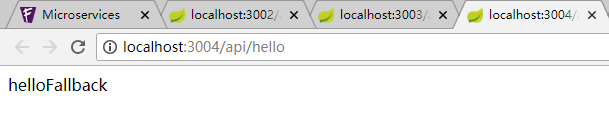

##### 2.3.2 Hystrix 参数

| 参数                                                                     | 描述                                           | 默认值 |
| ------------------------------------------------------------------------ | ---------------------------------------------- | ------ |
| hystrix.command.default.execution.isolation.thread.timeoutInMilliseconds | 超时时间.                                      | 1000ms |
| hystrix.command.default.circuitBreaker.requestVolumeThreshold            | 当在配置时间窗口内达到此数量的失败后,进行短路. | 20个   |
| hystrix.command.default.circuitBreaker.errorThresholdPercentage          | 出错百分比阈值,当达到此阈值后,开始短路.        | 50%    |
| hystrix.command.default.circuitBreaker.sleepWindowInMilliseconds         | 短路多久以后开始尝试是否恢复.                  | 5s     |


### 2.4 服务网关[zuul]

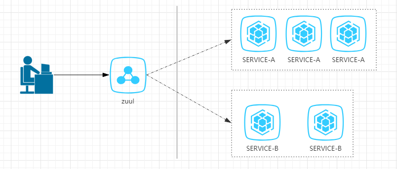

 

##### 2.4.1 代码

**添加依赖**

```xml
<dependency>
 <groupId>org.springframework.cloud</groupId>
 <artifactId>spring-cloud-starter-eureka</artifactId>
</dependency>
<dependency>
 <groupId>org.springframework.cloud</groupId>
 <artifactId>spring-cloud-starter-zuul</artifactId>
</dependency>
```


**配置注册中心**

```yml
eureka:
  client:
  service-url:
       defaultZone: http://127.0.0.1:1001/eureka
```


**添加注解**

```java
@SpringBootApplication
@EnableEurekaClient
@EnableZuulProxy
public class EurekaZuul {

 public static void main(String[] args) {
 	SpringApplication.run(EurekaZuul.class, args);
 }
}
```


**启动**

启动后访问:`http://localhost:1011/eureka-service/hello`

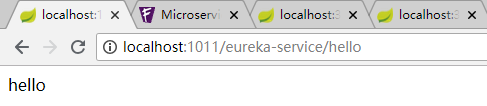

##### 2.4.2 Filter

```java
@Component

public class TokenFilter extends ZuulFilter {
 @Override
 public String filterType() {
  return "pre";
 }


 @Override
 public int filterOrder() {
  return 0;
 }

 @Override
 public boolean shouldFilter() {
  return true;
 }

 @Override
 public Object run() {
  RequestContext requestContext = RequestContext.getCurrentContext();
  HttpServletRequest request = requestContext.getRequest();
  String token = request.getParameter("token");
  if (StringUtils.isEmpty(token)) {
    requestContext.setSendZuulResponse(false);
    requestContext.setResponseStatusCode(403);
  }
  return null;
 }
}
```

重行启动后访问:`http://localhost:1011/eureka-service/hello`

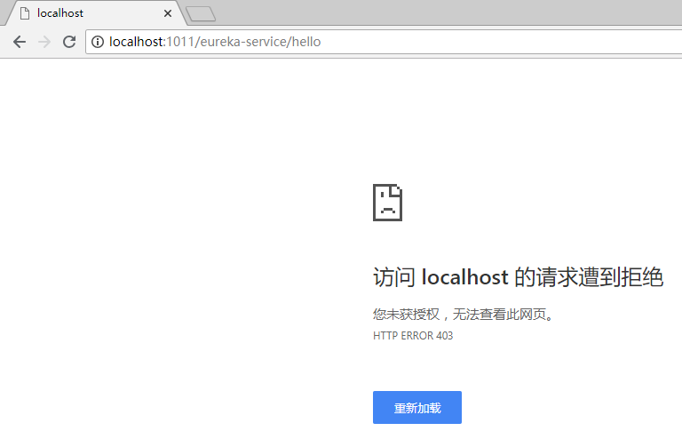

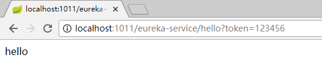


### 2.5 分布式配置中心[spring cloud config]

#### 2.5.1 git仓库

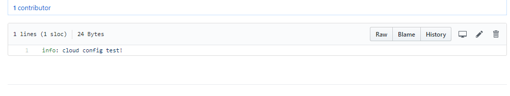

#### 2.5.2 构建配置中心

**添加依赖**

```xml
<dependency>
 <groupId>org.springframework.cloud</groupId>
 <artifactId>spring-cloud-config-server</artifactId>
</dependency>
```


**配置git仓库**

```yml
server:
  port: 6001
spring:
  cloud:
    config:
      server:
        git:
          uri: xxx
```


**添加注解**

```java
@SpringBootApplication
@EnableConfigServer
public class ConfigServerApp {
 public static void main(String[] args) {
  SpringApplication.run(ConfigServerApp.class, args);
 }
}
```


#### 2.5.6 构建客户端

**添加依赖**

```xml
<dependency>
 <groupId>org.springframework.boot</groupId>
 <artifactId>spring-boot-starter-web</artifactId>
</dependency>
<dependency>
 <groupId>org.springframework.cloud</groupId>
 <artifactId>spring-cloud-starter-config</artifactId>
</dependency>
```


**指定配置服务器地址**

```yml
clientinfo: ${info}
server:
  port: 6002
spring:
  cloud:
   config:
     uri: http://localhost:6001/
```


**编写controller**

```java
@Controller
public class InfoController {

 @Value("${clientinfo}")
 private String info;

 @GetMapping("/config/info")
 @ResponseBody
 public String getInfo() {
  return info;
 }
}
```


**启动类**

```java
@SpringBootApplication
public class ConfigClientApp {
 public static void main(String[] args) {
 	SpringApplication.run(ConfigClientApp.class, args);
 }
}
```

启动后访问:`http://localhost:6002/config/info`


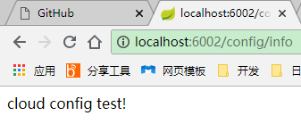