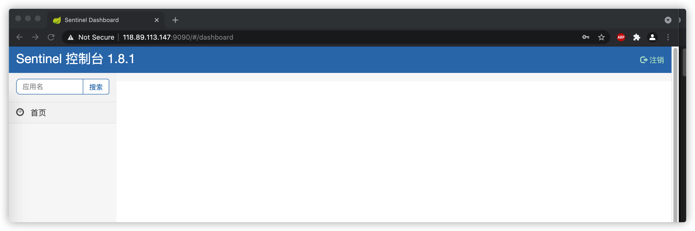

# Springcloud sentinel

sentinel[ˈsentɪnl]: 哨兵,守卫系统的 bodyguard. 笑哭脸.jpg

---

## 1. sentinel 管理端

如果部署在云服务器上,因为 sentinel 是连接回本地内网会出现问题,所以使用本地测试,请知悉.

<u><span style="color:red">在使用默认的配置时,sentinel 不具备持久化</span></u>,当客户端重启的时候,配置的规则全部丢失. 摊手.jpg

### 1.1 安装部署

[springcloud sentinel releases link](https://github.com/alibaba/Sentinel/releases)

```sh
# 下载web管理端
# root @ team3 in /opt/soft/projects/springcloud-sentinel [9:21:07]
$ wget https://github.com/alibaba/Sentinel/releases/download/1.8.1/sentinel-dashboard-1.8.1.jar

# 编写启动脚本和开放相应端口
# root @ team3 in /opt/soft/projects/springcloud-sentinel [9:27:45]
$ vim start-sentinel-dashboard.sh
#!/bin/sh

echo -e '\n--- Startup sentinel ---'

port=9090

java -Dserver.port=$port -Dcsp.sentinel.dashboard.server=127.0.0.1:$port -Dproject.name=sentinel-dashboard -jar sentinel-dashboard-1.8.1.jar

echo -e '\n--- Finish startup ---'

# 开启端口
# root @ team3 in /opt/soft/projects/springcloud-sentinel [9:32:39] C:2
$ firewall-cmd --add-port=9090/tcp --zone=public --permanent
success
# root @ team3 in /opt/soft/projects/springcloud-sentinel [9:32:48]
$ firewall-cmd --reload
success

# root @ team3 in /opt/soft/projects/springcloud-sentinel [9:34:59]
$ chmod +x start-sentinel-dashboard.sh

```

### 1.2 web 使用

默认用户名称: sentinel,
默认用户密码: sentinel



---

## 2. 项目使用

### 2.1 基础知识

在 sentinel 的熔断降级里面,有两个很重要的东西: `fallback(应急)`和`blockHandler(阻止)`.

Q: 那么我们该怎么区分这两个东西呀?

A: <u>fallback 是在接口异常时触发的回调,blockHandler 是限流或服务降级触发的回调.</u> [详情博客 link](https://blog.csdn.net/z69183787/article/details/109010369)

Q: 那么在定义这些玩意的时候,需要注意一些什么?

A: 需要注意的地方如下:

```
blockHandler:

blockHandler 对应处理 BlockException 的方法名称,blockHandler 方法访问范围需要是 public,返回类型需要与原方法相匹配,参数类型需要和原方法相匹配并且最后加一个额外的参数,类型为 BlockException.blockHandler 方法默认需要和原方法在同一个类中.
若使用其他类的方法,则可以指定 blockHandlerClass 为对应的类的 Class 对象,注意对应的方法必需为 static 方法.

fallback:

大致规则和blockHandler一致.
```

A: 对了,还有一些其他概念,可以顺便了解一下.

**资源名**: 标识资源的唯一名称(默认为请求路径),可使用 `SentinelResource` 配置;

**针对来源**: Sentinel 可针对服务调用者限流,填写微服务名称( `spring.application.name`),默认为 default,不区分来源;

**阈值类型**:

| 类型     | 备注                                          | 备注                                |
| -------- | --------------------------------------------- | ----------------------------------- |
| QPS      | 当调用该 api 的 QPS 达到阈值的时候,进行限流   | Queries-per-second,每秒钟的请求数量 |
| 线程数   | 当调用该 api 的线程数达到阈值的时候,进行限流. |                                     |
| 是否集群 | 默认不集群                                    |                                     |

**流控模式**:

| 模式 | 含义                                                                           |
| ---- | ------------------------------------------------------------------------------ |
| 直接 | 当 api 调用达到限流条件的时,直接限流                                           |
| 关联 | 当关联的资源请求达到阈值的时候,限流自己                                        |
| 链路 | 只记录指定链路上的流量（指定资源从入口资源进来的流量,如果达到阈值,则进行限流） |

**流控效果**:

| 模式     | 备注                                                                                               |
| -------- | -------------------------------------------------------------------------------------------------- |
| 快速失败 | 直接失败                                                                                           |
| Warm Up  | 根据 codeFactor（冷加载因子,默认值为 3）的值,从阈值/codeFactor,经过预热时长,才达到设置的 QPS 阈值; |
| 排队等待 | 匀速排队,让请求匀速通过,阈值类型必须设置为 QPS,否则无效                                            |

### 2.2 项目使用


### 2.3 总结

很遗憾,没实现 sentinel 持久化,现在也只是测试阶段.

---

## 3. 参考文档

a. [springcloud sentinel 官方文档](https://github.com/alibaba/Sentinel/wiki/%E6%96%B0%E6%89%8B%E6%8C%87%E5%8D%97)

b. [springcloud sentinel 博客 link](https://mrbird.cc/Sentinel%E6%8E%A7%E5%88%B6%E5%8F%B0%E8%AF%A6%E8%A7%A3.html)

c. [fullback 和 block 的区别 link](https://blog.csdn.net/z69183787/article/details/109010369)
