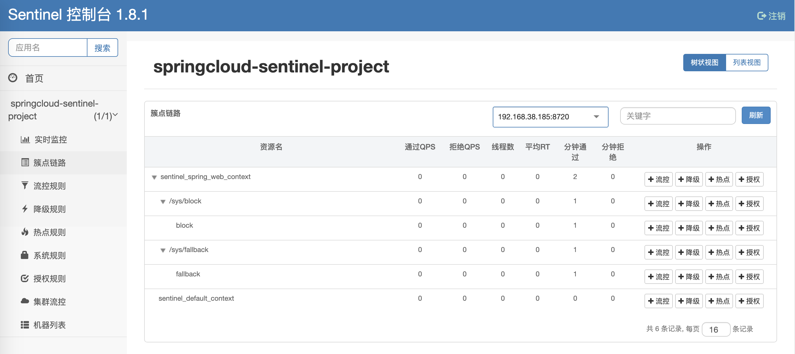
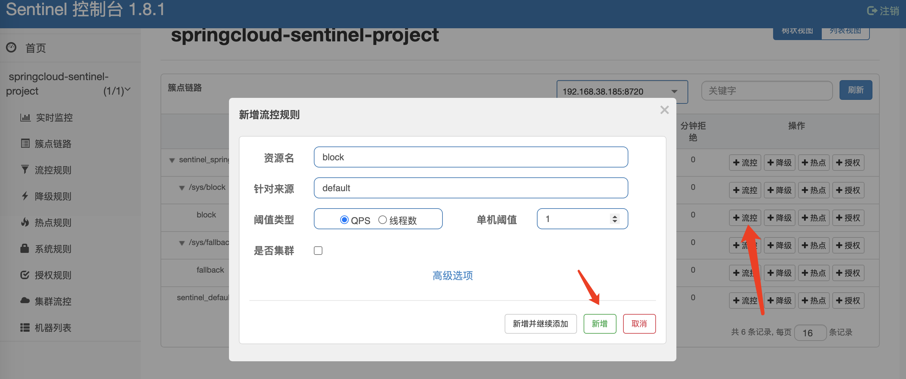
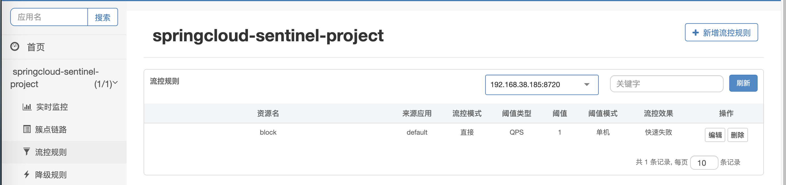
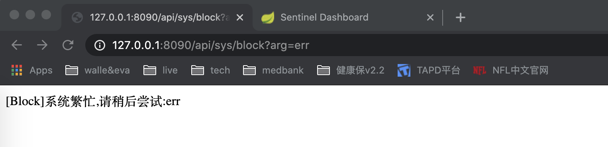
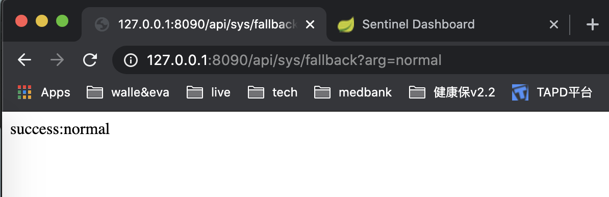
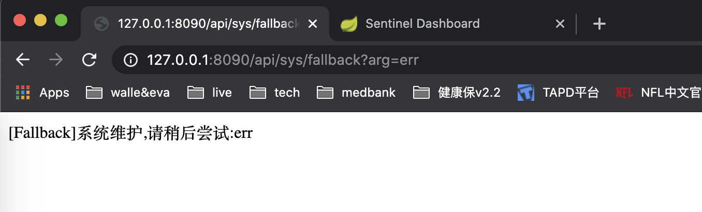

# Springcloud sentinel

sentinel[ˈsentɪnl]: 哨兵,守卫系统的 bodyguard. 笑哭脸.jpg

sentinel 主要用在熔断降级,流量控制等场景. 流量控制要熟悉一下各种流量控制方案如: 漏桶,令牌,固定窗口,滑动窗口等算法.

---

## 1. sentinel 管理端

如果部署在云服务器上,因为 sentinel 是连接回本地内网会出现问题,所以使用本地测试,请知悉.

<u><span style="color:red">在使用默认的配置时,sentinel 不具备持久化</span></u>,当客户端重启的时候,配置的规则全部丢失. 摊手.jpg

### 1.1 安装部署

[springcloud sentinel releases link](https://github.com/alibaba/Sentinel/releases)

```sh
# 下载web管理端
# root @ team3 in /opt/soft/projects/springcloud-sentinel [9:21:07]
$ wget https://github.com/alibaba/Sentinel/releases/download/1.8.1/sentinel-dashboard-1.8.1.jar

# 编写启动脚本和开放相应端口
# root @ team3 in /opt/soft/projects/springcloud-sentinel [9:27:45]
$ vim start-sentinel-dashboard.sh
#!/bin/sh

echo -e '\n--- Startup sentinel ---'

port=9090

java -Dserver.port=$port -Dcsp.sentinel.dashboard.server=127.0.0.1:$port -Dproject.name=sentinel-dashboard -jar sentinel-dashboard-1.8.1.jar

echo -e '\n--- Finish startup ---'

# 开启端口
# root @ team3 in /opt/soft/projects/springcloud-sentinel [9:32:39] C:2
$ firewall-cmd --add-port=9090/tcp --zone=public --permanent
success
# root @ team3 in /opt/soft/projects/springcloud-sentinel [9:32:48]
$ firewall-cmd --reload
success

# root @ team3 in /opt/soft/projects/springcloud-sentinel [9:34:59]
$ chmod +x start-sentinel-dashboard.sh

```

### 1.2 web 使用

默认用户名称: sentinel,
默认用户密码: sentinel


---

## 2. 项目使用

| 策略                            | 说明                                                                                                                           | 备注                                                                                                                                                                                                                                                                                         |
| ------------------------------- | ------------------------------------------------------------------------------------------------------------------------------ | -------------------------------------------------------------------------------------------------------------------------------------------------------------------------------------------------------------------------------------------------------------------------------------------- |
| 慢调用比例 (SLOW_REQUEST_RATIO) | 选择以慢调用比例作为阈值，需要设置允许的慢调用 RT（即最大的响应时间），请求的响应时间大于该值则统计为慢调用                    | 当单位统计时长（statIntervalMs）内请求数目大于设置的最小请求数目，并且慢调用的比例大于阈值，则接下来的熔断时长内请求会自动被熔断。经过熔断时长后熔断器会进入探测恢复状态（HALF-OPEN 状态），若接下来的一个请求响应时间小于设置的慢调用 RT 则结束熔断，若大于设置的慢调用 RT 则会再次被熔断。 |
| 异常比例 (ERROR_RATIO)          | 当单位统计时长（statIntervalMs）内请求数目大于设置的最小请求数目，并且异常的比例大于阈值，则接下来的熔断时长内请求会自动被熔断 | 经过熔断时长后熔断器会进入探测恢复状态（HALF-OPEN 状态），若接下来的一个请求成功完成（没有错误）则结束熔断，否则会再次被熔断。异常比率的阈值范围是 [0.0, 1.0]，代表 0% - 100%。                                                                                                              |
| 异常数 (ERROR_COUNT)            | 当单位统计时长内的异常数目超过阈值之后会自动进行熔断                                                                           | 经过熔断时长后熔断器会进入探测恢复状态（HALF-OPEN 状态），若接下来的一个请求成功完成（没有错误）则结束熔断，否则会再次被熔断。                                                                                                                                                               |

### 2.1 基础知识

在 sentinel 的熔断降级里面,有两个很重要的东西: `fallback(应急)`和`blockHandler(阻止)`.

Q: 那么我们该怎么区分这两个东西呀?

A: <u>fallback 是在接口异常时触发的回调,blockHandler 是限流或服务降级触发的回调.</u> [详情博客 link](https://blog.csdn.net/z69183787/article/details/109010369)

Q: 那么在定义这些玩意的时候,需要注意一些什么?

A: 需要注意的地方如下:

```
blockHandler:

blockHandler 对应处理 BlockException 的方法名称,blockHandler 方法访问范围需要是 public,返回类型需要与原方法相匹配,参数类型需要和原方法相匹配并且最后加一个额外的参数,类型为 BlockException.blockHandler 方法默认需要和原方法在同一个类中.
若使用其他类的方法,则可以指定 blockHandlerClass 为对应的类的 Class 对象,注意对应的方法必需为 static 方法.

fallback:

大致规则和blockHandler一致.
```

A: 对了,还有一些其他概念,可以顺便了解一下.

**资源名**: 标识资源的唯一名称(默认为请求路径),可使用 `SentinelResource` 配置;

**针对来源**: Sentinel 可针对服务调用者限流,填写微服务名称( `spring.application.name`),默认为 default,不区分来源;

**阈值类型**:

| 类型     | 备注                                          | 备注                                |
| -------- | --------------------------------------------- | ----------------------------------- |
| QPS      | 当调用该 api 的 QPS 达到阈值的时候,进行限流   | Queries-per-second,每秒钟的请求数量 |
| 线程数   | 当调用该 api 的线程数达到阈值的时候,进行限流. |                                     |
| 是否集群 | 默认不集群                                    |                                     |

**流控模式**:

| 模式 | 含义                                                                           |
| ---- | ------------------------------------------------------------------------------ |
| 直接 | 当 api 调用达到限流条件的时,直接限流                                           |
| 关联 | 当关联的资源请求达到阈值的时候,限流自己                                        |
| 链路 | 只记录指定链路上的流量（指定资源从入口资源进来的流量,如果达到阈值,则进行限流） |

**流控效果**:

| 模式     | 备注                                                                                               |
| -------- | -------------------------------------------------------------------------------------------------- |
| 快速失败 | 直接失败                                                                                           |
| Warm Up  | 根据 codeFactor（冷加载因子,默认值为 3）的值,从阈值/codeFactor,经过预热时长,才达到设置的 QPS 阈值; |
| 排队等待 | 匀速排队,让请求匀速通过,阈值类型必须设置为 QPS,否则无效                                            |

### 2.2 项目使用

FBI Warning: 因为 sentinel 不会自动加载接口,所以要对资源首先请求一次.



#### maven 依赖

```xml
<parent>
    <groupId>org.springframework.boot</groupId>
    <artifactId>spring-boot-starter-parent</artifactId>
    <version>2.3.2.RELEASE</version>
    <relativePath/>
</parent>

<dependencies>
    <dependency>
        <groupId>org.springframework.boot</groupId>
        <artifactId>spring-boot-starter</artifactId>
    </dependency>
    <dependency>
        <groupId>org.springframework.boot</groupId>
        <artifactId>spring-boot-starter-web</artifactId>
    </dependency>

    <dependency>
        <groupId>com.alibaba.cloud</groupId>
        <artifactId>spring-cloud-starter-alibaba-sentinel</artifactId>
        <version>2021.1</version>
    </dependency>
</dependencies>
```

#### 配置

```yml
spring:
  application:
    name: springcloud-sentinel-project
  # 配置sentinel dashboard
  cloud:
    sentinel:
      transport:
        dashboard: 127.0.0.1:9090

# 配置项目请求url前缀
server:
  servlet:
    context-path: /api/
  port: 8090
```

项目启动类如下:

```java
@SpringBootApplication
public class App {
    public static void main(String[] args) {
        SpringApplication.run(App.class, args);
    }
}
```

```java
@Controller
@RequestMapping("/sys")
public class SysController {
    @Resource
    private SysService sysService;

    @RequestMapping("/fallback")
    @ResponseBody
    @SentinelResource(value = "fallback", fallback = "fallback", fallbackClass = FallbackHandler.class)
    public String fallback(String arg) {
        if ("err".equals(arg)) {
            throw new RuntimeException("Full back");
        }
        return "success:" + arg;
    }

    @RequestMapping("/block")
    @ResponseBody
    @SentinelResource(value = "block", blockHandler = "block", blockHandlerClass = BlockHandler.class)
    public String block(String arg) {
        return "success:" + arg;
    }

}
```

#### blockHandler

```java
public class BlockHandler {
    public static String block(String arg, BlockException throwable) {
        return "[Block]系统繁忙,请稍后尝试:" + arg;
    }
}
```

在管理端配置`qps=1`





快速请求接口,可以看到触发 block



#### fallback

```java
public class FallbackHandler {
    public static String fallback(String arg, Throwable throwable) {
        return "[Fallback]系统维护,请稍后尝试:" + arg;
    }
}
```



触发 fallback



### 2.3 总结

很遗憾,没实现 sentinel 持久化,现在也只是测试阶段.

样例:

```java
package cn.example.hospital.doctor.admin.controller;

import com.alibaba.csp.sentinel.annotation.SentinelResource;
import com.alibaba.csp.sentinel.slots.block.BlockException;

import java.util.HashMap;
import java.util.Map;

import org.springframework.web.bind.annotation.RequestMapping;
import org.springframework.web.bind.annotation.RestController;

import cn.example.sharpen.framework.base.common.dto.SingleResponse;
import io.swagger.annotations.Api;

/**
 * @author cs12110
 * @version V1.0
 * @since 2022-01-07 09:15
 */
@RestController
@RequestMapping("/v1/sentinel-example")
@Api(tags = "sentinel example")
public class BizSentinelExampleController {

    /**
     * 测试接口
     * <p>
     * blockHandler: 同一个类里面,方法为public
     * fallbackHandler: 同一个类里面,方法为public
     * <p>
     * 测试设置规则:
     * <p>
     * block: QPS阈值1req/s
     *
     * @param sleep 休眠时间(用来测试fallback)
     * @return SingleResponse
     * @link https://github.com/alibaba/Sentinel/wiki/%E6%B3%A8%E8%A7%A3%E6%94%AF%E6%8C%81
     */
    @RequestMapping("/going-through")
    @SentinelResource(value = "going-through", blockHandler = "blockHandler", fallback = "fallbackHandler")
    public SingleResponse<?> goingThrough(long sleep) {
        if (sleep > 0) {
            // 模拟服务异常
            throw new RuntimeException("service timeout");
        }
        return SingleResponse.of(sleep);
    }

    /**
     * blockHandler: 用于流量超出阈值,进行限流
     * <p>
     * 入参也要going-through方法一致,可以多一个<code>BlockException</code>
     *
     * @param sleep    休眠时间
     * @param blockExp {@link com.alibaba.csp.sentinel.slots.block.BlockException},还有一个贼像的<code>BlockedException</code>,注意区分
     * @return SingleResponse 返回参数格式要和going-through一致
     */
    public SingleResponse<?> blockHandler(long sleep, BlockException blockExp) {
        Map<String, Object> map = new HashMap<>();
        map.put("sleep", sleep);
        map.put("message", blockExp.getMessage());
        map.put("cause", "限制访问");

        return SingleResponse.of(map);
    }

    /**
     * Fallback: 处理服务异常,用于服务降级/熔断
     * <p>
     * 函数，函数签名与原函数一致或加一个 Throwable 类型的参数.
     *
     * @param sleep     休眠时间
     * @param throwable 异常
     * @return SingleResponse
     */
    public SingleResponse<?> fallbackHandler(long sleep, Throwable throwable) {
        Map<String, Object> map = new HashMap<>();
        map.put("sleep", sleep);
        map.put("message", throwable.getMessage());
        map.put("cause", "服务异常,熔断");

        return SingleResponse.of(map);
    }
}
```

---

## 3. 参考文档

a. [springcloud sentinel 官方文档](https://github.com/alibaba/Sentinel/wiki/%E6%96%B0%E6%89%8B%E6%8C%87%E5%8D%97)

b. [springcloud sentinel 博客 link](https://mrbird.cc/Sentinel%E6%8E%A7%E5%88%B6%E5%8F%B0%E8%AF%A6%E8%A7%A3.html)

c. [fallback 和 block 的区别 link](https://blog.csdn.net/z69183787/article/details/109010369)
