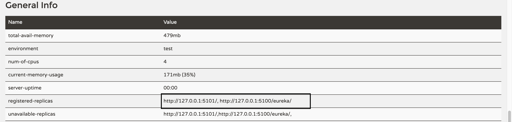

# Spring cloud

微服务,分布式,这些都是挡在解决温饱道路上的两座大山.

参考项目为: [cs12110 的 ms-project](https://github.com/cs12110/ms-project)

---

## 1. 基础知识

### 1.1 什么是微服务?

微服务是一种架构风格,一个大型复杂软件应用由一个或多个微服务组成.系统中的各个微服务可被独立部署,各个微服务之间是松耦合的.每个微服务仅关注于完成一件任务并很好地完成该任务.在所有情况下,每个任务代表着一个小的业务能力.

### 1.2 微服务与单体架构区别

- 单体架构所有的模块全都耦合在一块,代码量大,维护困难,微服务每个模块就相当于一个单独的项目,代码量明显减少,遇到问题也相对来说比较好解决.

- 单体架构所有的模块都共用一个数据库,存储方式比较单一,微服务每个模块都可以使用不同的存储方式(比如有的用 redis,有的用 mysql 等),数据库也是单个模块对应自己的数据库.

- 单体架构所有的模块开发所使用的技术一样,微服务每个模块都可以使用不同的开发技术,开发模式更灵活

### 1.3 微服务的优缺点

### 1.3.1 优点

- 易于开发和维护.
- 启动较快.
- 局部修改容易部署.
- 技术栈不受限.
- 按需伸缩.

### 1.3.2 缺点

- 运维要求较高,对于单体架构来讲,我们只需要维护好这一个项目就可以了,但是对于微服务架构来讲,由于项目是由多个微服务构成的,每个模块出现问题都会造成整个项目运行出现异常,想要知道是哪个模块造成的问题往往是不容易的,因为我们无法一步一步通过 debug 的方式来跟踪,这就对运维人员提出了很高的要求.

- 分布式的复杂性,对于单体架构来讲,我们可以不使用分布式,但是对于微服务架构来说,分布式几乎是必会用的技术,由于分布式本身的复杂性,导致微服务架构也变得复杂起来.

- 接口调整成本高,比如,用户微服务是要被订单微服务和电影微服务所调用的,一旦用户微服务的接口发生大的变动,那么所有依赖它的微服务都要做相应的调整,由于微服务可能非常多,那么调整接口所造成的成本将会明显提高.

- 重复劳动,对于单体架构来讲,如果某段业务被多个模块所共同使用,我们便可以抽象成一个工具类,被所有模块直接调用,但是微服务却无法这样做,因为这个微服务的工具类是不能被其它微服务所直接调用的,从而我们便不得不在每个微服务上都建这么一个工具类,从而导致代码的重复.

### 1.4 什么样的项目适合微服务

微服务可以按照业务功能本身的独立性来划分,如果系统提供的业务是非常底层的,如:操作系统内核,存储系统,网络系统,数据库系统等等,这类系统都偏底层,功能和功能之间有着紧密的配合关系,如果强制拆分为较小的服务单元,会让集成工作量急剧上升,并且这种人为的切割无法带来业务上的真正的隔离,所以无法做到独立部署和运行,也就不适合做成微服务了.

简单来说,能不能做成微服务,取决于四个要素:

- 小:微服务体积小.
- 独:能够独立的部署和运行.
- 轻:使用轻量级的通信机制和架构.
- 松:为服务之间是松耦合的.

---

## 2. 注册中心

彩蛋: 在星际穿越里面,那个小屁孩长大之后解出那条公式,喊的就是:`eureka`.

据说是在古希腊时期,如果解决某个难题,ta 们都说喊:`eureka`,我想大概是:`卧槽`的意思吧. 笑哭脸.jpg

程序猿说要有服务中心,于是世上便有了`eureka`.

### 2.1 注册中心-eureka

注册中心的高可用,注册中心是 spring cloud 的指挥所,要是一不小心挂掉了,那就尴尬了.

所以配置高可用的注册中心,还是很必要,很必要,很必要的.

设置本机的 host

```sh
mr3306:ms-project mr3306$ cat /etc/hosts |grep peer
# for spring cloud
127.0.0.1 peer1
127.0.0.1 peer2
```

### 2.1 配置文件

**application.properties**

```properties
# the name of application
spring.application.name=ms-reg
# 注意切换
spring.profiles.active=peer1

# Spring setting
server.tomcat.accept-count=1000
server.tomcat.max-threads=1000
server.tomcat.max-connections=2000

# log setting
logging.config=classpath:logconfig/logback-test.xml
```

**application-peer1.properties**

```properties
# Spring setting
server.port=5100
# multiple register center
eureka.instance.hostname=register-center-peer1
eureka.client.serviceUrl.defaultZone=http://peer2:5101/eureka
```

**application-peer2.properties**

```properties
# Spring setting
server.port=5101
# multiple register center
eureka.instance.hostname=register-center-peer2
eureka.client.serviceUrl.defaultZone=http://peer1:5100/eureka
```

### 2.2 运行类

```java
package com.ms.pkgs;

import org.springframework.boot.SpringApplication;
import org.springframework.boot.autoconfigure.EnableAutoConfiguration;
import org.springframework.cloud.netflix.eureka.server.EnableEurekaServer;
import org.springframework.context.annotation.Configuration;
import org.springframework.web.bind.annotation.RestController;

/**
 * 注册中心
 *
 *
 * <p>
 *
 * @author cs12110 2018年12月6日
 * @since 1.0
 */
@Configuration
@EnableAutoConfiguration
@EnableEurekaServer
@RestController
public class RegApp {

    public static void main(String[] args) {
        SpringApplication.run(RegApp.class, args);
    }
}
```

分别切换激活环境为:`peer1` 和 `peer2` 运行项目.

### 2.3 运行结果

在上述运行成功之后,可以通过浏览器打开:`http://127.0.0.1:5100/`查看 spring cloud 的运行情况



---

## 3. 网关-zuul

在微服务架构里面,如果有很多的服务部署在不同的服务器上,如果要同一个同一个 ip 来调用这些服务器,那么这时候,网关就可以用上了.

---

## Other

a. [Spring cloud 配置参数参考文档](https://blog.csdn.net/xingbaozhen1210/article/details/80290588)

b. [史上最简单的 SpringCloud 教程](https://blog.csdn.net/forezp/article/details/70148833)

c. [Spring Cloud 系列文章](http://ityouknow.com/spring-cloud)

d. [Spring cloud 五大神兽](https://www.cnblogs.com/ilinuxer/p/6580998.html)
