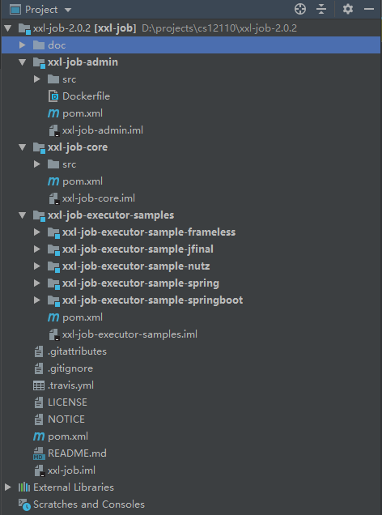
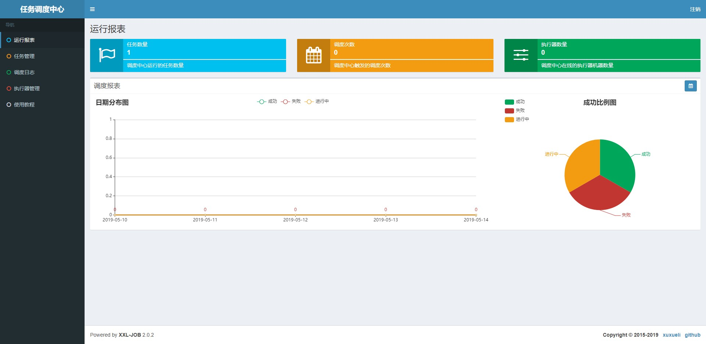
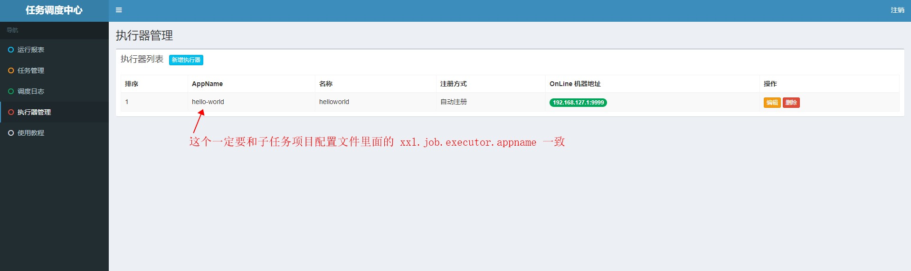
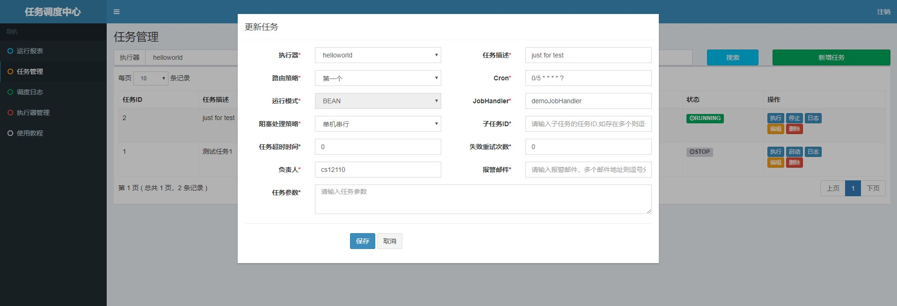
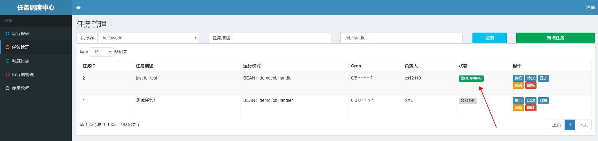

# 分布式任务调度

分布式任务调度还是要有的,万一需要呢?

这里使用[xxl-job 官方文档 link](http://www.xuxueli.com/xxl-job/#/)来做.

Q: 现在没个分布式什么的,都不好意思见人啦.但是分布式拆分出来之后,定时任务怎么同意管理呢?

A: 分布式调度框架,你值得拥有.在统一配置中心,配置各个任务的调度,方便管理.

本文档使用 xxl-job 的版本为: `2.0.2`,请知悉.

---

## 1. 部署调度中心

在 GitHub 下载 xxl-job 的 release 版本: https://github.com/xuxueli/xxl-job/releases

导入 ide 里面,结构如下图所示,请知悉.



项目模块说明:

- xxl-job-admin:调度中心
- xxl-job-core:公共依赖
- xxl-job-executor-samples:执行器 Sample 示例(选择合适的版本执行器,可直接使用,也可以参考其并将现有项目改造成执行器)
  - xxl-job-executor-sample-springboot:Springboot 版本,通过 Springboot 管理执行器,推荐这种方式
  - xxl-job-executor-sample-spring:Spring 版本,通过 Spring 容器管理执行器,比较通用
  - xxl-job-executor-sample-frameless:无框架版本
  - xxl-job-executor-sample-jfinal:JFinal 版本,通过 JFinal 管理执行器
  - xxl-job-executor-sample-nutz:Nutz 版本,通过 Nutz 管理执行器

### 1.1 初始化调度中心数据库

执行相应的数据库脚本: `tables_xxl_job.sql` 初始化数据库.

### 1.2 部署调度中心

修改`xxl-jobs-admin`配置中心配置文件`application.properties`,内容如下

```properties
### web
server.port=8070
server.context-path=/xxl-job-admin

### resources
spring.mvc.static-path-pattern=/static/**
spring.resources.static-locations=classpath:/static/

### freemarker
spring.freemarker.templateLoaderPath=classpath:/templates/
spring.freemarker.suffix=.ftl
spring.freemarker.charset=UTF-8
spring.freemarker.request-context-attribute=request
spring.freemarker.settings.number_format=0.##########

### mybatis
mybatis.mapper-locations=classpath:/mybatis-mapper/*Mapper.xml

### xxl-job, datasource
spring.datasource.url=jdbc:mysql://47.98.104.252:3306/xxl-job?Unicode=true&characterEncoding=UTF-8
spring.datasource.username=root
spring.datasource.password=**********
spring.datasource.driver-class-name=com.mysql.jdbc.Driver
spring.datasource.type=org.apache.tomcat.jdbc.pool.DataSource
spring.datasource.tomcat.max-wait=10000
spring.datasource.tomcat.max-active=30
spring.datasource.tomcat.test-on-borrow=true
spring.datasource.tomcat.validation-query=SELECT 1
spring.datasource.tomcat.validation-interval=30000

### xxl-job email
spring.mail.host=smtp.qq.com
spring.mail.port=25
spring.mail.username=cs12110@163.com
spring.mail.password=******
spring.mail.properties.mail.smtp.auth=true
spring.mail.properties.mail.smtp.starttls.enable=true
spring.mail.properties.mail.smtp.starttls.required=true

### xxl-job login
xxl.job.login.username=admin
xxl.job.login.password=123456

### xxl-job, access token
xxl.job.accessToken=

### xxl-job, i18n (default empty as chinese, "en" as english)
xxl.job.i18n=
```

使用 maven 对项目进行打包

```sh
PC@DESKTOP-DV8C0GM MINGW64 /d/projects/cs12110/xxl-job-2.0.2
$ mvn clean package -Dmaven.test.skip=true
# 下载各种依赖之后
[INFO] ------------------------------------------------------------------------
[INFO] Reactor Summary:
[INFO]
[INFO] xxl-job ............................................ SUCCESS [  1.006 s]
[INFO] xxl-job-core ....................................... SUCCESS [ 24.231 s]
[INFO] xxl-job-admin ...................................... SUCCESS [ 55.008 s]
[INFO] xxl-job-executor-samples ........................... SUCCESS [  0.106 s]
[INFO] xxl-job-executor-sample-spring ..................... SUCCESS [ 10.663 s]
[INFO] xxl-job-executor-sample-springboot ................. SUCCESS [  3.576 s]
[INFO] xxl-job-executor-sample-jfinal ..................... SUCCESS [  5.013 s]
[INFO] xxl-job-executor-sample-nutz ....................... SUCCESS [  2.732 s]
[INFO] xxl-job-executor-sample-frameless .................. SUCCESS [  0.278 s]
[INFO] ------------------------------------------------------------------------
[INFO] BUILD SUCCESS
[INFO] ------------------------------------------------------------------------
[INFO] Total time: 01:48 min
[INFO] Finished at: 2019-05-14T10:33:07+08:00
[INFO] Final Memory: 42M/259M
[INFO] ------------------------------------------------------------------------
```

打包完成后,启动项目

```sh
$ java -jar xxl-job-admin-2.0.2.jar
```

页面管理界面登录地址为: `http://127.0.0.1:8070/xxl-job-admin/toLogin`

登录成功后,界面如下所示



---

## 2. 编写调度任务

本章节采用`springboot`模块来开发,请知悉.

### 2.1 修改配置文件

要注意两个端口,一个是 Tomcat 的端口,一个 rpc 的端口.

```properties
# web port
server.port=8081

# log config
logging.config=classpath:logback.xml


### xxl-job admin address list, such as "http://address" or "http://address01,http://address02"
xxl.job.admin.addresses=http://127.0.0.1:8070/xxl-job-admin

### xxl-job executor address
xxl.job.executor.appname=hello-world
xxl.job.executor.ip=
xxl.job.executor.port=9999

### xxl-job, access token
xxl.job.accessToken=

### xxl-job log path
xxl.job.executor.logpath=/data/applogs/xxl-job/jobhandler

### xxl-job log retention days
xxl.job.executor.logretentiondays=-1
```

**修改一下 demojob 的代码**

```java
package com.xxl.job.executor.service.jobhandler;

import com.xxl.job.core.biz.model.ReturnT;
import com.xxl.job.core.handler.IJobHandler;
import com.xxl.job.core.handler.annotation.JobHandler;
import com.xxl.job.core.log.XxlJobLogger;
import org.slf4j.Logger;
import org.slf4j.LoggerFactory;
import org.springframework.stereotype.Component;

import java.util.concurrent.TimeUnit;


/**
 * 任务Handler示例（Bean模式）
 * <p>
 * 开发步骤：
 * 1、继承"IJobHandler"：“com.xxl.job.core.handler.IJobHandler”；
 * 2、注册到Spring容器：添加“@Component”注解，被Spring容器扫描为Bean实例；
 * 3、注册到执行器工厂：添加“@JobHandler(value="自定义jobhandler名称")”注解，注解value值对应的是调度中心新建任务的JobHandler属性的值。
 * 4、执行日志：需要通过 "XxlJobLogger.log" 打印执行日志；
 *
 * @author xuxueli 2015-12-19 19:43:36
 */
@JobHandler(value = "demoJobHandler")
@Component
public class DemoJobHandler extends IJobHandler {

    private static Logger logger = LoggerFactory.getLogger(DemoJobHandler.class);

    @Override
    public ReturnT<String> execute(String param) throws Exception {
        XxlJobLogger.log("XXL-JOB, Hello World.");

        logger.info("xxl-job,hello world");

        for (int i = 0; i < 5; i++) {
            logger.info("heart beat:{}", i);
            TimeUnit.SECONDS.sleep(2);
        }
        return SUCCESS;
    }
}
```

### 2.2 打包执行

在 parent 的目录下面使用 maven 打包,之后运行

```sh
$ java -jar xxl-job-executor-sample-springboot-2.0.2.jar
```

---

## 3. 配置调度任务

### 3.1 配置 executor



### 3.2 配置任务





### 3.3 子任务测试

写好定时之后,并且启动,子任务模块成功被调用.

```java
11:47:05.438 logback [Thread-19] INFO  c.x.j.e.s.jobhandler.DemoJobHandler - xxl-job,hello world
11:47:06.296 logback [Thread-19] INFO  c.x.j.e.s.jobhandler.DemoJobHandler - heart beat:0
11:47:26.681 logback [Thread-19] INFO  c.x.j.e.s.jobhandler.DemoJobHandler - heart beat:1
11:47:36.151 logback [Thread-19] INFO  c.x.j.e.s.jobhandler.DemoJobHandler - heart beat:2
11:47:38.153 logback [Thread-19] INFO  c.x.j.e.s.jobhandler.DemoJobHandler - heart beat:3
11:47:40.154 logback [Thread-19] INFO  c.x.j.e.s.jobhandler.DemoJobHandler - heart beat:4
11:47:57.770 logback [Thread-19] INFO  c.x.j.e.s.jobhandler.DemoJobHandler - xxl-job,hello world
11:47:57.770 logback [Thread-19] INFO  c.x.j.e.s.jobhandler.DemoJobHandler - heart beat:0
11:47:59.770 logback [Thread-19] INFO  c.x.j.e.s.jobhandler.DemoJobHandler - heart beat:1
11:48:01.770 logback [Thread-19] INFO  c.x.j.e.s.jobhandler.DemoJobHandler - heart beat:2
11:48:03.771 logback [Thread-19] INFO  c.x.j.e.s.jobhandler.DemoJobHandler - heart beat:3
11:48:05.772 logback [Thread-19] INFO  c.x.j.e.s.jobhandler.DemoJobHandler - heart beat:4
```

---

## 4. 参考文档

a. [xxl-job 官方文档](http://www.xuxueli.com/xxl-job/#/)
