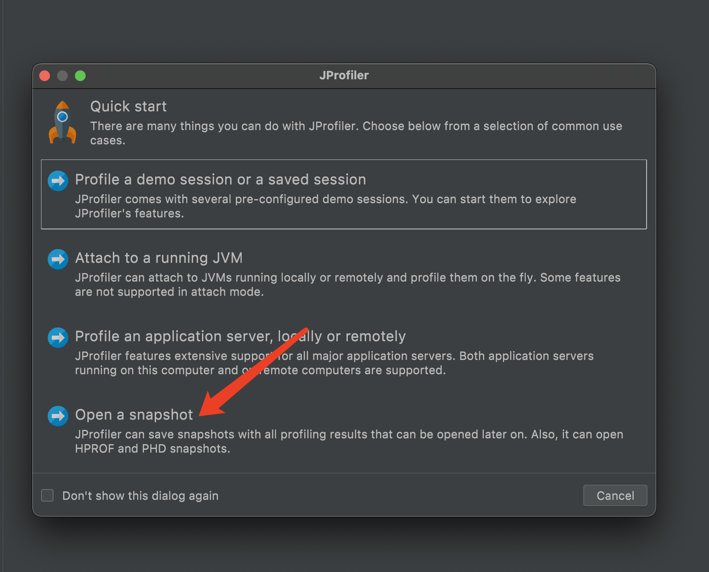
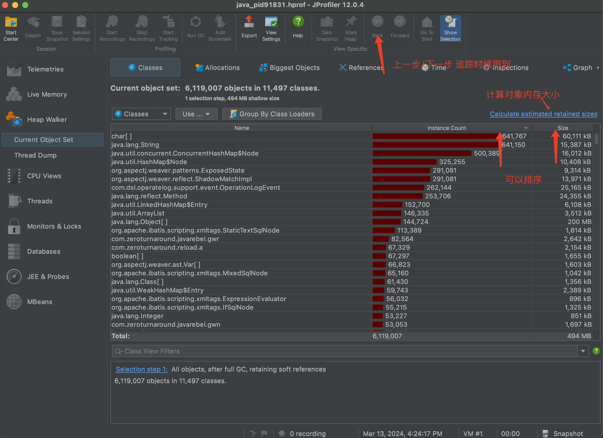
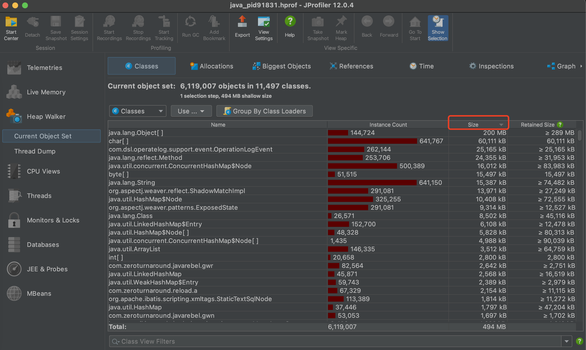
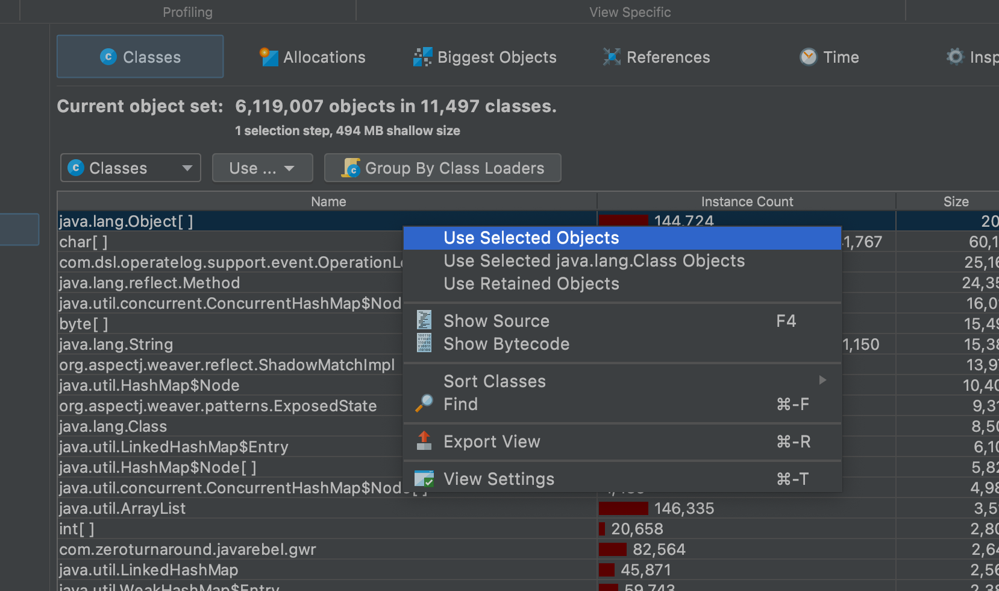
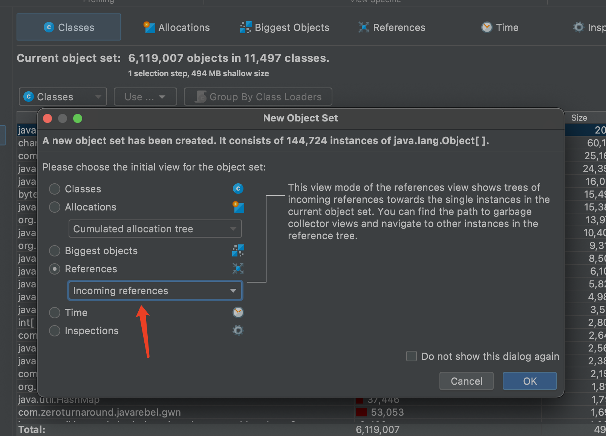
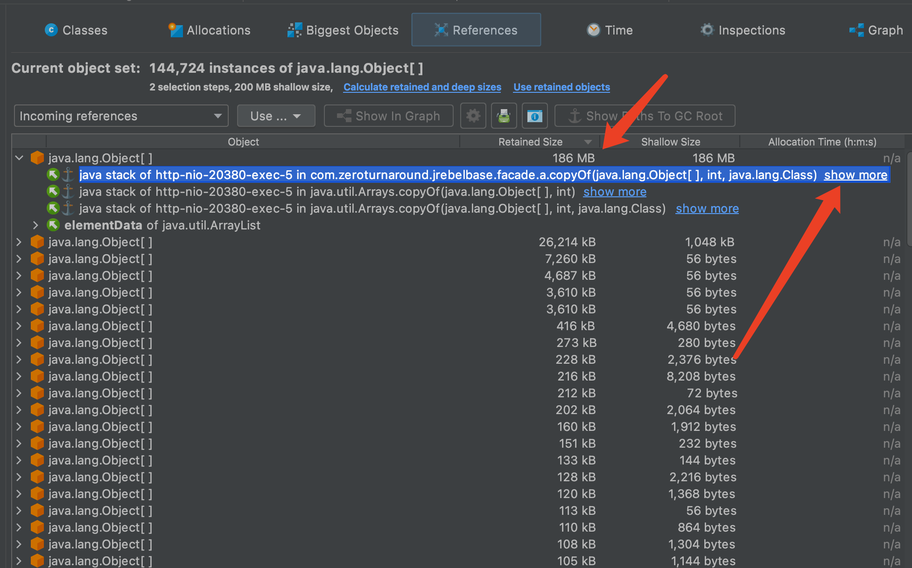
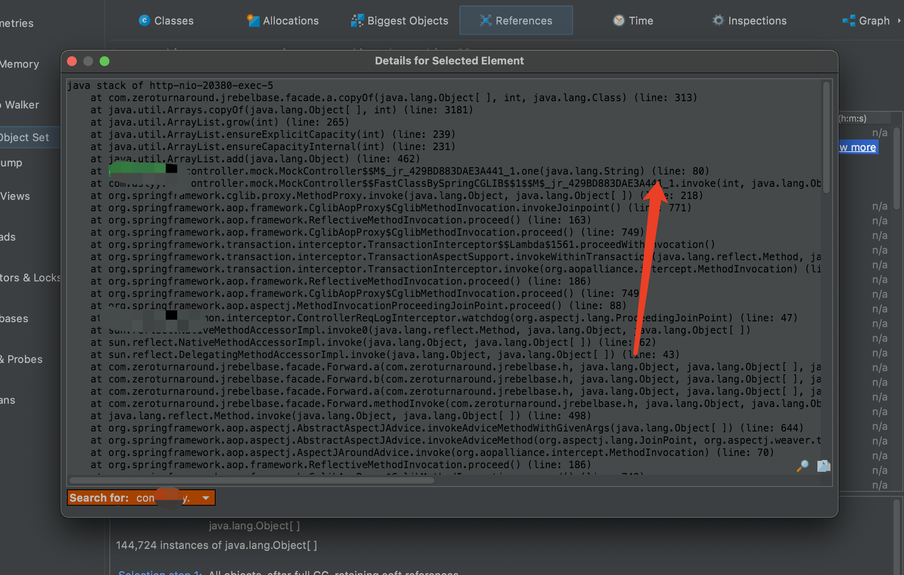

# Java OOM 定位

本文档使用 JProfiler 来定位 oom 问题,请知悉.

---

### 1. dump

在 oom 的时候,知道当时发生了啥事情很重要的一件事.

所以需要对服务进行 `dump` 配置.

```java
-Xmx1024m -Xms512m -XX:+PrintGCDetails -XX:+HeapDumpOnOutOfMemoryError -XX:HeapDumpPath=/Users/mr3306/Box/soft/eclipse-mat/oom
```

实验代码如下:

```java
@GetMapping("/one")
public Result<?> one(String billNo) {
    SettlementInfo sett = settlementInfoService.getBySettlementNo(billNo);

    // 一直往list里面存对象直到oom
    List<SettlementInfo> values = new ArrayList<>();
    for (long index = 0; index < Long.MAX_VALUE; index++) {
        // 代码第几行信息: com/mock/MockController.java:80
        values.add(sett);
    }

    return Result.success();
}
```

Q: 上面这些命令配置都是啥意思呀?

A: 使用 chatgpt 问一下 :"}

```text
这些是 Java 虚拟机 (JVM) 的启动参数，用于配置 Java 程序的内存使用和调试信息输出。下面是每个参数的含义：

1. -Xmx1024m: 设置 JVM 的最大堆内存为 1024MB。这表示 Java 程序可以使用的最大堆内存量为 1024MB。

2. -Xms512m: 设置 JVM 的初始堆内存为 512MB。这表示 JVM 启动时将分配 512MB 的堆内存，并根据需要进行动态扩展，直到达到最大堆内存（由 -Xmx 参数指定）为止。

3. -XX:+PrintGCDetails: 启用详细的垃圾回收日志输出。当垃圾回收发生时，将会输出更详细的信息，包括每个垃圾回收阶段的持续时间、内存使用情况等。

4. -XX:+HeapDumpOnOutOfMemoryError: 当发生内存溢出错误（OutOfMemoryError）时，自动产生堆转储文件。这个文件通常用于分析内存溢出的原因。

5. -XX:HeapDumpPath=/Users/mr3306/Box/soft/eclipse-mat/oom: 指定堆转储文件的路径。在发生内存溢出时，堆转储文件将会被生成到该路径下。在这个例子中，文件将会被生成到 /Users/mr3306/Box/soft/eclipse-mat/oom 这个目录下。
```

调用接口之后,服务出现 oom,并且在指定文件夹生成`hprof`文件.

```shell
# mr3306 @ mr3306 in ~/Box/soft/eclipse-mat/oom [17:35:21]
$ pwd
/Users/mr3306/Box/soft/eclipse-mat/oom

# mr3306 @ mr3306 in ~/Box/soft/eclipse-mat/oom [17:35:26]
$ ls -al -h
total 1753064
drwxr-xr-x  3 mr3306  staff    96B Mar 13 17:35 .
drwxr-xr-x  7 mr3306  staff   224B Mar 13 16:21 ..
-rw-------  1 mr3306  staff   845M Mar 13 16:24 java_pid91831.hprof
```

---

### 2. JProfiler

使用 JProfiler 打开 `java_pid91831.hprof` 文件,采用`Open a snapshot`模式打开.



JProfiler 打开`hprof`文件后, 主界面如下所示



点击重新计算保留大小之后,按照内存大小倒序



上面的图片中,可以看到排在第一的是`Object[]`.

Q: 那么我们怎么知道`Object[]`是啥?

A: 我们现在来看看具体怎么定位.

选中最大的内存对象,右键`Use Selected Objects`





关于上面不同的选项里面的作用是啥,现在我也不太清楚. orz

| 选项                 | 说明                              |
| -------------------- | --------------------------------- |
| incoming references  | 入引用,显示这个对象被谁引用       |
| outcoming references | 出引用,显示这个对象引用的其他对象 |





在上面我们可以看到是`.mock.MockController$$M$_jr_429BD883DAE3A441_1.one(java.lang.String) (line: 80)`

---

### 3. 参考资料

a. [记一次 JProfiler 生产实战内存分析 link](https://juejin.cn/post/7344697321798287400)

b. [Jprofiler 分析 Dump 文件 link](https://juejin.cn/post/7223400545011613733)
