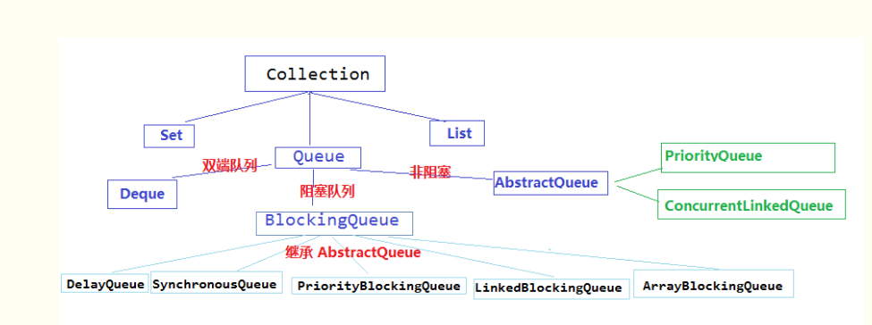

# Queue 的使用

在生产环境里面有一个需求,就是日志的异步写出,不影响接口的响应速度.

那么可以自己设计一个简单的 Mq,这样子就可以用到队列.

---

## 1. Queue 基础

### 1.1 继承架构

Java 的 Queue 接口集成实现图[来源](https://www.cnblogs.com/lemon-flm/p/7877898.html)



**不阻塞接口的 LinkedList**

实现了 java.util.Queue 接口和 java.util.AbstractQueue 接口
内置的不阻塞队列: PriorityQueue 和 ConcurrentLinkedQueue
PriorityQueue 和 ConcurrentLinkedQueue 类在 Collection Framework 中加入两个具体集合实现.
PriorityQueue 类实质上维护了一个有序列表.加入到 Queue 中的元素根据它们的天然排序（通过其 java.util.Comparable 实现）或者根据传递给构造函数的 java.util.Comparator 实现来定位.
ConcurrentLinkedQueue 是基于链接节点的,线程安全的队列.并发访问不需要同步.因为它在队列的尾部添加元素并从头部删除它们,所以只要不需要知道队列的大 小,ConcurrentLinkedQueue 对公共集合的共享访问就可以工作得很好.收集关于队列大小的信息会很慢,需要遍历队列.

**实现阻塞接口**

java.util.concurrent 中加入了 BlockingQueue 接口和五个阻塞队列类.它实质上就是一种带有一点扭曲的 FIFO 数据结构.不是立即从队列中添加或者删除元素,线程执行操作阻塞,直到有空间或者元素可用.

五个队列所提供的各有不同:

- ArrayBlockingQueue: 一个由数组支持的有界队列.
- LinkedBlockingQueue: 一个由链接节点支持的可选有界队列.
- PriorityBlockingQueue: 一个由优先级堆支持的无界优先级队列.
- DelayQueue: 一个由优先级堆支持的,基于时间的调度队列.
- SynchronousQueue: 一个利用 BlockingQueue 接口的简单聚集(rendezvous)机制.

  ​

### 1.2 方法说明

| 方法    | 功能描述                 | 详细描述                                            |
| ------- | ------------------------ | --------------------------------------------------- |
| add     | 增加一个元索             | 如果队列已满,则抛出一个 IIIegaISlabEepeplian 异常   |
| remove  | 移除并返回队列头部的元素 | 如果队列为空,则抛出一个 NoSuchElementException 异常 |
| element | 返回队列头部的元素       | 如果队列为空,则抛出一个 NoSuchElementException 异常 |
| offer   | 添加一个元素并返回 true  | 如果队列已满,则返回 false                           |
| poll    | 移除并返问队列头部的元素 | 如果队列为空,则返回 null                            |
| peek    | 返回队列头部的元素       | 如果队列为空,则返回 null                            |
| put     | 添加一个元素             | 如果队列满,则阻塞                                   |
| take    | 移除并返回队列头部的元素 | 如果队列为空,则阻塞                                 |

### 1.3 关于 Queue

在构建线程池里面里面,最常用的有两个 queue:`ArrayBlockingQueue`,`LinkedBlockingQueue`.

对于`ArrayBlockingQueue`: 有边界的 queue

```java
Person person = new Person();
person.setId("id");

// 声明只能队列里面只能容纳一个元素,构造时需要制定队列大小
ArrayBlockingQueue<Person> arrayBlockingQueue = new ArrayBlockingQueue<>(1);
arrayBlockingQueue.add(person);

// 尝试装入第二个元素时出错
//arrayBlockingQueue.add(person);
```

对于`LinkedBlockingQueue`: 其实这个也是有边界的队列(如果没制定大小,默认 queue 容纳元素为`Integer.MAX_VALUE`)

```java
Person person = new Person();
person.setId("id");

// 默认使用Integer.MAX_VALUE
LinkedBlockingQueue<Person> linkedBlockingQueue = new LinkedBlockingQueue<>();
linkedBlockingQueue.add(person);
linkedBlockingQueue.add(person);

// 指定长度为1
linkedBlockingQueue = new LinkedBlockingQueue<>(1);
linkedBlockingQueue.add(person);
// 加入第二个元素时出错
// linkedBlockingQueue.add(person);
```

关于`SynchronousQueue`:其中每个 put 必须等待一个 take

---

## 2. 简单代码

面临问题: 如消息堆积,该怎么办?这个可能会把服务器给撑爆了.(还没想到好的解决方法,可以给消息队列设置 size 大小,当大于某个值的时候,开始丢弃,如果业务允许的话)

```java
import java.util.LinkedList;
import java.util.Queue;

/**
 *
 * Just simple MQ
 *
 * @author root
 *
 */
public class TinyMQ {

	/**
	 * Message queue
	 */
	private static Queue<String> queue = new LinkedList<>();

	/**
	 * size of queue
	 */
	private static volatile int size = 0;

	/**
	 * Add msg to queue
	 *
	 * @param msg msg
	 * @return boolean if add msg to queue successful
	 */
	public static boolean put(String msg) {
		synchronized (TinyMQ.class) {
			size++;
			return queue.offer(msg);
		}
	}

	/**
	 * Take the first msg of queue, and remove it from queue
	 *
	 * @return String
	 */
	public static String take() {
		synchronized (TinyMQ.class) {
			String value = queue.poll();
			if (value != null) {
				size--;
			}
			return value;
		}
	}

	/**
	 * if queue is empty ,return true
	 *
	 * @return boolean
	 */
	public static boolean isEmpty() {
		synchronized (TinyMQ.class) {
			return queue.size() == 0;
		}
	}

	/**
	 * return the size of queue
	 *
	 * @return int
	 */
	public static int size() {
		return size;
	}

}
```

---

## 3. 测试

### 3.1 测试代码

```java
import java.text.SimpleDateFormat;
import java.util.Date;

public class TinyMQTest2 {

	public static void main(String[] args) {
		try {
			Thread producer1 = new Thread(new MqProducer("p1"));
			Thread producer2 = new Thread(new MqProducer("p2"));
			Thread t1 = new Thread(new MqConsumer("t1"));

			producer1.start();
			producer2.start();

			t1.start();
		} catch (Exception e) {
			e.printStackTrace();
		}
	}

	static class MqProducer implements Runnable {

		private String threadName;

		public MqProducer(String threadName) {
			super();
			this.threadName = threadName;
		}

		@Override
		public void run() {
			try {
				while (true) {
					long timestamp = System.currentTimeMillis();
					TinyMQ.put(threadName + " msg" + timestamp);
					Thread.sleep(2000);
				}

			} catch (Exception e) {
				e.printStackTrace();
			}
		}
	}

	static class MqConsumer implements Runnable {
		private String threadName;

		public MqConsumer(String threadName) {
			super();
			this.threadName = threadName;
		}

		@Override
		public void run() {
			while (true) {
				if (TinyMQ.isEmpty()) {
					try {
						Thread.sleep(500);
					} catch (Exception e) {
						e.printStackTrace();
					}
				} else {
					SimpleDateFormat sdf = new SimpleDateFormat("yyyy-MM-dd HH:mm:ss");
					StringBuilder body = new StringBuilder();
					body.append(sdf.format(new Date()));
					body.append(" ");
					body.append(threadName);
					body.append(" {");
					body.append(TinyMQ.take());
					body.append("} [");
					body.append(TinyMQ.size());
					body.append("]");
					System.out.println(body);
				}
			}

		}

	}
}
```

### 3.2 测试结果

```java
2018-10-21 15:35:03 t1 {p2 msg1540107303847} [1]
2018-10-21 15:35:03 t1 {p1 msg1540107303848} [0]
2018-10-21 15:35:05 t1 {p2 msg1540107305855} [1]
2018-10-21 15:35:05 t1 {p1 msg1540107305855} [0]
2018-10-21 15:35:07 t1 {p2 msg1540107307855} [1]
2018-10-21 15:35:07 t1 {p1 msg1540107307855} [0]
2018-10-21 15:35:09 t1 {p1 msg1540107309856} [1]
2018-10-21 15:35:09 t1 {p2 msg1540107309856} [0]
2018-10-21 15:35:11 t1 {p1 msg1540107311856} [1]
2018-10-21 15:35:11 t1 {p2 msg1540107311856} [0]
2018-10-21 15:35:13 t1 {p1 msg1540107313857} [1]
2018-10-21 15:35:13 t1 {p2 msg1540107313857} [0]
```

---

## 4. 优化

看到自己写的黑历史,尴尬.

上面的东西其实在 java 里面完全可以使用`SynchronousQueue`来实现.

### 4.1 代码

```java
package com.mock.pkgs.service;

import com.alibaba.fastjson.JSON;

import java.text.SimpleDateFormat;
import java.util.Date;
import java.util.concurrent.SynchronousQueue;

import lombok.Data;

/**
 * queue
 *
 * @author cs12110
 * @version V1.0
 * @since 2020-07-07 10:57
 */
public class SyncQueue {

    /**
     * Queue
     */
    private static final SynchronousQueue<Person> SYNC_QUEUE = new SynchronousQueue<>(true);

    @Data
    static class Person {
        private String id;
        private String name;

        @Override
        public String toString() {
            return JSON.toJSONString(this);
        }
    }

    /**
     * 消息生产者
     */
    static class QueueProvider implements Runnable {

        private String prefix;
        private long sleep;

        public QueueProvider(String prefix, long sleep) {
            this.prefix = prefix;
            this.sleep = sleep;
        }

        @Override
        public void run() {
            for (int index = 0; index < 3; index++) {
                Person body = new Person();
                body.setId(prefix + index);
                body.setName(prefix + index);
                try {
                    // 生产消息
                    SYNC_QUEUE.put(body);

                    // 等待3s
                    Thread.sleep(sleep);
                } catch (InterruptedException e) {
                    e.printStackTrace();
                }
            }
        }
    }

    /**
     * 消息消费者
     */
    static class QueueConsumer implements Runnable {
        @Override
        public void run() {
            SimpleDateFormat sdf = new SimpleDateFormat("yyyy-MM-dd HH:mm:ss,SSS");
            for (; ; ) {
                try {
                    Person body = SYNC_QUEUE.take();
                    System.out.println(sdf.format(new Date()) + "\t" + body);
                } catch (Exception e) {
                    e.printStackTrace();
                }
            }
        }
    }

    public static void main(String[] args) {
        // 生产者1
        new Thread(new QueueProvider("t1-", 1000)).start();
        // 生产者2
        new Thread(new QueueProvider("t2-", 2000)).start();

        // 消费者
        new Thread(new QueueConsumer()).start();
    }
}
```

### 4.2 测试

```java
2020-07-07 11:27:02,285	{"id":"t1-0","name":"t1-0"}
2020-07-07 11:27:02,496	{"id":"t2-0","name":"t2-0"}
2020-07-07 11:27:03,290	{"id":"t1-1","name":"t1-1"}
2020-07-07 11:27:04,294	{"id":"t1-2","name":"t1-2"}
2020-07-07 11:27:04,501	{"id":"t2-1","name":"t2-1"}
2020-07-07 11:27:06,506	{"id":"t2-2","name":"t2-2"}
```

---

### 5. DelayQueue

Q: 在现实使用场景中,经常会遇到延时处理的问题,除了使用定时器扫描,还有什么好的方法没?

A: `DelayQueue`可以做到简单的延时消费. :"}

```java

import com.alibaba.fastjson.JSON;

import java.text.SimpleDateFormat;
import java.util.Date;
import java.util.concurrent.DelayQueue;
import java.util.concurrent.Delayed;
import java.util.concurrent.TimeUnit;


import lombok.Data;

/**
 * @author cs12110
 * @version V1.0
 * @since 2021-02-23 14:33
 */
public class DelayQueueTest {

    @Data
    static class MyDelayTask implements Delayed {

        private long ttl;
        private Object payload;

        public static MyDelayTask create(int delaySeconds, Object payload) {
            MyDelayTask instance = new MyDelayTask();
            instance.setTtl(System.currentTimeMillis() + delaySeconds * 1000);
            instance.setPayload(payload);

            return instance;
        }

        @Override
        public long getDelay(TimeUnit unit) {
            long diffTime = ttl - System.currentTimeMillis();
            return unit.convert(diffTime, TimeUnit.MILLISECONDS);
        }

        @Override
        public int compareTo(Delayed o) {
            /*
             * compare默认都是升序,e1.compareTo(e2)
             *
             * 当compare=-1时,e1<e2,e1排在e2前面
             *
             * 当compare=0时,e1=e2
             *
             * 当compare=1时,e1>e2,e2排在e1前面
             */
            return (int) (this.ttl - ((MyDelayTask) o).getTtl());
        }

        @Override
        public String toString() {
            return JSON.toJSONString(this);
        }
    }

    public static void main(String[] args) {
        DelayQueue<MyDelayTask> delayQueue = new DelayQueue<>();

        MyDelayTask task1 = MyDelayTask.create(1, "123");
        delayQueue.offer(task1);

        MyDelayTask task2 = MyDelayTask.create(5, "456");
        delayQueue.offer(task2);

        display("Start up");

        while (true) {
            try {
                MyDelayTask target = delayQueue.take();

                display(target.toString());
            } catch (Exception e) {
                e.printStackTrace();
            }
        }
    }

    private static void display(String log) {
        SimpleDateFormat sdf = new SimpleDateFormat("yyyy-MM-dd HH:mm:ss.SSS");
        System.out.println(sdf.format(new Date()) + "\t" + log);
    }
}
```

测试结果

```java
2021-02-23 14:44:50.656	Start up
2021-02-23 14:44:51.762	{"payload":"123","ttl":1614062691591}
2021-02-23 14:44:55.596	{"payload":"456","ttl":1614062695591}
```

---

## 6. 参考资料

a. [低调人生的博客](https://www.cnblogs.com/lemon-flm/p/7877898.html)
