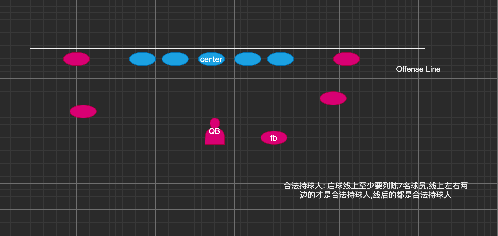

# Game

生活大于键盘. 笑哭脸.jpg

Have fun,kid.

---

## 1. 橄榄球

主要是美式橄榄球的规则,好像挺牛掰的样子. 笑哭脸.jpg

#### 1.1 入门规则

[bilibili 美式橄榄球基础规则视频 link](https://www.bilibili.com/video/av44610248)

看完上面这个基础规则视频之后,还有一些不太明白的话,可以接着看下面这个文章.

[美式橄榄球基础规则 link](https://baijiahao.baidu.com/s?id=1632388995397732533)

#### 1.2 FAQ

Q: `4down` 进攻里面,比如第一档从 40 码迈进 3 码到了 37 码,那么第二档发起进攻该从什么地方开始?

A: 第二档进攻从第一档进攻推进到的 37 码开始发球,启动进攻.

Q: 如果 4 档进攻都没达到 10 码,该怎么办?

A: 进攻 4 次,向前推进的总距离要是不到 10 码,那么攻守双方必须就地转换.在三次进攻后,没能向前推进 10 码,可以选择`弃踢`.在三次进攻,距离对方端区不远时(`最好是30码以内`),可以考虑`射门`,射门成功可得 3 分.如果射门失败,不仅没得分,攻防关系转换后,对方要从球踢出的位置开始进攻,所以离对方端区比较近才会考虑射门.

Q: 你给我翻译,翻译,什么叫`弃踢`,什么叫他妈的`弃踢`? 姜文脸.jpg

A: 弃踢实际上是第 4 次进攻的另类形式,姑且将弃踢理解成`放弃第 4 次进攻,把球踢给对方`.弃踢时尽量把球踢到靠近对方端区的地方,对方接到球后再回攻,回攻手被我方拦截的位置,就是对方进攻的起点位置.

Q: 那么传球有什么规则呀?为什么`四分卫只传出一次`,而不是像篮球一样传来传去?

A: 每次进攻`只有 1 次向前传球`的机会;其次,球只能从启球线的后方(进攻方这边)扔出;再次,进攻方只有特定队员`(合法接球者:內锋没有权利接向前的传球,端锋可以)`才有资格接球.

Q: 合法持球员是什么意思?

A: 合法接球员简单来说就是进攻组线上只有左右最边上两个人是合法接球员,后场的都是合法接球员.

---

## 2. 篮球

篮球规则太多了,泪目.

#### 2.1 基础规则

| 规则        | 描述                                                                                                                                                                                                           |
| ----------- | -------------------------------------------------------------------------------------------------------------------------------------------------------------------------------------------------------------- |
| `5 秒规则`  | 持球后,球员必须在 5 秒钟之内掷界外球(5s 内要发出球)                                                                                                                                                            |
| `8 秒规则`  | 球队从后场控制球开始,必须在 8 秒钟内使球进入前场(对方的半场)                                                                                                                                                   |
| `24 秒规则` | 进攻球队在场上控球时必须在 24 秒钟内投篮出(二次进攻为 14s,nba 现在)手.                                                                                                                                         |
| `3 秒规则`  | 分为进攻 3 秒和防守 3 秒. `进攻 3 秒`:进攻方球员不得滞留于 3 秒区 3 秒以上.  `防守 3 秒`:当某防守方球员对应的进攻方球员不在 3 秒区或者 3 秒区边缘、且彻底摆脱防守球员时,防守方球员不得滞留禁区 3 秒以上. |

#### 2.2 FAQ

Q: 一场比赛时长是怎样子的?

A: 一场篮球比赛是由 4 节组成,每节 12 分钟,加时赛的比赛时间均为 5 分钟.上下半场之间休息 15 分钟,节与节之间休息 2 分钟.

Q: 一共有多少次暂停?

A: 暂停分`短暂停`,`常规暂停`和`官方暂停`.短暂停时间为 20 秒,常规暂停时间为 100 秒或者 60 秒,官方暂停时间为 100 秒.`比赛双方在上下半场各有一个短暂停`,不能累计使用(上半场的短暂停不能留到下半场),但下半场的短暂停可以在加时赛中继续使用.常规暂停也叫长暂停,有 100 秒和 60 秒两种.`比赛双方在常规时间 48 分钟内可以叫六次长暂停`,其中包括四次 100 秒暂停和两次 60 秒短暂停.100 秒暂停每节使用<=1 次.

Q: 常见的犯规有哪些?

A: 野球场上常见的犯规有:`没摸到的打手啦`,`马拉松一样的三步上篮`.

Q: 什么时候开始罚球?

A: 通常在攻方队员进攻时,防守队员侵犯对方队员时,而且犯规方球队累计犯规四次以上要罚球,而 4 次或 4 次以下发界外球.

---

## 3. 足球

#### 3.1 基础规则

[bilibili 足球入门规则视频 link](https://www.bilibili.com/video/av20500563)

#### 3.2 FAQ

Q: 越位是什么?

A: 进攻队员向前传球的一瞬间,`接球队员在对方半场,且在比对方倒数第 2 名防守队员更靠近对方球门线`(传球给队友的时候,保证有两个对方球员在 ta 前面就可以避免越位).

Q: 每场可以更换多少队员?

A: 一场比赛下来`只能换三个队员`,在比赛中,替补队员名单必须在比赛开始前交给裁判员.

Q: 当其中一名队员被`红牌(或2张黄牌)罚下`,可以更换队员上场吗?

A: 不能,如果被罚下,只能己方 10 个队员在场比赛,不像篮球比赛那样子可以更换新的队员上场.

---

## 4. 网球

那时候的莎拉波娃是真的好看. 笑哭脸.jpg

#### 4.1 网球规则

[bilibili 网球规则视频 link](https://www.bilibili.com/video/av82456106)

#### 4.2 FAQ

Q: 怎么计分的,网球里面?

A: 一局内可能出现的分数为 0,15,30,40,结束.其实等同于 0,1,2,3 结束.一方赢得一分,记为 15:0,以此类推.40:40 成为平分(Deuce),此时一方得分称为占先.`一方需至少多赢两分才能赢下一局`,此时局数加一.

Q: 局数和盘又是什么?

A: 盘由局所构成,局数先到 6 的一方赢得此盘.局数相当于 nba 的节数,盘就是整场比赛.
