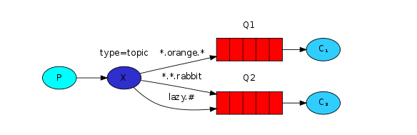
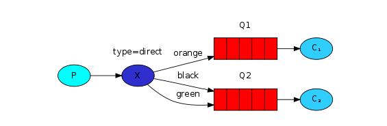

# RabbitMQ 的消费模式

RabbitMq 的消费模式,[详情 link](https://www.rabbitmq.com/getstarted.html)

---

## 1. Topic



匹配规则

```java
*: 只能匹配一个单词

#: 匹配多个


hello.* 符合: hello.123, 但是不符合hello.1.23

hello.# 符合: hello.123, 符合hello.1.23
```

### 1.1 生产者

```java
import com.app.util.RabbitUtil;
import com.rabbitmq.client.Channel;
import com.rabbitmq.client.Connection;

public class TopicProducer {

      private static final String EXCHANGE_NAME = "ex_topic";

      /**
       * 发送消息
       *
       * @param msg
       *            信息
       * @param topicVal
       *            topic
       */
      public static void sendMsg(String msg, String topicVal) {
            try {
                  Connection conn = RabbitUtil.getDefRabbitConnection();
                  Channel channel = conn.createChannel();

                  channel.exchangeDeclare(EXCHANGE_NAME, "topic");
                  channel.basicPublish(EXCHANGE_NAME, topicVal, null, msg.getBytes());

                  System.out.println("TopicProducer(" + topicVal + ") sending: " + msg);

                  channel.close();
                  conn.close();
            } catch (Exception e) {
                  e.printStackTrace();
            }
      }

}
```

### 1.2 消费者

```java
import java.io.IOException;

import com.app.util.RabbitUtil;
import com.rabbitmq.client.AMQP.BasicProperties;
import com.rabbitmq.client.Channel;
import com.rabbitmq.client.Connection;
import com.rabbitmq.client.Consumer;
import com.rabbitmq.client.DefaultConsumer;
import com.rabbitmq.client.Envelope;

public class TopicConsumer {

    private final static String EXCHANGE_NAME = "ex_topic";

    private String nameOfConsumer;

    private String topicExpression;

    private String queueName;

    public TopicConsumer(String nameOfConsumer, String topicExpression, String queueName) {
        this.nameOfConsumer = nameOfConsumer;
        this.topicExpression = topicExpression;
        this.queueName = queueName;
    }

    public void process() {
        try {
            Connection conn = RabbitUtil.getDefRabbitConnection();
            final Channel channel = conn.createChannel();
            channel.queueDeclare(queueName, false, false, false, null);
            channel.queueBind(queueName, EXCHANGE_NAME, topicExpression);
            channel.basicQos(1);
            Consumer consumer = new DefaultConsumer(channel) {
                @Override
                public void handleDelivery(String consumerTag, Envelope envelope, BasicProperties properties,
                        byte[] body) throws IOException {
                    String msg = new String(body, "UTF-8");
                    System.out.println(nameOfConsumer + "recieve: " + msg);
                    channel.basicAck(envelope.getDeliveryTag(), false);
                }
            };
            channel.basicConsume(queueName, false, consumer);
        } catch (Exception e) {
            e.printStackTrace();
        }
    }
}
```

### 1.3 测试代码

```java
public class RabbitTopicTest {

      public static void main(String[] args) {

            /**
             * 定义发送消息和routingKey
             */
            TopicProducer.sendMsg("It's save", "hello.insert");
            TopicProducer.sendMsg("It's delete", "hello.delete");

            /**
             * 只获取routingKey为hello.insert的信息
             */
            TopicConsumer t1 = new TopicConsumer("T1", "hello.insert", "topic_queue_t1");
            t1.process();

            /**
             * 匹配所有的信息
             */
            TopicConsumer t2 = new TopicConsumer("T2", "#", "topic_queue_t2");
            t2.process();

            /**
             * 只获取hello.为前缀的消息
             */
            TopicConsumer t3 = new TopicConsumer("T3", "hello.*", "topic_queue_t3");
            t3.process();

      }

}
```

---

## 2. Route



### 2.1 生产者

```java
import com.app.util.RabbitUtil;
import com.rabbitmq.client.Channel;
import com.rabbitmq.client.Connection;

public class RouteMsgProducer {

      private final static String EXCHANGE_NAME = "ex_route";

      /**
       * 发送消息到路由
       *
       * @param routeKey
       *            路由key
       * @param msg
       *            消息主体
       */
      public static void sendMsgToRoute(String routeKey, String msg) {
            try {

                  Connection conn = RabbitUtil.getDefRabbitConnection();
                  Channel channel = conn.createChannel();

                  /*
                   * 修改类型为:direct
                   */
                  channel.exchangeDeclare(EXCHANGE_NAME, "direct");
                  /*
                   * 使用routingKey
                   */
                  channel.basicPublish(EXCHANGE_NAME, routeKey, null, msg.getBytes());

                  System.out.println("RouteProducer(" + routeKey + ") sending: " + msg);

                  channel.close();
                  conn.close();

            } catch (Exception e) {
                  e.printStackTrace();
            }

      }

}
```

### 2.2 消费者

```java
import java.io.IOException;

import com.app.util.RabbitUtil;
import com.rabbitmq.client.AMQP.BasicProperties;
import com.rabbitmq.client.Channel;
import com.rabbitmq.client.Connection;
import com.rabbitmq.client.Consumer;
import com.rabbitmq.client.DefaultConsumer;
import com.rabbitmq.client.Envelope;

public class RouteConsumer {

      private final String EXCHANGE_NAME = "ex_route";

      /**
       * 消费者名称
       */
      private String consumerName;

      /**
       * routeKey
       */
      private String routeKey;

      /**
       * 队列名称
       */
      private String queueName;

      public RouteConsumer(String consumerName, String routeKey, String queueName) {
            super();
            this.consumerName = consumerName;
            this.routeKey = routeKey;
            this.queueName = queueName;
      }

      /**
       * 处理消息
       */
      public void process() {
            try {
                  Connection conn = RabbitUtil.getDefRabbitConnection();
                  final Channel channel = conn.createChannel();

                  channel.queueDeclare(queueName, false, false, false, null);

                  channel.basicQos(1);
                  channel.queueBind(queueName, EXCHANGE_NAME, routeKey);

                  Consumer consumer = new DefaultConsumer(channel) {

                        @Override
                        public void handleDelivery(String consumerTag, Envelope envelope, BasicProperties properties,
                                    byte[] body) throws IOException {

                              String msg = new String(body, "UTF-8");
                              System.out.println(consumerName + " rev: " + msg);

                              channel.basicAck(envelope.getDeliveryTag(), false);
                        }
                  };

                  channel.basicConsume(queueName, false, consumer);
            } catch (Exception e) {
                  e.printStackTrace();
            }
      }

}
```

### 2.3 测试

```java
public class RabbitRouteTest {
      public static void main(String[] args) {

            /**
             * 将消息发送给routeKey为dog的queue
             */
            RouteMsgProducer.sendMsgToRoute("dog", "This is my dog");

            /**
             * 获取routeKey为dog的queue的消息
             */
            RouteConsumer rc1 = new RouteConsumer("RC1", "dog", "route_queue_dog");
            rc1.process();

            /**
             * 获取routeKey为cat的queue的消息
             */
            RouteConsumer rc2 = new RouteConsumer("RC2", "cat", "route_queue_cat");
            rc2.process();
      }
}
```

---

## 3. 参考资料

a. [Rabbit 官网](https://www.rabbitmq.com/getstarted.html)
