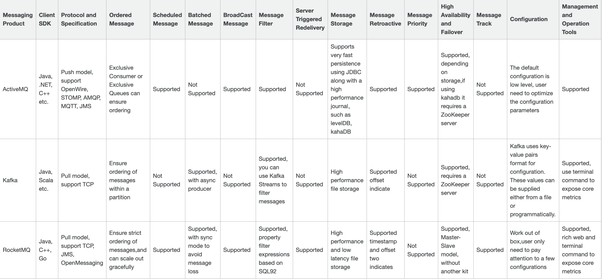
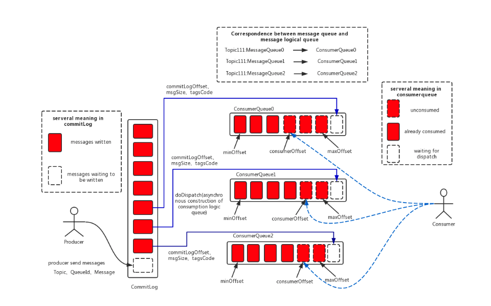
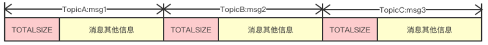
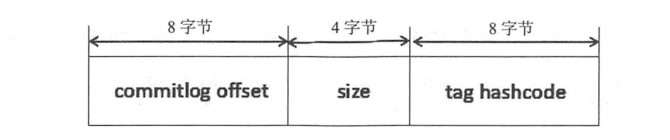
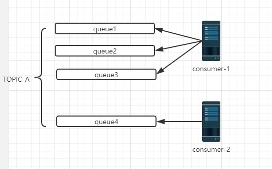
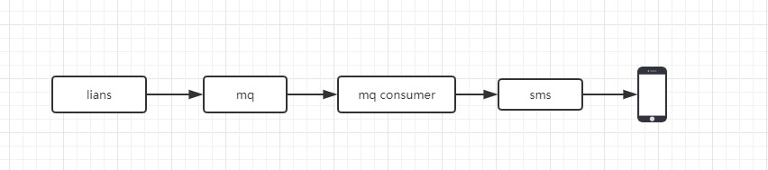
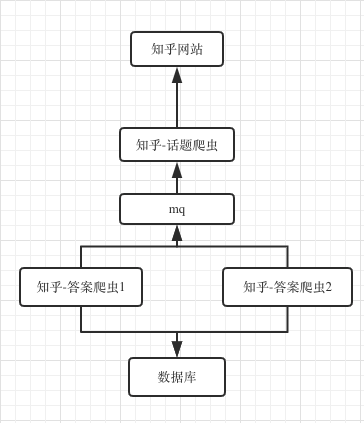

# Hello Rocketmq

| 文档名称       | 创建人                                                  | 创建时间   | 描述                    |
| -------------- | ------------------------------------------------------- | ---------- | ----------------------- |
| Hello Rocketmq | <u style='color:#95a5a6'>huanghuapeng@ingbaobei.com</u> | 2019-08-11 | RocketMq 基础知识与应用 |

多年以后,站在敬老院的门前,我将会回想起今天给各位大佬瑟瑟发抖的讲述 rocket 那个遥远的下午.

---

## 1. RocketMq 基础知识

[RocketMq 基础知识官方文档 link](http://rocketmq.apache.org/docs/core-concept/)

### 1.1 Why RocketMq?

Q: 为什么使用 rocketmq,而不使用其他的 mq 呢?

A: 官方给出的回答.

```bash
# Based on our research, with increased queues and virtual topics in use, ActiveMQ IO module reaches a bottleneck. We tried our best to solve this problem through throttling, circuit breaker or degradation, but it did not work well. So we begin to focus on the popular messaging solution Kafka at that time. Unfortunately, Kafka can not meet our requirements especially in terms of low latency and high reliability, see here for details.

大意: 随着队列和topic的增长,ActiveMq遇到了瓶颈.kafka的低延迟和高可靠不达标.

# In this context, we decided to invent a new messaging engine to handle a broader set of use cases, ranging from traditional pub/sub scenarios to high volume real-time zero-loss tolerance transaction system.

大意: 在这样子的前提下,决定去弄一个新的消息引擎来处理消息,从传统的发布/订阅场景到`高容量`,`实时`,`零丢失`事务系统.
```

下面是 RocketMq 和 Kafka 以及 ActiveMq 的对比(注意: 站在偏向 RocketMq 的角度的对比)



- ordered message: FIFO(First in first out).
- scheduled message: 定时发送消息.
- batched message: 批量消息(相当 jdbc 的批处理).
- broadcast message: 广播消息.

### 1.2 rocketmq 的结构

Q: 那么一般高可用的 rocketmq 的架构是怎样子呢?

A: 请看下面这个被复制烂的架构图.[rocketmq 架构 link](http://rocketmq.apache.org/docs/rmq-arc/)


名称解释

| 名称                | 说明                                                                                                                                                                                                                                                                                                                                         |
| ------------------- | -------------------------------------------------------------------------------------------------------------------------------------------------------------------------------------------------------------------------------------------------------------------------------------------------------------------------------------------- |
| `Producer`          | 消息生产者,位于用户的进程内,Producer 通过 NameServer 获取所有 Broker 的路由信息,根据负载均衡策略选择将消息发到哪个 Broker,然后调用 Broker 接口提交消息.                                                                                                                                                                                      |
| `Producer Group`    | 生产者组,简单来说就是多个发送同一类消息的生产者称之为一个生产者组.                                                                                                                                                                                                                                                                           |
| `Consumer`          | 消息消费者,位于用户进程内.Consumer 通过 NameServer 获取所有 broker 的路由信息后,向 Broker 发送 Pull 请求来获取消息数据.Consumer 可以以两种模式启动,广播（Broadcast）和集群（Cluster）,广播模式下,一条消息会发送给所有 Consumer,集群模式下消息只会发送给一个 Consumer.                                                                        |
| `Consumer Group`    | 消费者组,和生产者类似,消费同一类消息的多个 Consumer 实例组成一个消费者组.<span style="color:red">(记住 ta,这个超重要的!!!)<span>                                                                                                                                                                                                             |
| `Topic`             | Topic 用于将消息按主题做划分,Producer 将消息发往指定的 Topic,Consumer 订阅该 Topic 就可以收到这条消息.Topic 跟发送方和消费方都没有强关联关系,发送方可以同时往多个 Topic 投放消息,消费方也可以订阅多个 Topic 的消息.在 RocketMQ 中,Topic 是一个上逻辑概念.消息存储不会按 Topic 分开.                                                          |
| `Message`           | 代表一条消息,使用 MessageId 唯一识别,用户在发送时可以设置 messageKey,便于之后查询和跟踪.一个 Message 必须指定 Topic,相当于寄信的地址.Message 还有一个可选的 Tag 设置,以便消费端可以基于 Tag 进行过滤消息.也可以添加额外的键值对,例如你需要一个业务 key 来查找 Broker 上的消息,方便在开发过程中诊断问题.                                      |
| `Tag`               | 标签可以被认为是对 Topic 进一步细化.一般在相同业务模块中通过引入标签来标记不同用途的消息.                                                                                                                                                                                                                                                    |
| `Broker`            | Broker 是 RocketMQ 的核心模块,负责接收并存储消息,同时提供 Push/Pull 接口来将消息发送给 Consumer.Consumer 可选择从 Master 或者 Slave 读取数据.多个主/从组成 Broker 集群,集群内的 Master 节点之间不做数据交互.Broker 同时提供消息查询的功能,可以通过 MessageID 和 MessageKey 来查询消息.Borker 会将自己的 Topic 配置信息实时同步到 NameServer. |
| `Queue`             | Topic 和 Queue 是 1 对多的关系,一个 Topic 下可以包含多个 Queue,主要用于负载均衡.发送消息时,用户只指定 Topic,Producer 会根据 Topic 的路由信息选择具体发到哪个 Queue 上.Consumer 订阅消息时,会根据负载均衡策略决定订阅哪些 Queue 的消息.                                                                                                       |
| `Offset`            | RocketMQ 在存储消息时会为每个 Topic 下的每个 Queue 生成一个消息的索引文件,每个 Queue 都对应一个 Offset 记录当前 Queue 中消息条数.                                                                                                                                                                                                            |
| `NameServer`        | NameServer 可以看作是 RocketMQ 的注册中心,它管理两部分数据:集群的 Topic-Queue 的路由配置;Broker 的实时配置信息.其它模块通过 Nameserv 提供的接口获取最新的 Topic 配置和路由信息.                                                                                                                                                              |
| `Producer/Consumer` | 通过查询接口获取 Topic 对应的 Broker 的地址信息                                                                                                                                                                                                                                                                                              |
| `Broker`            | 注册配置信息到 NameServer, 实时更新 Topic 信息到 NameServer                                                                                                                                                                                                                                                                                  |

### 1.3 pull 与 push 模式

消息队列消息有两种方式

| 模式   | 说明                                                                                                                                    |
| ------ | --------------------------------------------------------------------------------------------------------------------------------------- |
| `Push` | 由 MQ 收到消息后主动调用消费者的新消息通知接口,需要消耗服务器 MQ 宝贵的线程资源,同时消费者只能被动等待消息通知(适合实时性要求高的场景). |
| `Pull` | 由消费者轮询调用 API 去获取消息,不消耗服务器 MQ 线程,消费者更加主动,虽然消费者的处理逻辑变得稍稍复杂.                                   |

两种方式的根本区别在于线程消耗问题,由于 MQ 服务器的线程资源相对客户端更加宝贵,Push 方式会占用服务器过多的线程从而难以适应高并发的消息场景.同时当某一消费者离线一段时间再次上线后,大量积压消息处理会消耗大量 MQ 线程从而拖累其它消费者的消息处理,所以 Pull 方式相对来说更好.

By the way,现在账号服务那边使用的是:`push`模式.

---

## 2. 高可用设计

### 2.1 消息的存储结构

[rocketmq 存储结构优秀文档 link](https://github.com/apache/rocketmq/blob/master/docs/cn/design.md)

#### 2.1.1 存储结构

rocketmq 消息存储结构如下所示(origin from `RocketMQ技术内幕`)



- CommitLog: 消息存储文件,所有消息主体的消息都存在 CommitLog 文件里面.
- ConsumeQueue: 消息消费队列.消息到达 CommitLog 文件后,将异步转发消息到消费队列,供消费者消费.
- IndexFile: 消息索引文件.存储消息的 key 和 offset 对应关系.
- 事务状态: 存储每条消息的事务的状态
- 定时消息服务: 每一个延迟级别对应一个消息消费队列,并存储延迟队列的消息拉取进度.

commitlog 消息存放格式,如下图所示,图片来源:[link](https://segmentfault.com/a/1190000018513635?utm_source=tag-newest)



consumerqueue 数据格式



消费者根据 topic 拉取数据流程:`从ConsumeQueue里面获取CommitLog offset,消息长度` -> `从commitlog里面根据偏移量获取` -> 卧槽,我竟然看不懂.

简要流程: ConsumeQueue（逻辑消费队列）作为消费消息的索引，保存了指定 Topic 下的队列消息在 CommitLog 中的起始物理偏移量 offset，消息大小 size 和消息 Tag 的 HashCode 值

#### 2.1.2 topic-queue 设计

Q: 在 rocketmq 里面,一个 topic 可以对应多个 queue,那么我们该怎么有效的设置 topic 与 queue 的数量呢?



A: TOPIC_A 在一个 Broker 上的 Topic 分片有 5 个 Queue,一个 Consumer Group 内有 2 个 Consumer 按照集群消费的方式消费消息,按照平均分配策略进行负载均衡得到的结果是:第一个 Consumer 消费 3 个 Queue,第二个 Consumer 消费 1 个 Queue.如果增加 Consumer,每个 Consumer 分配到的 Queue 会相应减少.Rocket MQ 的负载均衡策略规定:**<u style='color:#e74c3c'>Consumer 数量应该小于等于 Queue 数量,如果 Consumer 超过 Queue 数量,那么多余的 Consumer 将不能消费消息</u>**.在一个 Consumer Group 内,Queue 和 Consumer 之间的对应关系是一对多的关系:`一个 Queue 最多只能分配给一个 Consumer,一个 Cosumer 可以分配得到多个 Queue`.这样的分配规则,每个 Queue 只有一个消费者,可以避免消费过程中的多线程处理和资源锁定,有效提高各 Consumer 消费的并行度和处理效率.[origin link](https://mp.weixin.qq.com/s/1pFddUuf_j9Xjl58MBnvTQ)

### 2.2 消费模式

RocketMQ 有两种消费模式:`BROADCASTING(广播模式)`和`CLUSTERING(集群模式)`,默认的是 `集群消费模式`.

源码: `com.alibaba.rocketmq.client.consumer.DefaultMQPushConsumer`

```java
 public DefaultMQPushConsumer(String consumerGroup, RPCHook rpcHook, AllocateMessageQueueStrategy allocateMessageQueueStrategy) {
    // MessageModel.CLUSTERING为集群消费模式
    this.messageModel = MessageModel.CLUSTERING;
    this.consumeFromWhere = ConsumeFromWhere.CONSUME_FROM_LAST_OFFSET;
    this.consumeTimestamp = UtilAll.timeMillisToHumanString3(System.currentTimeMillis() - 1800000L);
    this.subscription = new HashMap();
    this.consumeThreadMin = 20;
    this.consumeThreadMax = 64;
    this.adjustThreadPoolNumsThreshold = 100000L;
    this.consumeConcurrentlyMaxSpan = 2000;
    this.pullThresholdForQueue = 1000;
    this.pullInterval = 0L;
    this.consumeMessageBatchMaxSize = 1;
    this.pullBatchSize = 32;
    this.postSubscriptionWhenPull = false;
    this.unitMode = false;
    this.consumerGroup = consumerGroup;
    this.allocateMessageQueueStrategy = allocateMessageQueueStrategy;
    this.defaultMQPushConsumerImpl = new DefaultMQPushConsumerImpl(this, rpcHook);
}
```

代码设置消费模式,示例如下

```java
 try {
    DefaultMQPushConsumer consumer = new DefaultMQPushConsumer(String.valueOf(id));
    consumer.setNamesrvAddr(MqSetting.NAME_SERVER_HOST);
    // 设置消费类型,集群还是广播
    consumer.setMessageModel(MessageModel.BROADCASTING);


    // 订阅主题和标签
    consumer.subscribe(MqSetting.TOPIC_NAME, "*");
    consumer.setConsumeFromWhere(ConsumeFromWhere.CONSUME_FROM_FIRST_OFFSET);

    // 注册监听器
    consumer.registerMessageListener(new MsgListener("consumer-" + id));

    consumer.start();
} catch (Exception e) {
    e.printStackTrace();
}
```

#### 2.2.1 广播消费模式

广播消费模式:<u>topic 下的同一条消息将被集群内的所有消费者消费一次.</u>


适用场景: req -> ehcache -> redis -> db,使用 mq 来做 ehcache 缓存的数据清理.

#### 2.2.2 集群消费模式

集群消费模式:<u>topic 下的同一条消息只允许被其中一个消费者消费</u>

<span style='color:#e74c3c'>FBI WARNING</span>: **在集群消费模式下,一个 Topic 的消息被多个 Consumer Group 消费的行为比较特殊.每个 Consumer Group 会分别将该 Topic 的消息消费一遍;在每一个 Consumer Group 内,各 Consumer 通过负载均衡的方式消费该 Topic 的消息.**


适用场景: 如 lians 的手机通知短信的发送(存在多个手机短信 mq 消费端).

### 2.3 消息的 ack

[rocketmq ack 消费确认机制 link](https://zhuanlan.zhihu.com/p/25265380)

#### 2.3.1 消费策略

```java
//默认策略,从该队列最尾开始消费,即跳过历史消息
CONSUME_FROM_LAST_OFFSET

//从队列最开始开始消费,即历史消息（还储存在broker的）全部消费一遍
CONSUME_FROM_FIRST_OFFSET

//从某个时间点开始消费,和setConsumeTimestamp()配合使用,默认是半个小时以前
CONSUME_FROM_TIMESTAMP
```

#### 2.3.2 ack 代码示例

```java
/**
* 消费者
*/
static class MsgListener implements MessageListenerConcurrently {
/**
 * 线程名称
 */
private String threadName;

private static Supplier<String> dateSupplier = () -> {
    SimpleDateFormat sdf = new SimpleDateFormat("yyyy-MM-dd HH:mm:ss");
    return sdf.format(new Date());
};

MsgListener(String threadName) {
    this.threadName = threadName;
}

@Override
public ConsumeConcurrentlyStatus consumeMessage(List<MessageExt> list, ConsumeConcurrentlyContext consumeConcurrentlyContext) {
    try {
        Message message = list.get(0);
        System.out.println(dateSupplier.get() + " - " + threadName + " - " + message.getTopic() + "." + message.getTags() + ":" + new String(message.getBody()));

        // 消费成功
        return ConsumeConcurrentlyStatus.CONSUME_SUCCESS;
    } catch (Exception e) {
        // 消费失败,重试
        return ConsumeConcurrentlyStatus.RECONSUME_LATER;
    }
}
}
```

---

## 3. 使用案例

mq 的使用场景.

### 3.1 lians 的短信消息

改造消息发送前


改造消息发送后



- 解耦,确定消息服务出问题的情况下,不影响主流程.
- 保证消息发送.

### 3.2 爬虫优化

偶尔喜欢刷知乎,所以弄了一个爬虫去爬取知乎的高赞回答.

现在获取到的话题数量

```sql
mysql> select count(1) from t_zhihu_topic
+----------+
| count(1) |
+----------+
|     7058 |
+----------+
1 row in set (0.00 sec)
```

如果每一个话题下面有 10(如生活下面那种话题,远远大这个数量) 个回答,那么总回答大概在: 7058x10 个.因为知乎存在反爬,同一个 ip 要请求间隔要>10s 才不会被禁用(另一个方案是使用 ip 代理池).这个可以看出一台服务器的话,爬取这个知乎答案,简直就是锻炼耐性.是的,你没猜错,现在就是一台服务器在爬取. 泪流满面.gif

Q:那么该怎么改进这个爬取的玩意呢?

A:把那些知乎话题下面的回答的 url,放到 mq 里面,在多个服务器上面,开启多个消费端来消费,这样子就能加快爬取的速度了.

version1 架构


version2 架构



---

## 4. 注意事项

### 4.1 topic 与 tag 的设计

Q: 到底什么时候该用 Topic,什么时候该用 Tag？[详情 link](https://help.aliyun.com/document_detail/95837.html?spm=a2c4g.11186623.6.613.405c1da9JMnX5O)

A: 设计参考如下:

- 消息类型是否一致:如普通消息,事务消息,定时消息,顺序消息,不同的消息类型使用不同的 Topic,无法通过 Tag 进行区分.

- 业务是否相关联:没有直接关联的消息,如淘宝交易消息,京东物流消息使用不同的 Topic 进行区分；而同样是天猫交易消息,电器类订单、女装类订单、化妆品类订单的消息可以用 Tag 进行区分.

- 消息优先级是否一致:如同样是物流消息,盒马必须小时内送达,天猫超市 24 小时内送达,淘宝物流则相对会会慢一些,不同优先级的消息用不同的 Topic 进行区分.

- 消息量级是否相当:有些业务消息虽然量小但是实时性要求高,如果跟某些万亿量级的消息使用同一个 Topic,则有可能会因为过长的等待时间而『饿死』,此时需要将不同量级的消息进行拆分,使用不同的 Topic.

场景: 比如会员成长值的增长,使用 topic:`sys_xyz_topic`,tag 有如下类型值:

```json
{
  "SCAN_MATERIAL": "浏览内容",
  "FIRST_UPLOAD_POLICY": "首次完成上传保单",
  "DAILY_SIGNED": "每日签到",
  "REGISTRATION_SUCCESS": "完成付费（支付成功），挂号",
  "BIND_WX_CODE": "绑定微信号",
  "SUBSCRIBE": "关注公众号",
  "SHARE_MATERIAL": "分享内容",
  "FIRST_REGISTRATION": "首次挂号",
  "POLICY_SUCCESS": "完成付费（支付成功），投保",
  "BIND_PHONE": "绑定手机号",
  "INVITE_USER": "邀请用户",
  "FIRST_BUY_POLICY": "首次投保",
  "FIRST_PRODUCT_EVALUATE": "首次查看某个产品分析或上传产品",
  "FIRST_DIAGNOSTIC": "首次完成智诊",
  "BIRTHDAY_INSURE": "生日投保"
}
```

Q: 那我可不可以把 tag 设置为 topic 呀?

A: 江湖有一句老话,`可以,但是没必要`. 微笑.jpg

### 4.2 消费幂等

消费幂等[详情 link](https://help.aliyun.com/document_detail/44397.html),保证消息的唯一性:

- 发送时消息重复
- 投递时消息重复
- 负载均衡时消息重复（包括但不限于网络抖动、Broker 重启以及订阅方应用重启）

Fun fact: `rocketmq确认消息肯定会被消费>=1次`.

所以在一些被消费一次的消息里面,做幂等校验,相当重要.如转账之类的业务场景.

**解决方法**

生产者

```java
Message message = new Message();
message.setKey("ORDERID_100");
SendResult sendResult = producer.send(message);
```

消费者

```java
consumer.subscribe("ons_test", "*", new MessageListener() {
    public Action consume(Message message, ConsumeContext context) {
        String key = message.getKey()
        // 根据业务唯一标识的 key 做幂等处理
        if(isUniqueOrderKey(key)){
            // continue do anything you want.
        }
    }
});
```

场景: lians 手机发送消息消费端,如果使用`msg_id`来做 mq 消息去重的处理.(`t_template_sms.mq_message_id`,如果没猜错的话)

### 4.3 订阅关系一致

**订阅关系一致** [link](https://help.aliyun.com/document_detail/43523.html?spm=a2c4g.11186623.6.605.2a381da95V6B1X)

订阅关系一致指的是同一个消费者 Group ID 下所有 Consumer 实例的处理逻辑必须完全一致.<u style='color:#e74c3c'>一旦订阅关系不一致,消息消费的逻辑就会混乱,甚至导致消息丢失</u>.消息队列 RocketMQ 里的一个消费者 Group ID 代表一个 Consumer 实例群组.对于大多数分布式应用来说,一个消费者 Group ID 下通常会挂载多个 Consumer 实例.

由于消息队列 RocketMQ 的订阅关系主要由 Topic + Tag 共同组成,因此,保持订阅关系一致意味着同一个消费者 Group ID 下所有的实例需在以下两方面均保持一致:

- 订阅的 Topic 必须一致

- 订阅的 Topic 中的 Tag 必须一致

所以,订阅关系的一致性几乎是整一个 rocketmq 正常运行的前提,不要浪,不要浪,不要浪,over!!!

---

## 5. 参考资料

| name                                     | link                                                                               |
| ---------------------------------------- | ---------------------------------------------------------------------------------- |
| RocketMq 官方文档                        | [link](http://rocketmq.apache.org/docs/quick-start/)                               |
| RocketMq 博客                            | [link](https://www.cnblogs.com/qdhxhz/p/11094624.html)                             |
| RocketMQ 消息发送的高可用设计            | [link](http://objcoding.com/2019/04/06/rocketmq-fault-strategy/)                   |
| 分布式开放消息系统(RocketMQ)的原理与实践 | [link](https://www.cnblogs.com/xuwc/p/9034352.html)                                |
| RocketMq 分布式事务                      | [link](https://www.jianshu.com/p/cc5c10221aa1)                                     |
| RocketMq 优秀样例                        | [link](https://github.com/apache/rocketmq/blob/master/docs/cn/RocketMQ_Example.md) |

---

## 6. 写在最后

这里面的人个个都是人才,写代码又厉害,超喜欢在里面的.

谢谢各位,如果有任何疑问请联系`huanghuapeng@ingbaobei.com`.
