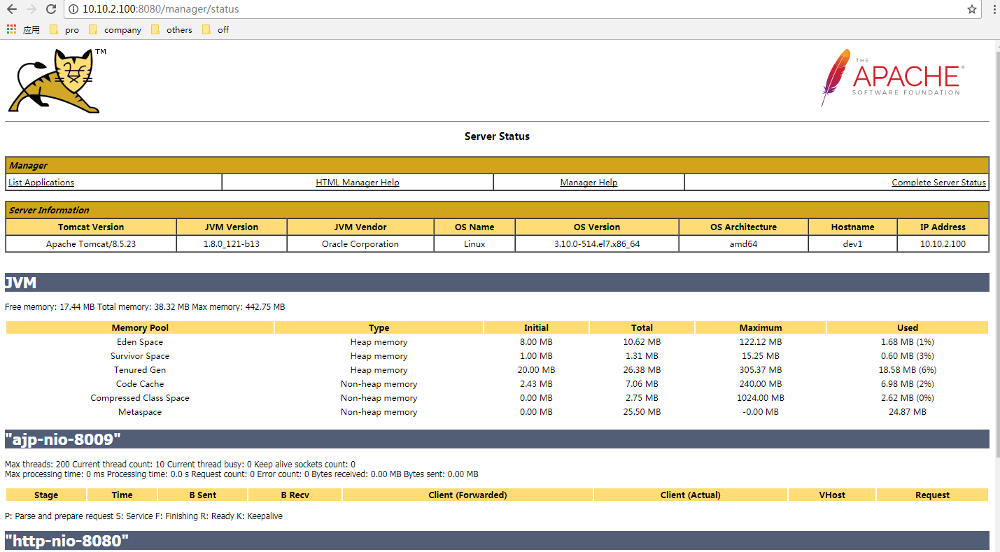

# Tomcat 使用指南

该文档仅适用于 tomcat8 用于设置 tomcat 用户,请知悉.

---

## 1. tomcat 添加用户

### 1.1 配置 manager.xml

因为 tomcat 默认的配置,不允许远程连接管理 tomcat,需要在目录`conf/Catalina/localhost`下配置一个`manager.xml`,内容如下

```xml
<Context privileged="true" antiResourceLocking="false"
         docBase="${catalina.home}/webapps/manager">
             <Valve className="org.apache.catalina.valves.RemoteAddrValve" allow="^.*$" />
</Context>
```

### 1.2 配置访问用户和密码

在`conf/tomcat-users.xml`节点`<tomcat-users>...</tomcat-users>`添加如下内容.

```xml
<role rolename="manager-gui"/>
<user username="tomcat" password="tomcat" roles="manager-gui"/>
```

### 1.3 重启 tomcat

```shell
[root@team-2 tomcat8]# bin/shutdown.sh
[root@team-2 tomcat8]# bin/startup.sh
```

### 1.4 测试



---

## 2. tomcat 修改端口

在 tomcat 里面,如果不想使用默认的 8080 端口,可以自行修改.

### 2.1 修改配置文件

修改`port="8080"`为修改端口就好.

```xml
<Connector port="8080" protocol="HTTP/1.1"
               executor="tomcatThreadPool"
               connectionTimeout="20000"
               redirectPort="8443" />
```

### 2.2 重启 tomcat

```shell
[root@team-2 tomcat8]# bin/shutdown.sh
[root@team-2 tomcat8]# bin/startup.sh
```

---
