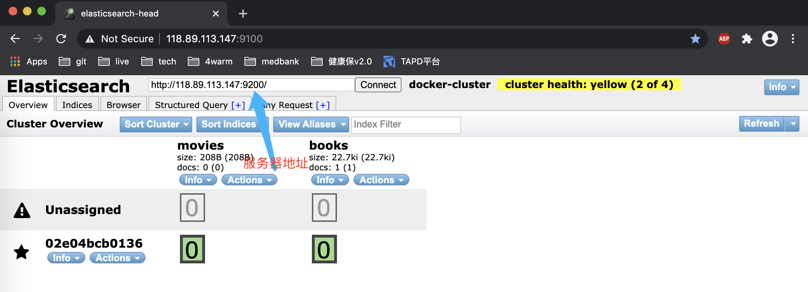

# Docker&ElasticSearch

elasticsearch 官网[link](https://www.elastic.co/guide/en/elasticsearch/reference/current/elasticsearch-intro.html)

---

## 1. docker 安装 es

服务器环境: <u>`centos`</u>

elasticsearch: <u>`7.12.0`</u>

### 1.1 下载镜像

[docker 安装 elasticsearch 官方指导 link](https://www.elastic.co/guide/en/elasticsearch/reference/7.12/docker.html)

```sh
# root @ team3 in ~ [12:28:41]
$ docker pull docker.elastic.co/elasticsearch/elasticsearch:7.12.0
Trying to pull repository docker.elastic.co/elasticsearch/elasticsearch ...

# root @ team3 in ~ [12:30:02]
$ docker images
REPOSITORY                                      TAG                 IMAGE ID            CREATED             SIZE
docker.elastic.co/elasticsearch/elasticsearch   7.12.0              9337ed510a0c        2 weeks ago         830 MB

# root @ team3 in ~ [12:30:42]
$ docker run -p 9200:9200 -p 9300:9300 -e "discovery.type=single-node" docker.elastic.co/elasticsearch/elasticsearch:7.12.0


# root @ team3 in ~ [13:06:23]
$ docker ps -all
CONTAINER ID        IMAGE                                                  COMMAND                  CREATED             STATUS              PORTS                                            NAMES
02e04bcb0136        docker.elastic.co/elasticsearch/elasticsearch:7.12.0   "/bin/tini -- /usr..."   2 minutes ago       Up 2 minutes        0.0.0.0:9200->9200/tcp, 0.0.0.0:9300->9300/tcp   relaxed_bassi

# root @ team3 in ~ [13:06:33]
$ curl http://127.0.0.1:9200
{
  "name" : "02e04bcb0136",
  "cluster_name" : "docker-cluster",
  "cluster_uuid" : "TdZQxBg5RkqxsYUbxE-98A",
  "version" : {
    "number" : "7.12.0",
    "build_flavor" : "default",
    "build_type" : "docker",
    "build_hash" : "78722783c38caa25a70982b5b042074cde5d3b3a",
    "build_date" : "2021-03-18T06:17:15.410153305Z",
    "build_snapshot" : false,
    "lucene_version" : "8.8.0",
    "minimum_wire_compatibility_version" : "6.8.0",
    "minimum_index_compatibility_version" : "6.0.0-beta1"
  },
  "tagline" : "You Know, for Search"
}
```

开启防火墙端口

```sh
# root @ team3 in ~ [13:07:55]
$ firewall-cmd --add-port=9200/tcp --zone=public --permanent
success

# root @ team3 in ~ [13:08:13]
$ firewall-cmd --add-port=9300/tcp --zone=public --permanent
success

# root @ team3 in ~ [13:08:19]
$ firewall-cmd --reload
success
```

设置一下系统配置

```sh
#  在/etc/sysctl.conf追加vm.max_map_count配置
# root @ team3 in ~ [13:17:43] C:1
$ vim /etc/sysctl.conf

# elasticsearch setting
vm.max_map_count=262144

# root @ team3 in ~ [13:21:07] C:127
$ sysctl -w vm.max_map_count=262144
vm.max_map_count = 262144
```

到这里,我们就安装成功了. `:"}`

### 1.2 安装 Head

Q: 我们都已经安装了,那么要怎么使用呀?

A: 推荐使用 elasticsearch-head 界面管理工具.BTW,这玩意并不好用. :{

首先允许 elasticsearch 的跨域访问:

```sh
# 进入elasticsearch容器
# root @ team3 in ~ [14:10:50]
$ docker exec -it 02e04bcb0136 /bin/bash
[root@02e04bcb0136 elasticsearch]# pwd
/usr/share/elasticsearch
[root@02e04bcb0136 elasticsearch]# ls
LICENSE.txt  NOTICE.txt  README.asciidoc  bin  config  data  jdk  lib  logs  modules  plugins
[root@02e04bcb0136 elasticsearch]# vi config/elasticsearch.yml
[root@02e04bcb0136 elasticsearch]# cat  config/elasticsearch.yml
cluster.name: "docker-cluster"
network.host: 0.0.0.0

# 添加跨域设置
http.cors.enabled: true
http.cors.allow-origin: "*"

# 重启容器
# root @ team3 in ~ [14:14:04]
$ docker restart  02e04bcb0136
```

```sh
# root @ team3 in ~ [14:39:32] C:1
$ docker pull mobz/elasticsearch-head:5-alpine

# root @ team3 in ~ [14:40:35]
$ docker images |grep head
docker.io/mobz/elasticsearch-head               5-alpine            e2a76963bc18        4 years ago         78.9 MB

# root @ team3 in ~ [14:41:23]
$ docker run -p 9100:9100 -it e2a76963bc18

# mr3306 @ mr3306 in ~ [14:36:09]
$ curl -XGET http://118.89.113.147:9100


# root @ team3 in ~ [14:48:53] C:126
$ docker exec -it 0550ad4daba0 /bin/sh
/usr/src/app # ls
Dockerfile                            LICENCE                               elasticsearch-head.sublime-project    index.html                            package.json                          test
Dockerfile-alpine                     README.textile                        elasticsearch-head.sublime-workspace  node_modules                          plugin-descriptor.properties
Gruntfile.js                          _site                                 grunt_fileSets.js                     npm-debug.log                         src

# 修改_site/vendor.js
# 第6886行配置,contentType:"x-www-form-urlencoded" 修改为 contentType: "application/json;charset=UTF-8"
# 第7574行配置,s.contentType === "x-www-form-urlencoded" 修改为 s.contentType === "application/json;charset=UTF-8"
/usr/src/app # vi _site/vendor.js
/usr/src/app # exit

# 重启容器
# root @ team3 in ~ [15:41:25] C:1
$ docker restart 0550ad4daba0
```

启动成功之后,通过服务器地址+端口号访问 head 管理页面,如下所示



Q: 在服务器内存不足的时候,启动 docker 里面的 elasticsearch 容器会出现内存不足的情况,请问要怎么修改呀?

A: 网上可以找到设置 elasticsearch 的 jvm 运行内存大小来控制

```sh
# root @ team3 in /opt/soft [17:10:26] C:130
$ docker exec -it 02e04bcb0136 /bin/bash
[root@02e04bcb0136 config]# pwd ;ls
/usr/share/elasticsearch/config
elasticsearch.keystore	elasticsearch.yml  jvm.options	jvm.options.d  log4j2.file.properties  log4j2.properties  role_mapping.yml  roles.yml  users  users_roles

# 设置jvm.options
[root@02e04bcb0136 config]# vi jvm.options
################################################################
## IMPORTANT: JVM heap size
################################################################
##
## The heap size is automatically configured by Elasticsearch
## based on the available memory in your system and the roles
## each node is configured to fulfill. If specifying heap is
## required, it should be done through a file in jvm.options.d,
## and the min and max should be set to the same value. For
## example, to set the heap to 4 GB, create a new file in the
## jvm.options.d directory containing these lines:
##
## -Xms4g
## -Xmx4g
##
## See https://www.elastic.co/guide/en/elasticsearch/reference/current/heap-size.html
## for more information
##
################################################################
-Xms512m
-Xmx512m
```

---

## 2. 整合使用

### 2.1 整合 IK 分词器

下载 ik 分词器: [ik 分词器 github link](https://github.com/medcl/elasticsearch-analysis-ik/releases/tag/v7.12.0)

```sh
# root @ team3 in /opt/soft/ik [9:21:01]
$ docker cp /opt/soft/ik/elasticsearch-analysis-ik-7.12.0.zip  02e04bcb0136:/usr/share/elasticsearch/plugins


# root @ team3 in ~ [9:22:11] C:127
$ docker exec -it 02e04bcb0136 /bin/bash
[root@02e04bcb0136 elasticsearch]# cd plugins/
[root@02e04bcb0136 plugins]# pwd
/usr/share/elasticsearch/plugins
[root@02e04bcb0136 plugins]# ls
elasticsearch-analysis-ik-7.12.0.zip
[root@02e04bcb0136 plugins]# mkdir ik
[root@02e04bcb0136 plugins]# mv elasticsearch-analysis-ik-7.12.0.zip  ik
[root@02e04bcb0136 plugins]# cd ik
[root@02e04bcb0136 ik]# unzip elasticsearch-analysis-ik-7.12.0.zip
Archive:  elasticsearch-analysis-ik-7.12.0.zip
  inflating: elasticsearch-analysis-ik-7.12.0.jar
  inflating: httpclient-4.5.2.jar
  inflating: httpcore-4.4.4.jar
  inflating: commons-logging-1.2.jar
  inflating: commons-codec-1.9.jar
   creating: config/
  inflating: config/main.dic
  inflating: config/quantifier.dic
  inflating: config/extra_single_word_full.dic
  inflating: config/IKAnalyzer.cfg.xml
  inflating: config/surname.dic
  inflating: config/suffix.dic
  inflating: config/stopword.dic
  inflating: config/extra_main.dic
  inflating: config/extra_stopword.dic
  inflating: config/preposition.dic
  inflating: config/extra_single_word_low_freq.dic
  inflating: config/extra_single_word.dic
  inflating: plugin-descriptor.properties
  inflating: plugin-security.policy
[root@02e04bcb0136 ik]# ls
commons-codec-1.9.jar	 elasticsearch-analysis-ik-7.12.0.jar  httpcore-4.4.4.jar
commons-logging-1.2.jar  elasticsearch-analysis-ik-7.12.0.zip  plugin-descriptor.properties
config			 httpclient-4.5.2.jar		       plugin-security.policy

[root@02e04bcb0136 ik]# exit

# root @ team3 in ~ [9:24:57]
$ docker ps
CONTAINER ID        IMAGE                                                  COMMAND                  CREATED             STATUS              PORTS                                            NAMES
0550ad4daba0        e2a76963bc18                                           "/bin/sh -c 'node_..."   18 hours ago        Up 18 hours         0.0.0.0:9100->9100/tcp                           keen_heisenberg
02e04bcb0136        docker.elastic.co/elasticsearch/elasticsearch:7.12.0   "/bin/tini -- /usr..."   20 hours ago        Up 19 hours         0.0.0.0:9200->9200/tcp, 0.0.0.0:9300->9300/tcp   relaxed_bassi

# 重启elasticsearch容器
# root @ team3 in ~ [9:25:08]
$ docker restart 02e04bcb0136
02e04bcb0136
```

Q: 要怎么校验分词器是否生效呀?

A: 可以通过接口调用来校验.

```sh
# 使用自带的分词器
# root @ team3 in ~ [15:59:25]
$ curl -X POST 'http://118.89.113.147:9200/_analyze?pretty=true' -H 'Content-Type:application/json' -d '{"text":"测试"}'
{
  "tokens" : [
    {
      "token" : "测",
      "start_offset" : 0,
      "end_offset" : 1,
      "type" : "<IDEOGRAPHIC>",
      "position" : 0
    },
    {
      "token" : "试",
      "start_offset" : 1,
      "end_offset" : 2,
      "type" : "<IDEOGRAPHIC>",
      "position" : 1
    }
  ]
}

# 使用ik_smart分词器
# root @ team3 in ~ [15:59:39]
$ curl -X POST 'http://118.89.113.147:9200/_analyze?pretty=true' -H 'Content-Type:application/json' -d '{"analyzer":"ik_smart","text":"测试"}'
{
  "tokens" : [
    {
      "token" : "测试",
      "start_offset" : 0,
      "end_offset" : 2,
      "type" : "CN_WORD",
      "position" : 0
    }
  ]
}

```

### 2.2 IK 自定义词库

Q: 上面中可以看到不论是 ik_smart 和 ik_max_word 在某些场景里面并不适用,比如`吴妈`会被分成 2 个词,但其实这是一个,那我们该怎么办呀?

A: 可以使用 IK 的自定义词库来限制分词提供定制化.

哭了,忽然发现 docker 容器里面中文乱码. :{

```sh

[root@02e04bcb0136 config]# pwd
/usr/share/elasticsearch/plugins/ik/config
[root@02e04bcb0136 config]#

# 在ext_dict配置自定义词库
[root@02e04bcb0136 config]# cat IKAnalyzer.cfg.xml
<?xml version="1.0" encoding="UTF-8"?>
<!DOCTYPE properties SYSTEM "http://java.sun.com/dtd/properties.dtd">
<properties>
	<comment>IK Analyzer 扩展配置</comment>
	<!--用户可以在这里配置自己的扩展字典 -->
	<entry key="ext_dict">myext.dic</entry>
	 <!--用户可以在这里配置自己的扩展停止词字典-->
	<entry key="ext_stopwords"></entry>
	<!--用户可以在这里配置远程扩展字典 -->
	<!-- <entry key="remote_ext_dict">words_location</entry> -->
	<!--用户可以在这里配置远程扩展停止词字典-->
	<!-- <entry key="remote_ext_stopwords">words_location</entry> -->
</properties>
[root@02e04bcb0136 config]# ls |grep myext.dic
myext.dic

# 设置词库内容
[root@02e04bcb0136 config]# cat myext.dic
我的世界
吴妈
阿q

[root@02e04bcb0136 config]# exit

# 重启elasticsearch容器
# root @ team3 in ~ [16:52:44]
$ docker restart 02e04bcb0136
```

重新查询

```sh
# root @ team3 in ~ [16:57:56]
$ curl --location --request POST 'http://118.89.113.147:9200/_analyze?pretty=true' \
> --header 'Content-Type: application/json' \
> -d '{
quote>     "analyzer": "ik_smart",
quote>     "text": "阿q:我的世界,正在发送到你的邮箱"
quote> }'
{
  "tokens" : [
    {
      "token" : "阿q",
      "start_offset" : 0,
      "end_offset" : 2,
      "type" : "CN_WORD",
      "position" : 0
    },
    {
      "token" : "我的世界",
      "start_offset" : 3,
      "end_offset" : 7,
      "type" : "CN_WORD",
      "position" : 1
    },
    {
      "token" : "正在",
      "start_offset" : 8,
      "end_offset" : 10,
      "type" : "CN_WORD",
      "position" : 2
    },
    {
      "token" : "发送",
      "start_offset" : 10,
      "end_offset" : 12,
      "type" : "CN_WORD",
      "position" : 3
    },
    {
      "token" : "到你",
      "start_offset" : 12,
      "end_offset" : 14,
      "type" : "CN_WORD",
      "position" : 4
    },
    {
      "token" : "的",
      "start_offset" : 14,
      "end_offset" : 15,
      "type" : "CN_CHAR",
      "position" : 5
    },
    {
      "token" : "邮箱",
      "start_offset" : 15,
      "end_offset" : 17,
      "type" : "CN_WORD",
      "position" : 6
    }
  ]
}
```

可以看到`我的世界`,`阿q`这些并没有被分词,that is good.

### 2.3 简单使用

"是时候用命令来装装逼了",我笑着说.

创建 indices

```sh
# root @ team3 in ~ [16:03:16] C:2
$ curl --location --request PUT 'http://118.89.113.147:9200/books' \
--header 'Content-Type: application/json' \
-d '{
    "settings": {
        "number_of_shards": 1,
        "number_of_replicas": 1
    },
    "mappings": {
        "properties": {
            "isbn": {
                "type": "text"
            },
            "author": {
                "type": "keyword"
            },
            "bookName": {
                "type": "text"
            },
            "description": {
                "type": "text",
                "analyzer": "ik_smart"
            },
            "score": {
                "type": "double"
            },
            "publishTime": {
                "type": "date"
            }
        }
    }
}'

{"acknowledged":true,"shards_acknowledged":true,"index":"books"}
```

删除索引

```sh
# root @ team3 in ~ [16:03:49]
$ curl --location --request DELETE 'http://118.89.113.147:9200/books'
```

获取索引结构

```sh
# root @ team3 in ~ [16:03:49]
$ curl --location --request GET 'http://118.89.113.147:9200/books/_mapping?pretty'
{
  "books" : {
    "mappings" : {
      "properties" : {
        "author" : {
          "type" : "keyword"
        },
        "bookName" : {
          "type" : "text"
        },
        "description" : {
          "type" : "text",
          "analyzer" : "ik_smart"
        },
        "isbn" : {
          "type" : "text"
        },
        "publishTime" : {
          "type" : "date"
        },
        "score" : {
          "type" : "double"
        },
        "tag" : {
          "type" : "text",
          "fields" : {
            "keyword" : {
              "type" : "keyword",
              "ignore_above" : 256
            }
          }
        }
      }
    }
  }
}
```

新增文档数据

```sh
# root @ team3 in ~ [16:09:27] C:2
$ curl --location --request POST 'http://118.89.113.147:9200/books/_doc/1' \
--header 'Content-Type: application/json' \
-d '{
    "publishTime": 1617877997000,
    "author": "鲁迅",
    "bookName": "彷徨",
    "isbn": "100",
    "score": 9.9,
    "tag": [
        "散文",
        "鲁迅"
    ],
    "description": "阿q,孔乙己,九斤老太"
}'
{"_index":"books","_type":"_doc","_id":"1","_version":5,"result":"updated","_shards":{"total":2,"successful":1,"failed":0},"_seq_no":4,"_primary_term":1}
```

删除文档

```sh
# root @ team3 in ~ [16:09:42]
$ curl --location --request DELETE 'http://118.89.113.147:9200/books/_doc/1' \
> --header 'Content-Type: application/json'
{"_index":"books","_type":"_doc","_id":"1","_version":6,"result":"deleted","_shards":{"total":2,"successful":1,"failed":0},"_seq_no":5,"_primary_term":1}
```

### 2.4 IK 远程扩展词

关于远程扩展词,这样子就可以动态扩展了,贼好. [源码位置 link](https://gitee.com/mirrors/elasticsearch-analysis-ik/blob/master/src/main/java/org/wltea/analyzer/dic/Dictionary.java)

```xml
<!DOCTYPE properties SYSTEM "http://java.sun.com/dtd/properties.dtd">
<properties>
	<comment>IK Analyzer 扩展配置</comment>
	<!--用户可以在这里配置自己的扩展字典 -->
	<entry key="ext_dict">myext.dic</entry>
	 <!--用户可以在这里配置自己的扩展停止词字典-->
	<entry key="ext_stopwords">stopword.dic</entry>
	<!--用户可以在这里配置远程扩展字典 -->
	<entry key="remote_ext_dict">https://oss-universe.oss-cn-guangzhou.aliyuncs.com/ik-ext.dic</entry>
	<!--用户可以在这里配置远程扩展停止词字典-->
	<!-- <entry key="remote_ext_stopwords">words_location</entry> -->
</properties>
```

配置远程扩展词的地址,ik 会自动扫描进去.`org.wltea.analyzer.dic.Dictionary`

```java
public static synchronized void initial(Configuration cfg) {
  if (singleton == null) {
    synchronized (Dictionary.class) {
      if (singleton == null) {

        singleton = new Dictionary(cfg);
        singleton.loadMainDict();
        singleton.loadSurnameDict();
        singleton.loadQuantifierDict();
        singleton.loadSuffixDict();
        singleton.loadPrepDict();
        singleton.loadStopWordDict();

        if(cfg.isEnableRemoteDict()){
          // 建立监控线程
          for (String location : singleton.getRemoteExtDictionarys()) {
            // 10 秒是初始延迟可以修改的 60是间隔时间 单位秒
            // Monitor调用的是: Dictionary.getSingleton().reLoadMainDict();
            pool.scheduleAtFixedRate(new Monitor(location), 10, 60, TimeUnit.SECONDS);
          }
          for (String location : singleton.getRemoteExtStopWordDictionarys()) {
            pool.scheduleAtFixedRate(new Monitor(location), 10, 60, TimeUnit.SECONDS);
          }
        }

      }
    }
  }
}
```

```java
void reLoadMainDict() {
  logger.info("start to reload ik dict.");
  // 新开一个实例加载词典，减少加载过程对当前词典使用的影响
  Dictionary tmpDict = new Dictionary(configuration);
  tmpDict.configuration = getSingleton().configuration;
  tmpDict.loadMainDict();
  tmpDict.loadStopWordDict();
  _MainDict = tmpDict._MainDict;
  _StopWords = tmpDict._StopWords;
  logger.info("reload ik dict finished.");
}
```

使用 http 请求远程地址,获取文件内容(<u>那样子,我们也可以扩展为根据 restful 接口使用呀</u>)

```java
/**
  * 从远程服务器上下载自定义词条
  */
private static List<String> getRemoteWordsUnprivileged(String location) {

  List<String> buffer = new ArrayList<String>();
  RequestConfig rc = RequestConfig.custom().setConnectionRequestTimeout(10 * 1000).setConnectTimeout(10 * 1000)
      .setSocketTimeout(60 * 1000).build();
  CloseableHttpClient httpclient = HttpClients.createDefault();
  CloseableHttpResponse response;
  BufferedReader in;
  HttpGet get = new HttpGet(location);
  get.setConfig(rc);
  try {
    response = httpclient.execute(get);
    if (response.getStatusLine().getStatusCode() == 200) {

      String charset = "UTF-8";
      // 获取编码，默认为utf-8
      HttpEntity entity = response.getEntity();
      if(entity!=null){
        Header contentType = entity.getContentType();
        if(contentType!=null&&contentType.getValue()!=null){
          String typeValue = contentType.getValue();
          if(typeValue!=null&&typeValue.contains("charset=")){
            charset = typeValue.substring(typeValue.lastIndexOf("=") + 1);
          }
        }

        if (entity.getContentLength() > 0 || entity.isChunked()) {
          in = new BufferedReader(new InputStreamReader(entity.getContent(), charset));
          String line;
          while ((line = in.readLine()) != null) {
            buffer.add(line);
          }
          in.close();
          response.close();
          return buffer;
        }
    }
    }
    response.close();
  } catch (IllegalStateException | IOException e) {
    logger.error("getRemoteWords {} error", e, location);
  }
  return buffer;
}
```

### 2.5 嵌套对象

Q: 这是一个挺不奇怪的问题,不是?

A:

`comments`: 默认为 object 类型

```json
{
  "mappings": {
    "properties": {
      "name": {
        "type": "text"
      },
      "comments": {
        "properties": {
          "userName": {
            "type": "text"
          },
          "comment": {
            "type": "text"
          },
          "age": {
            "type": "long"
          }
        }
      }
    }
  }
}
```

新增数据:

```json
{
  "name": "Harry Potter",
  "comments": [
    {
      "userName": "Alice black",
      "comment": "Great article",
      "age": 10
    },
    {
      "userName": "Smiley",
      "comment": "Smiley",
      "age": 15
    }
  ]
}
```

执行查询:

```json
{
  "query": {
    "bool": {
      "must": [
        {
          "match": {
            "comments.userName": "Alice"
          }
        },
        {
          "match": {
            "comments.age": "15"
          }
        }
      ]
    }
  }
}
```

查询结果

```json
{
  "took": 2,
  "timed_out": false,
  "_shards": {
    "total": 1,
    "successful": 1,
    "skipped": 0,
    "failed": 0
  },
  "hits": {
    "total": {
      "value": 1,
      "relation": "eq"
    },
    "max_score": 1.287682,
    "hits": [
      {
        "_index": "movies",
        "_type": "_doc",
        "_id": "mZoK8ngBxNKGCX9ZpIaY",
        "_score": 1.287682,
        "_source": {
          "name": "Harry Potter",
          "comments": [
            {
              "userName": "Alice black",
              "comment": "Great article",
              "age": 10
            },
            {
              "userName": "Smiley",
              "comment": "Smiley",
              "age": 15
            }
          ]
        }
      }
    ]
  }
}
```

Q: 这里面为什么会查询出来 Alice 和 age=15 的呀,明显 alice 的 age=10 呀.

A: 这是因为存储结构导致数据关联性丢失而查询不正确.[详情博客 link](https://blog.csdn.net/donghaixiaolongwang/article/details/78973706)

```json
{
  "comments.name": [alice, black, simley],
  "comments.comment": [Smiley, great, article],
  "comments.age": [10, 15]
}
```

重新定义数据结构,定义 comments 为`nested`.

```json
{
  "mappings": {
    "properties": {
      "name": {
        "type": "text"
      },
      "comments": {
        "type": "nested",
        "properties": {
          "userName": {
            "type": "text"
          },
          "comment": {
            "type": "text"
          },
          "age": {
            "type": "long"
          }
        }
      }
    }
  }
}
```

查询语句:

```json
{
  "query": {
    "nested": {
      "path": "comments",
      "query": {
        "bool": {
          "must": [
            {
              "match": {
                "comments.userName": "Alice"
              }
            },
            {
              "match": {
                "comments.age": "15"
              }
            }
          ]
        }
      }
    }
  }
}
```

查询结果:

```json
{
  "took": 2,
  "timed_out": false,
  "_shards": {
    "total": 1,
    "successful": 1,
    "skipped": 0,
    "failed": 0
  },
  "hits": {
    "total": {
      "value": 0,
      "relation": "eq"
    },
    "max_score": null,
    "hits": []
  }
}
```

---

## 3. 参考文档

a. [elasticsearch 官网 link](https://www.elastic.co/guide/en/elasticsearch/reference/current/elasticsearch-intro.html)

b. [elasticsearch docker 安装文档 link](https://blog.csdn.net/qq_40942490/article/details/111594267)

c. [IK 自定义词库 link](https://blog.csdn.net/y506798278/article/details/91303054)
