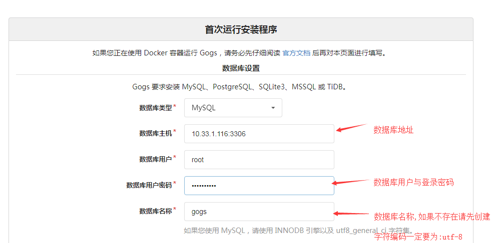
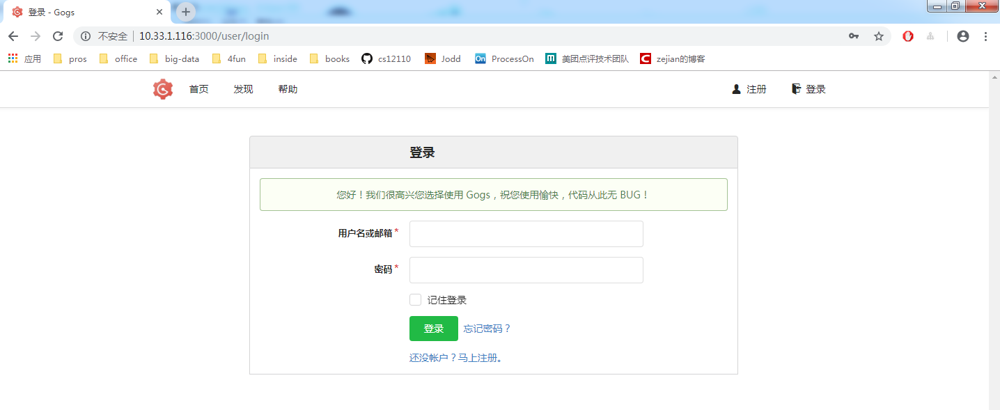

# Gogs 安装教程

如果你想要一个自己的 github,那么 Gogs 你值得拥有.

Gogs: 一个简易版,部署在自己服务器上的版本管理软件.

---

## 1. 依赖软件

请安装 ta 的依赖软件.

### 1.1 git

这里使用 yum 安装,如果是内网,请使用 rpm 的安装包安装.

```bash
[root@dev-116 ~]# yum install -y git
[root@dev-116 ~]# git --version
git version 1.8.3.1
[root@dev-116 ~]#
```

### 1.2 mysql

gogs 要使用数据库存储,在这里我们选用 mysql.

使用 rpm 安装 mysql,因为服务器上已经安装.

```bash
[root@dev-116 mysql]# ls
mysql-5.7.8-linux64.tar                         mysql-community-common-5.7.18-1.el7.x86_64.rpm  mysql-community-server-5.7.18-1.el7.x86_64.rpm
mysql-community-client-5.7.18-1.el7.x86_64.rpm  mysql-community-libs-5.7.18-1.el7.x86_64.rpm
[root@dev-116 mysql]# rpm -Uvh *.rpm
```

开启 mysql 服务,获取第一次生成的`root`临时密码.

```sh
[root@dev-115 opt]# systemctl start mysqld
[root@dev-115 opt]# cat /var/log/mysqld.log  |grep password
2018-10-12T05:58:21.575086Z 1 [Note] A temporary password is generated for root@localhost: l/tHEghg,4&m
```

登录 mysql 并修改 root 用户密码,赋予远程登录权限.

```sql
mysql> set password = 'Mysql@3306';
Query OK, 0 rows affected (0.00 sec)

mysql>  grant all privileges on *.* to 'root'@'%' identified by 'Mysql@3306';
Query OK, 0 rows affected, 1 warning (0.01 sec)

mysql> flush privileges;
Query OK, 0 rows affected (0.01 sec)
```

开通防火墙端口

```bash
[root@dev-116 ~]# firewall-cmd --add-port=3306/tcp --zone=public --permanent
success
[root@dev-116 ~]# firewall-cmd --reload
success
[root@dev-116 ~]# firewall-cmd --list-port
3306/tcp
```

---

## 2. 安装 Gogs

gogs 默认使用 3000 端口,请确保防火墙开启了该端口.

```bash
[root@dev-116 ~]# firewall-cmd --add-port=3000/tcp --zone=public --permanent
success
[root@dev-116 ~]# firewall-cmd --reload
success
[root@dev-116 ~]# firewall-cmd --list-port
3306/tcp 3000/tcp
```

### 2.1 下载安装

官网下载页面:[link](https://gogs.io/docs/installation/install_from_binary.html)

```bash
[root@dev-116 soft]# wget https://dl.gogs.io/0.11.66/gogs_0.11.66_linux_amd64.tar.gz
[root@dev-116 soft]# tar -xvf gogs_0.11.66_linux_amd64.tar.gz
[root@dev-116 gogs]# ls
gogs  LICENSE  public  README.md  README_ZH.md  scripts  templates
[root@dev-116 gogs]# ./gogs web
2018/11/02 14:18:32 [ WARN] Custom config '/opt/soft/gogs/custom/conf/app.ini' not found, ignore this if you're running first time
2018/11/02 14:18:32 [TRACE] Custom path: /opt/soft/gogs/custom
2018/11/02 14:18:32 [TRACE] Log path: /opt/soft/gogs/log
2018/11/02 14:18:32 [TRACE] Log Mode: Console (Trace)
2018/11/02 14:18:32 [ INFO] Gogs 0.11.66.0916
2018/11/02 14:18:32 [ INFO] Cache Service Enabled
2018/11/02 14:18:32 [ INFO] Session Service Enabled
2018/11/02 14:18:32 [ INFO] SQLite3 Supported
2018/11/02 14:18:32 [ INFO] Run Mode: Development
2018/11/02 14:18:32 [ INFO] Listen: http://0.0.0.0:3000
```

### 2.2 gogs 配置

gogs 要求在 web 上面进行配置.请按照下面的说明,进行修改.

web 请求界面地址为: `http://服务器地址:3000`




创建数据库语句

```sql
mysql> create database gogs charset='utf8';
Query OK, 1 row affected (0.00 sec)
```

修改完毕,拉到网页最后面,点击`立即安装`按钮即可.

安装成功后,跳转到`gogs`首页.



剩下的就和 github 使用差不多了,注册,登录,建立仓库....

### 2.3 tips

ok,现在安装成功了,我们要改变我们的启动的方式了.

我们上面使用启动方式是

```bash
[root@dev-116 gogs]# ./gogs web
```

当终端关闭的时候,这个进程也会被关闭,这就有点坑了.

我们使用下面这种启动方式来启动

```bash
[root@dev-116 gogs]# nohup ./gogs web  &
[1] 65117
[root@dev-116 gogs]# nohup: ignoring input and appending output to ‘nohup.out’
```

---

## 3. 参考资料

a. [gogs 官网](https://gogs.io/)
