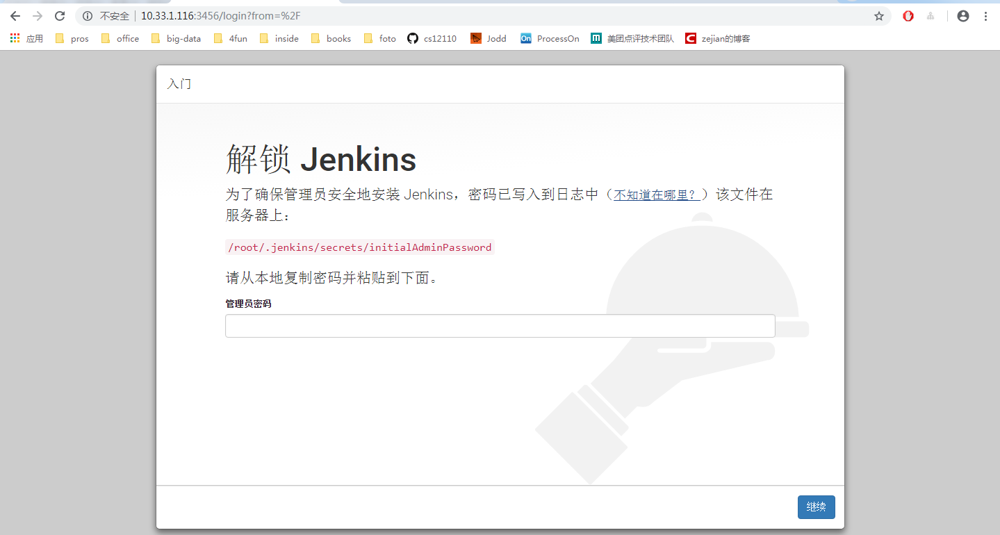
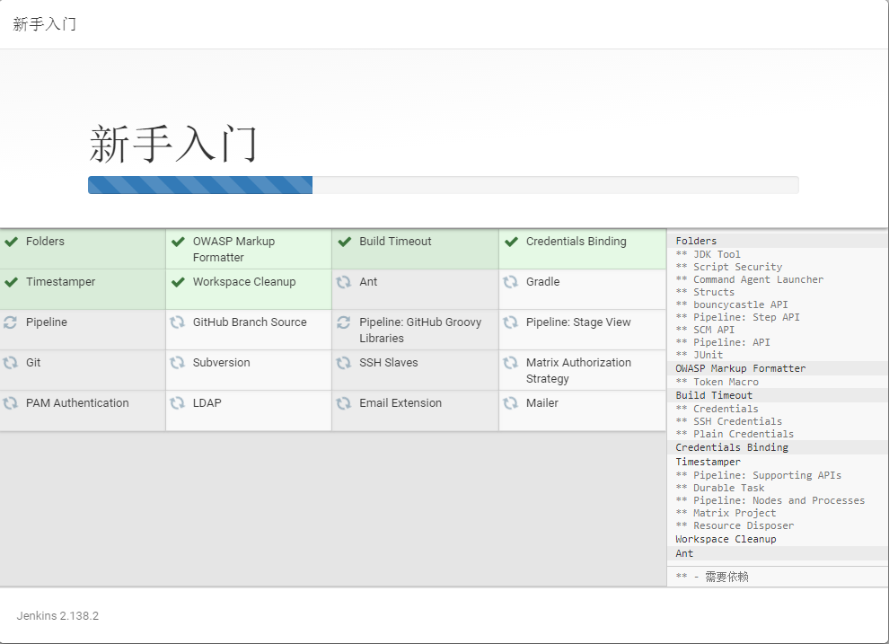
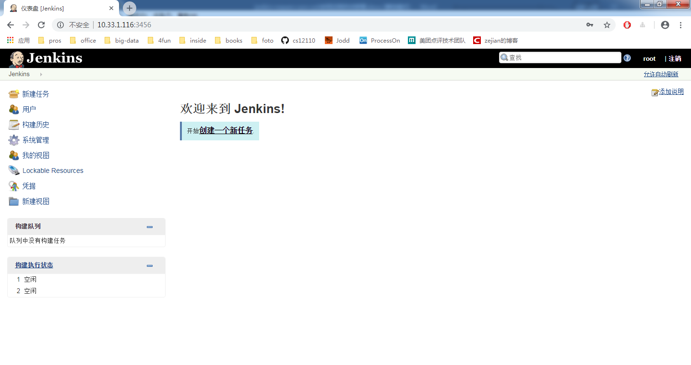
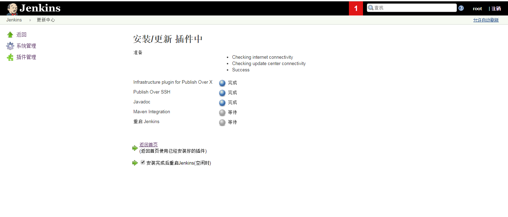
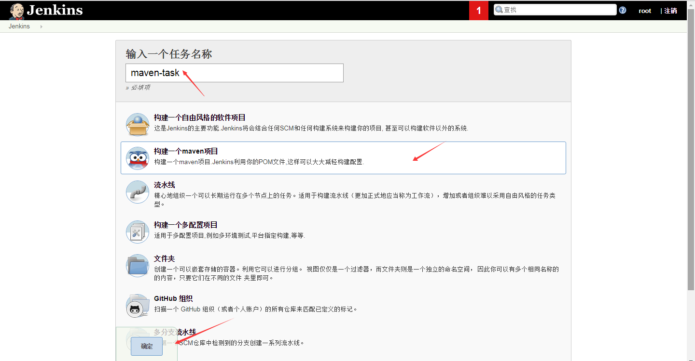
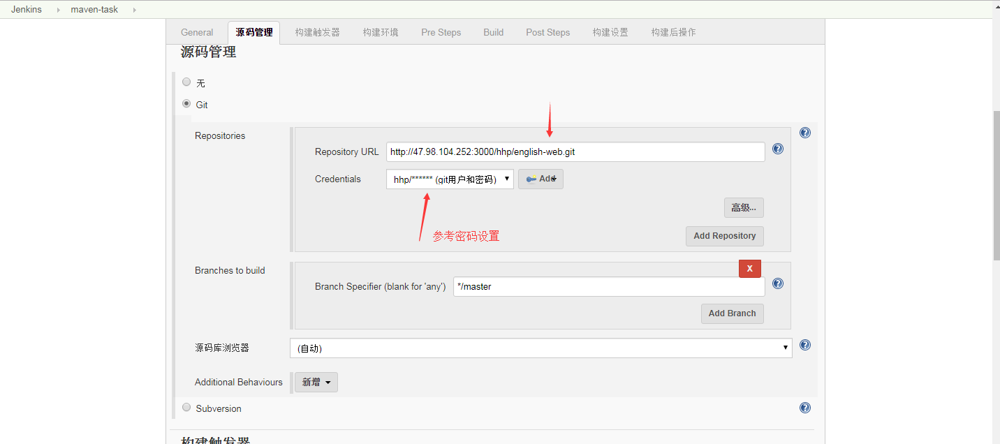
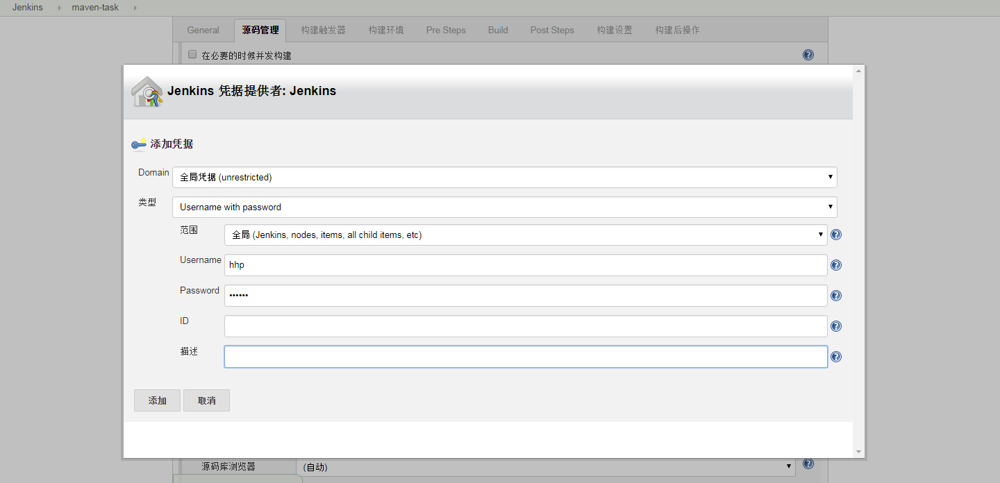
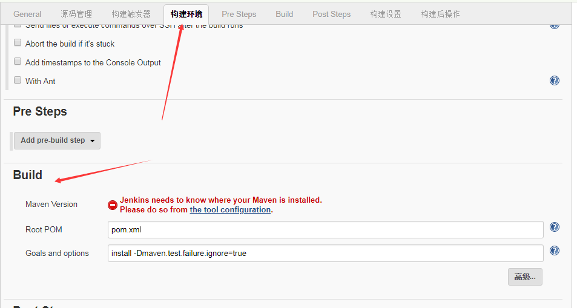
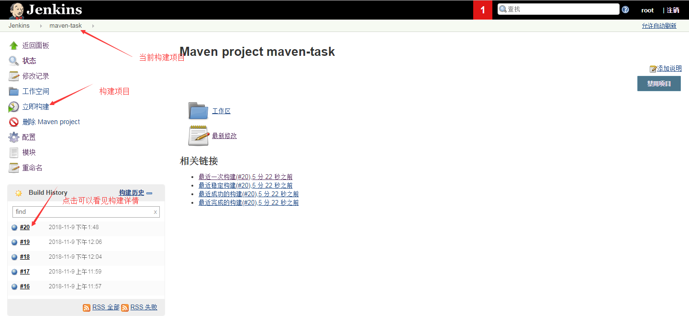
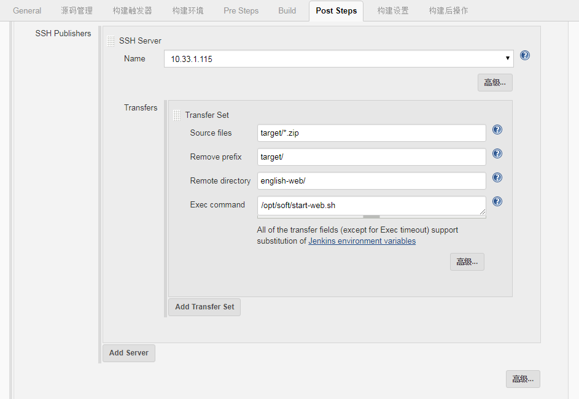

# Jenkins 使用指南

该文档适用于 jenkins 的安装是简单使用,请知悉.

文档构建的是`jenkins`+`git`+`maven`的项目,请知悉.


---

## 1. jenkins 安装

该章节主要说明 jenkins 的安装.

| 服务器地址  | 备注           |
| ----------- | -------------- |
| 10.33.1.116 | jenkins服务器  |
| 10.33.1.115 | 部署项目服务器 |

### 1.1 安装


#### 1.1.1 jenkins依赖

依赖软件有: `jdk`,`git`,`maven`

**jdk**如下

```bash
[root@dev-116 jdk1.8.0_151]# java -version
java version "1.8.0_151"
Java(TM) SE Runtime Environment (build 1.8.0_151-b12)
Java HotSpot(TM) 64-Bit Server VM (build 25.151-b12, mixed mode)
```

**maven**如下

```bash
[root@dev-116 maven-3.6.0]# mvn -version
Apache Maven 3.6.0 (97c98ec64a1fdfee7767ce5ffb20918da4f719f3; 2018-10-25T02:41:47+08:00)
Maven home: /opt/soft/maven/maven-3.6.0
Java version: 1.8.0_151, vendor: Oracle Corporation, runtime: /opt/soft/jdk/jdk1.8.0_151/jre
Default locale: en_US, platform encoding: UTF-8
OS name: "linux", version: "3.10.0-514.el7.x86_64", arch: "amd64", family: "unix"
```

**git**如下

```bash
[root@dev-116 jenkins]# git --version
git version 1.8.3.1
[root@dev-116 jenkins]#
```

#### 1.1.2 下载jenkins

这里面使用`jenkins.war`

```bash
[root@dev-116 jenkins]# wget http://mirror.xmission.com/jenkins/war-stable/2.138.2/jenkins.war
[root@dev-116 jenkins]# du -sh *
125M	jenkins.war
```

### 1.2 启动

注意: **记得开启防火墙的端口.**

```bash
[root@dev-116 jenkins]# firewall-cmd --add-port=3456/tcp --zone=public --permanent
success
[root@dev-116 jenkins]# firewall-cmd --reload
success
[root@dev-116 jenkins]# firewall-cmd --list-port
3000/tcp 3306/tcp 3456/tcp
```

启动 jenkins

```bash
[root@dev-116 jenkins]# java -jar jenkins.war --httpPort=3456
Running from: /opt/soft/jenkins/jenkins.war
webroot: $user.home/.jenkins
....
INFO: Completed initialization
Nov 09, 2018 9:02:54 AM hudson.WebAppMain$3 run
INFO: Jenkins is fully up and running
```

校验是否开启成功

```bash
[root@dev-116 jenkins]# curl 10.33.1.116:3456
```

为了启动方便,我们把启动写成脚本

```bash
#!/bin/bash

port=3456

echo -e '--- Startup jenkins by port[' $port '] ---'

nohup java -jar jenkins.war --httpPort=$port &

echo -e '--- It is done, you can visit by http://10.33.1.116:3456/ ---'
```

### 1.3 设置 jenkins

第一次登录 jenkins,要设置密码.

jenkins 的访问地址为:`http://server-ip:3456/`




获取jenkins密码

```bash
[root@dev-116 jenkins]# cat  /root/.jenkins/secrets/initialAdminPassword
e5d7c32aafb54888a75f0da6ec5903f5
```

选择 **安装推荐插件** 进行下一步.




设置用户和密码

| jenkins用户 | 登录密码 | 备注 |
| ----------- | -------- | ---- |
| root        | *****123 | -    |


配置完之后, **请重新启动一下jenkins**.

---

## 2. jenkins 简单使用

主要流程: 10.33.1.116上使用jenkins构建项目 -> 把构建好的zip包发送到10.33.1.115服务器上 -> 使用脚本在10.33.1.115服务器上启动项目


### 2.1 安装maven和ssh插件

使用jenkins的`root`用户登录




所在位置:  **`系统管理` -> `插件管理` ->`可选插件` ->`重启jenkins`**

依次安装`Publish on ssh`插件和`Maven Integration`.

比如安装`Maven Integration`



<span style="color:red;">注意<span> : 安装完成之后需要在`系统管理` -> `全局工具配置` 里面配置jdk的路径和maven的路径.


### 2.2 创建maven任务


#### 2.2.1 创建任务




#### 2.2.2 git设置



git用户密码设置如下




#### 2.2.3 构建设置



`Goals and options`里面的值可以maven的构建任何命令,如:`clean  package -Dmaven.test.skip=true`


添加ssh

在`系统管理` -> `系统设置` -> `Publish over SSH`设置


#### 2.2.4 发送配置

温馨提示: **注意文件的配置路径**

```bash
[root@dev-116 maven-task]# pwd
/root/.jenkins/workspace/maven-task
[root@dev-116 maven-task]# ls
docs  pom.xml  README.md  src  target
```

在`Post steps`里面`add post-build step`下拉框选择`Send files or execute commands over SSH`.


---

## 3. 构建任务


### 3.1 构建任务

填写上面的配置之后,开始构建任务




在构建的控制台里面输出这个则构建成功.

```bash
......
[INFO] ------------------------------------------------------------------------
[INFO] BUILD SUCCESS
[INFO] ------------------------------------------------------------------------
......
SSH: EXEC: completed after 404 ms
SSH: Disconnecting configuration [10.33.1.115] ...
SSH: Transferred 1 file(s)
```


### 3.2 运行脚本

修改构建里面的配置



该脚本位于`10.33.1.115`服务器的`/opt/soft/start-web.sh`

```bash
#!/bin/bash

source /etc/profile
cd /opt/soft/english-web/

pid=`jps -lm  |grep english-web | awk '{print $1}'`


echo -e 'killing: '$pid

kill -9 $pid

echo -e '--- Start up ---'

# delete file
rm -rf app/ config/ lib/ logconfig/ logs/

# unzip file
unzip english-web-*-SNAPSHOT-package.zip

# startup
nohup java -jar app/*.jar > /dev/null &

echo -e '---------------'
```

### 3.2 流程校验

在构建成功之后,可以在`10.33.1.115`服务器上看见项目启动.

```bash
[root@dev-115 soft]# cd english-web/
[root@dev-115 english-web]# ls
app  config  english-web-0.0.1-SNAPSHOT-package.zip  lib  logconfig  logs
[root@dev-115 english-web]# jps -lm |grep english
17586 app/english-web-0.0.1-SNAPSHOT.jar
[root@dev-115 english-web]# 
```

这样子就成功了,泪流满面.

---

## 4. 参考资料

a. [jenkins官网](https://jenkins.io/download/)