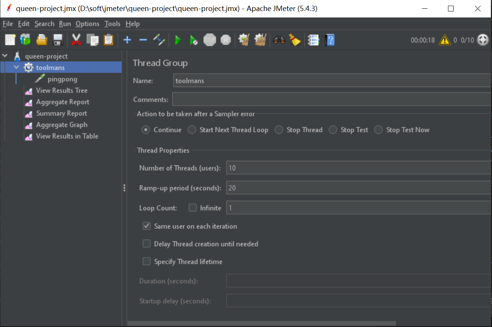
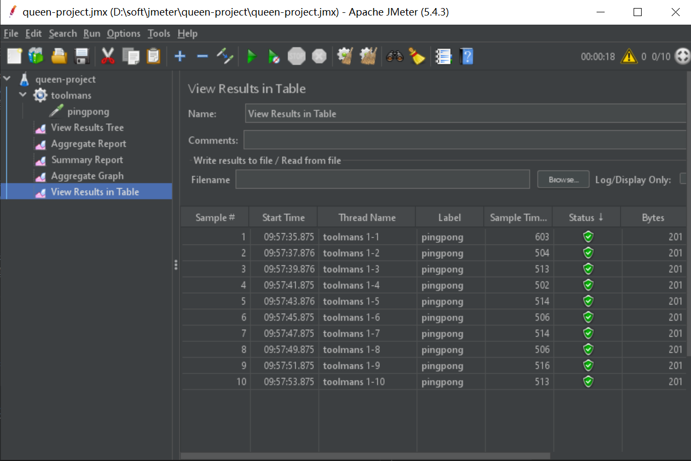
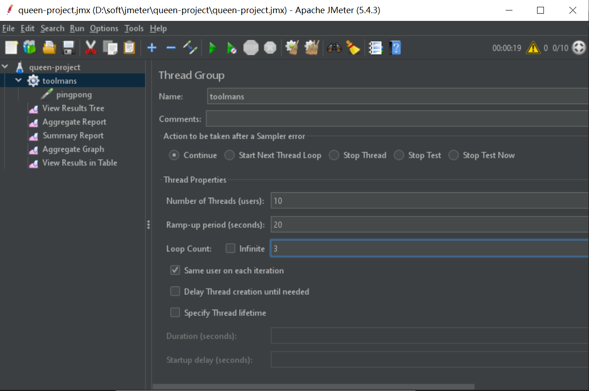
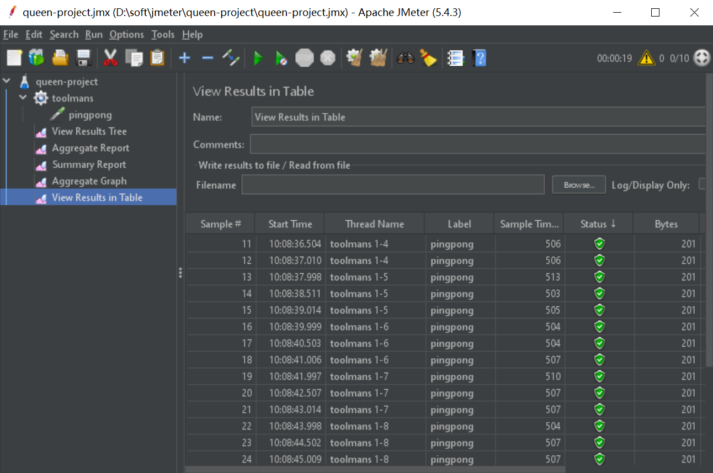

# Jmeter

之前一直挣扎在怎么设置 jmeter 的那些参数,什么线程数,Ramp-up,loop 啦.

都不知道是啥,一直就在瞎看.如果下面文档有错误和纰漏,请各位大佬指正.

压测项目名称: queen-project,来源于`Queen`的`Under Pressure`. :"}

---

## 1. 基础知识

Q: 网上说的 `tps` 和 `qps` 是啥?

A: 对于一个页面来说,`一次页面请求为 1 个 tps`,但一个页面可能包含`多次服务器请求`,那么对服务器的多次请求可以计入 `qps` 中.

Q: 所以如果仅仅对一个接口进行压测的时候, `qps==tps`?

A: 是的,可以这么理解.

| 基础概念 | 描述     | 备注                                                                           |
| -------- | -------- | ------------------------------------------------------------------------------ |
| threads  | 线程组   | 类似现实中的用户,多少个线程就等于多少个用户                                    |
| Ramp-up  | Ramp-up  | Ramp-up 规定所有用户在时间段内把请求发送完,请求时间间隔是固定的=Ramp-Up/线程数 |
| loop     | 循环次数 | 请求循环多少次                                                                 |

Q: 关于`Ramp-up time`,假如设置 10 个线程,循环次数=1,ramp-up time=20 的情况?

A: 我们可以通过`View Results in Table`可以看出几乎是`每 2 秒`发送一次请求(有图有真相).

Q: 上面这些情况是 loop=1 的情况,如果 loop=3 会是怎样的一种情况?

A: 通过执行结果可以看出,loop 几乎是同时开始的,而不是先执行完第一次,再执行第二次,然后执行第三次的情况.

Q: 那么最重要的问题来了,那我们该设置呢? 假如我们需要测试 `qps=10/s` 的情况.

A: 计算公式可以归纳为: `qps = threadNum / ramp-up * loop`;

| threadNum | ramp-up | loop | qps |
| --------- | ------- | ---- | --- |
| 10        | 1       | 1    | 10  |
| 5         | 1       | 2    | 10  |
| 20        | 2       | 1    | 10  |
| 50        | 10      | 2    | 10  |

---

## 2. jmeter 使用

Q: 其实,一个接口怎样子才算达标,或者上限?

A: 觉得大部分的是 qps+平均响应耗时.

Q: 怎么样子才算优化有提升?

A: 吞吐量上升+平均相应耗时下降.

Q: 怎么决定一个接口的上限?

A: qps 一直增长压测,直到出现 error 的情况,那这个接口就达到上限了.

### 2.1 压测模拟

场景: 用户 a 请求接口,如果请求没返回成功结果,则 1s 后继续轮询,直到最后成功为止.

---

## 3. 参考文档

a. [Jmeter 参数设置 blog](https://blog.csdn.net/u013908944/article/details/97383303)
