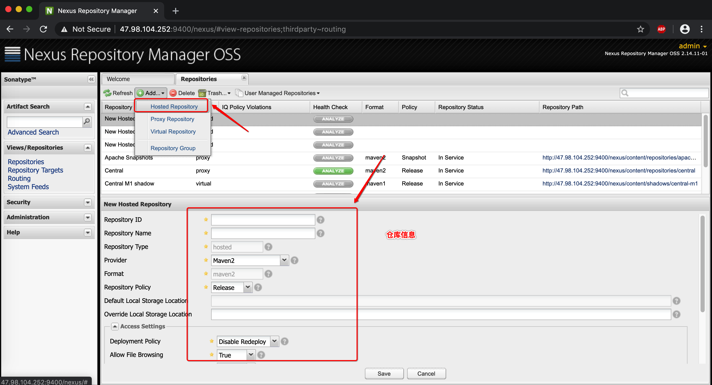
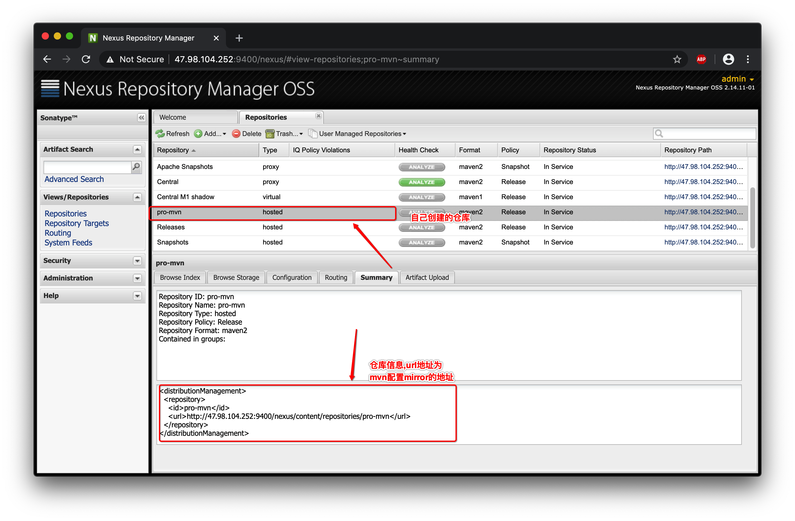
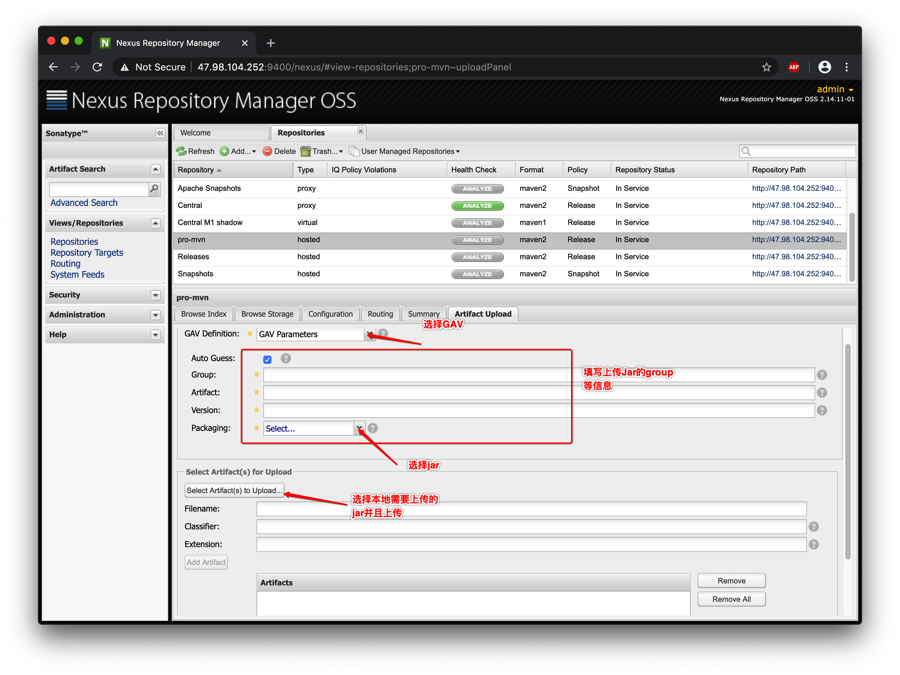
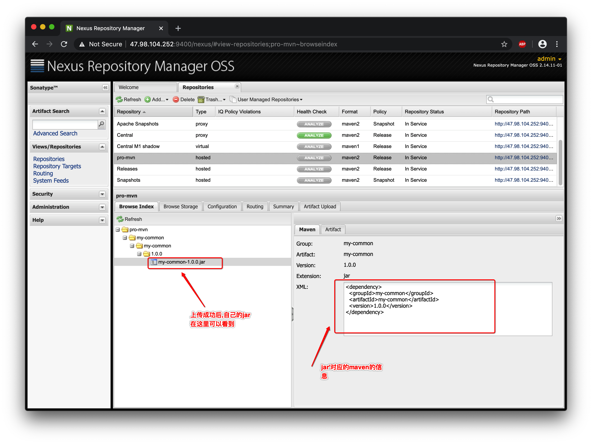

# Nexus

Maven 搭建私服`Nexus`.

Q: 为什么要使用这个玩意呀?

A: 第一个,如下图所示


Q: 哦,原来是

A: 我还没说完呢!!!还可以在私服上放内部的工具包,那样子其他人在 pom 里面引用就可以了,而不是一个 jar 到处导来导去.

## 1. 安装 Nexus

默认用户:`admin`,默认密码:`admin123`.

#### 安装 nexus

```sh
# 解压路径
[root@team-2 mvn-nexus]# pwd
/opt/soft/mvn-nexus
[root@team-2 mvn-nexus]# ls
nexus-2.14  sonatype-work

# 修改默认端口号,可以在conf/nexus.properties,设置端口号为:9400
[root@team-2 mvn-nexus]# cd nexus-2.14/
[root@team-2 nexus-2.14]# ls
bin  conf  lib  LICENSE.txt  logs  nexus  NOTICE.txt  tmp
```

需要设置运行的用户

```sh
[root@team-2 nexus-2.14]# bin/nexus start
****************************************
WARNING - NOT RECOMMENDED TO RUN AS ROOT
****************************************
If you insist running as root, then set the environment variable RUN_AS_USER=root before running this script.

# 设置nexus脚本里面的RUN_AS_USER的值
[root@team-2 nexus-2.14]# vim bin/nexus
#  port needs to be allocated prior to the user being changed.
RUN_AS_USER=root
```

#### 启动 nexus

```sh
# 开启nexus
[root@team-2 nexus-2.14]# bin/nexus start
****************************************
WARNING - NOT RECOMMENDED TO RUN AS ROOT
****************************************
Starting Nexus Repository Manager...
Started Nexus Repository Manager.

# 关闭nexus
[root@team-2 nexus-2.14]# bin/nexus stop
****************************************
WARNING - NOT RECOMMENDED TO RUN AS ROOT
****************************************
Stopping Nexus Repository Manager...
```

请开启开启相关防火墙端口

```sh
[root@team-2 ~]# firewall-cmd --add-port=9400/tcp --zone=public --permanent
success
[root@team-2 ~]# firewall-cmd --reload
success
```

启动后,浏览器访问地址: `http://47.98.104.252:9400/nexus`.


---

## 2. 使用私服

要是安装好,不使用,那有什么用???

#### 2.1 nexus 设置 repo



新增完仓库之后可以看到仓库的信息



#### 2.2 上传 jar

新建完仓库之后,就可以往上面上传自己的 jar 了. :"}



上传成功之后,可以查看 jar 在仓库的相关信息.



#### 2.3 meven 配置

本地使用 maven 需要设置一下 mirror,假设为`mvn-nexus-setting.xml`.

```xml
<mirror>
    <id>nexus</id>
    <mirrorOf>central</mirrorOf>
    <name>my repo</name>
    <url>http://47.98.104.252:9400/nexus/content/repositories/pro-mvn</url>
</mirror>
```

#### 2.4 项目引用

在项目中需要引用`mvn-nexus-setting.xml`配置,请知悉.

```xml
<dependencies>
    <dependency>
        <groupId>my-common</groupId>
        <artifactId>my-common</artifactId>
        <version>1.0.0</version>
    </dependency>
</dependencies>
```

#### 2.5 测试使用

`SysUtil`为`my-common`里面的类

```java
package com.mvn;

import com.pkgs.common.SysUtil;

/**
 * <p>
 *
 * @author cs12110 create at 2020-02-27 22:05
 * <p>
 * @since 1.0.0
 */
public class SysUtilInvoker {
    public static void main(String[] args) {
        String time = SysUtil.getTime();
        SysUtil.print(time);
    }
}
```

测试结果

```java
2020-02-27 22:06:20 SysUtil 2020-02-27 22:06:20
```

---

## 3. 参考资料

a. [Maven 入门:搭建 Nexus](https://www.cnblogs.com/huangwentian/p/9182819.html)
