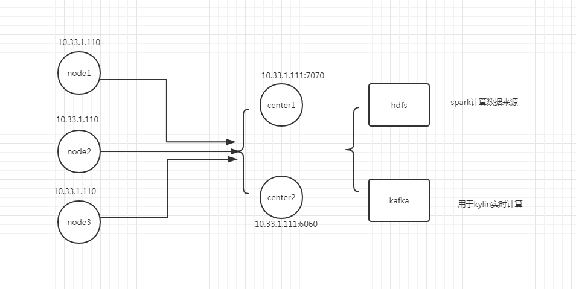

# Flume高可用

**Flume主要用于日志收集,为大数据分析提供数据收集基础.**

Flume节点部署如下表

| Ip地址      | agent名称 | 占用端口 | 备注      |
| ----------- | --------- | -------- | --------- |
| 10.33.1.110 | node1     |          | 前置节点1 |
| 10.33.1.110 | node2     |          | 前置节点2 |
| 10.33.1.110 | node3     |          | 前置节点3 |
| 10.33.1.111 | center1   | 7070     | 聚合节点1 |
| 10.33.1.111 | center2   | 6060     | 聚合节点2 |

**架构如下图**



**在这里只做解决构建高可用,sink进去`hdfs`和`kafka`不进行叙述.**


---


## 1. Flume聚合节点

### 1.1 Flume聚合节点配置文件

节点文件结构

```shell
[root@dev-2 flume-1.6]# ls
bin  center1-conf  center1.out  center2-conf  center2.out  CHANGELOG  conf  DEVNOTES  docs  lib  LICENSE  NOTICE  README  RELEASE-NOTES  tools
[root@dev-2 flume-1.6]# 
```

聚合节点1配置文件放置`center1-conf`文件夹.

聚合节点2配置文件放置`center2-conf`文件夹.


**聚合节点1配置如下**

```properties
center1.sources = seqGenSrc
center1.channels = memoryChannel
center1.sinks = loggerSink

# 使用avro
center1.sources.seqGenSrc.type = avro
center1.sources.seqGenSrc.bind = 10.33.1.111
center1.sources.seqGenSrc.port = 7070
center1.sources.seqGenSrc.channels = memoryChannel

center1.sinks.loggerSink.type = logger
center1.sinks.loggerSink.channel = memoryChannel

center1.channels.memoryChannel.type = memory
center1.channels.memoryChannel.capacity = 100
```


**聚合节点2配置如下**

```properties
center2.sources = seqGenSrc
center2.channels = memoryChannel
center2.sinks = loggerSink

# 使用avro
center2.sources.seqGenSrc.type = avro
center2.sources.seqGenSrc.bind = 10.33.1.111
center2.sources.seqGenSrc.port = 6060
center2.sources.seqGenSrc.channels = memoryChannel

center2.sinks.loggerSink.type = logger
center2.sinks.loggerSink.channel = memoryChannel

center2.channels.memoryChannel.type = memory
center2.channels.memoryChannel.capacity = 100
```


### 1.2 启动命令


```shell
[root@dev-2 flume-1.6]#  nohup flume-ng agent --conf center1-conf/ --conf-file center1-conf/flume-conf.properties  --name center1 > center1.out 2>&1 &
```


```shell
[root@dev-2 flume-1.6]#  nohup flume-ng agent --conf center2-conf/ --conf-file center2-conf/flume-conf.properties  --name center2 > center2.out 2>&1 &
```

启动完成后

```shell
[root@dev-2 flume-1.6]# jps -lm
2813 sun.tools.jps.Jps -lm
2782 org.apache.flume.node.Application --conf-file center2-conf/flume-conf.properties --name center2
2751 org.apache.flume.node.Application --conf-file center1-conf/flume-conf.properties --name center1
[root@dev-2 flume-1.6]# 
```

---


## 2. Flume前置节点

### 2.1 节点配置内容如下

配置文件`node1-conf.properties`文件内容如下,其他`node2`和`node3`节点配置文件复制`node1-conf.properties`并修改各自对应的`agent名称`和`监听目录`即可.


配置里面`node1.sinkgroups.g1.processor.priority`是优先级的配置,**数字越大,优先级越大**

```properties
node1.sources = seqGenSrc
node1.channels = memoryChannel
node1.sinks = sink1 sink2

# 配置sinkgroup
node1.sinkgroups = g1
node1.sinkgroups.g1.sinks = sink1 sink2
node1.sinkgroups.g1.processor.type = failover
# 配置sink优先级
node1.sinkgroups.g1.processor.priority.sink1 = 5
node1.sinkgroups.g1.processor.priority.sink2 = 10
node1.sinkgroups.g1.processor.maxpenalty = 10000

# 配置监听目录
node1.sources.seqGenSrc.type = spooldir
node1.sources.seqGenSrc.channels = memoryChannel
node1.sources.seqGenSrc.spoolDir = /opt/soft/flume-monitor/m1
node1.sources.seqGenSrc.fileHeader = true

# 配置sink1
node1.sinks.sink1.type = avro
node1.sinks.sink1.hostname = 10.33.1.111
node1.sinks.sink1.port = 7070
node1.sinks.sink1.channel = memoryChannel

# 配置sink2
node1.sinks.sink2.type = avro
node1.sinks.sink2.hostname = 10.33.1.111
node1.sinks.sink2.port = 6060
node1.sinks.sink2.channel = memoryChannel

node1.channels.memoryChannel.type = memory
node1.channels.memoryChannel.capacity = 100
```

### 2.2 开启节点命令

开启节点1
```powershell
[root@dev-1 flume-1.6]# nohup flume-ng agent --conf nodes-conf/ --conf-file nodes-conf/node1-conf.properties --name node1 >node1.out 2>&1 &
```

开启节点2
```powershell
[root@dev-1 flume-1.6]#nohup flume-ng agent --conf nodes-conf/ --conf-file nodes-conf/node2-conf.properties --name node2 >node2.out 2>&1 &
```

开启节点3
```powershell
[root@dev-1 flume-1.6]# nohup flume-ng agent --conf nodes-conf/ --conf-file nodes-conf/node3-conf.properties --name node3 >node3.out 2>&1 &
```

启动成功后

```powershell
[root@dev-1 flume-1.6]# jps -ml
2993 org.apache.flume.node.Application --conf-file nodes-conf/node1-conf.properties --name node1
3030 org.apache.flume.node.Application --conf-file nodes-conf/node2-conf.properties --name node2
3114 sun.tools.jps.Jps -ml
3067 org.apache.flume.node.Application --conf-file nodes-conf/node3-conf.properties --name node3
[root@dev-1 flume-1.6]# 

```


---


## 3. 测试使用

### 3.1 关闭服务器防火墙

```shell
[root@dev-2 flume-1.6]# systemctl stop firewalld 
[root@dev-2 flume-1.6]# systemctl status firewalld 
● firewalld.service - firewalld - dynamic firewall daemon
   Loaded: loaded (/usr/lib/systemd/system/firewalld.service; enabled; vendor preset: enabled)
   Active: inactive (dead) since Wed 2018-06-13 20:40:25 EDT; 55min ago
     Docs: man:firewalld(1)
  Process: 649 ExecStart=/usr/sbin/firewalld --nofork --nopid $FIREWALLD_ARGS (code=exited, status=0/SUCCESS)
 Main PID: 649 (code=exited, status=0/SUCCESS)

Jun 13 20:37:02 dev-2 systemd[1]: Starting firewalld - dynamic firewall daemon...
Jun 13 20:40:49 dev-2 systemd[1]: Started firewalld - dynamic firewall daemon.
Jun 13 20:40:24 dev-2 systemd[1]: Stopping firewalld - dynamic firewall daemon...
Jun 13 20:40:25 dev-2 systemd[1]: Stopped firewalld - dynamic firewall daemon.
[root@dev-2 flume-1.6]# 

```

### 3.2 正常情况

把node.txt文件复制进去node1节点的监听目录**/opt/soft/flume-monitor/m1**,`node.txt`内容如下

```shell
[root@dev-1 flume-monitor]# cat node.txt 
1
2
3
4
5
6
7
8
9
10
[root@dev-1 flume-monitor]# 

```

因为在前置节点里面设置了`center2`聚合节点的优先级比较高,所以只有`center2.out`文件输出如下内容

```shell
2018-06-13 22:00:38,898 (SinkRunner-PollingRunner-DefaultSinkProcessor) [INFO - org.apache.flume.sink.LoggerSink.process(LoggerSink.java:94)] Event: { headers:{file=/opt/soft/flume-monitor/m1/node.txt} body: 31                                              1 }
2018-06-13 22:00:38,899 (SinkRunner-PollingRunner-DefaultSinkProcessor) [INFO - org.apache.flume.sink.LoggerSink.process(LoggerSink.java:94)] Event: { headers:{file=/opt/soft/flume-monitor/m1/node.txt} body: 32                                              2 }
2018-06-13 22:00:38,899 (SinkRunner-PollingRunner-DefaultSinkProcessor) [INFO - org.apache.flume.sink.LoggerSink.process(LoggerSink.java:94)] Event: { headers:{file=/opt/soft/flume-monitor/m1/node.txt} body: 33                                              3 }
2018-06-13 22:00:38,900 (SinkRunner-PollingRunner-DefaultSinkProcessor) [INFO - org.apache.flume.sink.LoggerSink.process(LoggerSink.java:94)] Event: { headers:{file=/opt/soft/flume-monitor/m1/node.txt} body: 34                                              4 }
2018-06-13 22:00:38,900 (SinkRunner-PollingRunner-DefaultSinkProcessor) [INFO - org.apache.flume.sink.LoggerSink.process(LoggerSink.java:94)] Event: { headers:{file=/opt/soft/flume-monitor/m1/node.txt} body: 35                                              5 }
2018-06-13 22:00:38,901 (SinkRunner-PollingRunner-DefaultSinkProcessor) [INFO - org.apache.flume.sink.LoggerSink.process(LoggerSink.java:94)] Event: { headers:{file=/opt/soft/flume-monitor/m1/node.txt} body: 36                                              6 }
2018-06-13 22:00:38,901 (SinkRunner-PollingRunner-DefaultSinkProcessor) [INFO - org.apache.flume.sink.LoggerSink.process(LoggerSink.java:94)] Event: { headers:{file=/opt/soft/flume-monitor/m1/node.txt} body: 37                                              7 }
2018-06-13 22:00:38,901 (SinkRunner-PollingRunner-DefaultSinkProcessor) [INFO - org.apache.flume.sink.LoggerSink.process(LoggerSink.java:94)] Event: { headers:{file=/opt/soft/flume-monitor/m1/node.txt} body: 38                                              8 }
2018-06-13 22:00:38,902 (SinkRunner-PollingRunner-DefaultSinkProcessor) [INFO - org.apache.flume.sink.LoggerSink.process(LoggerSink.java:94)] Event: { headers:{file=/opt/soft/flume-monitor/m1/node.txt} body: 39                                              9 }
2018-06-13 22:00:38,902 (SinkRunner-PollingRunner-DefaultSinkProcessor) [INFO - org.apache.flume.sink.LoggerSink.process(LoggerSink.java:94)] Event: { headers:{file=/opt/soft/flume-monitor/m1/node.txt} body: 31 30                                           10 }
```

测试符合预期.

### 3.3 关闭一个center

**集群最主要的原因是应对单点异常.**

所以现在我们要测试在down掉一个center节点的情况下,是否还能正常工作.

选择down优先级比较高的`center2`聚合节点.

```shell
[root@dev-2 flume-1.6]# jps -lm
2900 sun.tools.jps.Jps -lm
2782 org.apache.flume.node.Application --conf-file center2-conf/flume-conf.properties --name center2
2751 org.apache.flume.node.Application --conf-file center1-conf/flume-conf.properties --name center1
[root@dev-2 flume-1.6]# kill -9 2782
[root@dev-2 flume-1.6]# jps -lm
2910 sun.tools.jps.Jps -lm
2751 org.apache.flume.node.Application --conf-file center1-conf/flume-conf.properties --name center1
[root@dev-2 flume-1.6]# 
```

在前置节点里面会出现报错,内容如下,原因: **因为sink2的关联center2关闭了,现在需要转发到center1上面去.**

```java
2018-06-13 22:53:25,278 (SinkRunner-PollingRunner-FailoverSinkProcessor) [WARN - org.apache.flume.sink.FailoverSinkProcessor.process(FailoverSinkProcessor.java:185)] Sink sink2 failed and has been sent to failover list
org.apache.flume.EventDeliveryException: Failed to send events
	at org.apache.flume.sink.AbstractRpcSink.process(AbstractRpcSink.java:392)
	at org.apache.flume.sink.FailoverSinkProcessor.process(FailoverSinkProcessor.java:182)
	at org.apache.flume.SinkRunner$PollingRunner.run(SinkRunner.java:147)
	at java.lang.Thread.run(Thread.java:745)
Caused by: org.apache.flume.EventDeliveryException: NettyAvroRpcClient { host: dev-2, port: 6060 }: Failed to send batch
	at org.apache.flume.api.NettyAvroRpcClient.appendBatch(NettyAvroRpcClient.java:315)
	at org.apache.flume.sink.AbstractRpcSink.process(AbstractRpcSink.java:376)
	... 3 more
Caused by: org.apache.flume.EventDeliveryException: NettyAvroRpcClient { host: dev-2, port: 6060 }: RPC request exception
	at org.apache.flume.api.NettyAvroRpcClient.appendBatch(NettyAvroRpcClient.java:365)
	at org.apache.flume.api.NettyAvroRpcClient.appendBatch(NettyAvroRpcClient.java:303)
	... 4 more
Caused by: java.util.concurrent.ExecutionException: java.io.IOException: Error connecting to dev-2/10.33.1.111:6060
	at java.util.concurrent.FutureTask.report(FutureTask.java:122)
	at java.util.concurrent.FutureTask.get(FutureTask.java:206)
	at org.apache.flume.api.NettyAvroRpcClient.appendBatch(NettyAvroRpcClient.java:357)
	... 5 more
Caused by: java.io.IOException: Error connecting to dev-2/10.33.1.111:6060
	at org.apache.avro.ipc.NettyTransceiver.getChannel(NettyTransceiver.java:261)
	at org.apache.avro.ipc.NettyTransceiver.getRemoteName(NettyTransceiver.java:386)
	at org.apache.avro.ipc.Requestor.writeHandshake(Requestor.java:202)
	at org.apache.avro.ipc.Requestor.access$300(Requestor.java:52)
	at org.apache.avro.ipc.Requestor$Request.getBytes(Requestor.java:478)
	at org.apache.avro.ipc.Requestor.request(Requestor.java:147)
	at org.apache.avro.ipc.Requestor.request(Requestor.java:129)
	at org.apache.avro.ipc.specific.SpecificRequestor.invoke(SpecificRequestor.java:84)
	at com.sun.proxy.$Proxy5.appendBatch(Unknown Source)
	at org.apache.flume.api.NettyAvroRpcClient$2.call(NettyAvroRpcClient.java:348)
	at org.apache.flume.api.NettyAvroRpcClient$2.call(NettyAvroRpcClient.java:344)
	at java.util.concurrent.FutureTask.run(FutureTask.java:266)
	at java.util.concurrent.ThreadPoolExecutor.runWorker(ThreadPoolExecutor.java:1142)
	at java.util.concurrent.ThreadPoolExecutor$Worker.run(ThreadPoolExecutor.java:617)
	... 1 more
Caused by: java.net.ConnectException: Connection refused
	at sun.nio.ch.SocketChannelImpl.checkConnect(Native Method)
	at sun.nio.ch.SocketChannelImpl.finishConnect(SocketChannelImpl.java:717)
	at org.jboss.netty.channel.socket.nio.NioClientSocketPipelineSink$Boss.connect(NioClientSocketPipelineSink.java:496)
	at org.jboss.netty.channel.socket.nio.NioClientSocketPipelineSink$Boss.processSelectedKeys(NioClientSocketPipelineSink.java:452)
	at org.jboss.netty.channel.socket.nio.NioClientSocketPipelineSink$Boss.run(NioClientSocketPipelineSink.java:365)
	... 3 more
```


在只有`center1`聚合节点工作的情况下,`center1.out`文件输出

```
2018-06-13 22:07:02,321 (SinkRunner-PollingRunner-DefaultSinkProcessor) [INFO - org.apache.flume.sink.LoggerSink.process(LoggerSink.java:94)] Event: { headers:{file=/opt/soft/flume-monitor/m1/node.txt} body: 31                                              1 }
2018-06-13 22:07:02,322 (SinkRunner-PollingRunner-DefaultSinkProcessor) [INFO - org.apache.flume.sink.LoggerSink.process(LoggerSink.java:94)] Event: { headers:{file=/opt/soft/flume-monitor/m1/node.txt} body: 32                                              2 }
2018-06-13 22:07:02,322 (SinkRunner-PollingRunner-DefaultSinkProcessor) [INFO - org.apache.flume.sink.LoggerSink.process(LoggerSink.java:94)] Event: { headers:{file=/opt/soft/flume-monitor/m1/node.txt} body: 33                                              3 }
2018-06-13 22:07:02,322 (SinkRunner-PollingRunner-DefaultSinkProcessor) [INFO - org.apache.flume.sink.LoggerSink.process(LoggerSink.java:94)] Event: { headers:{file=/opt/soft/flume-monitor/m1/node.txt} body: 34                                              4 }
2018-06-13 22:07:02,322 (SinkRunner-PollingRunner-DefaultSinkProcessor) [INFO - org.apache.flume.sink.LoggerSink.process(LoggerSink.java:94)] Event: { headers:{file=/opt/soft/flume-monitor/m1/node.txt} body: 35                                              5 }
2018-06-13 22:07:02,322 (SinkRunner-PollingRunner-DefaultSinkProcessor) [INFO - org.apache.flume.sink.LoggerSink.process(LoggerSink.java:94)] Event: { headers:{file=/opt/soft/flume-monitor/m1/node.txt} body: 36                                              6 }
2018-06-13 22:07:02,322 (SinkRunner-PollingRunner-DefaultSinkProcessor) [INFO - org.apache.flume.sink.LoggerSink.process(LoggerSink.java:94)] Event: { headers:{file=/opt/soft/flume-monitor/m1/node.txt} body: 37                                              7 }
2018-06-13 22:07:02,323 (SinkRunner-PollingRunner-DefaultSinkProcessor) [INFO - org.apache.flume.sink.LoggerSink.process(LoggerSink.java:94)] Event: { headers:{file=/opt/soft/flume-monitor/m1/node.txt} body: 38                                              8 }
2018-06-13 22:07:02,323 (SinkRunner-PollingRunner-DefaultSinkProcessor) [INFO - org.apache.flume.sink.LoggerSink.process(LoggerSink.java:94)] Event: { headers:{file=/opt/soft/flume-monitor/m1/node.txt} body: 39                                              9 }
2018-06-13 22:07:02,323 (SinkRunner-PollingRunner-DefaultSinkProcessor) [INFO - org.apache.flume.sink.LoggerSink.process(LoggerSink.java:94)] Event: { headers:{file=/opt/soft/flume-monitor/m1/node.txt} body: 31 30                                           10 }
```

测试符合预期,所以我们可以**通过配置flume的failover来避免单点异常**

---


## 4. Load balance

Flume使用`load balance`也可以实现避免单点异常.

配置文件内容

```properties
node1.sources = seqGenSrc
node1.channels = memoryChannel
node1.sinks = sink1 sink2

# 配置load balance
node1.sinkgroups = g1
node1.sinkgroups.g1.sinks = sink1 sink2
node1.sinkgroups.g1.processor.type = load_balance
node1.sinkgroups.g1.processor.backoff = true
# selector的值可以为: random或者round_robin
# random随机发送,round_robin相当于一次给center1,一次给center2
node1.sinkgroups.g1.processor.selector=random

node1.sources.seqGenSrc.type = spooldir
node1.sources.seqGenSrc.channels = memoryChannel
node1.sources.seqGenSrc.spoolDir = /opt/soft/flume-monitor/m1
node1.sources.seqGenSrc.fileHeader = true

node1.sinks.sink1.type = avro
node1.sinks.sink1.hostname = 10.33.1.111
node1.sinks.sink1.port = 7070
node1.sinks.sink1.channel = memoryChannel

node1.sinks.sink2.type = avro
node1.sinks.sink2.hostname = 10.33.1.111
node1.sinks.sink2.port = 6060
node1.sinks.sink2.channel = memoryChannel

node1.channels.memoryChannel.type = memory
node1.channels.memoryChannel.capacity = 100
```


---

## 5. 参考文档

a. **[Flume官网](http://flume.apache.org/FlumeUserGuide.html)**

