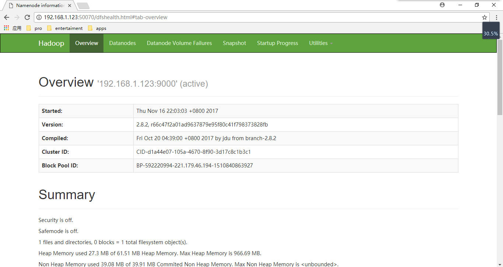

# Hadoop 安装文档

在单个节点安装伪分布式`hadoop`集群

---

## 1. 用户免密码登录

Q: 如果服务器 1 的 hadoop 用户能免密码登录服务器 2 的 dev 用户该怎么办?

A: 登录服务器 1 的 hadoop 用户,使用`ssh-keygen`生成公钥 -> 获取该公钥 -> 粘贴到服务器 2 的 dev 用户的 home 目录的`.ssh/authorized_keys`文件 -> 设置`.ssh/authorized_keys`权限设置为 600 -> 在服务器 1 的 hadoop 用户使用 ssh dev@服务器 2 就免密码了

**如果没有`.ssh/`文件夹,则使用`ssh-keygen -t rsa -P ""`生成,并自己创建`authorized_keys`文件.**

### 1.1 生成秘钥

```sh
# -P '' 空密码登录
[dev@alice ~]$ ssh-keygen -t rsa -P ''
...sh
Enter file in which to save the key (/home/dev/.ssh/id_rsa):
Your identification has been saved in /home/dev/.ssh/id_rsa.
Your public key has been saved in /home/dev/.ssh/id_rsa.pub.
...
```

### 1.2 配置权限文件(权限必须为 600)

```sh
[dev@alice ~]$ cat ~/.ssh/id_rsa.pub >> ~/.ssh/authorized_keys
[dev@alice ~]$ ls -al ~/.ssh/authorized_keys
-rw-rw-r--. 1 dev dev 391 Nov 16 22:52 /home/dev/.ssh/authorized_keys
[dev@alice ~]$ cat  ~/.ssh/authorized_keys
ssh-rsa AAAAB3NzaC1yc2EAAAADAQABAAABAQC9iz2aY8tsu+eKQ4Cw/NCBVEDa1BJKFHBFirqbhcdSncQt8NPkFcNy6AR6f/Sb2a6Lr0my6YQIHLiVYcT/I0ilxNz4Pv+5cmQ66cxDUk3D1y7xS9WddBXaOIcR/X6kTfT6X0vlUYz5iEto1S/SzXrOdqK86Slesd4Amo64QgxDxnLufXSoOeSjIuO0EyEyd9rMlkiuwYzc6Wns0BWrTMOySzlJQN9ApALN7A5gynMi++LoeUoFjk2gotMfuzaHIxsf8sQf2XwtNVxXf4ADCvUpv41VohFsndeZblf9MB7LQU7+e1fca9DFGjogNDV+a/tvfhuIK7W0OotC7BxCe93T dev@alice
```

`authorized_keys`文件权限必须为 600(r=4,w=2,x=1)

```sh
[dev@alice ~]$ chmod 600 ~/.ssh/authorized_keys
[dev@alice ~]$ ls -al ~/.ssh/authorized_keys
-rw-. 1 dev dev 391 Nov 16 22:52 /home/dev/.ssh/authorized_keys
[dev@alice ~]$
```

### 1.3 测试登录(不用输进密码,直接登录)

```sh
[dev@alice ~]$ ssh dev@192.168.1.123
Last login: Thu Nov 16 22:47:19 2017 from dev
[dev@alice ~]$
```

---

## 2. `Hadoop`安装教程

### 2.1 解压 hadoop

```sh
[dev@alice hadoop]$ tar -xvf hadoop-2.8.2.tar.gz
[dev@alice hadoop]$ cd hadoop-2.8.2/
```

```sh
# 创建foo文件夹,并创建4个子文件夹
[dev@alice hadoop-2.8.2]$ mkdir -p foo/name
[dev@alice hadoop-2.8.2]$ mkdir  foo/data
[dev@alice hadoop-2.8.2]$ mkdir  foo/hdfs
[dev@alice hadoop-2.8.2]$ mkdir  foo/tmp

[dev@alice hadoop-2.8.2]$ ls
bin  etc  foo  include  lib  libexec  sbin  share
[dev@alice hadoop-2.8.2]$ ls foo
data  hdfs  name  tmp
[dev@alice hadoop-2.8.2]$
```

### 2.2 修改 hadoop 配置文件

修改`etc/hadoop/hadoop-env.sh`
设置`JAVA_HOME`为系统`JDK`位置

```sh
[dev@alice hadoop-2.8.2]$ vim etc/hadoop/hadoop-env.sh

# The java implementation to use.
export JAVA_HOME=/home/dev/jdk/jdk8
```

修改`etc/hadoop/core-site.xml`文件

```xml
[dev@alice hadoop-2.8.2]$ vim etc/hadoop/core-site.xml
# hdfs://192.168.1.123 为服务器ip
<configuration>
    <property>
            <name>fs.default.name</name>
            <value>hdfs://192.168.1.123:9000</value>
    </property>
    <property>
            <name>hadoop.tmp.dir</name>
            <value>/home/dev/hadoop/hadoop-2.8.2/foo/tmp</value>
    </property>
</configuration>
```

修改`etc/hadoop/hdfs-site.xml`

```xml
[dev@alice hadoop-2.8.2]$ vim etc/hadoop/hdfs-site.xml
<configuration>
    <property>
            <name>dfs.replication</name>
            <value>1</value>
    </property>
    <property>
            <name>dfs.name.dir</name>
            <value>/home/dev/hadoop/hadoop-2.8.2/foo/name</value>
    </property>
    <property>
            <name>dfs.data.dir</name>
            <value>/home/dev/hadoop/hadoop-2.8.2/foo/data</value>
    </property>
</configuration>
```

修改`etc/hadoop/mapred-site.xml`

```xml
[dev@alice hadoop-2.8.2]$ cp etc/hadoop/mapred-site.xml.template  etc/hadoop/mapred-site.xml
[dev@alice hadoop-2.8.2]$ vim etc/hadoop/mapred-site.xml
<configuration>
    <property>
            <name>mapred.job.tracker</name>
            <value>http://192.168.1.123:9001</value>
    </property>
</configuration>
```

### 2.3 格式化`namenode`

```sh
[dev@alice hadoop-2.8.2]$ bin/hadoop namenode -format
.....
/************************************************************
SHUTDOWN_MSG: Shutting down NameNode at alice/221.179.46.194
************************************************************/
```

### 2.4 启动 hadoop

启动服务

```sh
[dev@alice hadoop-2.8.2]$ sbin/start-all.sh
```

启动成功之后,可通过浏览器访问`192.168.1.123:50070`



> Overview'192.168.1.123:9000'就是`java`调用 hadoop 的连接地址
> 服务器如果在没修改`/etc/hosts`的映射默认为 IP,可以修改 host 文件,比如 192.168.1.123 dev,在重启后就会以 dev 作为前缀了

停用服务

```sh
[dev@alice hadoop-2.8.2]$ sbin/stop-all.sh
```

---

## 3. 异常解决

浏览器上删除文件出现异常

```sh
Permission denied: user=dr.who, access=WRITE, inode="/flume":dev:supergroup:drwxr-xr-x
```

解决方法

```sh
[dev@pro hadoop]$ bin/hadoop fs -chmod 777 /flume
```

---

## 4. 常用命令

### 4.1 创建文件夹

```sh
[dev@pro hadoop]$ bin/hdfs dfs -mkdir -p /mapreduce/demo/
[dev@pro hadoop]$ bin/hadoop fs -chmod -R 777 /mapreduce/

[dev@pro hadoop]$ bin/hdfs dfs -mkdir -p /mapreduce/demo/input
[dev@pro hadoop]$ bin/hdfs dfs -mkdir -p /mapreduce/demo/output
```

### 4.2 上传文件

```sh
[dev@pro hadoop]$ bin/hadoop fs  -put input1.txt /mapreduce/demo/input/
[dev@pro hadoop]$ bin/hadoop fs  -put input2.txt /mapreduce/demo/input/
```

### 4.3 删除文件夹

```sh
[dev@pro hadoop]$ bin/hdfs dfs -rm -r -f /mapreduce/*
```

### 4.4 显示文件夹

```sh
[dev@pro hadoop]$ bin/hdfs dfs -ls /mapreduce/
Found 1 items
drwxrwxrwx   - dev supergroup          0 2017-11-22 01:49 /mapreduce/demo
```

---

## 5. 参考资料

a. [hadoop 入门教程](http://blog.csdn.net/hitwengqi/article/details/8008203)

b. [hadoop 集群安装](https://www.cnblogs.com/xuxy03/p/5922047.html)

c. [hadoop 集群动态增加节点](https://blog.csdn.net/sheng119/article/details/78854117)
