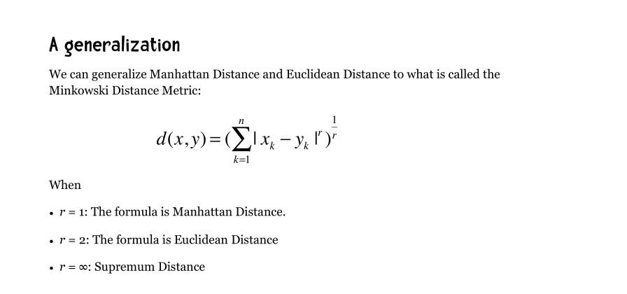
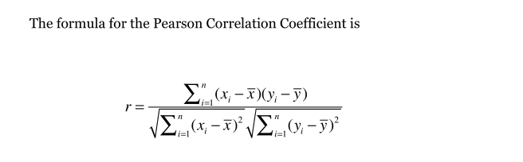
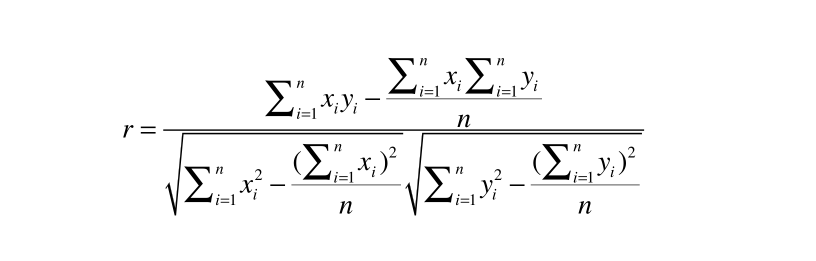
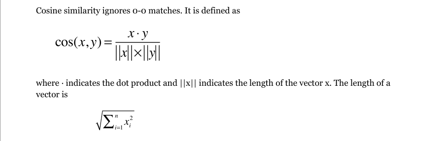
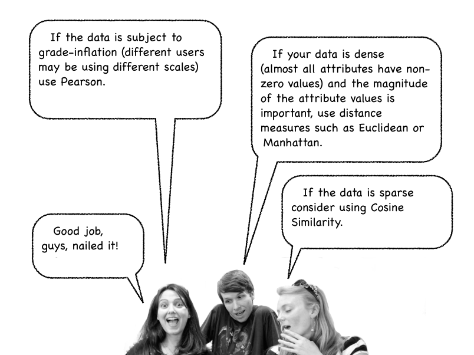
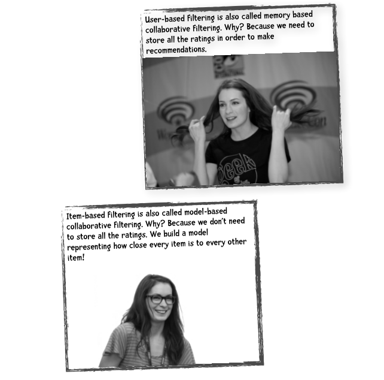
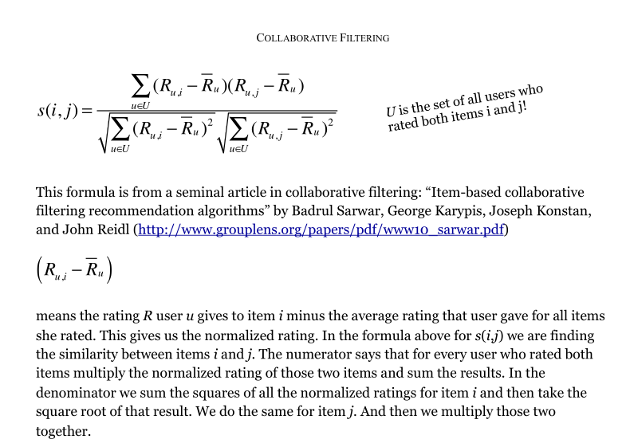
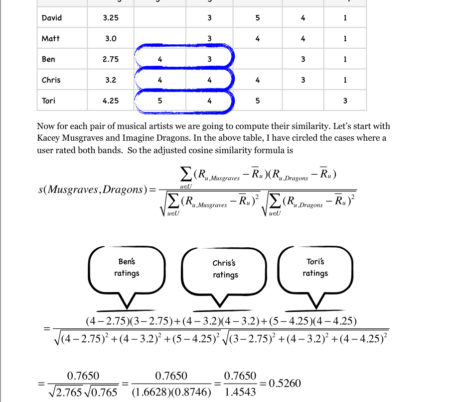
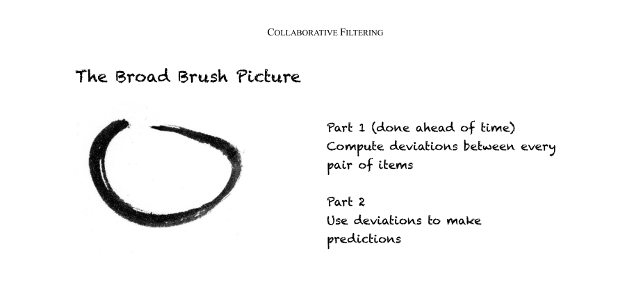

# 数据挖掘笔记

最好是自己根据那些例子写一遍,然后理解那些东西.`进度: 87/395`

强烈推荐这本书,而且还是免费,开源改变世界.

书籍地址: [A Programmer's Guide to Data Mining](http://guidetodatamining.com/)


---

## 基础算法

本章节主要用于第二章节的算法说明的简单记录.

各种距离都是为了找出`nearest`的`neighbor`,找出相似度最高的用户/物品.

### 1. 曼哈顿距离和欧几里得距离

书本: `Manhattan Distance and Euclidean Distance work best when there are no missing values`

**曼哈顿距离和欧几里得距离都适用于,两个维度没有缺失值的情况下.**

下面的公式里面

- 当 r=1 时,为曼哈顿距离计算公式.
- 当 r=2 时,为欧几里距离计算公式(勾股定理).
- 当 r=3 时,为多维距离计算公式.



**从公式可以看出来,曼哈顿距离越大则欧几里得距离也越大,距离越大相似度越低**

### 2. 皮尔逊相关系数



公式经过转换后,如下图所示:



书本: `It ranges between -1 and 1 inclusive. 1 indicates perfect agreement. -1 indicates perfect disagreement.`

**主要考虑数据的离散程度.值越接近于 1 时,相似度越高,越接近-1 时,越不相似.**

### 3. 余弦相似度

书本: `which is very popular in text mining but also used in collaborative filtering—cosine similarity`

**该相似度是非常流行的文本挖掘算法,比如全文检索之类.**

公式如下:



书本:`The cosine similarity rating ranges from 1 indicated perfect similarity to -1 indicate perfect negative similarity`

**值越接近于 1 时,相似度越高,越接近-1 时,越不相似.**

Q: 在电影推荐里面,我们根据电影的分类(比如喜剧,动作,爱情,剧情之类的)做余弦相似度计算.怎么做这个呢?

A: 构建一个稀疏的矩阵,每部电影包含了所有的分类,自己拥有的分类赋值为 1,没有的赋值为 0,然后交付给余弦相似度计算.

### 4. 计算算法的选取

Attention: **这个才是最重要的.**



- 如果数据存在"分数膨胀"问题,就使用`皮尔逊相关系数`.
- 如果数据比较"密集",变量之间基本都存在公有值,且这些距离数据是非常重要的,那就使用`欧几里得`或`曼哈顿距离`.
- 如果数据比较稀松,可以使用`余弦相似度算法`

分数膨胀:只要要求人类的一个群体去评价另一个群体的表现,分数膨胀就会出现.[link](https://baike.baidu.com/item/分数膨胀/1948048)

---

## 协同过滤

**Explicit ratings**: 明确的给出了评分,如知乎里面的 upvote/downvote

**Implicit Ratings**: 非明确评分,通过观察用户行为获得,如点击了多少次啦,建立用户画像.

用户画像的建立例子:

```
After observing what a user clicks on for a few weeks you can imagine that we could develop a reasonable profile of that user—she doesn't like sports but seems to like technology news. If the user clicks on the article “Fastest Way to Lose Weight Discovered by Professional Trainers” and the article “Slow and Steady: How to lose weight and keep it off” perhaps she wishes to lose weight. If she clicks on the iPhone ad, she perhaps has an interest in that product. (By the way, the term used when a user clicks on an ad is called 'click through'.)
```

计算问题:

```
Suppose you have one million users. Every time you want to make a recommendation for someone you need to calculate one million distances (comparing that person to the 999,999 other people). If we are making multiple recommendations per second, the number of calculations get extreme. Unless you throw a lot of iron at the problem the system will get slow.
```

解决计算问题的方法: 一堆服务器的集群 笑哭脸.jpg

### 1. 用户协同过滤

基于用户协同过滤有两个主要的问题

a. 扩展性: 用户规模的增长会导致服务器的运算压力越来越大.

b. 稀疏性: 大多数推荐系统中,物品的数量要远大于用户的数量,因此用户仅仅对一小部分
物品进行了评价,这就造成了数据的稀疏性.比如亚马逊有上百万本书,但用户只评论了很少一部分,于是就很难找到两个相似的用户了.

于是就有了下面的`物品协同过滤`

### 2. 物品协同过滤

基于物品,计算出和当前物品相似的物品.

和基于用户协同过滤的不一样的地方是: 基于用户协同过滤是在系统找出和当前用户相似度最高的用户,然后把相似度最高的用户的东西推荐给该用户. 基于物品协同过滤是在系统中找出和当前物品相似度最高的物品,并把相似的物品推荐给用户.



### 3. 优化余弦相似度

用余弦相似度来计算两个物品的距离,我们在第二章中提过“分数膨胀”现象,因此我们
会从用户的评价中减去他所有评价的均值,这就是修正的余弦相似度.(为什么不用皮尔森相关系数计算?)

公式如下:



例子如下:



Wow, a lot of craps happend for this moment, help,help,help.

### 4. Slope One 算法



`Slope One`分为两个步骤：

第一步: 首先需要计算出两两物品之间的差值(可以在夜间批量计算).

第二步: 则是进行预测,比如一个新用户 Ben 来到了我们网站,他从未听过 Whitney Houston 的
歌曲,我们想要预测他是否喜欢这位歌手.通过利用他评价过的歌手以及我们计算好的歌手之间的评分差值,就可以进行预测了.

计算物品的差异公式


- card(S)表示 S 中有多少个元素
- X 表示所有评分值的集合
- card(S (X))则表示同时评价过物品 j 和 i 的用户数.

看不下去,先喘口气再说,泪目.

---

## 参考资料

a. [数据挖掘指南官网](http://guidetodatamining.com/)

b. [数据挖掘指南中文版](https://dataminingguide.books.yourtion.com)
