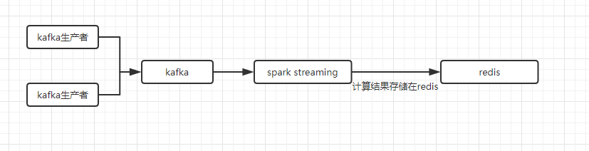
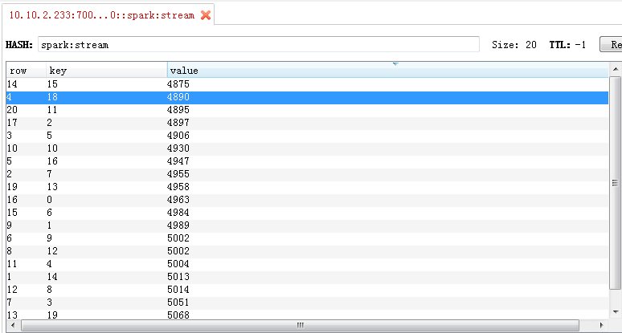

# Spark Streaming

在计算实时的 TopN 场景里面,streaming 的思路莫名的符合.

So,take a look, will you? :"}

---

## 1. 基础架构

程序系统架构基础如下



---

## 2. 代码实现

这里实现一个 word count 的流式计算例子,请知悉.

关于 kafka 生产者怎么往 kafka 生产消息,这里不进行叙述,[请参考 link](../kafka/kafka基础文档.md)

注意: **此处测试发送消息为 0 - 20 的随机数.**,生产者核心代码如下

```java
int index = 0;
int times = 50000;
Map<Integer, Integer> countMap = new HashMap<>();
while (index++ < times) {
    int num = (int) (Math.random() * 20);
    Integer value = countMap.getOrDefault(num, 0);
    countMap.put(num, value + 1);

    // 指定key,发布到不同的分区里面去.
    KeyedMessage<String, String> message = new KeyedMessage<>(topicName, "" + index, "" + num);
    producer.send(message);
}

```

### 2.1 pom.xml

```xml
<properties>
    <maven.compiler.source>1.8</maven.compiler.source>
    <maven.compiler.target>1.8</maven.compiler.target>
    <encoding>UTF-8</encoding>
    <scala.version>2.11.8</scala.version>
    <spark.version>2.1.0</spark.version>
    <hadoop.version>2.7.3</hadoop.version>
    <project.build.sourceEncoding>UTF-8</project.build.sourceEncoding>
</properties>

<dependencies>
    <dependency>
        <groupId>junit</groupId>
        <artifactId>junit</artifactId>
        <version>4.12</version>
    </dependency>


    <dependency>
        <groupId>org.apache.spark</groupId>
        <artifactId>spark-core_2.11</artifactId>
        <version>${spark.version}</version>
    </dependency>

    <dependency>
        <groupId>org.apache.spark</groupId>
        <artifactId>spark-mllib_2.11</artifactId>
        <version>${spark.version}</version>
    </dependency>
    <dependency>
        <groupId>org.apache.spark</groupId>
        <artifactId>spark-sql_2.11</artifactId>
        <version>${spark.version}</version>
    </dependency>
    <dependency>
        <groupId>org.apache.spark</groupId>
        <artifactId>spark-hive_2.11</artifactId>
        <version>${spark.version}</version>
    </dependency>
    <dependency>
        <groupId>org.apache.spark</groupId>
        <artifactId>spark-streaming-flume_2.11</artifactId>
        <version>${spark.version}</version>
    </dependency>

    <dependency>
        <groupId>org.apache.hadoop</groupId>
        <artifactId>hadoop-client</artifactId>
        <version>${hadoop.version}</version>
    </dependency>
    <dependency>
        <groupId>commons-lang</groupId>
        <artifactId>commons-lang</artifactId>
        <version>2.6</version>
    </dependency>
    <dependency>
        <groupId>org.apache.hbase</groupId>
        <artifactId>hbase-client</artifactId>
        <version>1.3.0</version>
    </dependency>
    <dependency>
        <groupId>org.apache.hbase</groupId>
        <artifactId>hbase-server</artifactId>
        <version>1.3.0</version>
    </dependency>
    <dependency>
        <groupId>org.apache.hbase</groupId>
        <artifactId>hbase-common</artifactId>
        <version>1.3.0</version>
    </dependency>

    <dependency>
        <groupId>org.apache.spark</groupId>
        <artifactId>spark-streaming-kafka-0-10_2.11</artifactId>
        <version>2.1.0</version>
    </dependency>
    <dependency>
        <groupId>org.apache.kafka</groupId>
        <artifactId>kafka_2.11</artifactId>
        <version>0.10.2.0</version>
    </dependency>
    <dependency>
        <groupId>org.apache.spark</groupId>
        <artifactId>spark-streaming_2.11</artifactId>
        <version>2.1.0</version>
    </dependency>
    <dependency>
        <groupId>com.101tec</groupId>
        <artifactId>zkclient</artifactId>
        <version>0.10</version>
    </dependency>

    <dependency>
        <groupId>org.spark-project.hive</groupId>
        <artifactId>hive-beeline</artifactId>
        <version>1.2.1.spark2</version>
    </dependency>
    <dependency>
        <groupId>org.spark-project.hive</groupId>
        <artifactId>hive-metastore</artifactId>
        <version>1.2.1.spark2</version>
    </dependency>
    <dependency>
        <groupId>org.spark-project.hive</groupId>
        <artifactId>hive-cli</artifactId>
        <version>1.2.1.spark2</version>
    </dependency>

    <dependency>
        <groupId>redis.clients</groupId>
        <artifactId>jedis</artifactId>
        <version>2.9.0</version>
    </dependency>

    <dependency>
        <groupId>de.ruedigermoeller</groupId>
        <artifactId>fst</artifactId>
        <version>2.50</version>
    </dependency>

    <dependency>
        <groupId>org.codehaus.janino</groupId>
        <artifactId>commons-compiler</artifactId>
        <version>2.6.1</version>
    </dependency>

    <dependency>
        <groupId>mysql</groupId>
        <artifactId>mysql-connector-java</artifactId>
        <version>5.1.41</version>
    </dependency>

    <dependency>
        <groupId>com.alibaba</groupId>
        <artifactId>fastjson</artifactId>
        <version>1.2.32</version>
    </dependency>
</dependencies>
```

### 2.2 流式计算代码

```java
import cn.rojao.engine.util.RedisUtil;
import org.apache.kafka.clients.consumer.ConsumerRecord;
import org.apache.kafka.common.serialization.StringDeserializer;
import org.apache.spark.SparkConf;
import org.apache.spark.api.java.Optional;
import org.apache.spark.streaming.Durations;
import org.apache.spark.streaming.api.java.JavaDStream;
import org.apache.spark.streaming.api.java.JavaInputDStream;
import org.apache.spark.streaming.api.java.JavaPairDStream;
import org.apache.spark.streaming.api.java.JavaStreamingContext;
import org.apache.spark.streaming.kafka010.ConsumerStrategies;
import org.apache.spark.streaming.kafka010.KafkaUtils;
import org.apache.spark.streaming.kafka010.LocationStrategies;
import redis.clients.jedis.JedisCluster;
import scala.Tuple2;

import java.util.*;


/**
 * Spark streaming test
 * <p>
 * <p/>
 *
 * @author cs12110 created at: 2019/2/15 11:15
 * <p>
 * since: 1.0.0
 */
public class StreamingWordCountApp {

    public static void main(String[] args) {

        try {
            SparkConf conf = new SparkConf();
            conf.setAppName(StreamingWordCountApp.class.getName());

            // sparkStreaming的对象
            JavaStreamingContext streamingContext = new JavaStreamingContext(conf, Durations.seconds(15));
            streamingContext.checkpoint(".");

            // kafka参数map
            Map<String, Object> kafkaParams = new HashMap<>(6);
            kafkaParams.put("bootstrap.servers", "10.10.1.141:20000,10.10.1.141:20001,10.10.1.141:20002");
            kafkaParams.put("key.deserializer", StringDeserializer.class);
            kafkaParams.put("value.deserializer", StringDeserializer.class);
            kafkaParams.put("group.id", "spark-streaming");
            kafkaParams.put("auto.offset.reset", "latest");
            kafkaParams.put("enable.auto.commit", false);

            // 订阅的主题
            List<String> topics = new ArrayList<>();
            topics.add("spark-streaming-topic");

            JavaInputDStream<ConsumerRecord<String, String>> stream = KafkaUtils.createDirectStream(
                    streamingContext,
                    LocationStrategies.PreferConsistent(),
                    ConsumerStrategies.Subscribe(topics, kafkaParams)
            );


            //算子逻辑处理
            JavaDStream<String> words = stream
                    .map(ConsumerRecord::value)
                    .flatMap(line -> Arrays.asList(line.split(" "))
                            .iterator());

            JavaPairDStream<String, Integer> pairs = words.mapToPair(word -> new Tuple2<>(word, 1));
            JavaPairDStream<String, Integer> wordCounts = pairs.updateStateByKey(
                    (values, state) -> {
                        Integer newValue = state.or(0);
                        for (Integer value : values) {
                            newValue += value;
                        }
                        return Optional.of(newValue);
                    });

            final String redisCluster = "10.10.2.233:7000,10.10.2.233:7001,10.10.2.233:7002,10.10.2.233:7003,10.10.2.233:7004,10.10.2.233:7005";

            // 将运算结果存入redis
            System.out.println("------------------------------------------------");
            wordCounts.foreachRDD((rdd, time) ->
                    rdd.foreachPartition((iterator) -> {
                        // 获取redis连接,进行处理
                        JedisCluster jedisCluster = RedisUtil.getClusterConn(redisCluster);

                        while (iterator.hasNext()) {
                            // redis 压入数据
                            Tuple2<String, Integer> result = iterator.next();
                            System.out.println(result._1 + " : " + result._2);

                            jedisCluster.hset("spark:stream", result._1, "" + result._2);
                        }

                        // redis关闭连接
                        jedisCluster.close();
                    })
            );
            System.out.println("------------------------------------------------");

            wordCounts.print();
            //启动实时任务
            streamingContext.start();

            //等待程序的结束，可用Ctrl+c来结束
            streamingContext.awaitTermination();
            streamingContext.close();
        } catch (Exception e) {
            e.printStackTrace();
        }
    }
}
```

### 2.3 测试结果

使用脚本往 spark 提交任务,脚本内容如下:

```bash
#!/bin/sh

use_memory='8G'
spark_location='spark://10.10.1.141:7077,10.10.1.142:7077'

task_app_prefix='/opt/bi/spark/stream-task/'

executor_conf=$task_app_prefix'/setting/etl-mysql.properties'
executor_class='cn.rojao.engine.streaming.StreamingWordCountApp'
executor_app=$task_app_prefix'/hvs-engine-0.0.1-SNAPSHOT.jar'

echo -e  '\n\nStartup spark task\n\n'

spark-submit \
--master ${spark_location} \
--executor-memory ${use_memory} \
--class ${executor_class} ${executor_app}  ${executor_conf}
```

计算结果



---

## 3. 参考资料

a. [Spark 以及 spark streaming 核心原理及实践](https://www.cnblogs.com/liuliliuli2017/p/6809094.html)
